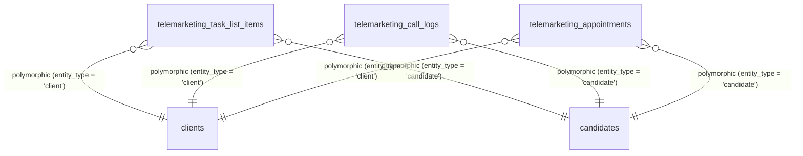

# المرجع المتقاطع — Golden CRM Cross-Reference

> هاد الملف بيخليّك تفهم: "هيدا الحقل وين بيستخدم؟" و "هيدا الجدول مع مين مرتبط؟"
> **مفيد للـ:** debugging, refactoring, impact analysis, onboarding developers.

---

## 1. الحقول المشتركة بين الجداول (Shared Fields)

> **القاعدة:** أي حقل بيظهر بأكتر من جدول — نسجله هون.

### 1.1 `client_id` / `customer_id` (معرف الزبون)

| الجدول | اسم الحقل | نوع العلاقة | ON DELETE | وصف |
|---|---|---|---|---|
| `clients` | `id` | PK | — | المصدر |
| `contracts` | `customer_id` | FK | SET NULL | العقود تبع الزبون |
| `visits` | `customer_id` | FK | — | الزيارات للزبون |
| `field_visits` | `client_id` | FK | — | الزيارات الميدانية |
| `open_tasks` | `client_id` | FK | — | المهام المفتوحة |
| `customer_call_logs` | `client_id` | FK | — | سجل الاتصالات |
| `emergency_tickets` | `client_id` | FK | — | بلاغات الطوارئ |
| `maintenance_requests` | `customer_id` | FK | — | طلبات الصيانة |
| `contact_targets` | `target_id` | FK | — | أهداف الاتصال |
| `visit_name_collections` | `client_id` | FK | — | جمع أسماء |
| `direct_suggestions` | `client_id` | FK | — | ترشيحات مباشرة |

**⚠️ ملاحظة مهمة:** `customer_id` = `client_id` بنفس المعنى — تسمية مختلفة حسب السياق (Sales vs CRM).

### 1.2 `branch_id` (معرف الفرع)

| الجدول | NULL? | DEFAULT | وصف |
|---|---|---|---|
| `clients` | ✅ | — | فرع تسجيل الزبون |
| `contracts` | ✅ | — | **فرع العقد — ممكن يختلف عن فرع الزبون** |
| `employees` | ✅ | — | فرع الموظف |
| `candidates` | ✅ | — | فرع المرشح |
| `field_visits` | ✅ | — | فرع الزيارة |
| `open_tasks` | ✅ | — | فرع المهمة |
| `visits` | ❌ | — | فرع الزيارة |
| `tasks` | ❌ | — | فرع المهمة |
| `maintenance_requests` | ❌ | — | فرع طلب الصيانة |
| `emergency_tickets` | ❌ | — | فرع بلاغ الطوارئ |
| `telemarketing_task_lists` | ❌ | — | فرع كشف التسويق |
| `day_schedules` | ❌ | — | جدول الفرق |

**⚠️ ثغرة معروفة:** انظر [GAPS-TRACKER.md#GAP-006](GAPS-TRACKER.md#GAP-006)

### 1.3 `status` (الحالة)

| الجدول | النوع | القيم المسموحة | CHECK constraint? |
|---|---|---|---|
| `clients` | `VARCHAR(50)` | `active` / `deleted` (via `deleted_at`) | ❌ لا |
| `contracts` | `VARCHAR(50)` | `draft`, `active`, `completed`, `cancelled` | ✅ نعم |
| `contract_installments` | `VARCHAR(50)` | `pending`, `paid`, `partial`, `overdue` (حروف صغيرة) | ✅ نعم |
| `dues` | `VARCHAR(50)` | `Pending`, `Partial`, `Paid`, `Overdue` (أول حرف كبير - GAP-013) | ✅ نعم |
| `open_tasks` | `VARCHAR(50)` | `open`, `needs_follow_up`, `assigned`, `in_scheduling`, `scheduled`, `waiting_execution`, `in_execution`, `ended`, `completed`, `closed`, `cancelled` | ✅ نعم |
| `tasks` | `VARCHAR(50)` | `pending`, `in-progress`, `completed` | ✅ نعم |
| `visits` | `VARCHAR(50)` | `Pending`, `Completed`, `Cancelled` | ✅ نعم |
| `emergency_tickets` | `VARCHAR(50)` | `New`, `Assigned`, `In Progress`, `Completed`, `Cancelled` | ✅ نعم |
| `candidates` | `VARCHAR(50)` | `New`, `Suggested`, `FollowUp`, `Contacted`, `Qualified`, `Junk` | ✅ نعم |
| `referral_sheets` | `VARCHAR(50)` | `New`, `In-Progress`, `Completed`, `Archived` | ✅ نعم |
| `telemarketing_task_list_items` | `VARCHAR(20)` | `pending`, `called`, `booked` | ✅ نعم |
| `contact_targets` | `VARCHAR(50)` | `new`, `queued`, `in_call_list`, `contacted`, `booked`, `closed`, `cancelled` | ✅ نعم |
| `field_visits` | `VARCHAR(50)` | `scheduled`, `in_progress`, `ended`, `completed`, `not_completed`, `postponed_by_company`, `postponed_by_customer`, `cancelled`, `needs_reschedule` | ✅ نعم |
| `visit_tasks` | `VARCHAR(50)` | `pending`, `in_progress`, `completed`, `not_completed`, `cancelled` | ✅ نعم |
| `visit_name_collections` | `VARCHAR(50)` | `pending`, `partial`, `completed` | ✅ نعم |
| `direct_suggestions` | `VARCHAR(50)` | `pending`, `contacted`, `converted` | ✅ نعم |

**⚠️ ملاحظة:** `status` كل جدول enum مختلف — لا خلط!

**⚠️ نتائج المكالمات الهاتفية (Telemarketing Outcome System - 21 نتيجة):**
يفرض الجدول `telemarketing_call_logs` عبر الحقل `outcome` قيد فحص متكامل لـ 21 نتيجة معيارية مقسمة تشغيلياً لـ 5 مجموعات كبرى بالاتساق مع السيرفر:
1. **لم يتم التواصل (`not_reached`):** `no_answer` (لم يتم الرد)، `busy` (مشغول)، `out_of_coverage` (خارج التغطية)، `not_in_service` (خارج الخدمة)، `wrong_number` (رقم خاطئ)، `auto_disconnected` (انقطع تلقائياً)، `message_sent` (مرسل رسالة).
2. **تم التواصل - بدون موعد (`reached`):** `currently_busy` (العميل مشغول حالياً)، `interrupted` (انقطع الاتصال)، `not_interested` (غير مهتم)، `other_company_not_interested` (لديه جهاز آخر وغير مهتم)، `seen_offer_not_interested` (اطلع سابقاً وغير مهتم)، `address_updated` (تم تحديث العنوان)، `new_number` (رقم إضافي).
3. **تم التواصل - يحتاج متابعة (`follow_up`):** `other_company_callback` (لديه جهاز آخر وطلب المتابعة)، `seen_offer_callback` (اطلع وطلب المتابعة).
4. **تم التواصل - طلب خدمة (`service_request`):** `service_request` (طلب صيانة)، `company_customer_missing_phone` (رقم مفقود).
5. **حجز موعد (`booked`):** `booked_marketing_appointment`.

### 1.4 `created_at` / `created_by` (التدقيق والأرشيف)

| الجدول | `created_at` | `created_by` | `updated_at` | `deleted_at` | Soft-delete? |
|---|---|---|---|---|---|
| `clients` | ✅ TIMESTAMPTZ | ✅ FK → hr_users | ❌ | ✅ | ✅ نعم |
| `contracts` | ✅ TIMESTAMPTZ | — | — | — | ❌ لا |
| `open_tasks` | ✅ TIMESTAMPTZ | ✅ FK → hr_users | ✅ TIMESTAMPTZ | — | ❌ لا |
| `employees` | ✅ TIMESTAMPTZ | — | — | — | ❌ لا |
| `candidates` | ✅ TIMESTAMPTZ | ✅ FK → hr_users | — | — | ❌ لا |
| `referral_sheets` | ✅ TIMESTAMPTZ | ✅ FK → hr_users | — | — | ❌ لا |
| `tasks` | — | — | — | — | ❌ لا |
| `visits` | — | — | — | — | ❌ لا |
| `telemarketing_task_lists` | ✅ TIMESTAMPTZ | — | — | — | ❌ لا |
| `telemarketing_task_list_items` | — | — | — | — | ❌ لا |
| `telemarketing_call_logs` | ✅ TIMESTAMPTZ (via `timestamp`) | ✅ FK → hr_users (via `called_by`) | — | — | ❌ لا |
| `telemarketing_appointments` | ✅ TIMESTAMPTZ | ✅ FK → hr_users (via `created_by`) | — | — | ❌ لا |
| `contact_targets` | ✅ TIMESTAMPTZ | — | ✅ TIMESTAMPTZ | — | ❌ لا |
| `field_visits` | ✅ TIMESTAMPTZ | ✅ FK → hr_users | ✅ TIMESTAMPTZ | — | ❌ لا |
| `visit_tasks` | ✅ TIMESTAMPTZ | — | ✅ TIMESTAMPTZ | — | ❌ لا |
| `visit_task_results` | ✅ TIMESTAMPTZ | ✅ FK → hr_users (via `closed_by`) | ✅ TIMESTAMPTZ | — | ❌ لا |
| `visit_name_collections` | ✅ TIMESTAMP | — | ✅ TIMESTAMP | — | ❌ لا |
| `direct_suggestions` | ✅ TIMESTAMP | — | ✅ TIMESTAMP | — | ❌ لا |
| `visit_geo_logs` | ✅ TIMESTAMP | — | ✅ TIMESTAMP | — | ❌ لا |

**⚠️ ملاحظة:** يتميز جدول `telemarketing_appointments` باحتوائه على حقل `answered_by` لتوثيق اسم متلقي المكالمة الفعلي وقت الاتصال (مثلاً "أخت العميل")، وهو يختلف عن الحقل `created_by` المخصص لتوثيق معرف الموظف الذي قام بالحجز.

**⚠️ ملاحظة إضافية:** يشتمل جدول `field_visits` على لقطة لاسم مجيب الاتصال وقت الحجز `answered_by` (مثل "زوجة العميل")، بالإضافة إلى تتبع الموظف الذي حجز الموعد هاتفياً عبر `booked_by_telemarketer_id` لضمان الشفافية الجنائية الكاملة للزيارة الميدانية.

### 1.5 `geo_unit_id` / `governorate` / `district` / `neighborhood` (المناطق والعناوين جغرافياً)

تتميز بنية العناوين والمطابقة الجغرافية للمواقع بوجود تباين هيكلي كبير (النمط غير المتسق - انظر GAP-003 و GAP-034)، حيث تُخزن بعض المراجع كـ `INTEGER` صحيحة مع قيد الربط الفيزيائي، بينما تظل حقول عناوين العملاء والموظفين كـ `VARCHAR(255)` نصية يتيمة:

| الجدول | اسم الحقل | النوع | ON DELETE | قيد ربط فيزيائي؟ | وصف |
|---|---|---|---|---|---|
| `geo_units` | `id` | `INTEGER` (PK) | — | — | المصدر والتقسيم الرئيسي |
| `branches` | `location_geo_id` | `INTEGER` (FK) | SET NULL | ✅ نعم | إحداثيات ومقر الفرع الجغرافي |
| `branches` | `covered_geo_ids` | `JSONB` array | — | ❌ لا (GAP-038) | نطاق التغطية والفلترة للفرع |
| `clients` | `governorate` | `VARCHAR(255)` | — | ❌ لا (GAP-003) | محافظة سكن العميل (تخزن كـ string رقمي) |
| `clients` | `district` | `VARCHAR(255)` | — | ❌ لا (GAP-003) | منطقة سكن العميل (تخزن كـ string رقمي) |
| `clients` | `neighborhood` | `VARCHAR(255)` | — | ❌ لا (GAP-003) | حي سكن العميل (تخزن كـ string رقمي) |
| `candidates` | `geo_unit_id` | `INTEGER` (FK) | SET NULL | ✅ نعم | موقع سكن المرشح المعتمد |
| `contracts` | `installation_geo_unit_id` | `INTEGER` (FK) | SET NULL | ✅ نعم | موقع وتمديد تركيب الأجهزة الفعلي |
| `employees` | `residence` | `VARCHAR(255)` | — | ❌ لا (GAP-034) | موقع سكن ومقر الموظف أو الفني |

**⚠️ تأثير نمط التناقض:** يفرض هذا التناقض الهيكلي على المطورين إجراء عمليات تحويل قسرية مكثفة بالخلفية للربط الجغرافي (مثل `NULLIF(c.governorate, '')::int`) ويخلق بيانات يتيمة لا تتأثر بالحذف المتتالي للتقسيمات الجغرافية.

---

## 2. العلاقات بين الجداول (Entity Relationships)

### 2.1 النظرة العامة

```
clients (1) ────────► (N) contracts
    │                       │
    │                       ▼
    │                  (N) contract_line_items
    │                       │
    │                       ▼
    │                  (N) contract_payment_entries
    │
    ├───────► (N) field_visits
    │            │
    │            ▼
    │       (N) visit_tasks
    │            │
    │            ▼
    │       (N) visit_task_results
    │
    ├───────► (N) open_tasks
    │            │
    │            ▼
    │       (N) open_task_delivery_results
    │       (N) open_task_installation_results
    │
    ├───────► (N) customer_call_logs
    │
    ├───────► (N) client_assignments (M2M bridge)
    │            │
    │            ▼
    │       (N) hr_users
    │
    └───────► (N) emergency_tickets
                 │
                 ▼
            (1) emergency_results
                 │
                 ▼
            (N) emergency_maintenance_actions
            (N) emergency_payment_entries
            (N) emergency_installments

```

### 2.1.2 علاقات المرشحين (Candidates)

```
referral_sheets (1) ──────► (N) candidates
                                 │
                                 ├───────► (1) clients (via converted_to_lead_id)
                                 │
                                 ├───────► (N) candidate_assignments (M2M bridge)
                                 │            │
                                 │            ▼
                                 │       (N) hr_users
                                 │
                                 └───────► (1) branches
```

### 2.1.3 علاقات التسويق الهاتفي والتعددية (Telemarketing Polymorphism)

يعتمد نظام التسويق الهاتفي على بنية علاقات متعددة الأشكال (Polymorphic Relationships) للربط الديناميكي بين الكشوف والمكالمات والمواعيد من جهة، والزبائن (`clients`) أو المرشحين (`candidates`) من جهة أخرى عبر الحقلين المشتركين `entity_type` و `entity_id`.



| الجدول | حقل النوع | حقل المعرف | الكيانات المستهدفة | وصف السلوك |
|---|---|---|---|---|
| `telemarketing_task_list_items` | `entity_type` | `entity_id` | `client`, `candidate` | يحدد جهة الاتصال الفردية المدرجة بالكشف اليومي |
| `telemarketing_call_logs` | `entity_type` | `entity_id` | `client`, `candidate` | يحدد المستهدف الذي جرت معه المكالمة الهاتفية المسجلة |
| `telemarketing_appointments` | `entity_type` | `entity_id` | `client`, `candidate` | يحدد من حجز الموعد (عميل حالي للصيانة/الترقية، أو مرشح لمبيعات جديدة) |

### 2.2 الجداول الربطية (Junction Tables)

| الجدول الربطي | يربط | مع | الغرض |
|---|---|---|---|---|
| `client_assignments` | `clients` | `hr_users` | تخصيص موظفين لزبون |
| `candidate_assignments` | `candidates` | `hr_users` | تخصيص موظفين لمرشح |
| `contract_line_items` | `contracts` | `device_models` + `spare_parts` | بنود العقد |
| `contract_payment_entries` | `contracts` | — | دفعات العقد |
| `visit_tasks` | `field_visits` | `task_type_config` | مهام الزيارة |
| `role_permission_grants` | `roles` | `permissions` | صلاحيات الدور |
| `user_branch_assignments` | `hr_users` | `branches` | فروع المستخدم |
| `call_task_links` | `open_tasks` | `customer_call_logs` | ربط الاتصالات بالتكليفات |
| `open_task_devices` | `open_tasks` | `device_models` | أجهزة المهمة الميدانية |

---

## 3. القيود المشتركة (Shared Constraints)

### 3.1 Soft-Delete Pattern

| الجدول | الحقول | الفهرس الجزئي |
|---|---|---|
| `clients` | `deleted_at`, `deleted_by`, `is_active` | `idx_clients_active` |
| أي جدول آخر | ❌ لا يوجد | — |

**الخلاصة:** بس `clients` عنده soft-delete — باقي الجداول hard-delete.

### 3.2 JSONB Fields (حقول مرنة)

| الجدول | الحقل | الاستخدام |
|---|---|---|
| `clients` | `contacts` | أرقام إضافية |
| `clients` | `gps_coordinates` | إحداثيات |
| `clients` | `referrers` | قائمة الوسطاء |
| `contracts` | — | — |
| `open_tasks` | `client_snapshot`, `contract_snapshot`, `team_snapshot` | لقطات فدائية لبيانات الزبائن والعقود والفرق |
| `employees` | — | — |
| `branches` | `covered_geo_ids` | مناطق التغطية |
| `branches` | `contact_info` | معلومات التواصل |
| `device_models` | `supported_visit_types` | أنواع الزيارات |
| `spare_parts` | `compatible_device_ids` | الأجهزة المتوافقة |
| `emergency_tickets` | `attachments` | مرفقات |
| `maintenance_requests` | `technical_report` | تقرير فني |

### 3.3 CHECK Constraints (قيم محددة)

| الجدول | الحقل | القيم | موجود بالـ DB? |
|---|---|---|---|
| `clients` | `gender` | `Male`, `Female` | ❌ لا (GAP-005) |
| `clients` | `data_quality` | `Complete`, `Partial`, `Minimal` | ❌ لا (GAP-005) |
| `clients` | `rating` | `Committed`, `NotCommitted`, `Undefined` | ❌ لا |
| `employees` | `role` | `supervisor`, `technician`, `telemarketer`, `trainee` | ✅ نعم |
| `employees` | `status` | `active`, `leave`, `inactive` | ✅ نعم |
| `contracts` | `status` | `draft`, `active`, `completed`, `cancelled` | ✅ نعم |
| `contract_line_items` | `item_type` | `device`, `accessory`, `service_fee` | ✅ نعم |
| `contract_payment_entries` | `method` | `cash`, `sham_cash`, `syriatel_cash`, `mtn_cash`, `alharam`, `bank_transfer`, `barter`, `usd_cash` | ✅ نعم |
| `contract_installments` | `status` | `pending`, `paid`, `partial`, `overdue` | ✅ نعم |
| `dues` | `status` | `Pending`, `Partial`, `Paid`, `Overdue` | ✅ نعم |
| `open_tasks` | `status` | `open`, `needs_follow_up`, `assigned`, `in_scheduling`, `scheduled`, `waiting_execution`, `in_execution`, `ended`, `completed`, `closed`, `cancelled` | ✅ نعم |
| `open_tasks` | `task_family` | `marketing`, `service`, `maintenance`, `emergency` | ✅ نعم |
| `open_tasks` | `reason` | `new_lead`, `follow_up`, `renewal`, `service_request`, `other` | ✅ نعم |
| `open_tasks` | `priority` | `high`, `medium`, `low` | ✅ نعم |
| `open_tasks` | `last_waiting_status` | `open`, `needs_follow_up` | ✅ نعم |
| `task_activity_log` | `event_type` | `status_change, note_added, rescheduled, assigned, reassigned, call_made, priority_changed, team_assigned, team_changed, lifecycle_skip` | ✅ نعم |
| `open_task_pre_offers` | `offer_type` | `cash`, `installment` | ✅ نعم |
| `task_type_config` | `scheduling_pattern` | `immediate`, `short_window`, `long_window`, `expected_window` | ✅ نعم |
| `task_type_config` | `window_basis` | `none`, `due_date`, `expected_date` | ✅ نعم |
| `task_type_config` | `location_basis` | `client`, `contract` | ✅ نعم |
| `device_technical_states` | `phase` | `pre`, `post`, `standalone` | ✅ نعم |
| `emergency_result_costs` | `final_decision` | `resolved`, `partially_resolved`, `unresolved`, `needs_followup`, `cancelled` | ✅ نعم |
| `tasks` | `type` | `emergency`, `dues`, `periodic`, `returns`, `followup` | ✅ نعم |
| `tasks` | `status` | `pending`, `in-progress`, `completed` | ✅ نعم |
| `tasks` | `priority` | `high`, `medium`, `low` | ✅ نعم |
| `device_models` | `category` | `Residential`, `Industrial`, `Commercial` | ✅ نعم |
| `spare_parts` | `maintenance_type` | `Periodic`, `Emergency`, `Accessory` | ✅ نعم |

---

## 4. الـ APIs المتقاطعة (Shared API Patterns)

### 4.1 Query Parameters المشتركة

| الباراميتر | الجداول اللي بيستخدموه | النوع | وصف |
|---|---|---|---|
| `branchId` | clients, contracts, candidates, tasks, visits | integer | تصفية حسب فرع |
| `search` | clients, candidates, employees | string | بحث نصي |
| `page` | الكل | integer | ترقيم الصفحات |
| `limit` | الكل | integer | حجم الصفحة |
| `status` | contracts, tasks, visits | string | تصفية حسب حالة |
| `date` | schedules, visits, field_visits | string | تصفية حسب تاريخ |

### 4.2 Headers المشتركة

| Header | الجداول المطلوب فيها | وصف |
|---|---|---|
| `X-Branch-Id` | tasks, visits, field_visits, schedules, routeAssignments, planning, contactTargets, telemarketing, openTasks, workScopes, maintenanceRequests, emergencyTickets, dues | branch-only routes |
| `Authorization: Bearer JWT` | الكل عدا public routes | التحقق من الهوية |

---

## 5. الجداول التشغيلية الكاملة (72 Table Inventory)

> قائمة بكل الجداول بالنظام — للتأكد إن ما فيه جدول منسي.

### 5.1 الكيانات الأساسية (Core)

| # | الجدول | PK | FKs | Soft-delete | CHECK |
|---|---|---|---|---|---|
| 1 | `geo_units` | `id` | `parent_id` → geo_units | ❌ | ❌ |
| 2 | `branches` | `id` | `location_geo_id` → geo_units | ❌ | ✅ |
| 3 | `employees` | `id` | — | ❌ | ✅ |
| 4 | `hr_users` | `id` | `employee_id` → employees | ❌ | — |
| 5 | `clients` | `id` | `branch_id`, `referral_sheet_id`, `created_by` | ✅ | ❌ |
| 6 | `candidates` | `id` | `referral_sheet_id` | ❌ | ✅ |
| 7 | `referral_sheets` | `id` | `owner_user_id`, `created_by` | ❌ | ✅ |

### 5.2 العمليات (Operations)

| # | الجدول | PK | FKs | وصف |
|---|---|---|---|---|
| 8 | [`contracts`](domains/contracts.md) | `id` | `customer_id`, `device_model_id` | العقود والعمليات المالية |
| 9 | [`contract_line_items`](domains/contracts.md) | `id` | `contract_id` | بنود العقد وتفاصيل الأجهزة |
| 10 | [`contract_payment_entries`](domains/contracts.md) | `id` | `contract_id` | سجلات المقبوضات والدفعات المباشرة |
| 11 | [`contract_installments`](domains/contracts.md) | `id` | `contract_id` | جدول وجدولة الأقساط والتواريخ |
| 12 | [`dues`](domains/contracts.md) | `id` | `contract_id` | الذمم والديون والمتابعة المالية |
| 13 | `device_models` | `id` | — | موديلات الأجهزة |
| 14 | `spare_parts` | `id` | — | قطع الغيار |
| 15 | `device_discounts` | `id` | `device_model_id` | خصومات الأجهزة |
| 16 | [`device_technical_states`](domains/open-tasks.md) | `id` | `contract_id`, `open_task_id` | الحالات التقنية للأجهزة (طوارئ/صيانة) |

### 5.3 الزيارات والمهام (Visits & Tasks)

| # | الجدول | PK | FKs | وصف |
|---|---|---|---|---|
| 17 | `visits` | `id` | `customer_id`, `employee_id` | الزيارات القديمة |
| 18 | [`field_visits`](domains/field-visits.md) | `id` | `client_id`, `branch_id`, `reassigned_supervisor_id` | الزيارات الميدانية الموحدة |
| 19 | [`visit_tasks`](domains/field-visits.md) | `id` | `field_visit_id`, `source_open_task_id` | مهام الزيارة التشغيلية |
| 20 | [`visit_task_results`](domains/field-visits.md) | `id` | `visit_task_id`, `closed_by` | نتائج مهام الزيارة |
| 21 | [`visit_name_collections`](domains/field-visits.md) | `id` | `visit_task_id`, `client_id`, `referral_sheet_id` | جمع أسماء وتوصيات مرافقة |
| 22 | [`direct_suggestions`](domains/field-visits.md) | `id` | `visit_task_id`, `client_id` | ترشيحات مبيعات مباشرة |
| 23 | `tasks` | `id` | — | المهام القديمة |
| 24 | [`open_tasks`](domains/open-tasks.md) | `id` | `client_id`, `contract_id`, `branch_id`, `task_type` | المهام المفتوحة والتشغيل الميداني |
| 25 | [`task_type_config`](domains/open-tasks.md) | `task_type` | — | إعدادات أنواع المهام والنافذة الزمنية |
| 26 | `schedules` | `date` | — | جداول الفرق |
| 27 | `route_assignments` | `key` | — | تخصيص المسارات |
| 28 | `routes` | `id` | — | المسارات الجغرافية |
| 29 | `route_points` | `id` | `route_id` | نقاط المسار |
| 30 | `workScopes` | `id` | — | نطاقات العمل |
| 31 | `day_schedules` | `date` | — | الجداول اليومية |
| 32 | `maintenance_requests` | `id` | `customer_id`, `contract_id` | طلبات الصيانة |
| 33 | `emergency_tickets` | `id` | `client_id`, `contract_id` | بلاغات الطوارئ |
| 34 | `emergency_action_types` | `id` | — | أنواع إجراءات الطوارئ |
| 35 | [`emergency_result_parts`](domains/open-tasks.md) | `id` | `open_task_id`, `spare_part_id` | قطع غيار الطوارئ المستهلكة |
| 36 | [`emergency_result_costs`](domains/open-tasks.md) | `id` | `open_task_id`, `closing_employee_id` | التكاليف والقرارات النهائية للطوارئ |
| 37 | [`emergency_maintenance_actions`](domains/open-tasks.md) | `id` | `open_task_id`, `action_type_id` | الإجراءات الميدانية الفنية للصيانة |
| 38 | [`emergency_payment_entries`](domains/open-tasks.md) | `id` | `costs_id`, `transfer_company_id` | دفعات ومقبوضات الطوارئ المتعددة |
| 39 | [`emergency_installments`](domains/open-tasks.md) | `id` | `costs_id`, `open_task_id`, `due_id` | جدولة أقساط صيانة الطوارئ |
| 40 | [`visit_task_device_delivery_results`](domains/field-visits.md) | `id` | `visit_task_result_id`, `device_model_id` | نتائج وتفاصيل تسليم الأجهزة المادية |
| 41 | [`visit_task_device_installation_results`](domains/field-visits.md) | `id` | `visit_task_result_id`, `installed_by_employee_id` | نتائج تركيب وتمديد الأجهزة تقنياً |
| 42 | [`visit_task_device_demo_results`](domains/field-visits.md) | `id` | `visit_task_result_id`, `contract_id` | نتائج وخصومات عروض المبيعات الميدانية |
| 43 | [`visit_task_device_activation_results`](domains/field-visits.md) | `id` | `visit_task_result_id`, `activated_by_employee_id` | فحص ومعايرة جودة المياه والتفعيل التشغيلي |
| 44 | [`visit_task_emergency_technical_states`](domains/field-visits.md) | `id` | `visit_task_result_id` | الفحوصات والقياسات التقنية لتشخيص الطوارئ |
| 45 | [`visit_task_emergency_parts_used`](domains/field-visits.md) | `id` | `visit_task_result_id`, `spare_part_id` | قطع غيار الصيانة الطارئة المستهلكة فنزلياً |
| 46 | [`visit_task_emergency_financials`](domains/field-visits.md) | `id` | `visit_task_result_id` | التسويات والحسابات المالية لصيانات الطوارئ |
| 47 | `open_task_delivery_results` | `id` | — | نتائج توصيل مفتوحة |
| 48 | `open_task_installation_results` | `id` | — | نتائج تركيب مفتوحة |
| 49 | [`open_task_pre_offers`](domains/open-tasks.md) | `id` | `open_task_id`, `closed_by_employee_id` | عروض أسعار ودراسات مالية مسبقة |
| 50 | `marketing_visit_tasks` | `id` | — | مهام زيارة تسويق |
| 51 | `marketing_visit_task_offers` | `id` | — | عروض زيارة تسويق |
| 52 | `marketing_visits` | `id` | — | زيارات تسويق (legacy) |
| 52a | [`task_activity_log`](domains/open-tasks.md) | `id` | `task_id`, `performed_by` | سجل أنشطة وتغير حالات المهمة |
| 52b | [`open_task_devices`](domains/open-tasks.md) | `id` | `task_id`, `device_model_id` | الأجهزة المادية الملحقة بالمهمة |
| 52c | [`call_task_links`](domains/open-tasks.md) | `call_id`, `task_id` | `call_id`, `task_id` | ربط الاتصالات بالتكليفات الجارية |

### 5.4 التسويق (Telemarketing)

| # | الجدول | PK | FKs | وصف |
|---|---|---|---|---|
| 53 | [`telemarketing_task_lists`](domains/telemarketing.md) | `id` | — | كشوف التسويق اليومية الموزعة على الفرق |
| 54 | [`telemarketing_task_list_items`](domains/telemarketing.md) | `id` | `task_list_id` | بنود الاتصال والعملاء/المرشحين الفرديين داخل الكشف |
| 55 | [`telemarketing_call_logs`](domains/telemarketing.md) | `id` | `task_list_id`, `contact_target_id` | سجلات توثيق المكالمات الهاتفية الجارية ونتائجها |
| 56 | [`telemarketing_appointments`](domains/telemarketing.md) | `id` | `contact_target_id` | مواعيد الزيارات الميدانية المحجوزة هاتفياً |
| 57 | [`contact_targets`](domains/telemarketing.md) | `id` | `branch_id`, `supervisor_hr_user_id` | الأهداف والذمم اليومية المخصصة للمتابعة |

### 5.5 التوظيف (HR)

| # | الجدول | PK | FKs | وصف |
|---|---|---|---|---|
| 58 | `job_vacancies` | `id` | — | الشواغر |
| 59 | `job_applications` | `id` | `vacancy_id` | طلبات التوظيف |
| 60 | `applicants` | `id` | — | المتقدمون |
| 61 | `interviews` | `id` | `application_id` | المقابلات |
| 62 | `training_courses` | `id` | — | الدورات التدريبية |
| 63 | `training_course_trainees` | `id` | `course_id` | المتدربون |
| 64 | `training_attendance` | `id` | `course_id` | الحضور |
| 65 | `departments` | `id` | — | الأقسام |

### 5.6 الصلاحيات والأمان (Auth & Permissions)

| # | الجدول | PK | FKs | وصف |
|---|---|---|---|---|
| 66 | `roles` | `id` | — | الأدوار |
| 67 | `permissions` | `id` | — | الصلاحيات |
| 68 | `role_permissions` | `id` | `role_id`, `permission_id` | صلاحيات الدور |
| 69 | `role_permission_grants` | `id` | `role_id`, `permission_id` | منح الصلاحيات |
| 70 | `role_job_tasks` | `id` | `role_id` | مهام الدور |
| 71 | `user_branch_assignments` | `id` | `user_id`, `branch_id` | فروع المستخدم |

### 5.7 النظام والمساعدة (System)

| # | الجدول | PK | FKs | وصف |
|---|---|---|---|---|
| 72 | `system_lists` | `id` | — | قوائم النظام |
| 73 | `audit_logs` | `id` | — | سجل التدقيق |
| 74 | `client_audit_log` | `id` | `client_id` | تغييرات الزبون |
| 75 | `referrers` | `id` | — | الوسطاء |
| 76 | `customer_call_logs` | `id` | `client_id` | سجل اتصال الزبائن |

---

## 6. الجداول اللي لساتون Legacy أو Deprecated

| الجدول | البديل | الحالة |
|---|---|---|
| `tasks` | `open_tasks` + `visit_tasks` | ⚠️ قديم — بده migration |
| `visits` | `field_visits` | ⚠️ قديم — بده migration |
| `marketing_visits` | `field_visits` | ⚠️ قديم — migration جارية |
| `assigned_hr_user_id` (clients) | `client_assignments` | ⚠️ deprecated — لازم يُحذف |
