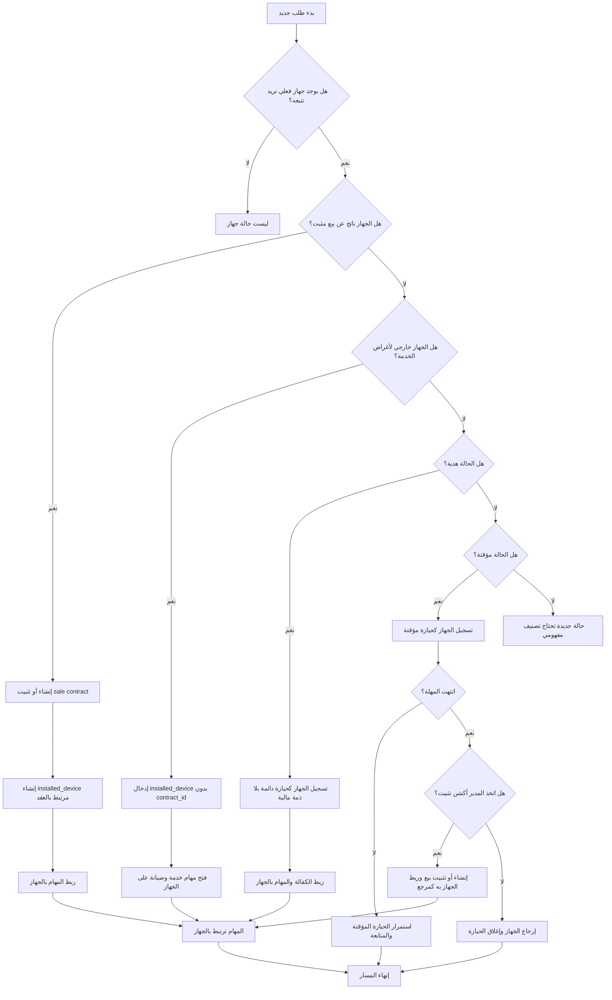

# Contract-Device Boundary Scenarios

## هدف هذا الملف

هذا الملف يوثق الحالات الواقعية التي يظهر فيها الخلط بين:

- العقد
- الجهاز
- المهام
- الالتزام المالي

الهدف ليس فقط سرد الأمثلة، بل تحويلها إلى أداة قرار تساعدنا على تثبيت القاعدة التالية:

> الجهاز هو الأصل التشغيلي، والعقد مرجع صفقة عند الحاجة، والالتزام المالي لا ينشأ إلا إذا وجد سبب مالي فعلي.

## لماذا نحتاج هذه السيناريوهات

أغلب الالتباس لا يظهر في التعريفات النظرية، بل في الحالات اليومية مثل:

- هل نحتاج عقدا قبل إدخال الجهاز؟
- هل يمكن أن نخدم جهازا بلا بيع؟
- هل الهدية تعتبر عقدا أم جهازا فقط؟
- هل المؤقت هو جهاز أم بيع مؤجل؟
- هل المهمة يجب أن تربط بالعقد أم بالجهاز؟

لذلك هذا الملف يجمع السيناريوهات التي تمثل مناطق الخلط الفعلي.

## القاعدة السريعة قبل السيناريوهات

عند ظهور أي حالة جديدة، نمر على الأسئلة التالية:

1. هل دخل إلى النظام جهاز فعلي؟
2. هل توجد صفقة بيع أو اتفاق مالي حقيقي؟
3. هل توجد ذمة أو تحصيل أو أقساط؟
4. هل ما يحدث هو خدمة على جهاز قائم؟
5. هل المهمة تنفذ على جهاز أم على صفقة؟

إذا كانت الإجابة:

- يوجد جهاز ولا يوجد بيع: ننشئ جهازا ولا ننشئ عقد بيع
- يوجد جهاز ويوجد بيع: ننشئ جهازا، والعقد يبقى مرجع البيع
- توجد خدمة فقط: نربط المهمة بالجهاز
- توجد ذمة فقط: نوثقها كالتزام مالي، لا كهوية جهاز

## سيناريوهات الخلط الواقعية

### SCN-01: صيانة جهاز خارجي وتم إنشاء عقد بيع له بالخطأ

**الوصف**

زبون أحضر جهازا من خارج الشركة للصيانة، لكن الفريق استخدم مسار "عقد صيانة" وكأنه عقد بيع.

**أين الخلط**

- تم استخدام `contracts` لتمثيل خدمة على جهاز خارجي
- تم افتراض أن كل جهاز يحتاج عقدا

**التفسير الصحيح**

- الجهاز الخارجي يجب أن يدخل كـ `installed_device`
- المهام والخدمة ترتبط بالجهاز
- لا حاجة إلى `sale_contract`

**القرار المعتمد**

- هذا workflow خدمة
- وليس workflow بيع

### SCN-02: بيع جهاز هدية وتم البحث عن ذمة مالية غير موجودة

**الوصف**

تم تسليم جهاز للزبون كهبة، ثم بدأ الفريق بالبحث عن `final_price` ودفعات ومستحقات وكأن هناك بيعة مالية.

**أين الخلط**

- تمت مساواة "تسليم جهاز" مع "وجود التزام مالي"

**التفسير الصحيح**

- الهدية تعني حيازة جهاز دائمة
- يوجد جهاز فعلي وموقع وكفالة ومهام لاحقة
- لا توجد ذمة مالية ناشئة عن ثمن بيع

**القرار المعتمد**

- ننشئ أو نسجل الجهاز
- لا نفترض التزاما ماليا إلا إذا وجد سبب مستقل واضح

### SCN-03: جهاز مؤقت اعتبر بيعة مثبتة منذ اليوم الأول

**الوصف**

تم تسليم جهاز لمدة شهر كتجربة أو بشكل مؤقت، لكن النظام أو الفريق عامله كأنه بيع نهائي منذ البداية.

**أين الخلط**

- تم دمج الحيازة المؤقتة مع البيع المثبت
- تم تجاهل أن القرار النهائي يأتي لاحقا

**التفسير الصحيح**

- هذا جهاز في حيازة مؤقتة
- لا توجد بيعة مثبتة عند البداية
- بعد انتهاء المهلة يصبح الجهاز مستحقا للحسم
- لا يتحول إلى بيع إلا بأكشن مدير

**القرار المعتمد**

- البداية: جهاز مؤقت
- النهاية المحتملة:
  - إرجاع الجهاز
  - أو تثبيت بيع

### SCN-04: تعديل السعر في العقد لتغيير حالة الجهاز

**الوصف**

تم التعامل مع حالة التسليم أو التركيب وكأنها تتأثر من خلال تعديل بيانات العقد أو السعر أو طريقة الدفع.

**أين الخلط**

- استخدام كيان الاتفاق لتغيير واقع الجهاز

**التفسير الصحيح**

- السعر والدفعات تخص العقد والالتزام المالي
- `delivered` و `installed` و `active` تخص الجهاز

**القرار المعتمد**

- التغييرات التشغيلية تكتب على الجهاز
- التغييرات المالية تكتب على العقد أو الجداول المالية التابعة

### SCN-05: مهمة ميدانية مربوطة بالعقد بدل الجهاز

**الوصف**

عند إنشاء مهمة تركيب أو صيانة، تم ربطها بالعقد فقط، ثم أصبح من غير الواضح أي جهاز فعلي هو المقصود.

**أين الخلط**

- تم اعتبار العقد owner تشغيلي

**التفسير الصحيح**

- المهمة تنفذ على جهاز فعلي
- العقد يفسر أصل الصفقة إذا وجد

**القرار المعتمد**

- المهمة يجب أن تكون مرتبطة بالجهاز مباشرة
- العقد يبقى مرجعا ثانويا أو خلفيا عند الحاجة

### SCN-06: جهاز قديم يحتاج خدمة لكن لا يوجد بيع جديد

**الوصف**

جهاز موجود عند الزبون منذ زمن ويحتاج صيانة، لكن الفريق احتاج إنشاء صفقة جديدة فقط ليتمكن من فتح مهمة.

**أين الخلط**

- تم افتراض أن الخدمة لا تنطلق إلا من عقد بيع

**التفسير الصحيح**

- الخدمة تنطلق من وجود جهاز يحتاج عملا
- لا حاجة إلى بيع جديد لمجرد فتح مهمة

**القرار المعتمد**

- الجهاز أصل قائم مستقل
- يمكن فتح الخدمة عليه مباشرة

### SCN-07: إلغاء عقد بيع قبل التسليم مع بقاء الجهاز كأنه أصل نشط

**الوصف**

تم إلغاء صفقة بيع قبل التسليم، لكن الجهاز الناتج بقي ظاهرا وكأنه جهاز قائم فعليا عند الزبون.

**أين الخلط**

- عدم الفصل بين أصل الصفقة ومصير الأصل الفيزيائي الناتج عنها

**التفسير الصحيح**

- إلغاء العقد لا يعني تجاهل أثره على الجهاز
- يجب أن تكون هناك قاعدة واضحة لمصير الجهاز:
  - إلغاء
  - عدم تفعيل
  - إرجاع
  - أو حالة غير نشطة

**القرار المعتمد**

- هذه حالة boundary تحتاج قرارا تشغيليا صريحا
- لكنها تؤكد أن الجهاز ليس مجرد حقل داخل العقد

### SCN-08: استبدال جهاز مع الاحتفاظ بنفس المعاملة المفهومية

**الوصف**

تم استبدال الجهاز الفيزيائي بوحدة أخرى، لكن السجلات استمرت وكأنها نفس الأصل بدون تمييز.

**أين الخلط**

- خلط بين علاقة الزبون بالصفقة وبين هوية الأصل الفيزيائي نفسه

**التفسير الصحيح**

- قد يبقى مرجع الصفقة نفسه
- لكن الأصل الفيزيائي قد يتغير
- الرقم التسلسلي والهوية التشغيلية يجب ألا يذوبا في تاريخ العقد

**القرار المعتمد**

- نحتاج لاحقا سياسة واضحة للاستبدال
- لكن المفهوم المؤكد: الأصل الفيزيائي شيء، والصفقة شيء آخر

## BPMN مرجعي مبسط

هذا المخطط ليس BPMN رسمي بصيغة XML، لكنه BPMN مبسط بصياغة Mermaid يوضح القرار التشغيلي المطلوب.

## كيف نقرأ هذا المخطط

المخطط يثبت 4 قرارات مركزية:

1. وجود جهاز لا يعني تلقائيا وجود عقد
2. وجود عقد لا يعني تلقائيا وجود ذمة مالية
3. الخدمة تنطلق من الجهاز لا من العقد
4. الحيازة المؤقتة ليست بيعة إلا بعد قرار تثبيت

## القرارات المفهومية المستخرجة

من السيناريوهات السابقة نستنتج القواعد التالية:

- `installed_device` كيان أولي تشغيلي
- `contract` كيان مرجعي عند وجود بيع أو اتفاق من هذا النوع
- `task` يجب أن ترتبط بالجهاز
- `financial obligation` لا تنشأ تلقائيا مع كل جهاز
- الهدية والمؤقت ليسا بيعا ماليا افتراضيا

## كيف سنستخدم هذا الملف لاحقا

هذا الملف سيستخدم كمرجع عند:

- تعديل هيكل `installed_devices`
- إعادة تعريف `contract_type` أو تقليصه
- تصميم أزرار الواجهة الخاصة بإدخال الجهاز
- تعريف علاقة المهام بالجهاز
- استخراج التاسكات المعمارية والتنفيذية

## الخلاصة

إذا أردنا تثبيت الحد الفاصل بين العقد والجهاز، فالمعيار الأوضح ليس أسماء الأزرار ولا أسماء الجداول، بل هذا السؤال:

> هل ما نملكه هنا أصل فيزيائي يحتاج خدمة وتتبع، أم صفقة مالية تحتاج توثيقا، أم كلاهما معا؟

ومن هذا السؤال تبدأ كل القرارات الصحيحة في النموذج.
