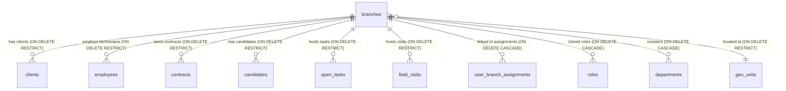

# دستور الكيان: الفروع (Branches Domain Constitution)

> **الحالة (Status):** Active / Authoritative  
> **المرجع الأعلى والتأسيسي للوحدات التنظيمية وعمليات التشغيل متعدد الفروع (Multi-branch)، وتنسيق تغطية الصلاحيات والفلترة الجغرافية.**

---

## 1. هوية الكيان (Entity Identity)

- **الاسم العربي:** الفروع / مراكز التشغيل الجغرافية
- **الاسم الإنجليزي:** Branches
- **اسم الجدول:** `branches`
- **الوصف:** الكيان التنظيمي والتأسيسي الأول لجميع العمليات في Golden CRM. يمثل الفرع وحدة تشغيل جغرافية وإدارية مستقلة للشركة تمتلك موقعاً فيزيائياً معتمداً ومجموعة فروع مغطاة بالتشغيل ومصفوفة موظفين وفرق عمل ميدانية. يتم عزل كافة البيانات التشغيلية (عملاء، عقود، زيارات، مكالمات، مهام) وإسناد الصلاحيات الأمنية جغرافياً وفق نطاق الفروع المصرح بها للمستخدم.
- **الجداول المرتبطة:**
  1. `clients` (مرتبط بـ `branch_id`).
  2. `employees` (مرتبط بـ `branch_id`).
  3. `contracts` (مرتبط بـ `branch_id`).
  4. `candidates` (مرتبط بـ `branch_id`).
  5. `open_tasks` (مرتبط بـ `branch_id`).
  6. `field_visits` (مرتبط بـ `branch_id`).
  7. `user_branch_assignments` (يربط الموظف بعدة فروع تشغيلية).
  8. `roles` (استنساخ قوالب الصلاحيات والوظائف للفرع).
  9. `departments` (الأقسام التابعة للفرع).
  10. `contact_targets` (أهداف اتصالات التسويق للفرع).
- **الأهمية والأمان:** يمثل ركيزة الحماية وعزل الفروع (Branch Scoping / Multi-branch Isolation). أي تسريب أو وصول خارج الفروع المتاحة يمثل خرقاً أمنياً صريحاً لخصوصية العملاء وحسابات الفروع بالشركة.

---

## 2. معجم الجداول والحقول (Table & Field Dictionary)

### 2.1 جدول الفروع `branches`
يخزن البيانات الأساسية للمواقع الفيزيائية ونطاق التغطية والاتصال للفروع المتاحة بالشركة.

| الحقل (Field) | النوع (SQL Type) | NULL? | DEFAULT | Constraints | الوصف والشرح بالعربية | مثال واقعي (Example) |
|---|---|---|---|---|---|---|
| `id` | `INTEGER` | ❌ | `nextval()` | `PRIMARY KEY` | المعرف الفريد للفرع | `3` (فرع حمص) |
| `name` | `VARCHAR(255)` | ❌ | — | — | الاسم الفعلي للفرع | `"فرع حمص"` |
| `location_geo_id`| `INTEGER` | ✅ | — | `FK → geo_units(id) ON DELETE RESTRICT`| المعرف الجغرافي للمقر الرئيسي للفرع | `10` (معرف حمص القديمة) |
| `detailed_address`| `TEXT` | ✅ | — | — | العنوان التفصيلي الفيزيائي للمقر | `"حي الواعر، شارع الخراب"`|
| `contact_info` | `JSONB` | ✅ | `'[]'::jsonb`| — | معلومات التواصل وأقسام الفرع | `[{"type": "phone", ...}]` |
| `status` | `VARCHAR(50)` | ✅ | `'active'` | `CHECK (status IN (active, inactive))` | حالة التفعيل للفرع بالعمليات | `"active"` |
| `created_at` | `TIMESTAMPTZ` | ✅ | `NOW()` | — | تاريخ تأسيس الفرع بالخلفية | `2026-04-01 12:00:00+00` |

---

### 2.2 المقر المعتمد مقابل جدول التغطية الجغرافية
تتوزع هوية الفرع جغرافياً وفق بعدين رئيسيين بالـ DB:
1. **المقر المعتمد للفرع (`location_geo_id`):** حقل أمني ونزاهة فيزيائية من نوع `INTEGER REFERENCES geo_units(id) ON DELETE RESTRICT`. يمثل المركز المالي والإداري لنشاط الفرع بالشركة.
2. **جدول التغطية (`branch_geo_coverage`):** جدول ربط مستقل (Junction Table — migration 169) يربط الفرع بالوحدات الجغرافية التي يغطيها:
   ```sql
   branch_geo_coverage (
     branch_id   INTEGER REFERENCES branches(id)   ON DELETE CASCADE,
     geo_unit_id INTEGER REFERENCES geo_units(id)  ON DELETE CASCADE,
     PRIMARY KEY (branch_id, geo_unit_id)
   )
   ```
   - حذف فرع → يُحذف كل صفوفه بالجدول تلقائياً (CASCADE).
   - حذف وحدة جغرافية → تُزال تغطية تلك الوحدة من جميع الفروع تلقائياً (CASCADE).
   - يُستخدم في `geoScopeService.ts` لبناء `serviceGeoIds` و`visibleGeoIds` لكل فرع.

---

### 2.3 هيكلية بيانات التواصل وأقسام الفروع `BranchContact`
يتم تخزين معلومات التواصل للفرع كـ JSONB يحتوي على مصفوفة كائنات تطابق النوع المشترك `BranchContact` بالخلفية:

```typescript
export interface BranchContact {
  id: string;            // معرف UUID فريد للواجهة الرسومية
  type: BranchContactType;
  department: BranchDepartment;
  value: string;         // البريد، الهاتف، أو الموقع الفعلي
  label?: string;        // ملاحظة إضافية
}

export type BranchContactType = 'email' | 'phone' | 'mobile' | 'website';
export type BranchDepartment = 'customer_service' | 'hr' | 'management' | 'accounting' | 'other';
```

*مثال تخزين واقعي بالـ DB:*
```json
[
  {
    "id": "c7a8b9d0-1234-5678-abcd-112233445566",
    "type": "phone",
    "department": "customer_service",
    "value": "031-234567",
    "label": "الرقم الأساسي لصيانة الفلاتر"
  }
]
```

---

## 3. القيود والقواعد التشغيلية (Database Constraints & Business Rules)

### BR-1: مطابقة وصلاحيات الوصول متعدد الفروع (Multi-branch Scope System)
يتعامل خادم التطبيق مع حدود وصول المستخدم للفروع بطريقة ديناميكية صارمة:
1. **إسناد الفروع للمستخدم:** يرتبط المستخدم الموظف بأكثر من فرع مع تحديد الفرع الرئيسي للعمل عبر جدول التخصيص `user_branch_assignments` (مصفوفة `allowedBranchIds`).
2. **تحديد الفرع الجاري (`actingBranchId`):** يُقرأ من الهيدر المرسل بالطلب `X-Branch-Id`. في حال كان الموظف يمتلك حق الوصول للفرع المرسل، يُعتمد كفرع جاري، وإلا يُستبدل بالفرع الرئيسي المعتمد له.
3. **فلترة السجلات جغرافياً:** يتم تصفية وعزل استعلامات جداول العملاء والعقود والمهام والزيارات بحيث تنحصر فقط في السجلات التابعة للفرع الجاري أو الفروع المصرح بها للموظف:
$$\text{WHERE } \text{record.branch\_id} \in \text{context.allowedBranchIds}$$

### BR-2: قيد المنع التام لحذف الفروع (ON DELETE RESTRICT Safety Bound)
لحماية سلامة وموثوقية البيانات المالية والجنائية التاريخية للشركة، تم فرض قيد حذف صارم `ON DELETE RESTRICT` لجميع حقول `branch_id` بالجدوال التشغيلية (انظر الهجرة `014`):
- يمنع محرك قاعدة البيانات حذف أي فرع بالكامل في حال كان يحتوي على زبون واحد (`clients`) أو موظف واحد (`employees`) أو عقد واحد (`contracts`) أو مهام ميدانية جارية أو تاريخية.
- للتخلص من الفرع، يجب تصفية ونقل ارتباطات كافة الموظفين والعملاء أولاً، وهو ما يمثل صمام أمان شامل ضد الحذف العشوائي.

### BR-3: قواعد حالة التفعيل والأرشفة (Branch Status Constraints)
- **حالة نشط (`status = 'active'`):** الفرع يعمل بالكامل، يظهر بالواجهات، ويسمح بإنشاء سجلات جديدة وتوزيع مهام ميدانية.
- **حالة غير نشط (`status = 'inactive'`):** الفرع متوقف ومغلق. يمنع الخادم بـ tRPC/Express إسناد موظفين جدد له أو تحويل فنيين تشغيليين، مع بقاء سجلاته التاريخية متاحة للقراءة والتدقيق المالي فقط لحفظ الأثر التاريخي للأقساط والصيانة.

### BR-4: نزاهة التغطية الجغرافية — محلولة ✅ (migration 169)
* **الوضع السابق:** كانت التغطية مخزنة كـ JSONB Array بلا FK، مما يترك معرفات يتيمة عند حذف وحدات جغرافية.
* **الوضع الحالي:** التغطية مخزنة في `branch_geo_coverage` (junction table) مع `ON DELETE CASCADE` على كلا الطرفين — حذف أي وحدة جغرافية يُنظّف الفروع المرتبطة بها أوتوماتيكياً. (انظر §2.2 للتفاصيل)

---

## 4. العلاقات الهيكلية (Entity Relationships)



---

## 5. قواعد الحذف والنزاهة المرجعية (Deletion & Integrity Rules)

- **حظر حذف الفرع (RESTRICT):** تفرض محركات قاعدة البيانات حظر حذف الفرع المرتبط بالعملاء والموظفين والعقود بـ `ON DELETE RESTRICT` لمنع تخلف سجلات يتمية بلا مرجعية مالية.
- **الحذف المتتالي (CASCADE):** عند نجاح حذف الفرع الشاغر (الخالي تماماً من السجلات والارتباطات الأساسية)، يقوم محرك الـ DB بالمسح المتتالي للارتباطات الأمنية والداخلية للفرع بـ `ON DELETE CASCADE` في الجداول التالية:
  - جدول مصفوفة الصلاحيات والأدوار المنسوخة للفرع `roles` (حيث يتم إزالة كافة الأدوار المستنسخة جراء وجود `branch_id`).
  - جدول تخصيص فروع المستخدمين `user_branch_assignments` (حيث تزال الفروع المخصصة للموظفين).
  - جدول الأقسام الإدارية والمهام الفرعية للفرع `departments`.

---

## 6. صلاحيات الوصول (Permission Matrix)

تم تنظيم الصلاحيات الخاصة بإدارة الفروع بالخلفية كالتالي:

| الصلاحية المطلوبة (Permission Key) | النطاق المسموح (Allowed Scopes) | الوصف والشرح بالعربية |
|---|---|---|
| `branches.view` | `GLOBAL / BRANCH` | استعراض قائمة الفروع وتفاصيلها — مطلوبة لـ `GET /` و `GET /:id` |
| `branches.manage` | `GLOBAL / BRANCH` | الصلاحية الإدارية الكاملة لإنشاء فروع جديدة وتعديلها وتغيير حالتها وحذفها |

---

## 7. عقد API (API Contract)

### 7.1 قائمة endpoints المتاحة

#### 1. `GET /api/branches`
- **الوصف:** استعراض وجلب قائمة جميع الفروع بالنظام.
- **الصلاحية المطلوبة:** `branches.view`.
- **صيغة الاستجابة:**
```json
[
  {
    "id": 3,
    "name": "فرع حمص",
    "locationGeoId": 10,
    "detailedAddress": "حي الواعر، بناية ١٢",
    "coveredGeoIds": [10, 43],
    "contactInfo": [
      { "id": "uuid-1", "type": "phone", "department": "customer_service", "value": "031-234567" }
    ],
    "status": "active",
    "createdAt": "2026-04-01T12:00:00.000Z",
    "locationGeoName": "حمص القديمة"
  }
]
```

#### 2. `POST /api/branches`
- **الوصف:** تأسيس وإنشاء فرع تشغيلي جديد للشركة.
- **الصلاحية المطلوبة:** `branches.manage`.
- **طلب المدخلات (Body Schema):**
```json
{
  "name": "فرع اللاذقية الجديد",
  "locationGeoId": 9,
  "detailedAddress": "شبه الجزيرة، بناية ٧",
  "coveredGeoIds": [9, 34, 35],
  "contactInfo": [
    { "id": "uuid-x", "type": "email", "department": "management", "value": "latakia@golden-crm.com" }
  ],
  "status": "active"
}
```
- **الاستجابة:** إرجاع السجل المنشأ كاملاً مع معرف الـ `id` الجديد.

#### 3. `GET /api/branches/:id`
- **الوصف:** تفاصيل فرع فردي.
- **الصلاحية المطلوبة:** `branches.view`.
- **رموز الأخطاء:** `404` إذا لم يوجد الفرع.

#### 4. `PUT /api/branches/:id`
- **الوصف:** تعديل بيانات الفرع (الاسم، المقر، التغطية، معلومات التواصل، الحالة).
- **الصلاحية المطلوبة:** `branches.manage`.
- **رموز الأخطاء:** `404` إذا لم يوجد الفرع.

#### 5. `DELETE /api/branches/:id`
- **الوصف:** حذف الفرع المحدد — يفشل إذا كان مرتبطاً بعملاء أو موظفين أو عقود.
- **الصلاحية المطلوبة:** `branches.manage`.
- **رموز الأخطاء:** `404` (غير موجود) / `409` (لا يمكن الحذف — توجد سجلات مرتبطة).

---

## 8. حالات الاختبار الشاملة (Test Cases)

| معرف الاختبار | سيناريو الاختبار (Scenario) | طريقة الطلب | المدخلات البرمجية (Inputs) | النتيجة المتوقعة (Expected) |
|---|---|---|---|---|
| **TC-01** | عرض كافة فروع النظام بنجاح | `GET /api/branches` | — | الرد بـ `200` وإرجاع مصفوفة الفروع المعرفة مع دمج الاسم الجغرافي للمقر. |
| **TC-02** | عرض تفاصيل فرع مخصص بنجاح | `GET /api/branches/3` | `id = 3` | الرد بـ `200` وإرجاع السجل الكامل والتفصيلي للفرع. |
| **TC-03** | قراءة الفروع بدون صلاحيات خاصة | `GET /api/branches` | حساب موظف تشغيلي بنطاق صلاحيات محدود | الرد بـ `200` والنجاح بالقراءة دون حظر (تأكيد فجوة requireAuth). |
| **TC-04** | منع إنشاء فرع بدون مسمى | `POST /api/branches` | `{ "locationGeoId": 1 }` | الرد بـ `400/500` بسبب القيد الميكانيكي لقاعدة البيانات `NOT NULL`. |
| **TC-05** | إنشاء فرع تشغيلي جديد بنجاح | `POST /api/branches` | `{ "name": "الفرع التجريبي", "locationGeoId": 1 }` | الرد بـ `200` وتوليد الرقم الفريد وتخزين مصفوفات JSONB الافتراضية الفارغة. |
| **TC-06** | حظر حذف فرع يحتوي على زبائن | `DELETE /api/branches/1`| `id = 1` (فرع دمشق - يحتوي على 500 زبون)| الرد بـ `500` وإفشال العملية وتبيان الخطأ بسبب قيد `ON DELETE RESTRICT`. |
| **TC-07** | حظر حذف فرع يحتوي على موظفين | `DELETE /api/branches/2`| `id = 2` (يحتوي على فنيين صيانة) | الرد بـ `500` وإفشال العملية ومنع تعليق أو يتم حسابات الموظفين. |
| **TC-08** | حذف فرع فارغ تماماً بنجاح | `DELETE /api/branches/9`| `id = 9` (فرع تم مسح ونقل كافة الموظفين منه) | الرد بـ `200` مع مسح متتاليCASCADE لتعيينات فروع المستخدمين التابعة. |
| **TC-09** | تعديل مصفوفة التغطية للفرع | `PUT /api/branches/3` | `{ "name": "فرع حمص", "coveredGeoIds": [10, 43, 44] }` | الرد بـ `200` وتعديل مصفوفة JSONB بالخلفية لـ 3 أحياء مغطاة. |
| **TC-10** | حظر التعديل بدون صلاحيات إدارة | `PUT /api/branches/3` | طلب مستخدم غير مصرح له بـ `branches.manage` | الرد بـ `403` "Forbidden - صلاحيات غير كافية للتعديل". |
| **TC-11** | محاولة الوصول لفرع غير معرّف | `GET /api/branches/999`| `id = 999` | الرد بـ `404` "الفرع غير موجود بقاعدة البيانات". |
| **TC-12** | تحديث معلومات التواصل والاتصال | `PUT /api/branches/3` | `{ "name": "فرع حمص", "contactInfo": [{"type":"phone","value":"031-1"}] }` | الرد بـ `200` وتخزين المصفوفة وتعديل كاش الصلاحيات والوصول للفرع. |

---

## 9. الثغرات والتضاربات المكتشفة (Gaps & Contradictions)

### GAP-045: ✅ محلول — إضافة `branches.view` لمسارات الاستعلام
* **الموقع:** `packages/api/routes/branches.ts`
* **الحل المُطبَّق:** استبدال `requireAuth` بـ `requirePermission('branches.view')` على `GET /` و `GET /:id`. الصلاحية موجودة في DB منذ migration 030 ومستخدمة صحيحاً في الواجهة.
* **التاريخ:** 2026-05-24

### GAP-046: ✅ محلول — استبدال `covered_geo_ids` JSONB بجدول `branch_geo_coverage`
* **الموقع:** `migrations/169_branch_geo_coverage_table.sql` + `geoScopeService.ts` + `branches.ts`
* **الحل المُطبَّق:** إنشاء junction table مع `ON DELETE CASCADE` على كلا الطرفين — حذف أي وحدة جغرافية يُنظّف تغطية الفروع أوتوماتيكياً. (انظر §2.2)
* **التاريخ:** 2026-05-24

### GAP-047: غياب النزاهة والتحقق من بنية معلومات التواصل للفرع
* **الموقع:** `migrations/004_column_additions.sql` (branches.contact_info)
* **الوصف:** يتم تخزين حقل معلومات التواصل كـ JSONB مرن وحر دون وجود قيد فحص أو التحقق من صحة تطابق الكائنات البرمجية (Contact Schema Structure validation).
* **التأثير:** إمكانية إدخال بيانات تالفة أو كائنات مشوهة بالداتابيز تؤدي لحدوث أخطاء فادحة وتوقف تام بالواجهات الأمامية للعملاء عند محاولة تفكيك وقراءة مصفوفة الفروع بالمتصفح.
* **الحل المقترح:** تطبيق فحص وتحقق صارم في السيرفر باستخدام Zod Schema للـ `contactInfo` المدخل بطلب الـ PUT/POST قبل ترحيل الحفظ بقاعدة البيانات.

### GAP-048: انعدام سجل التدقيق ومراقبة التغييرات للفروع
* **الموقع:** `packages/api/routes/branches.ts`
* **الوصف:** تخلو واجهة الإدارة للفروع تماماً من وجود نظام تتبع وتدقيق (Audit Trail) للعمليات التشغيلية الهامة كالتغيير الجغرافي للمقر، أو تعديل مصفوفة الأحياء المغطاة، أو تغيير أرقام الاتصال.
* **التأثير:** صعوبة تحديد المسؤول عن إحداث تغييرات جغرافية أدت لتداخل نطاقات العمل الميداني للفرق وتغيير توزيع العمليات الجغرافية.
* **الحل المقترح:** تسجيل وربط عمليات التعديل للفروع بجدول المراقبة والتدقيق العام للمشروع `audit_logs`.

### GAP-049: تعطل فحص حالة الفرع غير النشط بالمهام والعقود الجديدة
* **الموقع:** `packages/api/routes/clients.ts` & `packages/api/routes/contracts.ts`
* **الوصف:** لا يفرض السيرفر أي فحوصات تمنع إسناد أو تسجيل عقود أو عملاء أو مهام جديدة لفرع تم تحويل حالته ميدانياً لـ غير نشط (`status = 'inactive'`).
* **التأثير:** إمكانية ترحيل سجلات وعمليات جديدة لفروع مغلقة مما يؤدي لضياع السجلات ميدانياً لغياب فرق العمل النشطة التابعة للفرع.
* **الحل المقترح:** تطبيق قيد فحص بالـ Controllers يحظر ترحيل السجلات الجديدة في حال لم تكن حالة الفرع المرجعي `active` بالداتابيز.

---

## 10. تاريخ التغييرات الهيكلية (Schema Changelog)

| تاريخ الهجرة | رقم الهجرة (File) | الإجراء والوصف التقني والتأثير |
|---|---|---|
| **2026-04-01** | `001_core_tables.sql`| التأسيس الأولي لجدول `branches` مع تحديد المقر والمستند التأسيسي لمصفوفة التغطية الجغرافية والحالة. |
| **2026-04-02** | `004_column_additions.sql`| إضافة حقل معلومات التواصل للفرع `contact_info` بصفة مصفوفة JSONB مرنة بالخلفية. |
| **2026-04-14** | `013_multi_branch_identity.sql`| **تعدد الهوية التنظيمية:** ربط حسابات المستخدمين (`hr_users`) والأدوار الأكاديمية بالفروع ودعم قوالب النسخ للفرع. |
| **2026-04-14** | `014_branch_id_domain_tables.sql`| **الربط متعدد الفروع المعزز:** إدراج حقول `branch_id REFERENCES branches(id) ON DELETE RESTRICT` بـ 11 جدولاً لجميع الكيانات المتاحة. |
| **2026-04-15** | `016_departments.sql`| تأسيس الأقسام الإدارية والعملياتية وربطها المباشر بالفرع الرئيسي بـ `ON DELETE CASCADE`. |
| **2026-04-20** | `019_authorization_schema_preparation.sql`| إدخال جدول تعيينات الفروع وتعدد الوصول للمستخدمين `user_branch_assignments`. |
| **2026-04-24** | `040_branches_detailed_address.sql`| إلحاق حقل العنوان الفيزيائي التفصيلي `detailed_address` بجدول الفروع لتحديد مقار العمل بالكامل. |
| **2026-04-27** | `060_fix_branch_geo_coverage.sql`| معالجة وتصحيح بنية معطيات التغطية والمواقع الجغرافية وتطابقها للفلترة جغرافياً. |
| **2026-05-24** | `169_branch_geo_coverage_table.sql`| **GAP-046:** استبدال `covered_geo_ids` JSONB بجدول `branch_geo_coverage` مع `ON DELETE CASCADE` على كلا الطرفين + ترحيل البيانات الموجودة. |
