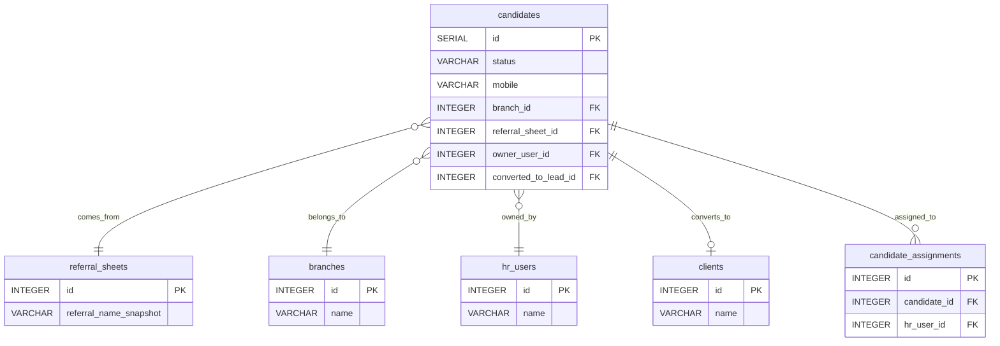

# دستور الكيان: المرشحون (Candidates Domain Constitution)

> **الحالة (Status):** Draft / Active  
> **المرجع الأعلى للكيان `candidates` في النظام.** تم إعداده بناءً على تحليل هجرات قاعدة البيانات، الهياكل البرمجية، السياسات الأمنية، والمنطق التشغيلي المطبق.

---

## 1. هوية الكيان (Entity Identity)

- **الاسم العربي:** المرشح
- **الاسم الإنجليزي:** Candidate
- **اسم الجدول:** `candidates`
- **الوصف:** يمثل الشخص أو العائلة المقترحة كعميل محتمل للشركة قبل إجراء أي عملية شراء فعلية. يتم تجميع المرشحين يدوياً أو تلقائياً من أوراق الإحالة المجمعة ميدانياً (`referral_sheets`). يُصنف العميل كمرشح حتى تثبت جديته ويتحول لعميل فعلي (`Client`) يملك عقداً وجهازاً.
- **الفرق بين المرشح (Candidate) والزبون (Client):** 
  - المرشح هو هدف تسويقي مؤقت لم يقم بأي شراء بعد ولا يملك عقوداً، ويمكن حذفه فيزيائياً من النظام بشكل حاد (Hard-Delete).
  - الزبون هو كيان مالي وتجاري نشط يملك عقوداً وأجهزة ويستفيد من خدمات الصيانة، ولا يمكن حذفه إلا ناعماً (Soft-Delete) لحماية نزاهة الحسابات والأرشيف الميداني.
- **الجداول المرتبطة برمجياً وتاريخياً:** `referral_sheets`, `clients` (عبر `converted_to_lead_id`)، `candidate_assignments`, `hr_users`, `branches`, `geo_units`

---

## 2. الجدول والحقول (Table & Field Dictionary)

يحتوي الجدول التالي على معجم الحقول لجدول `candidates` المستخلص بدقة من هجرات قاعدة البيانات ومسارات الخادم الخلفي لـ API والأنماط المشتركة:

| الحقل (Field) | النوع (SQL Type) | NULL? | DEFAULT | Constraints | الوصف والشرح بالعربية | مثال واقعي (Example) |
|---|---|---|---|---|---|---|
| `id` | `SERIAL` | ❌ | — | `PRIMARY KEY` | المعرف الفريد للمرشح في قاعدة البيانات | `102` |
| `first_name` | `VARCHAR(255)` | ✅ | — | — | الاسم الأول للمرشح | `"سمير"` |
| `last_name` | `VARCHAR(255)` | ✅ | — | — | الكنية / اسم العائلة للمرشح | `"الحموي"` |
| `nickname` | `VARCHAR(255)` | ✅ | — | — | اللقب الشعبي للمرشح | `"أبو أحمد"` |
| `mobile` | `VARCHAR(50)` | ❌ | — | — | رقم الموبايل الأساسي النظيف للاتصال | `"0933112233"` |
| `contacts` | `JSONB` | ✅ | `'[]'`::jsonb | — | قائمة أرقام الاتصال الإضافية وحالاتها | `[{"label": "عمل", "number": "0113334445", "isPrimary": false, "status": "active"}]` |
| `address_text` | `TEXT` | ✅ | `''` | — | العنوان النصي للمرشح | `"حمص، الإنشاءات، شارع البرازيل، بناية 8"` |
| `geo_unit_id` | `INTEGER` | ✅ | — | — | معرف المنطقة الجغرافية للحي/القرية | `45` |
| `owner_user_id` | `INTEGER` | ✅ | — | — | (Legacy) معرف المستخدم المالك الفردي القديم | `12` |
| `status` | `VARCHAR(50)` | ✅ | `'Suggested'` | `CHECK (status IN ...)` | حالة المرشح (New, Suggested, FollowUp, Contacted, Qualified, Junk) | `"Suggested"` |
| `referral_sheet_id` | `INTEGER` | ✅ | — | `FK → referral_sheets(id)` | معرف ورقة الإحالات الميدانية المصدر | `15` |
| `referral_date` | `VARCHAR(50)` | ✅ | — | — | تاريخ تسجيل الإحالة | `"2026-05-10"` |
| `referral_reason` | `TEXT` | ✅ | — | — | سبب ترشيح وإحالة العميل | `"استعلام مبيعات جهاز مياه"` |
| `referral_type` | `VARCHAR(100)` | ✅ | — | — | نوع الإحالة التشغيلي | `"Client"` / `"Personal"` / `"Employee"` |
| `referral_origin_channel`| `VARCHAR(100)`| ✅ | — | — | القناة المصدر التي تم جلب الترشيح عبرها | `"PhoneCall"` / `"Campaign"` |
| `referral_name_snapshot` | `VARCHAR(255)` | ✅ | — | — | اسم الشخص المحيل وقت التقاط الصورة | `"محمود البكري"` |
| `referral_entity_id` | `INTEGER` | ✅ | — | — | معرف الكيان المحيل للمرشح | `102` |
| `referral_confirmation_status`| `VARCHAR(50)`| ✅ | `'Pending'`| — | حالة تأكيد الاتصال الأولي بالإحالة (Pending, Confirmed, Rejected) | `"Pending"` |
| `occupation` | `VARCHAR(255)` | ✅ | — | — | مهنة المرشح الحالية | `"تاجر أقمشة"` |
| `candidate_notes` | `TEXT` | ✅ | — | — | ملاحظات تشغيلية خاصة بالمرشح | `"مهتم بأجهزة الفلترة الصناعية"` |
| `duplicate_flag` | `BOOLEAN` | ✅ | `FALSE` | — | راية تشير لتكرار الهاتف بقاعدة البيانات | `false` |
| `duplicate_type` | `VARCHAR(50)` | ✅ | — | — | نوع التكرار المطابق المكتشف (Candidate, Client, Both) | `"Client"` |
| `duplicate_reference_id` | `INTEGER` | ✅ | — | — | معرف السجل المكرر المطابق | `1024` |
| `converted_to_lead_id` | `INTEGER` | ✅ | — | — | معرف الزبون المنشأ في `clients(id)` بعد التحويل | `2048` |
| `created_at` | `TIMESTAMPTZ` | ✅ | `NOW()` | — | تاريخ ووقت إنشاء السجل | `"2026-05-24T18:00:00Z"` |
| `created_by` | `INTEGER` | ✅ | — | — | معرف المستخدم الذي سجل المرشح | `7` |
| `branch_id` | `INTEGER` | ✅ | — | `FK → branches(id)` | معرف الفرع التشغيلي الحاضن للمرشح | `3` |

---

## 3. القيود والقواعد (Constraints & Business Rules)

### 3.1 قيود قاعدة البيانات (Database Constraints)
- **Primary Key:** الحقل `id` هو المعرف الفريد التلقائي للجدول.
- **Foreign Keys:**
  - `referral_sheet_id` يرتبط بـ `referral_sheets(id)` مع خيار `ON DELETE SET NULL`.
  - `branch_id` يرتبط بـ `branches(id)` مع خيار `ON DELETE RESTRICT` لمنع حذف الفرع إذا كان يحتوي على مرشحين مخصصين.
- **Status CHECK constraint:** تفرض قاعدة البيانات انحصار حالة المرشح ضمن قيم محددة:
  ```sql
  CONSTRAINT candidates_status_check CHECK (status IN ('New', 'Suggested', 'FollowUp', 'Contacted', 'Qualified', 'Junk'))
  ```

### 3.2 قواعد العمل البرمجية والتشغيلية (Business Rules)

#### BR-1: آلة حالات المرشح الصارمة (Status State Machine)
المرشح يبدأ تشغيلياً بحالة `New` (في حال إدخاله يدوياً بالكامل) أو `Suggested` (في حال جلبه تلقائياً عبر لوائح الإحالة الميدانية)، ويتنقل عبر الفلترة والاتصال:
- `Suggested` / `New` ──► الاتصال الأولي ──► `Contacted`
- `Contacted` ──► عدم جدية أو رفض ──► `Junk`
- `Contacted` ──► إبداء اهتمام ومتابعة ──► `FollowUp`
- `FollowUp` / `Contacted` ──► نجاح الفلترة والتحقق والتأهيل ──► `Qualified`
- `Qualified` ──► شراء الفلتر وإنشاء عقد ──► `Converted` (يتم ربطه بـ `converted_to_lead_id` ويتحول إلى زبون).

#### BR-2: نظام الكشف التلقائي عن التكرار (Duplicate Detection System)
عند إنشاء أو تعديل مرشح، يتم تنظيف وفحص رقم الهاتف المدخل (`mobile` أو أي رقم في مصفوفة `contacts`). إذا تطابق مع هاتف عميل أو مرشح آخر فعال:
- يتم تعيين `duplicate_flag = TRUE`.
- يتم تعيين `duplicate_reference_id` بمعرف الكيان المطابق.
- يتم تعيين `duplicate_type` حسب حالة الكيان المطابق:
  - `Candidate` (إذا تطابق مع مرشح آخر).
  - `Client` (إذا تطابق مع زبون مسجل فعلياً).
  - `Both` (إذا تطابق مع الكيانين).

#### BR-3: التحويل لعميل (Lead Conversion Architecture)
لا يوجد مسار برميجي أوتوماتيكي أو قيد قاعدة بيانات يعالج التحويل. العملية تتم عبر الواجهة (Client-Side) حيث يقوم النظام عند نجاح البيع بإنشاء زبون جديد في جدول `clients` مع تعيين `is_candidate = TRUE` ومن ثم تحديث سجل المرشح بوضع معرف الزبون الجديد في حقل `converted_to_lead_id` وتغيير حالته إلى `Qualified`.

#### BR-4: الملكية والتخصيص الذاتي (Ownership & Auto-Assignment)
- يستخدم الكيان العمود المباشر `owner_user_id` لحفظ المالك الفردي للمرشح (الذي يتم تعيينه تلقائياً كمنشئ السجل للمستخدمين غير المشرفين، أو يحدد يدوياً من الأدمن).
- يدعم الجدول التعيينات متعددة الملاك عبر جدول الجانكشن `candidate_assignments` للنطاق `ASSIGNED`.
- عند إنشاء مرشح يدوياً، يتم فرض إدراج معرف المستخدم الحالي المنشئ تلقائياً ضمن قائمة المسندين لضمان الاحتفاظ بصلاحيات الوصول في حال كان يملك نطاق إسناد شخصي.

#### BR-5: التوليد التلقائي من لوائح الإحالة الميدانية (Referral Sheets Generation)
عند إغلاق لائحة أسماء ميدانية (`referral_sheets`)، يتم توليد سجلات مرشحين تلقائياً في الجدول وتغذية حقول الإحالة مثل `referral_sheet_id` و `referral_name_snapshot` تلقائياً دون تدخل يدوي، مع وضع الحالة الابتدائية `Suggested` وحالة التأكيد `Pending`.

---

## 4. العلاقات (Relationships)

### 4.1 مخطط العلاقات الكيانية (Entity Relationship Map)



### 4.2 تفاصيل الجداول المرتبطة

| الجدول المرتبط | نوع العلاقة | سلوك الحذف (ON DELETE) | الوصف التشغيلي |
|---|---|---|---|
| `referral_sheets` | `N:1` | `SET NULL` | لائحة الأسماء التشغيلية التي تم تجميع المرشح عبرها ميدانياً. |
| `branches` | `N:1` | `RESTRICT` | الفرع الإداري المالك لبيانات المرشح والناظم لصلاحية نطاق الفرع. |
| `hr_users` | `N:1` | `SET NULL` | المالك الفردي الأساسي للمرشح (`owner_user_id`). |
| `clients` | `1:1` | — | السجل المالي للزبون الذي تم إنشاؤه بعد تحويل المرشح الناجح. |
| `candidate_assignments`| `1:N` | `CASCADE` | جدول الربط متعدد-إلى-متعدد لتخصيص المرشحين لموظفي التسويق والمتابعة. |

---

## 5. آلة الحالات (State Machine)

### 5.1 دورة حياة المرشح الكاملة (Candidate Status Lifecycle)

```
      [Suggested] (ميداني)  ──┐
                               │
      [New] (يدوي) ────────────┴─► [Contacted] (تم الاتصال) ──► [Junk] (مستبعد)
                                       │
                                       ├─► [FollowUp] (متابعة واهتمام)
                                       │
                                       └─► [Qualified] (مؤهل للشراء) ──► [Converted to Client]
```

### 5.2 حالة تأكيد الإحالة الميدانية (Referral Confirmation Status)
تتحكم هذه الحالة بعمليات التحقق الأولي لمدخلات فرق الميدان قبل بدء الاتصالات التسويقية الصارمة:
- `Pending` (افتراضي عند التوليد التلقائي من لوائح الأسماء).
- `Confirmed` (عند تأكيد الموظف لصحة رقم الهاتف وتفاصيل العميل).
- `Rejected` (عند اكتشاف رقم خطأ أو هوية وهمية، ويؤدي غالباً لنقل المرشح لحالة `Junk`).

---

## 6. صلاحيات الوصول (Permission Matrix)

يتم تنظيم وإدارة الوصول لبيانات المرشحين عبر نظام الصلاحيات الموزع على مساحتين للأسماء (Namespaces):

### 6.1 الصلاحيات الأساسية للمرشحين (`candidates.*`)

تتحكم بالوصول لقوائم وبيانات المرشحين الفردية ومتابعات الاتصالات:

| المفتاح (Permission Key) | الاسم العربي للصلاحية | النطاقات المدعومة (Scopes) | الوصف الأمني |
|---|---|---|---|
| `candidates.view_list` | عرض المرشحين | `GLOBAL`, `BRANCH`, `ASSIGNED` | رؤية قائمة المرشحين والتفاصيل (السياسة تستخدم view_list للتفاصيل أيضاً). |
| `candidates.create` | إنشاء مرشح | `GLOBAL`, `BRANCH` | إضافة سجل مرشح يدوي جديد وتخصيص الفرع التشغيلي المطبق. |
| `candidates.edit` | تعديل مرشح | `GLOBAL`, `BRANCH`, `ASSIGNED` | تعديل بيانات المرشح، وتحديث وضعه وإسنادات موظفيه. |
| `candidates.delete` | حذف مرشح | `GLOBAL`, `BRANCH` | إجراء الحذف الفيزيائي الحاد للسجل التالف أو غير المرغوب فيه. |

### 6.2 صلاحيات لوائح الأسماء الإحالية (`candidates.name_lists.*`)

تتحكم بإدارة أوراق الإحالة والمجموعات الميدانية المجمعة للأسماء (Referral Sheets):
- `candidates.name_lists.view_list` (عرض كشوف ولوائح الأسماء المصدر).
- `candidates.name_lists.create` (إنشاء لوائح الأسماء).
- `candidates.name_lists.edit` (تعديل وتحديث لوائح الأسماء).
- `candidates.name_lists.delete` (حذف لوائح الأسماء ميدانياً).

---

## 7. عقد API (API Contract)

### 7.1 قائمة المسارات (Endpoints)

يتميز كيان المرشحين بعقد API مغلق وبسيط جداً يحتوي على **4 مسارات فقط** مع **غياب مسار جلب تفاصيل السجل الفردي** (`GET /:id`):

| الطريقة | المسار (Path) | الصلاحية المطلوبة | وصف السلوك والوظيفة التشغيلية |
|---|---|---|---|
| **GET** | `/api/candidates` | `candidates.view_list` | جلب قائمة المرشحين، مع دعم التصفية والبحث والـ Pagination ونطاق الصلاحيات المطبقة. |
| **POST** | `/api/candidates` | `candidates.create` | إنشاء سجل مرشح جديد، وحفظ التعيينات للموظفين وإسناد الفرع تلقائياً. |
| **PUT** | `/api/candidates/:id` | `candidates.edit` | تعديل سجل المرشح بالكامل وتحديث التعيينات أو المالك القديم. |
| **DELETE**| `/api/candidates/:id` | `candidates.delete` | حذف سجل المرشح فيزيائياً وبشكل نهائي من الداتابيز. |

### 7.2 تفاصيل الاستجابة والطلب (Request / Response Schemas)

#### 7.2.1 طلب إنشاء مرشح (POST /api/candidates)
```json
{
  "firstName": "سمير",
  "lastName": "الحموي",
  "nickname": "أبو أحمد",
  "mobile": "0933112233",
  "contacts": [],
  "addressText": "حمص، الإنشاءات",
  "geoUnitId": 45,
  "status": "Suggested",
  "branchId": 3,
  "occupation": "تاجر أقمشة",
  "candidateNotes": "مهتم بأجهزة الفلترة الصناعية",
  "assignmentUserIds": [7]
}
```

#### 7.2.2 استجابة تفاصيل المرشح من القائمة
```json
{
  "id": 102,
  "firstName": "سمير",
  "lastName": "الحموي",
  "nickname": "أبو أحمد",
  "mobile": "0933112233",
  "contacts": [],
  "addressText": "حمص، الإنشاءات",
  "geoUnitId": 45,
  "ownerUserId": 7,
  "status": "Suggested",
  "referralSheetId": 15,
  "referralDate": "2026-05-10",
  "referralReason": "استعلام مبيعات جهاز مياه",
  "referralType": "Client",
  "referralOriginChannel": "PhoneCall",
  "referralNameSnapshot": "محمود البكري",
  "referralEntityId": 102,
  "referralConfirmationStatus": "Pending",
  "occupation": "تاجر أقمشة",
  "candidateNotes": "مهتم بأجهزة الفلترة الصناعية",
  "duplicateFlag": false,
  "duplicateType": null,
  "duplicateReferenceId": null,
  "convertedToLeadId": null,
  "createdAt": "2026-05-24T18:00:00Z",
  "createdBy": 7,
  "branchId": 3,
  "branchName": "فرع حمص",
  "createdByUserId": 7,
  "createdByUserName": "علي المحمد",
  "createdByRoleDisplayName": "مدير تسويق حمص",
  "assignments": [
    {
      "userId": 7,
      "userName": "علي المحمد",
      "roleDisplayName": "مدير تسويق حمص"
    }
  ]
}
```

---

## 8. حالات الاختبار الشاملة (Test Cases)

### 8.1 الاختبارات الوظيفية وعقد العمل (Functional Tests)

| الرمز | سيناريو الفحص والاختبار | الطريقة والمسار | المدخلات المرسلة | السلوك المتوقع والاستجابة | ملاحظات تشغيلية |
|---|---|---|---|---|---|
| **TC-01** | إنشاء مرشح مستوف للشروط (Happy Path) | POST `/api/candidates` | اسم أول، رقم هاتف، فرع، وحالة `Suggested`. | ترميز `200` مع الكائن المنشأ كاملاً مغذياً بالتعيينات. | يتم ربط الموظف المنشئ تلقائياً بالمسندين. |
| **TC-02** | محاولة إنشاء مرشح بدون رقم هاتف أساسي | POST `/api/candidates` | كائن مرشح بدون هاتف أو مصفوفة أرقام إضافية. | ترميز `400` أو فشل الفاليديشن. | رقم الموبايل حقل إجباري لإجراء الفحص الذكي. |
| **TC-03** | محاولة إنشاء مرشح بحالة مخالفة للقيود | POST `/api/candidates` | إرسال حالة `InvalidStatus` في حقل `status`. | ترميز `500` أو خطأ قاعدة بيانات للفشل بقيد الفحص. | قيد قاعدة البيانات `candidates_status_check` يحظر التلاعب. |
| **TC-04** | تعديل حالة المرشح إلى Junk | PUT `/api/candidates/:id`| إرسال كائن تعديل يغير الحالة إلى `Junk`. | ترميز `200` مع تحديث الحالة بنجاح. | تمثل استبعاد العميل لعدم الجدية. |
| **TC-05** | محاولة حذف مرشح تم تحويله إلى عميل فعلي | DELETE `/api/candidates/:id`| معرف مرشح يملك قيمة غير خالية في `converted_to_lead_id`. | ترميز `400` مع منع الحذف التشغيلي لوجود كيان زبون مرتبط. | (ثغرة تصميمية: الـ API يفتقد لهذا الفحص حالياً). |
| **TC-06** | حذف مرشح معلق لم يتحول بعد | DELETE `/api/candidates/:id`| معرف مرشح بحالة `Suggested` أو `Junk` غير مرتبط بعميل. | ترميز `200` مع نجاح الحذف الفيزيائي التام من قاعدة البيانات. | هذا الكيان يدعم الحذف الصلب بشكل طبيعي. |
| **TC-07** | تصفية قائمة المرشحين بالفرع | GET `/api/candidates?branchId=3`| إرسال المعلمة في مسار الاستعلام. | ترميز `200` وإعادة مرشحي الفرع رقم 3 فقط. | فلترة دقيقة للفروع. |

### 8.2 اختبارات الصلاحيات والنطاقات (Permissions Scope Tests)

| رتبة المستخدم | الصلاحية المفحوصة | نطاق الصلاحية (Scope) | السلوك التشغيلي المتوقع |
|---|---|---|---|
| **HQ Admin** | `candidates.view_list` | `GLOBAL` | يستطيع استعلام وجلب كافة مرشحي الشركة عبر كافة الفروع دون حظر. |
| **Branch Manager** | `candidates.view_list` | `BRANCH` | يرى فقط مرشحي الفرع التشغيلي المخصص له، ويمنع من رؤية مرشحي بقية الفروع. |
| **Telemarketer** | `candidates.view_list` | `ASSIGNED` | يرى فقط المرشحين المسندين له شخصياً في جدول `candidate_assignments`. |
| **Telemarketer** | `candidates.delete` | `NONE` | يُرفض طلبه فوراً بترميز `403` لعدم امتلاك إذن الحذف نهائياً. |

---

## 9. الثغرات والتضاربات المكتشفة (Gaps & Contradictions)

تم رصد عدد من الثغرات البرمجية والعيوب المعمارية والتصميمية لكيان المرشحين:

### ⚠️ 9.1 الثغرة الأولى: غياب كامل لمسار جلب السجل الفردي للمرشح (Missing GET Candidate by ID Endpoint)
- **التضارب:** يفتقر مسار المرشحين `routes/candidates.ts` كلياً لوجود مسار قراءة سجل فردي (`GET /api/candidates/:id`) بالرغم من احتواء ملف السياسات الأمنية `candidatePolicy.ts` على دالة تحقق مخصصة لقراءة مرشح منفرد `canViewCandidate` تشير لأحقية المستخدم بالوصول.
- **الأثر التشغيلي:** تضطر واجهة المستخدم الرسومية (Frontend) لجلب كامل قائمة المرشحين وتصفيتها محلياً لعرض تفاصيل مرشح، مما يسبب استهلاكاً ضخماً للبيانات ومخاطر تسريب أمني لبيانات مرشحين خارج نطاق صلاحيات الموظف التشغيلية.
- **التوصية:** إنشاء المسار `GET /api/candidates/:id` وربطه بالسياسة الأمنية المحددة واستعلام الحقول الفردية.

### ⚠️ 9.2 الثغرة الثانية: تعارض قيم الحالة بين قيد قاعدة البيانات ونوع التطبيق البرمجي (Status Values Mismatch)
- **التضارب:** تفرض قاعدة البيانات بقيد الفحص `candidates_status_check` قيم الحالة التالية:
  `('New', 'Suggested', 'FollowUp', 'Contacted', 'Qualified', 'Junk')`.
  بينما يعرّف النوع البرمجي المشترك في ملف `packages/shared/types.ts` القيم كالتالي:
  `CandidateStatus = 'Prospect' | 'Suggested' | 'FollowUp' | 'Contacted' | 'Qualified' | 'Junk'`.
  تم استبدال قيمة `New` في قاعدة البيانات بـ `Prospect` في طبقة التطبيق البرمجي دون تحديث الداتابيز.
- **الأثر التشغيلي:** حدوث أخطاء قاتلة عند محاولة إدخال القيمة البرمجية `Prospect` في قاعدة البيانات بسبب فشل قيود التحقق وقذف أخطاء `500` للمستخدمين.
- **التوصية:** توحيد المسمى إما لـ `New` أو لـ `Prospect` بكافة الطبقات وتعديل الهجرات وقيد الداتابيز بالتزامن.

### ⚠️ 9.3 الثغرة الثالثة: حظر نطاق الإسناد الفردي في قيود الصلاحيات بالداتابيز (Assigned Scope Blocked by DB Allowed Scopes)
- **التضارب:** في هجرة الصلاحيات والنطاقات المسموحة (`054_permissions_allowed_scopes.sql`)، تم تقييد صلاحيات المرشحين التشغيلية `candidates.*` بـ `GLOBAL` و `BRANCH` فقط واستبعاد نطاق `ASSIGNED`. بينما في كود الخادم الفعلي `routes/candidates.ts` ودالة التحقق بالسياسة، يوجد منطق برمجي مخصص لتصفية وعرض وفلترة القوائم للمستخدمين الذين يملكون نطاق `ASSIGNED` فقط بناءً على جدول الربط M2M.
- **الأثر التشغيلي:** لا يمكن للآدمن تعيين النطاق المخصص الفردي لمسؤولي التسويق الهاتفي عبر لوحة التحكم بالرغم من جاهزية الكود للتعامل مع التعيينات الفردية، مما يعطل فكرة استقلالية بيانات موظف التسويق.
- **التوصية:** إضافة نطاق `'ASSIGNED'` للصلاحيات الخاصة بالمرشحين في هجرات قواعد البيانات.

### ⚠️ 9.4 الثغرة الرابعة: تكرار أعمدة الملكية والتخصيص الإرثية (Stale Single-Ownership Column - owner_user_id)
- **التضارب:** بقاء العمود `owner_user_id` في جدول `candidates` بعد الانتقال لنظام التعيين متعدد الأطراف في جدول الربط `candidate_assignments` في الهجرة `042`. يقوم الكيان بتخزينه وتعبئته كلقب للمالك التشغيلي يدوياً بالرغم من خروج العمود من الحسابات الأمنية المطبقة بالـ Middleware.
- **الأثر التشغيلي:** تكرار وتخزين بيانات غير مستخدمة ومربكة للمطورين الجدد في قاعدة البيانات.
- **التوصية:** إسقاط العمود `owner_user_id` والاعتماد بالكامل على جدول الجانكشن.

### ⚠️ 9.5 الثغرة الخامسة: عدم وجود معالجة ترانزأكشن أوتوماتيكية للتحويل لزبون (No DB-Level Lead Conversion Transaction)
- **التضارب:** الحقل `converted_to_lead_id` يتم تحديثه كمعلمة عادية بالـ Body في مسار التعديل دون وجود مسار ترانزأكشن مخصص أو إجراء مخزن بالداتابيز يضمن صحة إنشاء الزبون المقابل وتحديث حالة المرشح لـ `Qualified` في نفس اللحظة.
- **الأثر التشغيلي:** خطر حدوث انقطاع وتيتيم للمرشحين بحيث يتم تحويلهم لزبائن دون تحديث سجل المرشح بقيمة `converted_to_lead_id` الصحيحة، مما يعطل تتبع الأثر ونجاح الحملات التسويقية.
- **التوصية:** إنشاء مسار برمجي خاص بـ `POST /api/candidates/:id/convert` ينفذ العملية كترانزأكشن متكامل ومضمون.

---

## 10. تاريخ التغييرات (Schema Changelog)

يوثق الجدول التالي تتابع نمو وتطور الكيان `candidates` عبر هجرات قواعد البيانات المتتالية:

| تاريخ الهجرة | ملف الهجرة (Migration File) | طبيعة التعديل وهدف التأثير الفني والتشغيلي على الجدول |
|---|---|---|
| **2026-04** | `001_core_tables.sql` | التأسيس الأولي (Baseline) وإنشاء جدول `candidates` بالحقول التسويقية الأساسية وقيد الحالة الأولي. |
| **2026-04** | `007_candidates_missing_columns.sql` | إضافة الأعمدة الغائبة للتحديث التشغيلي: المجموعات الإضافية `contacts` ومعرف المنطقة الجغرافية `geo_unit_id` والعمل. وتحديث قيد فحص الحالة `candidates_status_check` لحل مشاكل الاتصال. |
| **2026-04** | `014_branch_id_domain_tables.sql` | ربط المرشحين بالفرع التشغيلي الحاضن عبر العمود المرجعي `branch_id` بقيد `ON DELETE RESTRICT` لضبط نطاق الفروع. |
| **2026-04** | `021_candidates_authorization_enablement.sql` | إدراج وبذر صلاحيات الوصول الأساسية للمرشحين `candidates.*` في لوحة الإدارة وضبط قوالب الأدوار كـ `BRANCH`. |
| **2026-04** | `034_candidate_name_lists_permissions.sql` | بذر وتسجيل صلاحيات لوائح الأسماء الإحالية `candidates.name_lists.*` ونقل منح الأدوار السابقة للمسار الجديد. |
| **2026-04** | `042_assignments_m2m.sql` | الانتقال الشامل لنظام التعيين متعدد الموظفين للمرشحين عبر تأسيس جدول الجانكشن `candidate_assignments` والترحيل التلقائي من العمود الفردي القديم `owner_user_id`. |
| **2026-04** | `054_permissions_allowed_scopes.sql` | تصنيف وحصر النطاقات المصرحة للمرشحين بلوحة التحكم بـ `GLOBAL` و `BRANCH` وإجراء تنظيف شامل للتعيينات السابقة. |
| **2026-05** | `111_referral_sheets_target_candidates.sql` | تحديث ورقة الإحالات بإضافة عمود عدد المرشحين المستهدفين `target_candidates` للمقارنة مع المدخلات الفعلية المترتبة. |
