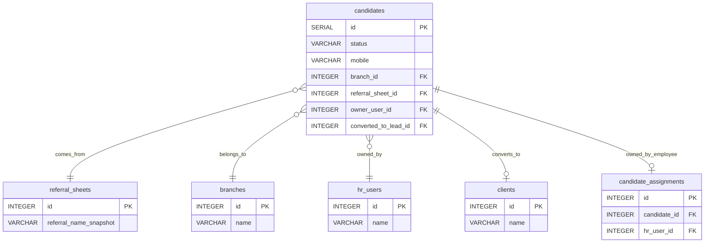

# دستور الكيان: المرشحون (Candidates Domain Constitution)

> **الحالة (Status):** Active — عقد تفاصيل V1 وقسم وعود الهدايا V2 معتمدان 2026-07-29
> **المرجع الأعلى للكيان `candidates` في النظام.** تم إعداده بناءً على تحليل هجرات قاعدة البيانات، الهياكل البرمجية، السياسات الأمنية، والمنطق التشغيلي المطبق.

---

## 1. هوية الكيان (Entity Identity)

- **الاسم العربي:** المرشح
- **الاسم الإنجليزي:** Candidate
- **اسم الجدول:** `candidates`
- **الوصف:** يمثل الشخص أو العائلة المقترحة كعميل محتمل للشركة قبل إجراء أي عملية شراء فعلية. يتم تجميع المرشحين يدوياً أو تلقائياً من أوراق الإحالة المجمعة ميدانياً (`referral_sheets`). يُصنف العميل كمرشح حتى تثبت جديته ويتحول لعميل فعلي (`Client`) يملك عقداً وجهازاً.
- **الفرق بين المرشح (Candidate) والزبون (Client):** 
  - المرشح هو هدف تسويقي مؤقت لم يقم بأي شراء بعد ولا يملك عقوداً، ويمكن حذفه فيزيائياً من النظام بشكل حاد (Hard-Delete).
  - الزبون هو كيان مالي وتجاري نشط يملك عقوداً وأجهزة ويستفيد من خدمات الصيانة، ولا يمكن حذفه إلا ناعماً (Soft-Delete) لحماية نزاهة الحسابات والأرشيف الميداني.
- **الجداول المرتبطة برمجياً وتاريخياً:** `referral_sheets`, `clients` (عبر `converted_to_lead_id`)، `candidate_assignments`, `hr_users`, `branches`, `geo_units`

---

## 2. الجدول والحقول (Table & Field Dictionary)

يحتوي الجدول التالي على معجم الحقول لجدول `candidates` المستخلص بدقة من هجرات قاعدة البيانات ومسارات الخادم الخلفي لـ API والأنماط المشتركة:

| الحقل (Field) | النوع (SQL Type) | NULL? | DEFAULT | Constraints | الوصف والشرح بالعربية | مثال واقعي (Example) |
|---|---|---|---|---|---|---|
| `id` | `SERIAL` | ❌ | — | `PRIMARY KEY` | المعرف الفريد للمرشح في قاعدة البيانات | `102` |
| `first_name` | `VARCHAR(255)` | ✅ | — | — | الاسم الأول للمرشح | `"سمير"` |
| `last_name` | `VARCHAR(255)` | ✅ | — | — | الكنية / اسم العائلة للمرشح | `"الحموي"` |
| `nickname` | `VARCHAR(255)` | ✅ | — | — | اللقب الشعبي للمرشح | `"أبو أحمد"` |
| `mobile` | `VARCHAR(50)` | ❌ | — | — | رقم الموبايل الأساسي النظيف للاتصال | `"0933112233"` |
| `contacts` | `JSONB` | ✅ | `'[]'`::jsonb | — | قائمة أرقام الاتصال الإضافية وحالاتها | `[{"label": "عمل", "number": "0113334445", "isPrimary": false, "status": "active"}]` |
| `address_text` | `TEXT` | ✅ | `''` | — | العنوان النصي للمرشح | `"حمص، الإنشاءات، شارع البرازيل، بناية 8"` |
| `geo_unit_id` | `INTEGER` | ✅ | — | — | معرف المنطقة الجغرافية للحي/القرية | `45` |
| `owner_user_id` | `INTEGER` | ✅ | — | — | (Legacy) معرف المستخدم المالك الفردي القديم | `12` |
| `status` | `VARCHAR(50)` | ✅ | `'Suggested'` | `CHECK (status IN ...)` | حالة المرشح (New, Suggested, FollowUp, Contacted, Qualified, Junk) | `"Suggested"` |
| `referral_sheet_id` | `INTEGER` | ✅ | — | `FK → referral_sheets(id)` | معرف ورقة الإحالات الميدانية المصدر | `15` |
| `referral_date` | `VARCHAR(50)` | ✅ | — | — | تاريخ تسجيل الإحالة | `"2026-05-10"` |
| `referral_reason` | `TEXT` | ✅ | — | — | سبب ترشيح وإحالة العميل | `"استعلام مبيعات جهاز مياه"` |
| `referral_type` | `VARCHAR(100)` | ✅ | — | — | نوع الإحالة التشغيلي | `"Client"` / `"Personal"` / `"Employee"` |
| `referral_origin_channel`| `VARCHAR(100)`| ✅ | — | — | القناة المصدر التي تم جلب الترشيح عبرها | `"PhoneCall"` / `"Campaign"` |
| `referral_name_snapshot` | `VARCHAR(255)` | ✅ | — | — | اسم الشخص المحيل وقت التقاط الصورة | `"محمود البكري"` |
| `referral_entity_id` | `INTEGER` | ✅ | — | — | معرف الكيان المحيل للمرشح | `102` |
| `referral_confirmation_status`| `VARCHAR(50)`| ✅ | `'Pending'`| — | حالة تأكيد الاتصال الأولي بالإحالة (Pending, Confirmed, Rejected) | `"Pending"` |
| `occupation` | `VARCHAR(255)` | ✅ | — | — | مهنة المرشح من فئة `occupation` المشتركة نفسها مع الزبائن في `system_lists`؛ التخزين النصي يحفظ القيم التاريخية | `"تاجر أقمشة"` |
| `candidate_notes` | `TEXT` | ✅ | — | — | ملاحظات تشغيلية خاصة بالمرشح | `"مهتم بأجهزة الفلترة الصناعية"` |
| `duplicate_flag` | `BOOLEAN` | ✅ | `FALSE` | — | راية تشير لتكرار الهاتف بقاعدة البيانات | `false` |
| `duplicate_type` | `VARCHAR(50)` | ✅ | — | — | نوع التكرار المطابق المكتشف (Candidate, Client, Both) | `"Client"` |
| `duplicate_reference_id` | `INTEGER` | ✅ | — | — | معرف السجل المكرر المطابق | `1024` |
| `converted_to_lead_id` | `INTEGER` | ✅ | — | — | معرف الزبون المنشأ في `clients(id)` بعد التحويل | `2048` |
| `created_at` | `TIMESTAMPTZ` | ✅ | `NOW()` | — | تاريخ ووقت إنشاء السجل | `"2026-05-24T18:00:00Z"` |
| `created_by` | `INTEGER` | ✅ | — | — | معرف المستخدم الذي سجل المرشح | `7` |
| `branch_id` | `INTEGER` | ✅ | — | `FK → branches(id)` | معرف الفرع التشغيلي الحاضن للمرشح | `3` |

---

## 3. القيود والقواعد (Constraints & Business Rules)

### 3.1 قيود قاعدة البيانات (Database Constraints)
- **Primary Key:** الحقل `id` هو المعرف الفريد التلقائي للجدول.
- **Foreign Keys:**
  - `referral_sheet_id` يرتبط بـ `referral_sheets(id)` مع خيار `ON DELETE SET NULL`.
  - `branch_id` يرتبط بـ `branches(id)` مع خيار `ON DELETE RESTRICT` لمنع حذف الفرع إذا كان يحتوي على مرشحين مخصصين.
- **Status CHECK constraint:** تفرض قاعدة البيانات انحصار حالة المرشح ضمن قيم محددة:
  ```sql
  CONSTRAINT candidates_status_check CHECK (status IN ('New', 'Suggested', 'FollowUp', 'Contacted', 'Qualified', 'Junk'))
  ```

### 3.2 قواعد العمل البرمجية والتشغيلية (Business Rules)

#### BR-1: آلة حالات المرشح الصارمة (Status State Machine)
المرشح يبدأ تشغيلياً بحالة `New` (في حال إدخاله يدوياً بالكامل) أو `Suggested` (في حال جلبه تلقائياً عبر لوائح الإحالة الميدانية)، ويتنقل عبر الفلترة والاتصال:
- `Suggested` / `New` ──► الاتصال الأولي ──► `Contacted`
- `Contacted` ──► عدم جدية أو رفض ──► `Junk`
- `Contacted` ──► إبداء اهتمام ومتابعة ──► `FollowUp`
- `FollowUp` / `Contacted` ──► نجاح الفلترة والتحقق والتأهيل ──► `Qualified`
- `Qualified` ──► شراء الفلتر وإنشاء عقد ──► `Converted` (يتم ربطه بـ `converted_to_lead_id` ويتحول إلى زبون).

#### BR-2: نظام الكشف التلقائي عن التكرار (Duplicate Detection System)
عند إنشاء أو تعديل مرشح، ينفذ الخادم تنظيفاً وفحصاً لكل رقم في `mobile` و`contacts` مقابل أرقام الزبائن والأسماء الأخرى، بصرف النظر عن نطاق القائمة التي استطاعت الواجهة تحميلها. إذا وجد تطابق:
- يتم تعيين `duplicate_flag = TRUE`.
- تبقى الراية دلالة كشف تحتاج مراجعة، ولا تستخدم دلالة على الربط أو التحويل.
- يعامل `duplicate_reference_id` كمرجع إرثي مفرد؛ لا يكشف أو يتحول إلى رابط قبل تفويض السجل المطابق.
- يتم تعيين `duplicate_type` حسب حالة الكيان المطابق:
  - `Candidate` (إذا تطابق مع مرشح آخر).
  - `Client` (إذا تطابق مع زبون مسجل فعلياً).
  - `Both` (إذا تطابق مع الكيانين).
- عند وجود سجل مطابق خارج نطاق المستخدم تعاد حقيقة وجود التطابق فقط، بلا اسم أو رقم أو معرف كاشف.
- لا يحدث دمج أو حذف آلي للأسماء المتطابقة.

#### BR-3: التحويل لعميل (Lead Conversion Architecture)
- إنشاء زبون من اسم مقترح يتم خادمياً ضمن معاملة واحدة عبر `POST /api/clients` مع `sourceCandidateId`: يُقفل سجل الاسم، يُنشأ الزبون، تُنقل الملكية، ثم يصبح الاسم `Qualified` ويرتبط بـ`converted_to_lead_id`. فشل أي خطوة يتراجع عن العملية كلها.
- يجب أن يكون الزبون الناتج ضمن فرع الاسم نفسه، ولا يقبل الخادم `assignmentUserIds` موازية أثناء التحويل.
- إذا كانت ملكية الاسم `BRANCH` ينتج زبون بملكية الفرع. وإذا كانت `PERSONAL` تنتقل للموظف نفسه فقط إن كان مؤهلاً لإسناد الزبائن عبر `clients.can_be_assigned`؛ وإلا تصبح ملكية الزبون للفرع.
- عند ربط الاسم بزبون موجود: لا تنتقل الملكية إلا إلى زبون `LEAD` في الفرع نفسه؛ أما `FOP` و`OP` والربط عبر الفروع فلا يغير ملكية الزبون القائمة.
- الربط بزبون موجود يحتاج تفويض الاسم وتفويض موضوع الزبون والصلاحية المناسبة لتغيير العلاقة؛ تطابق الهاتف لا يحل محل التفويض.
- نتيجة التحويل مستقلة عن `duplicate_flag` وتميز بين `CREATED_NEW_CLIENT` و`LINKED_EXISTING_CLIENT` متى توفر سجل حدث موثوق. البيانات التاريخية غير الكافية تعرض كـ"مرتبط بزبون" بلا تخمين.
- الاسم `Qualified` أو `Junk` أو المرتبط مسبقاً بزبون سجل منتهٍ لا يقبل تعديلاً أو ربطاً جديداً.

#### BR-3.1: نطاق تفاصيل V1
- يعيد `GET /api/candidates/:id` قائمة `phoneNumbers` مشتقة من `mobile` و`contacts`، مع نوع الرقم ووصفه ودعم واتساب وحالته وكونه أساسياً، وتعرض صفحة التفاصيل هذه البيانات للقراءة فقط.
- لا يعيد العقد خصائص التواصل التنفيذية، ولا تعرض الصفحة أزرار اتصال أو واتساب أو نسخ أو سجل تواصل.
- سجل التواصل والمتابعة وتاريخ الحالات والتدقيق الكامل مؤجلة ولا تدخل في DTO أو واجهة V1.
- لا يعيد عقد التفاصيل `referralConfirmationStatus` لأنه غير مستخدم حالياً، ويعرض القيم التاريخية الإنجليزية لسبب الترشيح بالعربية.
- إنشاء اسم من لائحة يحتاج تفويض موضوع اللائحة نفسها، ويرفض الخادم اللوائح المكتملة أو المؤرشفة. يرث الاسم خادميًا الفرع والملكية والمسؤول ونوع الوسيط ومعرفه ولقطة اسمه وقناة الوصول وتاريخ اللائحة، ولا يعتمد على قيم موازية من المتصفح.
- صفحة التفاصيل تعرض الحالة الحالية والفرع والملكية والعنوان والإحالة ولائحة المصدر المخولة والمهنة والملاحظات وتنبيه التكرار ونتيجة التحويل الآمنة.

#### BR-3.2: وعود الهدايا في تفاصيل V2
- تعرض صفحة تفاصيل الاسم قسماً مستقلاً للقراءة فقط من `gift_records` عند امتلاك `contract_gifts.view`.
- يجلب `GET /api/gifts/records?candidateId=:id` السجلات ذات مصدر `candidate` المرتبط بالاسم، وكذلك سجلات مصدر `name_list` المرتبطة بلائحة مصدر الاسم.
- يبقى نطاق الهدايا `GLOBAL` أو `BRANCH` أو `ASSIGNED` مطبقاً على النتائج؛ رؤية الاسم لا توسع نطاق رؤية الهدايا.
- يعرض القسم حالة الوعد والشرط والكميات والمستفيد والمصدر والتاريخ، ولا يقدم عمليات اعتماد أو تسليم أو إلغاء في هذه النسخة.
- عدم وجود وعد يعرض كحالة فارغة حقيقية، وفشل الجلب يظهر كخطأ ولا يستبدل ببيانات محلية.

#### BR-4: الملكية والتخصيص الذاتي (Ownership & Auto-Assignment)
- **قرار 2026-07-27:** ملكية الاسم المقترح واحدة من نوعين حصراً:
  - `PERSONAL`: صف واحد فقط في `candidate_assignments` لمستخدم فعال، مرتبط بموظف نشط، يحمل دوره `candidates.can_be_assigned`، وينتمي إلى فرع السجل.
  - `BRANCH`: لا توجد أي صفوف في `candidate_assignments`؛ ويكون `candidates.branch_id` هو الفرع المالك.
- العمود `owner_user_id` مرآة إرثية فقط خلال مرحلة الانتقال، ولا يدخل في قرار الرؤية أو الملكية.
- المستخدم ذو نطاق `ASSIGNED` يرى فقط الأسماء التي يملك لها صف إسناد شخصي؛ ولا يرى أسماء ملكية الفرع.
- الإنشاء بلا اختيار ملكية صريح يسند السجل إلى المنشئ فقط إذا كان مؤهلاً. لا يجوز تحويل الإسناد الفارغ ضمناً إلى ملكية فرع.
- اختيار موظف آخر، أو النقل إلى ملكية الفرع، أو الخروج منها يتطلب `candidates.assignment.manage` ضمن فرع السجل.
- عند تعطيل المستخدم أو موظفه، تنتقل الأسماء المفتوحة المسندة إليه إلى ملكية الفرع مع سجل تدقيق. تبقى سجلات `Qualified` و`Junk` على إسنادها التاريخي.
- الاسم الناتج من لائحة يرث فرع اللائحة ومسؤولها خادمياً؛ وإذا كانت اللائحة بلا مسؤول يرث ملكية الفرع.

#### BR-5: التوليد التلقائي من لوائح الإحالة الميدانية (Referral Sheets Generation)
عند إغلاق لائحة أسماء ميدانية (`referral_sheets`)، يتم توليد سجلات مرشحين تلقائياً في الجدول وتغذية حقول الإحالة مثل `referral_sheet_id` و `referral_name_snapshot` تلقائياً دون تدخل يدوي، مع وضع الحالة الابتدائية `Suggested` وحالة التأكيد `Pending`.

- **قرار 2026-07-29:** عند إنشاء اسم تابع للائحة، تكون اللائحة مصدر الحقيقة الخادمي للفرع، والملكية، ونوع الوسيط، ومعرفه، ولقطة اسمه، وقناة الوصول، وتاريخ اللائحة، وعنوان الوسيط عند استعماله. لا يقبل الخادم قيماً موازية قابلة للتلاعب من الواجهة لهذه الحقول.
- تبقى القيم المنسوخة داخل الاسم لقطة تاريخية بعد الإنشاء. لا تعيد التغييرات اللاحقة على اللائحة كتابة تاريخ الاسم، وأي اختلاف تاريخي يعرض للمصالحة التشغيلية ولا يصحح تلقائياً.
- **قرار 2026-07-29 — بقاء المصدر:** إذا ارتبط أي اسم باللائحة، يمنع حذفها حذفاً يفقد `referral_sheet_id` وتؤرشف بدلاً من ذلك. رؤية بطاقة اللائحة من صفحة الاسم تحتاج تفويض `candidates.name_lists.view_list` على موضوع اللائحة، وتفصل أدوار الجامع والمراجع وقائد الزيارة والمنشئ. يحسب عدد الأسماء الفعلي خادمياً من العلاقة ولا يعتمد وحده على العداد المخزن.

---

## 4. العلاقات (Relationships)

### 4.1 مخطط العلاقات الكيانية (Entity Relationship Map)


```mermaid
erDiagram
    candidates {
        SERIAL id PK
        VARCHAR status
        VARCHAR mobile
        INTEGER branch_id FK
        INTEGER referral_sheet_id FK
        INTEGER owner_user_id FK
        INTEGER converted_to_lead_id FK
    }
    referral_sheets {
        INTEGER id PK
        VARCHAR referral_name_snapshot
    }
    branches {
        INTEGER id PK
        VARCHAR name
    }
    clients {
        INTEGER id PK
        VARCHAR name
    }
    hr_users {
        INTEGER id PK
        VARCHAR name
    }
    candidate_assignments {
        INTEGER id PK
        INTEGER candidate_id FK
        INTEGER hr_user_id FK
    }

    candidates }o--|| referral_sheets : "comes_from"
    candidates }o--|| branches : "belongs_to"
    candidates }o--|| hr_users : "owned_by"
    candidates ||--o| clients : "converts_to"
    candidates ||--o| candidate_assignments : "owned_by_employee"
```

### 4.2 تفاصيل الجداول المرتبطة

| الجدول المرتبط | نوع العلاقة | سلوك الحذف (ON DELETE) | الوصف التشغيلي |
|---|---|---|---|
| `referral_sheets` | `N:1` | `SET NULL` | لائحة الأسماء التشغيلية التي تم تجميع المرشح عبرها ميدانياً. |
| `branches` | `N:1` | `RESTRICT` | الفرع الإداري المالك لبيانات المرشح والناظم لصلاحية نطاق الفرع. |
| `hr_users` | `N:1` | `SET NULL` | الموظف المسؤول عند الملكية الشخصية عبر `candidate_assignments`؛ أما `owner_user_id` فمرآة إرثية فقط. |
| `clients` | `1:1` | — | السجل المالي للزبون الذي تم إنشاؤه بعد تحويل المرشح الناجح. |
| `candidate_assignments`| `1:0..1` | `CASCADE` | مصدر الحقيقة للملكية الشخصية: صف واحد يعني موظفاً مسؤولاً، وعدم وجود صف يعني ملكية الفرع. |

---

## 5. آلة الحالات (State Machine)

### 5.1 دورة حياة المرشح الكاملة (Candidate Status Lifecycle)

```
      [Suggested] (ميداني)  ──┐
                               │
      [New] (يدوي) ────────────┴─► [Contacted] (تم الاتصال) ──► [Junk] (مرفوض)
                                       │
                                       ├─► [FollowUp] (متابعة واهتمام)
                                       │
                                       └─► [Qualified] (مؤهل للشراء) ──► [Converted to Client]
```

### 5.2 حالة تأكيد الإحالة الميدانية (Referral Confirmation Status)
تتحكم هذه الحالة بعمليات التحقق الأولي لمدخلات فرق الميدان قبل بدء الاتصالات التسويقية الصارمة:
- `Pending` (افتراضي عند التوليد التلقائي من لوائح الأسماء).
- `Confirmed` (عند تأكيد الموظف لصحة رقم الهاتف وتفاصيل العميل).
- `Rejected` (عند اكتشاف رقم خطأ أو هوية وهمية، ويؤدي غالباً لنقل المرشح لحالة `Junk`).

---

## 6. صلاحيات الوصول (Permission Matrix)

يتم تنظيم وإدارة الوصول لبيانات المرشحين عبر نظام الصلاحيات الموزع على مساحتين للأسماء (Namespaces):

### 6.1 الصلاحيات الأساسية للمرشحين (`candidates.*`)

تتحكم بالوصول لقوائم وبيانات الأسماء المقترحة الفردية:

| المفتاح (Permission Key) | الاسم العربي للصلاحية | النطاقات المدعومة (Scopes) | الوصف الأمني |
|---|---|---|---|
| `candidates.view_list` | عرض المرشحين | `GLOBAL`, `BRANCH`, `ASSIGNED` | رؤية قائمة المرشحين والتفاصيل (السياسة تستخدم view_list للتفاصيل أيضاً). |
| `candidates.create` | إنشاء مرشح | `GLOBAL`, `BRANCH` | إضافة سجل مرشح يدوي جديد وتخصيص الفرع التشغيلي المطبق. |
| `candidates.edit` | تعديل مرشح | `GLOBAL`, `BRANCH`, `ASSIGNED` | تعديل بيانات المرشح وتحديث وضعه؛ لا تمنح إدارة الملكية. |
| `candidates.delete` | حذف مرشح | `GLOBAL`, `BRANCH` | إجراء الحذف الفيزيائي الحاد للسجل التالف أو غير المرغوب فيه. |
| `candidates.can_be_assigned` | أهلية الإسناد للأسماء المقترحة | `GLOBAL`, `BRANCH` | أهلية فقط: لا تمنح حق الإسناد، وتُقبل فقط لمستخدم فعال مرتبط بموظف نشط ودوره يحمل هذه المنحة. |
| `candidates.assignment.manage` | إدارة مسؤولي الأسماء المقترحة | `GLOBAL`, `BRANCH` | تعيين موظف مؤهل أو نقل الملكية إلى الفرع؛ مستقلة عن تعديل بيانات الاسم. |

### 6.2 صلاحيات لوائح الأسماء الإحالية (`candidates.name_lists.*`)

تتحكم بإدارة أوراق الإحالة والمجموعات الميدانية المجمعة للأسماء (Referral Sheets):
- `candidates.name_lists.view_list` (عرض كشوف ولوائح الأسماء المصدر).
- `candidates.name_lists.create` (إنشاء لوائح الأسماء).
- `candidates.name_lists.edit` (تعديل وتحديث لوائح الأسماء).
- `candidates.name_lists.delete` (حذف لوائح الأسماء ميدانياً).
- `candidates.name_lists.assignment.manage` (تحديد أو تغيير مسؤول لائحة الأسماء ضمن نطاق الصلاحية).
- `candidates.name_lists.can_be_assigned` (أهلية فقط: لا تمنح حق الإسناد، وتُقبل فقط لمستخدم فعال مرتبط بموظف نشط ودوره يحمل هذه المنحة).

---

## 7. عقد API (API Contract)

### 7.1 قائمة المسارات (Endpoints)

يتضمن عقد الأسماء المقترحة مسار تفاصيل فردياً مستقلاً؛ ولا تعتمد صفحة التفاصيل على تحميل القائمة الكاملة:

| الطريقة | المسار (Path) | الصلاحية المطلوبة | وصف السلوك والوظيفة التشغيلية |
|---|---|---|---|
| **GET** | `/api/candidates` | `candidates.view_list` | جلب قائمة المرشحين، مع دعم التصفية والبحث والـ Pagination ونطاق الصلاحيات المطبقة. |
| **GET** | `/api/candidates/:id` | `candidates.view_list` + سياسة موضوع الاسم | جلب DTO تفاصيل V1 مع `phoneNumbers` للقراءة فقط، ومع تفويض الكيانات المرتبطة مستقلاً. |
| **POST** | `/api/candidates` | `candidates.create` | إنشاء سجل مرشح جديد وحفظ ملكية شخصية أو ملكية فرع ضمن transaction واحدة. |
| **POST** | `/api/candidates/:id/link-client` | `candidates.edit` + سياسة موضوع الزبون | ربط الاسم بزبون موجود، مع نقل الملكية فقط في حالة `LEAD` ضمن الفرع نفسه. |
| **PUT** | `/api/candidates/:id` | `candidates.edit` | تعديل بيانات المرشح؛ تغيير الملكية يحتاج أيضاً `candidates.assignment.manage`. |
| **DELETE**| `/api/candidates/:id` | `candidates.delete` | حذف سجل المرشح فيزيائياً وبشكل نهائي من الداتابيز. |

### 7.2 تفاصيل الاستجابة والطلب (Request / Response Schemas)

#### 7.2.1 طلب إنشاء مرشح (POST /api/candidates)
```json
{
  "firstName": "سمير",
  "lastName": "الحموي",
  "nickname": "أبو أحمد",
  "mobile": "0933112233",
  "contacts": [],
  "addressText": "حمص، الإنشاءات",
  "geoUnitId": 45,
  "status": "Suggested",
  "branchId": 3,
  "occupation": "تاجر أقمشة",
  "candidateNotes": "مهتم بأجهزة الفلترة الصناعية",
  "ownershipType": "PERSONAL",
  "responsibleUserId": 7
}
```

#### 7.2.2 استجابة تفاصيل المرشح من القائمة
```json
{
  "id": 102,
  "firstName": "سمير",
  "lastName": "الحموي",
  "nickname": "أبو أحمد",
  "mobile": "0933112233",
  "contacts": [],
  "addressText": "حمص، الإنشاءات",
  "geoUnitId": 45,
  "ownerUserId": 7,
  "ownershipType": "PERSONAL",
  "responsibleUserId": 7,
  "ownershipLabel": "علي المحمد",
  "status": "Suggested",
  "referralSheetId": 15,
  "referralDate": "2026-05-10",
  "referralReason": "استعلام مبيعات جهاز مياه",
  "referralType": "Client",
  "referralOriginChannel": "PhoneCall",
  "referralNameSnapshot": "محمود البكري",
  "referralEntityId": 102,
  "referralConfirmationStatus": "Pending",
  "occupation": "تاجر أقمشة",
  "candidateNotes": "مهتم بأجهزة الفلترة الصناعية",
  "duplicateFlag": false,
  "duplicateType": null,
  "duplicateReferenceId": null,
  "convertedToLeadId": null,
  "createdAt": "2026-05-24T18:00:00Z",
  "createdBy": 7,
  "branchId": 3,
  "branchName": "فرع حمص",
  "createdByUserId": 7,
  "createdByUserName": "علي المحمد",
  "createdByRoleDisplayName": "مدير تسويق حمص",
  "assignments": [
    {
      "userId": 7,
      "userName": "علي المحمد",
      "roleDisplayName": "مدير تسويق حمص"
    }
  ]
}
```

#### 7.2.3 استجابة تفاصيل V1 (`GET /api/candidates/:id`)

تعاد `phoneNumbers` كإسقاط قراءة فقط من `mobile` و`contacts` يشمل `number` و`type` و`label` و`hasWhatsApp` و`isPrimary` و`status`، من دون إجراءات تواصل. الحقول والبطاقات المرتبطة التي يفشل تفويضها تعاد بحالة محجوبة لا ببياناتها.

```json
{
  "id": 102,
  "firstName": "سمير",
  "lastName": "الحموي",
  "nickname": "أبو أحمد",
  "phoneNumbers": [
    { "number": "0933112233", "type": "mobile", "label": "شخصي", "hasWhatsApp": true, "isPrimary": true, "status": "preferred" },
    { "number": "0113334445", "type": "landline", "label": "المنزل", "hasWhatsApp": false, "isPrimary": false, "status": "active" }
  ],
  "status": "Suggested",
  "branch": { "id": 3, "name": "فرع حمص" },
  "ownership": {
    "type": "PERSONAL",
    "responsibleUserId": 7,
    "responsibleUserName": "علي المحمد",
    "roleDisplayName": "مدير تسويق حمص"
  },
  "createdAt": "2026-05-24T18:00:00Z",
  "address": {
    "geoUnitId": 45,
    "geoPath": [],
    "text": "حمص، الإنشاءات"
  },
  "referral": {
    "entryMode": "NAME_LIST",
    "type": "Client",
    "nameSnapshot": "محمود البكري",
    "originChannel": "Campaign",
    "date": "2026-05-10",
    "reason": "استعلام مبيعات جهاز مياه"
  },
  "occupation": {
    "value": "تاجر أقمشة",
    "active": true
  },
  "candidateNotes": "مهتم بأجهزة الفلترة الصناعية",
  "duplicate": { "flagged": false, "type": null, "match": null },
  "conversion": null,
  "sourceSheet": { "visible": false },
  "permissions": {
    "canEdit": true,
    "canQualify": true,
    "canLinkClient": true
  }
}
```

---

## 8. حالات الاختبار الشاملة (Test Cases)

### 8.1 الاختبارات الوظيفية وعقد العمل (Functional Tests)

| الرمز | سيناريو الفحص والاختبار | الطريقة والمسار | المدخلات المرسلة | السلوك المتوقع والاستجابة | ملاحظات تشغيلية |
|---|---|---|---|---|---|
| **TC-01** | إنشاء مرشح مستوف للشروط (Happy Path) | POST `/api/candidates` | اسم أول، رقم هاتف، فرع، وحالة `Suggested`. | ترميز `200` مع الكائن المنشأ كاملاً مغذياً بالتعيينات. | يتم ربط الموظف المنشئ تلقائياً بالمسندين. |
| **TC-02** | محاولة إنشاء مرشح بدون رقم هاتف أساسي | POST `/api/candidates` | كائن مرشح بدون هاتف أو مصفوفة أرقام إضافية. | ترميز `400` أو فشل الفاليديشن. | رقم الموبايل حقل إجباري لإجراء الفحص الذكي. |
| **TC-03** | محاولة إنشاء مرشح بحالة مخالفة للقيود | POST `/api/candidates` | إرسال حالة `InvalidStatus` في حقل `status`. | ترميز `500` أو خطأ قاعدة بيانات للفشل بقيد الفحص. | قيد قاعدة البيانات `candidates_status_check` يحظر التلاعب. |
| **TC-04** | تعديل حالة المرشح إلى Junk | PUT `/api/candidates/:id`| إرسال كائن تعديل يغير الحالة إلى `Junk`. | ترميز `200` مع تحديث الحالة بنجاح. | تمثل استبعاد العميل لعدم الجدية. |
| **TC-05** | محاولة حذف مرشح تم تحويله إلى عميل فعلي | DELETE `/api/candidates/:id`| معرف مرشح يملك قيمة غير خالية في `converted_to_lead_id`. | ترميز `400` مع منع الحذف التشغيلي لوجود كيان زبون مرتبط. | (ثغرة تصميمية: الـ API يفتقد لهذا الفحص حالياً). |
| **TC-06** | حذف مرشح معلق لم يتحول بعد | DELETE `/api/candidates/:id`| معرف مرشح بحالة `Suggested` أو `Junk` غير مرتبط بعميل. | ترميز `200` مع نجاح الحذف الفيزيائي التام من قاعدة البيانات. | هذا الكيان يدعم الحذف الصلب بشكل طبيعي. |
| **TC-07** | تصفية قائمة المرشحين بالفرع | GET `/api/candidates?branchId=3`| إرسال المعلمة في مسار الاستعلام. | ترميز `200` وإعادة مرشحي الفرع رقم 3 فقط. | فلترة دقيقة للفروع. |

### 8.2 اختبارات الصلاحيات والنطاقات (Permissions Scope Tests)

| رتبة المستخدم | الصلاحية المفحوصة | نطاق الصلاحية (Scope) | السلوك التشغيلي المتوقع |
|---|---|---|---|
| **HQ Admin** | `candidates.view_list` | `GLOBAL` | يستطيع استعلام وجلب كافة مرشحي الشركة عبر كافة الفروع دون حظر. |
| **Branch Manager** | `candidates.view_list` | `BRANCH` | يرى فقط مرشحي الفرع التشغيلي المخصص له، ويمنع من رؤية مرشحي بقية الفروع. |
| **Telemarketer** | `candidates.view_list` | `ASSIGNED` | يرى فقط المرشحين المسندين له شخصياً في جدول `candidate_assignments`. |
| **Telemarketer** | `candidates.delete` | `NONE` | يُرفض طلبه فوراً بترميز `403` لعدم امتلاك إذن الحذف نهائياً. |

---

## 9. الثغرات والتضاربات المكتشفة (Gaps & Contradictions)

تم رصد عدد من الثغرات البرمجية والعيوب المعمارية والتصميمية لكيان المرشحين:

### ◐ 9.1 مسار جلب السجل الفردي للمرشح
- **التضارب:** يفتقر مسار المرشحين `routes/candidates.ts` كلياً لوجود مسار قراءة سجل فردي (`GET /api/candidates/:id`) بالرغم من احتواء ملف السياسات الأمنية `candidatePolicy.ts` على دالة تحقق مخصصة لقراءة مرشح منفرد `canViewCandidate` تشير لأحقية المستخدم بالوصول.
- **الأثر التشغيلي:** تضطر واجهة المستخدم الرسومية (Frontend) لجلب كامل قائمة المرشحين وتصفيتها محلياً لعرض تفاصيل مرشح، مما يسبب استهلاكاً ضخماً للبيانات ومخاطر تسريب أمني لبيانات مرشحين خارج نطاق صلاحيات الموظف التشغيلية.
- **قرار V1:** إنشاء المسار `GET /api/candidates/:id` وربطه بالسياسة الأمنية وإرجاع DTO مخفف يعرض أرقام الهاتف للقراءة فقط ولا يحتوي إجراءات أو سجل تواصل.

### ⚠️ 9.2 الثغرة الثانية: تعارض قيم الحالة بين قيد قاعدة البيانات ونوع التطبيق البرمجي (Status Values Mismatch)
- **التضارب:** تفرض قاعدة البيانات بقيد الفحص `candidates_status_check` قيم الحالة التالية:
  `('New', 'Suggested', 'FollowUp', 'Contacted', 'Qualified', 'Junk')`.
  بينما يعرّف النوع البرمجي المشترك في ملف `packages/shared/types.ts` القيم كالتالي:
  `CandidateStatus = 'Prospect' | 'Suggested' | 'FollowUp' | 'Contacted' | 'Qualified' | 'Junk'`.
  تم استبدال قيمة `New` في قاعدة البيانات بـ `Prospect` في طبقة التطبيق البرمجي دون تحديث الداتابيز.
- **الأثر التشغيلي:** حدوث أخطاء قاتلة عند محاولة إدخال القيمة البرمجية `Prospect` في قاعدة البيانات بسبب فشل قيود التحقق وقذف أخطاء `500` للمستخدمين.
- **التوصية:** توحيد المسمى إما لـ `New` أو لـ `Prospect` بكافة الطبقات وتعديل الهجرات وقيد الداتابيز بالتزامن.

### ⚠️ 9.3 الثغرة الثالثة: حظر نطاق الإسناد الفردي في قيود الصلاحيات بالداتابيز (Assigned Scope Blocked by DB Allowed Scopes)
- **التضارب:** في هجرة الصلاحيات والنطاقات المسموحة (`054_permissions_allowed_scopes.sql`)، تم تقييد صلاحيات المرشحين التشغيلية `candidates.*` بـ `GLOBAL` و `BRANCH` فقط واستبعاد نطاق `ASSIGNED`. بينما في كود الخادم الفعلي `routes/candidates.ts` ودالة التحقق بالسياسة، يوجد منطق برمجي مخصص لتصفية وعرض وفلترة القوائم للمستخدمين الذين يملكون نطاق `ASSIGNED` فقط بناءً على جدول الربط M2M.
- **الأثر التشغيلي:** لا يمكن للآدمن تعيين النطاق المخصص الفردي لمسؤولي التسويق الهاتفي عبر لوحة التحكم بالرغم من جاهزية الكود للتعامل مع التعيينات الفردية، مما يعطل فكرة استقلالية بيانات موظف التسويق.
- **التوصية:** إضافة نطاق `'ASSIGNED'` للصلاحيات الخاصة بالمرشحين في هجرات قواعد البيانات.

### ◐ 9.4 مرحلة انتقال العمود الإرثي `owner_user_id`
- **الوضع الحالي:** أصبح `candidate_assignments` مصدر الحقيقة، مع صفر صفوف لملكية الفرع وصف واحد للملكية الشخصية. بقي `owner_user_id` مرآة توافقية لا تدخل في قرارات التفويض.
- **الحماية:** تعرض واجهة المصالحة `candidate_ownership_reconciliation` أي اختلاف بين المرآة والمصدر الحقيقي.
- **المتبقي:** إسقاط العمود في هجرة مستقلة بعد إثبات توقف جميع المستهلكين الإرثيين.

### ✅ 9.5 معالجة التحويل الذرية
- **الحل:** أصبح إنشاء الزبون من الاسم يتم في معاملة خادم واحدة مع قفل الاسم، ونقل الملكية وفق BR-3، وربط `converted_to_lead_id`.
- **النتيجة:** لا يمكن نجاح إنشاء الزبون مع فشل تحديث الاسم، ولا يمكن تحويل الاسم نفسه مرتين بالتزامن.

---

## 10. تاريخ التغييرات (Schema Changelog)

يوثق الجدول التالي تتابع نمو وتطور الكيان `candidates` عبر هجرات قواعد البيانات المتتالية:

| تاريخ الهجرة | ملف الهجرة (Migration File) | طبيعة التعديل وهدف التأثير الفني والتشغيلي على الجدول |
|---|---|---|
| **2026-04** | `001_core_tables.sql` | التأسيس الأولي (Baseline) وإنشاء جدول `candidates` بالحقول التسويقية الأساسية وقيد الحالة الأولي. |
| **2026-04** | `007_candidates_missing_columns.sql` | إضافة الأعمدة الغائبة للتحديث التشغيلي: المجموعات الإضافية `contacts` ومعرف المنطقة الجغرافية `geo_unit_id` والعمل. وتحديث قيد فحص الحالة `candidates_status_check` لحل مشاكل الاتصال. |
| **2026-04** | `014_branch_id_domain_tables.sql` | ربط المرشحين بالفرع التشغيلي الحاضن عبر العمود المرجعي `branch_id` بقيد `ON DELETE RESTRICT` لضبط نطاق الفروع. |
| **2026-04** | `021_candidates_authorization_enablement.sql` | إدراج وبذر صلاحيات الوصول الأساسية للمرشحين `candidates.*` في لوحة الإدارة وضبط قوالب الأدوار كـ `BRANCH`. |
| **2026-04** | `034_candidate_name_lists_permissions.sql` | بذر وتسجيل صلاحيات لوائح الأسماء الإحالية `candidates.name_lists.*` ونقل منح الأدوار السابقة للمسار الجديد. |
| **2026-04** | `042_assignments_m2m.sql` | الانتقال الشامل لنظام التعيين متعدد الموظفين للمرشحين عبر تأسيس جدول الجانكشن `candidate_assignments` والترحيل التلقائي من العمود الفردي القديم `owner_user_id`. |
| **2026-04** | `054_permissions_allowed_scopes.sql` | تصنيف وحصر النطاقات المصرحة للمرشحين بلوحة التحكم بـ `GLOBAL` و `BRANCH` وإجراء تنظيف شامل للتعيينات السابقة. |
| **2026-05** | `111_referral_sheets_target_candidates.sql` | تحديث ورقة الإحالات بإضافة عمود عدد المرشحين المستهدفين `target_candidates` للمقارنة مع المدخلات الفعلية المترتبة. |
| **2026-07-08** | `assigneeEligibility.ts` | توحيد شرط أهلية تملك الزبائن ولوائح الأسماء والأسماء المقترحة: مستخدم فعال + ملف موظف مرتبط + موظف نشط + منحة `*.can_be_assigned` المناسبة. |
| **2026-07-27** | `389_candidate_branch_ownership.sql` | اعتماد الملكية الشخصية/ملكية الفرع، صلاحية إدارة مستقلة، سجل تدقيق، منع أكثر من مسؤول، إسقاط المفتوح إلى ملكية الفرع عند تعطيل الموظف، وواجهة مصالحة للتعارضات التاريخية. |
