# دستور الكيان: الزبائن (Clients Domain Constitution)

> **الحالة (Status):** Pilot / Active Draft  
> **المرجع الأعلى للكيان `clients` في النظام.** تم إعداده بناءً على تحليل هيكل قواعد البيانات، المسارات البرمجية، السياسات الأمنية، والمنطق التشغيلي المطبق.

---

## 1. هوية الكيان (Entity Identity)

- **الاسم العربي:** الزبون / العميل
- **الاسم الإنجليزي:** Client
- **اسم الجدول:** `clients`
- **الوصف:** الكيان المركزي في نظام Golden CRM. يمثل شخصاً (فرداً أو عائلة) تربطه علاقة تجارية بالشركة (مالك جهاز أو مرشح للشراء). يرتبط بالزبون كافة العقود، الزيارات، المهام، والاتصالات.
- **الجداول المرتبطة برمجياً وتشغيلياً:** `contracts`, `visits`, `telemarketing_call_logs`, `client_assignments`, `referral_sheets`, `open_tasks`, `visit_name_collections`, `direct_suggestions`, `contact_targets`
- **الأهمية والأمان:** كيان أساسي وحساس (Core Entity). لا يمكن حذفه بشكل فيزيائي نهائياً عبر العمليات الاعتيادية لحفظ نزاهة السجلات التاريخية والعقود، وإنما يتم استخدام آلية الحذف الناعم (Soft-Delete).

---

## 2. الجدول والحقول (Table & Field Dictionary)

يحتوي الجدول التالي على الوصف التفصيلي والدقيق لكافة الحقول في جدول `clients` مستخرجاً من هجرات قاعدة البيانات (Migrations)، والـ SELECT المطبق برمجياً (`CLIENT_SELECT`)، والأنواع البرمجية المشتركة (`packages/shared/types.ts`).

| الحقل (Field) | النوع (SQL Type) | NULL? | DEFAULT | Constraints | الوصف والشرح بالعربية | مثال واقعي (Example) |
|---|---|---|---|---|---|---|
| `id` | `SERIAL` | ❌ | — | `PRIMARY KEY` | المعرف الفريد التلقائي للزبون | `1024` |
| `name` | `VARCHAR(255)` | ❌ | — | — | الاسم الكامل للزبون (Legacy) | `"أحمد محمد علي"` |
| `first_name` | `VARCHAR(255)` | ✅ | — | — | الاسم الأول للزبون | `"أحمد"` |
| `father_name` | `VARCHAR(255)` | ✅ | — | — | اسم الأب | `"محمد"` |
| `last_name` | `VARCHAR(255)` | ✅ | — | — | اسم العائلة / الكنية | `"علي"` |
| `nickname` | `VARCHAR(255)` | ✅ | — | — | اللقب أو الكنية الشعبية | `"أبو شهاب"` |
| `mobile` | `VARCHAR(50)` | ❌ | — | — | رقم الموبايل الأساسي (يتم تنظيفه وتخزينه كـ 10 خانات) | `"0991234567"` |
| `contacts` | `JSONB` | ✅ | `'[]'`::jsonb | — | قائمة أرقام الهواتف الإضافية وحالاتها | `[{"label": "بيت", "number": "0112223334", "isPrimary": false, "status": "active"}]` |
| `governorate` | `VARCHAR(255)` | ✅ | `''` | — | معرف المحافظة من جدول `geo_units` مخزن كـ String | `"1"` (معرف دمشق) |
| `district` | `VARCHAR(255)` | ✅ | `''` | — | معرف المنطقة من جدول `geo_units` مخزن كـ String | `"12"` (معرف المزة) |
| `neighborhood` | `VARCHAR(255)` | ✅ | `''` | — | معرف الحي/البلدة من جدول `geo_units` مخزن كـ String | `"123"` (معرف فيلات غربية) |
| `detailed_address` | `TEXT` | ✅ | — | — | العنوان التفصيلي والسكن الحالي | `"فيلات غربية، بناية 5، طابق 2، شقة 4"` |
| `gps_coordinates` | `JSONB` | ✅ | — | — | إحداثيات الموقع الجغرافي للزبون | `{"lat": 33.5138, "lng": 36.2765}` |
| `gender` | `VARCHAR(10)` | ✅ | — | — | جنس الزبون (`Male` / `Female`) | `"Male"` |
| `national_id` | `VARCHAR(12)` | ✅ | — | — | الرقم الوطني السوري للزبون | `"010203040506"` |
| `birth_date` | `DATE` | ✅ | — | — | تاريخ ميلاد الزبون | `"1990-05-15"` |
| `mother_name` | `VARCHAR(255)` | ✅ | — | — | الاسم الكامل لوالدة الزبون | `"فاطمة محمود"` |
| `national_id_registry` | `VARCHAR(255)` | ✅ | — | — | قيد النفوس (السجل المدني) | `"دمشق"` |
| `national_id_issued_by` | `VARCHAR(255)` | ✅ | — | — | أمانة السجل المدني الصادر عنها البطاقة | `"الميدان"` |
| `national_id_issue_date` | `DATE` | ✅ | — | — | تاريخ إصدار الهوية الشخصية | `"2015-06-20"` |
| `national_id_box` | `VARCHAR(50)` | ✅ | — | — | رقم الخانة (الدفتر) | `"542"` |
| `occupation` | `VARCHAR(255)` | ✅ | — | — | مهنة الزبون الحالية | `"مهندس برمجيات"` |
| `spouse_occupation` | `VARCHAR(255)` | ✅ | — | — | مهنة الشريك / الزوجة | `"طبيبة أطفال"` |
| `data_quality` | `VARCHAR(50)` | ✅ | — | — | تقييم جودة البيانات للزبون | `"Complete"` / `"Partial"` |
| `water_source` | `VARCHAR(255)` | ✅ | — | — | مصدر المياه الرئيسي المستخدم | `"شبكة مياه عامة"` |
| `notes` | `TEXT` | ✅ | — | — | ملاحظات عامة حول الزبون | `"يفضل الاتصال بعد الظهر فقط"` |
| `rating` | `VARCHAR(50)` | ✅ | — | — | تقييم مدى التزام العميل | `"Committed"` / `"NotCommitted"` |
| `source_channel` | `VARCHAR(255)` | ✅ | — | — | القناة التسويقية التي تم جلب الزبون منها | `"SocialMedia"` / `"PhoneCall"` |
| `referrer_type` | `VARCHAR(255)` | ✅ | — | — | نوع المحيل للزبون | `"Personal"` / `"Client"` / `"Employee"` |
| `referrer_id` | `INTEGER` | ✅ | — | — | معرف المحيل (مثل رقم الموظف أو الزبون الآخر) | `45` |
| `referrer_name` | `VARCHAR(255)` | ✅ | — | — | اسم الشخص المحيل وقت التسجيل | `"خالد عمر"` |
| `referral_notes` | `TEXT` | ✅ | — | — | ملاحظات حول الإحالة | `"صديق مقرب للزبون خالد"` |
| `referrers` | `JSONB` | ✅ | `'[]'`::jsonb | — | قائمة الوسطاء المسجلين للزبون | `[{"type": "Client", "id": 45, "name": "خالد"}]` |
| `referral_entity_id` | `INTEGER` | ✅ | — | — | معرف الكيان المحيل للزبون | `45` |
| `referral_date` | `VARCHAR(50)` | ✅ | — | — | تاريخ تسجيل الإحالة | `"2026-04-01"` |
| `referral_reason` | `TEXT` | ✅ | — | — | سبب الإحالة | `"شراء جهاز تنقية مياه"` |
| `referral_sheet_id` | `INTEGER` | ✅ | — | `FK → referral_sheets(id)` | معرف لائحة الإحالات المرتبطة | `12` |
| `referral_address_text`| `TEXT` | ✅ | — | — | نص عنوان الإحالة التابع للوسيط | `"المزة، بناية 3"` |
| `is_candidate` | `BOOLEAN` | ✅ | `FALSE` | — | هل كان الزبون مرشحاً سابقاً وتم تحويله؟ | `false` |
| `target_client` | `VARCHAR(255)` | ✅ | — | — | المنتج التسويقي المستهدف للزبون | `"فلتر مياه 5 مراحل"` |
| `candidate_status` | `VARCHAR(50)` | ✅ | — | — | حالة المرشح التاريخية (Legacy) | `"New"` / `"OP"` / `"FOP"` |
| `branch_id` | `INTEGER` | ✅ | — | `FK → branches(id) ON DELETE RESTRICT` | معرف الفرع الذي ينتمي إليه الزبون | `3` |
| `created_by` | `INTEGER` | ✅ | — | `FK → hr_users(id) ON DELETE SET NULL` | معرف المستخدم الذي أنشأ سجل الزبون | `7` |
| `created_at` | `TIMESTAMPTZ` | ✅ | `NOW()` | — | تاريخ ووقت إنشاء السجل التاريخي | `"2026-05-20T10:30:00Z"` |
| `deleted_at` | `TIMESTAMP` | ✅ | — | — | تاريخ ووقت الحذف الناعم (Soft-Delete) | `"2026-05-22T14:30:00Z"` |
| `deleted_by` | `INTEGER` | ✅ | — | — | معرف المستخدم الذي قام بحذف السجل ناعماً | `5` |
| `is_active` | `BOOLEAN` | ✅ | `TRUE` | — | هل السجل فعال حالياً ولم يحذف ناعماً؟ | `true` |
| `assigned_hr_user_id` | `INTEGER` | ✅ | — | `FK → hr_users(id) ON DELETE SET NULL` | (Legacy) معرف المالك الفردي القديم قبل الانتقال لـ M2M | `12` |

---

## 3. القيود والقواعد (Constraints & Business Rules)

### 3.1 قيود المستوى البرمجي وقاعدة البيانات (Database Constraints)
- **Primary Key:** الحقل `id` هو المعرف الفريد التسلسلي الأساسي.
- **Foreign Keys:** 
  - `branch_id` يرتبط بـ `branches(id)` مع قيد `ON DELETE RESTRICT` لمنع حذف الفرع إذا كان يحتوي على زبائن.
  - `referral_sheet_id` يرتبط بـ `referral_sheets(id)` مع قيد `ON DELETE SET NULL`.
  - `created_by` يرتبط بـ `hr_users(id)` مع قيد `ON DELETE SET NULL`.
  - `assigned_hr_user_id` (Legacy) يرتبط بـ `hr_users(id)` مع قيد `ON DELETE SET NULL`.
- **Soft-Delete Index:** الفهرس الجزئي الفريد `idx_clients_active` يُبنى على الزبائن الفعالين فقط:
  ```sql
  CREATE INDEX idx_clients_active ON clients(deleted_at) WHERE deleted_at IS NULL;
  ```

### 3.2 قواعد العمل البرمجية والتشغيلية (Business Rules)

#### BR-1: الحذف الناعم الصارم (Strict Soft-Delete)
لا يمكن حذف سجل زبون من الواجهة أو الـ API فيزيائياً في حال وجوده ضمن دورة العمل. عند حذف زبون (`DELETE /api/clients/:id`):
1. يتم فحص وجود أي عقود مسجلة للزبون (`contracts`)، ويتم منع الحذف بترميز `400` في حال وجودها.
2. يتم فحص وجود سجل زيارات ميدانية (`field_visits`)، ويتم منع الحذف بترميز `400` في حال وجودها.
3. يتم فحص وجود أي مهام مفتوحة مكتملة (`open_tasks` بحالة `completed`)، ويتم منع الحذف بترميز `400` في حال وجودها.
4. في حال تخطي الفحوصات:
   - يتم تعيين كافة مهام الزبون المفتوحة وغير المكتملة كـ `cancelled`.
   - يتم حذف سجلات التخصيص التابعة له من جدول `client_assignments`.
   - يتم إلغاء كافة مواعيد التسويق الهاتفي المستمرة للزبون (`telemarketing_appointments` بحالة غير مكتملة أو غير ملغاة كـ `cancelled`).
   - يتم حذف سجلات الاستهداف في `contact_targets` المرتبطة بالزبون.
   - يتم تحديث الزبون بتعيين `deleted_at = NOW()`, `deleted_by = currentUser`, `is_active = FALSE`.

#### BR-2: توليد الاسم الكامل الذكي (Full Name Fallback)
إذا تم تزويد الواجهة بـ `first_name` و `last_name` ولم يزود حقل الاسم الكامل `name` صراحة، يتم برمجياً دمج الأسماء كالتالي:
`name = first_name + (father_name ? " " + father_name : "") + " " + lastName`.

#### BR-3: التحقق الذكي والمنع المشروط للارقام المكررة (Smart Match & Strict Conflict)
- عند إنشاء أو تعديل الزبون، يتم فحص تكرار رقم الموبايل الأساسي (`mobile`) أو أي رقم مدرج في قائمة الأرقام الإضافية (`contacts`).
- الفحص يتبع المنطق الرياضي للتنظيف (`phoneNormalizationSql`): إزالة كافة الرموز والبدء بـ `09` مع دمج الصيغ المحلية والدولية للموبايل السوري.
- إذا وجد رقم مطابق:
  - إذا كان المستخدم يملك صلاحية عرض هذا الزبون المكرر (حسب الفرع أو الإسناد المتاح له)، يعود الـ API بترميز `409` مع تفاصيل الزبون (`MATCH_VISIBLE`).
  - إذا كان الزبون المكرر خارج نطاق رؤية المستخدم (فرع آخر أو غير مسند إليه للمسؤولين الشخصيين)، يعود الـ API بترميز `409` مع رسالة مبهمة تفيد بوجود الرقم مع حظر التفاصيل (`MATCH_RESTRICTED`).

#### BR-4: قواعد الملكية التشغيلية للزبائن (Customer Ownership Logic)
ملكية الزبون تنظمها قواعد صارمة مبنية على التعيينات والحالة (`packages/api/services/customerOwnership.ts`):
1. **ملكية الفرع العامة (Company Branch Owned):** إذا كان العميل يملك حالة `candidate_status` ضمن قيم `OP` أو `FOP` (مرشح تشغيلي)، أو إذا لم يكن لديه أي موظف مسند مؤهل، تعتبر الملكية تابعة للشركة في حدود الفرع (`company_branch`).
2. **الملكية الفردية المشروطة (Personal Single Owner):** يعتبر الموظف مالكاً شخصياً للزبون إذا تم ربطه بـ `client_assignments` وكان الموظف مستوفياً للشروط التالية:
   - المستخدم فعال (`u.is_active = TRUE`).
   - المستخدم مرتبط بملف موظف (`u.employee_id IS NOT NULL`).
   - حالة الموظف نشطة (`e.status = 'active'`).
   - الموظف يملك دوراً يصنف كـ `SUPERVISOR` أو `TECHNICIAN`.
   - إذا كان المالك واحداً وسوبرفايزر: `personal_single_supervisor`.
   - إذا كان المالك واحداً وتكنيشن: `personal_single_technician`.
3. **الملكية الفردية المتعددة (Personal Multi Owner):** في حال وجود أكثر من موظف مستوف للشروط السابقة مسندين للعميل: `personal_multi`.

#### BR-5: تغيير الفرع المشروط (Conditional Branch Migration)
يُمنع تعديل الفرع (`branchId`) الخاص بالزبون كلياً في حال وجود زيارات ميدانية نشطة أو مجدولة (`field_visits` بحالة `in_progress` أو `scheduled`). يجب إنهاء الزيارات أو إلغاؤها أولاً لمنع الفوضى في نطاقات الفروع.

#### BR-6: التخصيص الذاتي الإجباري (Mandatory Self-Assignment)
للمستخدمين من غير مسؤولي الإدارة العليا (Non-Super Admins)، عند إنشاء عميل جديد، يتم فرض إدراج معرف المستخدم المنشئ تلقائياً ضمن قائمة الموظفين المسندين (`resolvedAssignees`) لضمان عدم فقدانه للوصول للزبون فور إنشائه إذا كان يملك نطاق إسناد شخصي.

---

## 4. العلاقات (Relationships)

### 4.1 مخطط العلاقات الكيانية (Entity Relationship Map)

```mermaid
erDiagram
    clients {
        SERIAL id PK
        VARCHAR name
        VARCHAR mobile
        JSONB contacts
        INTEGER branch_id FK
        INTEGER created_by FK
        INTEGER referral_sheet_id FK
    }
    branches {
        INTEGER id PK
        VARCHAR name
    }
    hr_users {
        INTEGER id PK
        VARCHAR name
    }
    referral_sheets {
        INTEGER id PK
        VARCHAR referral_name_snapshot
    }
    contracts {
        INTEGER id PK
        INTEGER customer_id FK
    }
    field_visits {
        INTEGER id PK
        INTEGER client_id FK
    }
    telemarketing_call_logs {
        INTEGER id PK
        INTEGER client_id FK
    }
    open_tasks {
        INTEGER id PK
        INTEGER client_id FK
    }
    client_assignments {
        INTEGER id PK
        INTEGER client_id FK
        INTEGER hr_user_id FK
    }
    visit_name_collections {
        INTEGER id PK
        INTEGER client_id FK
    }
    direct_suggestions {
        INTEGER id PK
        INTEGER client_id FK
    }
    contact_targets {
        VARCHAR id PK
        INTEGER target_id FK
    }

    clients ||--o{ contracts : "owns"
    clients ||--o{ field_visits : "visited_by"
    clients ||--o{ telemarketing_call_logs : "called_in"
    clients ||--o{ open_tasks : "has"
    clients ||--o{ client_assignments : "assigned_to"
    clients }o--|| branches : "belongs_to"
    clients }o--|| referral_sheets : "referred_via"
    clients }o--|| hr_users : "created_by"
    clients ||--o{ visit_name_collections : "collects_names_for"
    clients ||--o{ direct_suggestions : "referred_in"
    clients ||--o{ contact_targets : "targeted_as"
```



### 4.2 تفاصيل الجداول المرتبطة

| الجدول المرتبط | نوع العلاقة | سلوك الحذف (ON DELETE) | الوصف التشغيلي |
|---|---|---|---|
| `branches` | `N:1` | `RESTRICT` | الفرع التشغيلي الحاضن للعميل والناظم لصلاحيات فروع الموظفين. |
| `hr_users` (`created_by`) | `N:1` | `SET NULL` | المستخدم المنشئ للعميل لأغراض تدقيق النظام (Auditing). |
| `referral_sheets` | `N:1` | `SET NULL` | لائحة الإحالة المرتبطة بالزبون في حال جلبه عبر وسطاء لوائح. |
| `contracts` | `1:N` | `SET NULL` | العقود المسجلة والأجهزة المبيعة للزبون (تمنع حذف العميل). |
| `field_visits` | `1:N` | — | الزيارات الميدانية المنفذة أو المخططة لموقع الزبون (تمنع حذف العميل). |
| `client_assignments` | `1:N` (Junction) | `CASCADE` | جدول الربط متعدد-إلى-متعدد لتحديد الموظفين المخصصين للزبون لأغراض النطاق المخصص `ASSIGNED`. |
| `open_tasks` | `1:N` | `CANCEL` (برمجياً) | المهام المفتوحة بخصوص الزبون (صيانة، تركيب، تسويق). |
| `visit_name_collections` | `1:N` | — | تجميع الأسماء الإحالية التي يدلي بها الزبون أثناء زيارة الميدان. |
| `direct_suggestions` | `1:N` | — | الترشيحات المباشرة الفردية التي سجلت بناءً على توصية الزبون. |
| `contact_targets` | `1:N` | `DELETE` (برمجياً) | أهداف الاتصال النشطة في كشوف الاتصالات الجارية للزبون. |

---

## 5. آلة الحالات (State Machine)

يتفاعل الزبون مع عدة آلات حالات فرعية وفق المنظور التشغيلي:

### 5.1 دورة حياة الكيان والنشاط (Client Lifecycle & Soft-Delete)

```
  [غير موجود] 
       │
       │ (POST /api/clients)
       ▼
   ┌───────┐
   │ Active│◄────────────────────────┐
   └───┬───┘                         │ (تعديل الحالة من OP/FOP)
       │                             │
       │ (PUT candidateStatus=OP/FOP)│
       ▼                             │
   ┌───────────────────────────┐     │
   │ Converted to TM Candidate ├─────┘
   └───┬───────────────────────┘
       │
       │ (DELETE /api/clients/:id)
       ▼
   ┌─────────┐
   │ Deleted │ (soft-deleted, is_active=false, deleted_at=NOW())
   └─────────┘
```

### 5.2 حالة تقييم العميل (Client Rating State)

يتم تعديل تقييم التزام العميل برمجياً أو يدوياً استناداً إلى عمليات الشراء والدفع والتفاعل:
- `Undefined` (افتراضي للزبائن الجدد).
- `Committed` (عميل ملتزم بالدفع والزيارات ويملك عقوداً نشطة).
- `NotCommitted` (عميل متخلف عن الدفع أو يرفض التعامل مع فرق الصيانة/التسويق).

### 5.3 حالة جودة بيانات العميل (Data Quality State)

- `Partial` (افتراضي عند التسجيل الأولي بالاسم ورقم الهاتف دون استكمال الحقول التفصيلية والقانونية).
- `Complete` (عند استكمال الحقول الأساسية: الهوية الوطنية، المربع المدني، قيد النفوس، العنوان التفصيلي الدقيق، إحداثيات الـ GPS).

---

## 6. صلاحيات الوصول (Permission Matrix)

يتم تصفية وإدارة الوصول لبيانات الزبائن بشكل كامل عبر نظام الصلاحيات المبني على الأدوار والنطاقات المحددة بالداتابيز برمجياً (`clientPolicy.ts` + `authorizationService.js`):

| المفتاح (Permission Key) | الاسم العربي للصلاحية | النطاقات المدعومة (Scopes) | الوصف الأمني |
|---|---|---|---|
| `clients.view_list` | عرض قائمة الزبائن | `GLOBAL`, `BRANCH`, `ASSIGNED` | رؤية قائمة الزبائن المتاحة وضمن الفروع المصرحة. |
| `clients.view` | عرض تفاصيل زبون | `GLOBAL`, `BRANCH`, `ASSIGNED` | قراءة السجل الكامل للزبون وعقوده وبياناته الحساسة. |
| `clients.create` | إنشاء زبون جديد | `GLOBAL`, `BRANCH` | إضافة زبون جديد وربطه بالفرع التشغيلي المناسب. |
| `clients.edit` | تعديل بيانات زبون | `GLOBAL`, `BRANCH`, `ASSIGNED` | تعديل حقول الزبون. لا تمنح هذه الصلاحية حق تغيير المسؤولين. |
| `clients.delete` | حذف زبون (ناعم) | `GLOBAL`, `BRANCH` | حذف زبون ناعماً مع تنظيف التبعيات والمهام المفتوحة. |
| `clients.assignment.manage`| إدارة مسؤولي الزبون | `GLOBAL` / `BRANCH` | تحديد أو تغيير الموظفين المسؤولين عن الزبون ضمن نطاق الصلاحية. |
| `clients.can_be_assigned`| إمكانية الإسناد للزبائن | `GLOBAL` / `BRANCH` (Eligibility) | ظهور اسم الموظف ضمن قائمة المنسدلين للإسناد فقط، ولا تمنحه حق الإسناد. |

### 6.1 منطق النطاق (Scope Visibility Logic)

1. **النطاق العام (GLOBAL Scope):**
   - يتيح الوصول لكافة الزبائن على مستوى النظام كاملاً (مخصص للإدارة العليا HQ و Super Admin).
2. **نطاق الفرع (BRANCH Scope):**
   - يتيح الوصول فقط للزبائن الذين يتطابق `branch_id` الخاص بهم مع قائمة الفروع المصرحة للمستخدم (`allowedBranchIds` المحددة في الـ JWT / AuthContext).
3. **النطاق الشخصي / المسند (ASSIGNED Scope):**
   - يتيح الوصول للزبائن المسندين للمستخدم شخصياً في جدول `client_assignments`.
   - **قاعدة حماية الخصوصية المطلقة (Privacy Protection Rule):** للمستخدمين بنطاق `ASSIGNED` فقط، يتم حظر معرفة أسماء الموظفين الآخرين المسندين لنفس العميل. يقوم الـ API تلقائياً بإفراغ مصفوفة التعيينات وحظر حقول الملكية الشخصية للمسندين الآخرين (`redactPersonalAssignments`).

---

## 7. عقد API (API Contract)

### 7.1 قائمة المسارات (Endpoints)

| الطريقة | المسار (Path) | الصلاحية المطلوبة | وصف السلوك والوظيفة |
|---|---|---|---|
| **GET** | `/api/clients` | `clients.view_list` | جلب قائمة الزبائن مع دعم التصفية والبحث والـ Pagination والنطاقات الأمنية. |
| **POST** | `/api/clients/smart-match` | `clients.create` | التحقق من تكرار الهاتف قبل إرسال نموذج الإنشاء لتجنب التضارب. |
| **GET** | `/api/clients/:id` | `clients.view` | جلب تفاصيل زبون محدد بالمعرف الفريد. |
| **POST** | `/api/clients` | `clients.create` | إنشاء زبون جديد وحفظ سجل التخصيص والفرع المطبق. |
| **PUT** | `/api/clients/:id` | `clients.edit` | تعديل سجل زبون، وتوثيق التغييرات الحساسة في جدول التغيرات. |
| **DELETE**| `/api/clients/:id` | `clients.delete` | إطلاق الحذف الناعم والتنظيف المتتابع لمهام ومواعيد العميل الفعال. |
| **POST** | `/api/clients/bulk-delete` | `clients.delete` | حذف مجموعة زبائن دفعة واحدة (تحتوي تضارباً تشغيلياً). |

### 7.2 تفاصيل معلمات الطلب والاستجابة (Request / Response Schemas)

#### 7.2.1 الطلب لإنشاء زبون (POST /api/clients)
```json
{
  "firstName": "أحمد",
  "fatherName": "محمد",
  "lastName": "علي",
  "nickname": "أبو شهاب",
  "mobile": "0991234567",
  "contacts": [
    {
      "label": "بيت",
      "number": "0112223334",
      "isPrimary": false,
      "status": "active"
    }
  ],
  "governorate": "1",
  "district": "12",
  "neighborhood": "123",
  "detailedAddress": "المزة، بناية 5، طابق 2",
  "gpsCoordinates": {
    "lat": 33.5138,
    "lng": 36.2765
  },
  "gender": "Male",
  "nationalId": "010203040506",
  "birthDate": "1990-05-15",
  "motherName": "فاطمة محمود",
  "nationalIdRegistry": "دمشق",
  "nationalIdIssuedBy": "الميدان",
  "nationalIdIssueDate": "2015-06-20",
  "nationalIdBox": "542",
  "occupation": "مهندس برمجيات",
  "spouseOccupation": "طبيبة أطفال",
  "dataQuality": "Complete",
  "waterSource": "شبكة مياه عامة",
  "notes": "يفضل الاتصال بعد الظهر",
  "rating": "Committed",
  "sourceChannel": "SocialMedia",
  "referrerType": "Personal",
  "assignmentUserIds": [7, 12]
}
```

#### 7.2.2 استجابة تفاصيل زبون (GET /api/clients/:id)
يتم تعبئة الاستجابة بكافة حقول `CLIENT_SELECT` شاملة التخصيصات الحالية والملكية الذكية للزبون:
```json
{
  "id": 1024,
  "firstName": "أحمد",
  "fatherName": "محمد",
  "lastName": "علي",
  "nickname": "أبو شهاب",
  "name": "أحمد محمد علي",
  "mobile": "0991234567",
  "contacts": [
    {
      "label": "بيت",
      "number": "0112223334",
      "isPrimary": false,
      "status": "active"
    }
  ],
  "governorate": "1",
  "district": "12",
  "neighborhood": "123",
  "detailedAddress": "المزة، بناية 5، طابق 2",
  "gpsCoordinates": {
    "lat": 33.5138,
    "lng": 36.2765
  },
  "gender": "Male",
  "nationalId": "010203040506",
  "birthDate": "1990-05-15",
  "motherName": "فاطمة محمود",
  "nationalIdRegistry": "دمشق",
  "nationalIdIssuedBy": "الميدان",
  "nationalIdIssueDate": "2015-06-20",
  "nationalIdBox": "542",
  "occupation": "مهندس برمجيات",
  "spouseOccupation": "طبيبة أطفال",
  "dataQuality": "Complete",
  "waterSource": "شبكة مياه عامة",
  "notes": "يفضل الاتصال بعد الظهر",
  "rating": "Committed",
  "sourceChannel": "SocialMedia",
  "referrerType": "Personal",
  "referrerId": null,
  "referrerName": "الموظف المستلم",
  "referralNotes": "صديق مقرب للزبون خالد",
  "referrers": [],
  "referralEntityId": null,
  "referralDate": "2026-04-01",
  "referralReason": "شراء جهاز تنقية مياه",
  "referralSheetId": 12,
  "referralAddressText": "المزة، بناية 3",
  "createdAt": "2026-05-20T10:30:00Z",
  "isCandidate": false,
  "targetClient": "فلتر مياه 5 مراحل",
  "candidateStatus": "New",
  "branchId": 3,
  "branchName": "فرع دمشق",
  "createdByUserId": 7,
  "createdByUserName": "علي المحمد",
  "createdByRoleDisplayName": "مدير مبيعات",
  "assignments": [
    {
      "userId": 7,
      "userName": "علي المحمد",
      "roleDisplayName": "مدير مبيعات"
    }
  ],
  "ownership": {
    "ownerType": "personal_single_supervisor",
    "ownerLabel": "علي المحمد",
    "personalAssignments": [
      {
        "userId": 7,
        "userName": "علي المحمد",
        "roleDisplayName": "مدير مبيعات",
        "teamSlotType": "SUPERVISOR",
        "employeeId": 5
      }
    ],
    "companyOwnershipScope": "branch",
    "effectiveOwnershipReason": "personal_assignment_active"
  }
}
```

---

## 8. حالات الاختبار الشاملة (Test Cases)

### 8.1 الاختبارات الوظيفية وعقد العمل (Functional & Validation Tests)

| الرمز | سيناريو الفحص والاختبار | الطريقة والمسار | المدخلات المرسلة | السلوك المتوقع والاستجابة | ملاحظات تشغيلية |
|---|---|---|---|---|---|
| **TC-01** | إنشاء زبون صحيح مستوف للحقول (Happy Path) | POST `/api/clients` | اسم أول، كنية، موبايل، فرع، وتخصيصات موظفين. | ترميز `200` مع الكائن المنشأ كاملاً مغذياً بالمعرف الفريد. | يتم توليد حقل `name` تلقائياً وربط المخصصين. |
| **TC-02** | محاولة إنشاء زبون بدون موبايل | POST `/api/clients` | كائن زبون كامل بدون حقل `mobile`. | ترميز `400` مع رسالة خطأ تفيد بنقص رقم الموبايل. | حقل الهاتف إجباري لضمان الفحص الذكي. |
| **TC-03** | محاولة إنشاء زبون برقم هاتف مكرر متاح للرؤية | POST `/api/clients` | إرسال رقم هاتف زبون موجود مسبقاً في نفس الفرع. | ترميز `409` مع كائن الزبون المطابق وحالته تشير لـ `MATCH_VISIBLE`. | فحص منع التكرار والدمج المسبق. |
| **TC-04** | محاولة إنشاء زبون برقم هاتف مكرر غير متاح للرؤية | POST `/api/clients` | إرسال رقم هاتف زبون مسجل في فرع آخر ليس للمستخدم صلاحية عليه. | ترميز `409` مع رسالة مبهمة وحالة `MATCH_RESTRICTED`. | تأمين سرية البيانات بين الفروع والمناطق. |
| **TC-05** | جلب تفاصيل زبون غير موجود | GET `/api/clients/999999` | معرف عشوائي غير موجود بقاعدة البيانات. | ترميز `404` مع رسالة "الزبون غير موجود". | معالجة حالات المعرفات التالفة. |
| **TC-06** | جلب تفاصيل زبون محذوف ناعماً | GET `/api/clients/:id` | معرف لزبون يملك قيمة `deleted_at` غير خالية. | ترميز `404` أو منع الوصول المباشر. | الزبائن المحذوفون ناعماً يتم استبعادهم تلقائياً من قوائم البحث والاستعلام. |
| **TC-07** | محاولة حذف زبون مرتبط بعقد بيع نشط | DELETE `/api/clients/:id`| معرف زبون يملك سجلات شراء في جدول `contracts`. | ترميز `400` مع رسالة تمنع الحذف لربطه بعقود مبيعات. | سلامة البيانات والتحليلات المالية والضمانات. |
| **TC-08** | محاولة حذف زبون يملك سجل زيارات ميدانية | DELETE `/api/clients/:id`| معرف زبون مسجل له زيارات سابقة في جدول `field_visits`. | ترميز `400` مع رسالة تمنع الحذف لوجود زيارات ميدانية. | الحفاظ على الأرشيف التشغيلي لفرق الميدان. |
| **TC-09** | محاولة حذف زبون يملك مهام مكتملة | DELETE `/api/clients/:id`| معرف زبون مسجل له مهام بحالة `completed` في `open_tasks`. | ترميز `400` مع رسالة تمنع الحذف لوجود نتائج مهام. | حفظ نتائج الصيانة والتقارير الفنية. |
| **TC-10** | حذف ناعم ناجح لزبون مستوف للشروط | DELETE `/api/clients/:id`| معرف زبون فعال لا يملك عقوداً أو زيارات أو مهام مكتملة. | ترميز `200` مع حالة `success: true`. | يتم تحويل حالته لغير فعال وتلغى تعييناته ومهامه المفتوحة. |
| **TC-11** | محاولة تغيير الفرع لزبون يملك زيارة ميدانية نشطة | PUT `/api/clients/:id` | كائن تعديل يحتوي فرعاً جديداً، والزبون لديه زيارة نشطة. | ترميز `400` مع رسالة تمنع النقل لوجود زيارة نشطة أو مجدولة. | الحفاظ على استقرار العمليات وجداول الفنيين. |
| **TC-12** | فحص التخصيص الذاتي للمستخدم المنشئ (غير الآدمن) | POST `/api/clients` | إرسال طلب إنشاء زبون بدون إسناد موظفين. | ترميز `200` مع إدراج معرف الموظف المنشئ تلقائياً في قائمة المسندين. | حماية حقوق الوصول والملكية للبيانات المستقطبة حديثاً. |

### 8.2 اختبارات مصفوفة الصلاحيات (Permission Matrix Tests)

| رتبة المستخدم | الصلاحية المفحوصة | نطاق الصلاحية (Scope) | السلوك المتوقع (Expected Result) |
|---|---|---|---|
| **HQ / Super Admin** | `clients.view_list` | `GLOBAL` | يستطيع رؤية واستعلام كافة زبائن الشركة في كل الفروع. |
| **Branch Manager** | `clients.view_list` | `BRANCH` | يستطيع رؤية زبائن الفرع المصرح له فقط، ويمنع من رؤية زبائن الفروع الأخرى. |
| **Sales Executive** | `clients.view` | `ASSIGNED` | يستطيع قراءة وتفحص بيانات الزبائن المسندين له في جدول `client_assignments` فقط. |
| **Sales Executive** | `clients.view` (Redaction) | `ASSIGNED` | عند تفحص زبون، يتم إخفاء تعيينات الموظفين الآخرين المسندين لنفس الزبون لحفظ الخصوصية. |
| **Telemarketer** | `clients.delete` | `NONE` | يُرفض طلبه فوراً بترميز `403` لعدم امتلاك إذن الحذف نهائياً. |

---

## 9. الثغرات والتضاربات المكتشفة (Gaps & Contradictions)

تم رصد عدد من الثغرات البرمجية والتعارضات الهيكلية بين تصميم قاعدة البيانات والمنطق البرمجي المطبق في خوادم الـ API:

### ⚠️ 9.1 الثغرة الأولى: تدمير قواعد الحذف الناعم في مسار الحذف الجماعي (Bulk-Delete Hard Delete Bypass)
- **التضارب:** عند حذف زبون فردي (`DELETE /api/clients/:id`)، يطبق الخادم ضوابط صارمة جداً (منع الحذف في حال وجود عقود أو زيارات أو مهام مكتملة، مع إلغاء المهام المفتوحة وتنظيف جداول التخصيص والحذف الناعم). بالمقابل، عند استخدام مسار الحذف الجماعي (`POST /api/clients/bulk-delete`)، يقوم الـ API بتشغيل استعلام حذف صلب مباشر وحاد من قاعدة البيانات:
  ```javascript
  await pool.query('DELETE FROM clients WHERE id = ANY($1)', [ids]);
  ```
- **الأثر التشغيلي:** 
  1. كسر مبدأ النزاهة المرجعية: سيفشل الاستعلام البرمجي بترميز خطأ قاعدة بيانات في حال وجود أي قيود أجنبية نشطة، مما يسبب تجربة مستخدم سيئة وتوقف الاستجابة.
  2. في حال عدم وجود قيود صارمة في بعض الجداول الفرعية، سيؤدي هذا إلى حذف صلب نهائي للزبائن وتيتيم العقود أو المهام دون المرور بآلية الحذف الناعم المعتمدة.
- **التوصية:** تعديل مسار `bulk-delete` ليعمل بذات المنطق البرمجي للحذف الناعم الفردي (Soft-Delete) عبر تحديث الحقول وتنظيف التبعيات لكافة المعرفات المطلوبة بشكل دفعي آمن وضمن ترانزأكشن أوتوماتيكي متكامل.

### ⚠️ 9.2 الثغرة الثانية: تضارب نطاق الإسناد الشخصي بين تهيئة الداتابيز والتطبيق التشغيلي (Assigned Scope Discrepancy)
- **التضارب:** في هجرة الصلاحيات المعتمدة (`054_permissions_allowed_scopes.sql`)، تم حظر نطاق `ASSIGNED` صراحة لكافة صلاحيات كيان الزبائن (`clients.*`) وتحديد النطاقات المسموحة بـ `['GLOBAL', 'BRANCH']` فقط، مع تشغيل استعلام لحذف أي تعيينات تخالف ذلك. بينما في كود الـ API (`clients.ts`) والسياسات الأمنية للزبائن (`clientPolicy.ts`)، يوجد حجم ضخم جداً من المنطق البرمجي المخصص لتصنيف وتطبيق النطاق `ASSIGNED` وتصفية الزبائن وتعمية وحجب بيانات الموظفين الآخرين في حال كون نطاق المستخدم شخصياً.
- **الأثر التشغيلي:** التطبيق البرمجي مهيأ أمنياً وفنياً لنطاق الإسناد الفردي الحساس، إلا أن قيود قاعدة البيانات تحظر تهيئة هذا النطاق للأدوار عبر لوحة تحكم الصلاحيات، مما يعيق تفعيل سيناريوهات الملكية الفردية المصممة للزبائن.
- **التوصية:** مراجعة وتعديل مصفوفة `allowed_scopes` للزبائن في الهجرة لتدعم النطاق `ASSIGNED` برمجياً وقاعدة بيانات بشكل متسق.

### ⚠️ 9.3 الثغرة الثالثة: ضعف النزاهة الهيكلية لحقول المواقع الجغرافية (Stringified Integer Foreign Keys)
- **التضارب:** الحقول `governorate` و `district` و `neighborhood` معرفة في جدول `clients` كأعمدة نصية `VARCHAR(255)` بقيم افتراضية فارغة، في حين أنها تخزن معرفات رقمية تشير إلى جدول الوحدات الجغرافية (`geo_units.id`). يظهر هذا جلياً في هجرة النسخ الاحتياطي للأخذ الفوري للقطات (`167_snapshot_backfill.sql`) حيث يتم عمل كاستينغ قسري لهذه الحقول لمطابقتها رقمياً:
  ```sql
  gu.id = NULLIF(c.governorate, '')::int
  ```
- **الأثر التشغيلي:** تخزين المعرفات النصية دون قيود مفاتيح أجنبية (Foreign Keys) يفتح الباب لحدوث أخطاء إدخال ضخمة وتلف في البيانات المخزنة، وفشل عمليات الكاستينغ البرمجية في حال إدخال نصوص غير رقمية في الواجهة.
- **التوصية:** تحويل الحقول جغرافية البنية إلى أنواع `INTEGER` صريحة مع إنشاء قيود مفاتيح أجنبية تربطها بجدول `geo_units(id)` وتفعيل قواعد الحذف المتتابع المناسبة.

### ⚠️ 9.4 الثغرة الرابعة: بقاء الحقل الإرثي الفردي للملكية دون استخدام (Stale Single-Ownership Column)
- **التضارب:** العمود `assigned_hr_user_id` ما زال موجوداً في جدول `clients` بعد إضافته في الهجرة `031` بالرغم من الانتقال الشامل لنظام التعيين متعدد الأطراف عبر جدول الربط `client_assignments` في الهجرة `042`. كود الـ SELECT التشغيلي والتحكم بالملكية يستبعد هذا الحقل تماماً ويعتمد بالكامل على جدول الجانكشن.
- **الأثر التشغيلي:** تكرار وتخزين بيانات غير مستخدمة ومربكة للمطورين في قاعدة البيانات.
- **التوصية:** إزالة العمود `assigned_hr_user_id` من جدول `clients` في هجرة تنظيف لاحقة.

### ⚠️ 9.5 الثغرة الخامسة: غياب قيود الفحص والتحقق لقيم الجنس وجودة البيانات (Missing Enums DB Check Constraints)
- **التضارب:** يتم تصنيف حقول `gender` و `data_quality` بنوع نصوص عامة دون وجود قيود فحص تشغيلية في قاعدة البيانات (`CHECK Constraints`) بالرغم من وجود واجهات تعامل صارمة وأنواع برمجية محددة مثل `'male' | 'female'` في Typescript.
- **الأثر التشغيلي:** إمكانية إدخال قيم عشوائية تسبب خللاً في عمل الواجهات والتصفية والفلترة.
- **التوصية:** إضافة قيود `CHECK` على مستوى الجدول تضمن انحصار القيم المدخلة في الأنماط المعتمدة بالنظام.

---

## 10. تاريخ التغييرات (Schema Changelog)

يوثق الجدول التالي تتابع نمو وتطور الكيان `clients` عبر هجرات قواعد البيانات المتتالية:

| تاريخ الهجرة | ملف الهجرة (Migration File) | طبيعة التعديل والتأثير الهيكلي على الكيان |
|---|---|---|
| **2026-04** | `001_core_tables.sql` | التأسيس الأولي (Baseline) وإنشاء جدول `clients` بالحقول الأساسية الأولى ورقم الموبايل. |
| **2026-04** | `004_column_additions.sql` | إضافة الحقول الإضافية الأولى: الاسم الأول، كنية الأب، العائلة، العمل، مصدر المياه، الملاحظات والتقييم وقائمة الوسطاء. |
| **2026-04** | `008_spouse_occupation.sql` | إضافة حقل عمل الزوج/ة لجدول العملاء `spouse_occupation` لأغراض دراسة القدرة الشرائية والاستهداف. |
| **2026-04** | `009_data_quality.sql` | إضافة حقل جودة البيانات `data_quality` لمراقبة دقة وموثوقية مدخلات البيانات من فريق الاتصالات. |
| **2026-04** | `010_client_gender.sql` | إضافة حقل جنس العميل `gender` لتخصيص طرق الخطاب الهاتفي والميداني. |
| **2026-04** | `011_client_contract_fields.sql`| إضافة حقول التوثيق القانوني الأولي: الرقم الوطني، تاريخ الميلاد، وملاحظات إضافية للإحالات. |
| **2026-04** | `014_branch_id_domain_tables.sql`| إدخال هيكل الفروع المتعددة للعميل عبر ربط العمود `branch_id` بقيد `RESTRICT` وفهرسة الفرع لرفع سرعة الاستعلام. |
| **2026-04** | `024_clients_permissions_seeding.sql`| بذر صلاحيات الوصول الفردية للزبائن في لوحة الإدارة العامة وضبط أدوار القوالب كـ `BRANCH`. |
| **2026-04** | `025_clients_role_grants_refinement.sql`| تحسين وتخصيص دقيق لصلاحيات الكيان على الأدوار (سماح كامل للآدمن، منع الحذف لمدير الفرع والمبيعات، عرض فقط للباقي). |
| **2026-04** | `031_clients_assigned_hr_user_id.sql`| إدخال مبدأ الملكية الفردية الفعال للزبائن عبر إضافة الحقل المؤقت `assigned_hr_user_id`. |
| **2026-04** | `041_clients_created_by.sql` | فصل جهة تسجيل العميل (immutable audit) عن المالك التشغيلي عبر إضافة الحقل المرجعي `created_by`. |
| **2026-04** | `042_assignments_m2m.sql` | الانتقال الكامل للنظام التشغيلي متعدد الملاك للزبائن عبر تأسيس جدول الجانكشن `client_assignments` والتخلص من فكرة المالك الفردي المغلق. |
| **2026-04** | `043_clients_can_be_assigned_permission.sql`| تسجيل وبذر الصلاحية الراية `clients.can_be_assigned` للتحكم بقائمة ظهور الموظفين في منسدلات الإسناد الشخصي. |
| **2026-06-12** | `273_clients_assignment_manage_permission.sql` | فصل حق إدارة مسؤولي الزبون إلى `clients.assignment.manage` بدل استخدام `clients.edit`. |
| **2026-04** | `049_cleanup_null_branch_telemarketing_data.sql`| تنظيف كافة البيانات التالفة وإلغاء تيتيم الزبائن مجهولي الفروع وحفظ سلامة دورات اتصال الزبائن. |
| **2026-05** | `079_client_audit_and_soft_delete.sql`| تأسيس البنية الأمنية للزبائن عبر تسجيل جدول تغيرات العملاء `client_audit_log` وتدشين أعمدة الحذف الناعم `deleted_at`, `deleted_by`, `is_active`. |
| **2026-05** | `131_client_legal_fields.sql` | استكمال حقول الدفتر القانوني للزبائن للتحقق المطلق: اسم الأم، قيد النفوس، الجهة المصدرة للهوية وتاريخها ورقمه. |
| **2026-05** | `167_snapshot_backfill.sql` | تفعيل بنية الأخذ الفوري للقطات البيانات (Snapshots) وربط الزبائن بالزيارات المنفذة وأرشفة معلوماتهم وقت الزيارة. |
