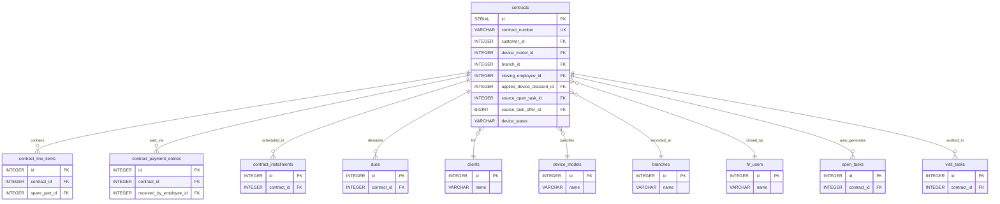

# دستور الكيان: العقود والعمليات المالية (Contracts Domain Constitution)

> **الحالة (Status):** Active Draft / Authoritative  
> **المرجع الأعلى للكيان `contracts` وكافة الجداول والعمليات المالية والتشغيلية الملحقة به** (البنود، الدفعات، الأقساط، والديون المستحقة).

---

## 1. هوية الكيان (Entity Identity)

- **الاسم العربي:** العقد / عقد المبيعات والصيانة
- **الاسم الإنجليزي:** Contract
- **اسم الجدول:** `contracts`
- **الوصف:** السجل التجاري الحاكم لعملية بيع وتركيب أجهزة تنقية المياه وتقديم خدمات الصيانة. يمثل الاتفاق المالي والقانوني الملزم بين الشركة والزبون. كل عقد يتضمن جهازاً رئيسياً واحداً على الأقل، ومجموعة من قطع الغيار أو الملحقات الاختيارية، وتفاصيل الدفعات المالية والأقساط المستحقة، كما يطلق تلقائياً دورات المهام الميدانية كالتوصيل والتركيب.
- **الأهمية والأمان:** الكيان الأكثر تعقيداً وأهمية في النظام المالي والتشغيلي. أي خلل في بياناته يؤثر مباشرة على حسابات الأرباح والخسائر، ديون العملاء، وجداول الفنيين. لا يمكن تعديل معالمه المالية الحساسة إلا بموافقة وبصلاحيات مشرف الفرع أو الإدارة.
- **الجداول الفرعية والملحقة (Sub-Entities):**
  1. `contract_line_items` (بنود العقد من أجهزة وقطع وإكسسوارات ورسوم).
  2. `contract_payment_entries` (سجل الدفعات المقبوضة نقدياً أو إلكترونياً أو بالتبادل).
  3. `contract_installments` (جدولة الأقساط المحددة وتواريخ استحقاقها).
  4. `dues` (سجل الذمم والديون والمتابعات المالية الجارية).

---

## 2. معجم الجداول والحقول (Table & Field Dictionary)

### 2.1 جدول العقود الرئيسي `contracts`

يخزن البيانات الحاكمة للاتفاق والصفقة والبيانات القانونية للمشتري وتتبع تسليم وتركيب الجهاز.

| الحقل (Field) | النوع (SQL Type) | NULL? | DEFAULT | Constraints | الوصف والشرح بالعربية | مثال واقعي (Example) |
|---|---|---|---|---|---|---|
| `id` | `SERIAL` | ❌ | — | `PRIMARY KEY` | المعرف الفريد التلقائي للعقد بقاعدة البيانات | `4025` |
| `contract_number` | `VARCHAR(100)` | ✅ | — | `UNIQUE` | الرقم الفريد التشغيلي للعقد (يولد بصيغة مميزة) | `"C-2026-00054"` |
| `customer_id` | `INTEGER` | ✅ | — | `FK → clients(id) ON DELETE SET NULL` | معرف الزبون مالك العقد في جدول العملاء | `1024` |
| `customer_name` | `VARCHAR(255)` | ✅ | — | — | لقطة لاسم الزبون وقت توقيع العقد (Denormalized) | `"أحمد محمد علي"` |
| `contract_date` | `VARCHAR(50)` | ✅ | — | — | تاريخ تحرير وتوقيع العقد النصي | `"2026-05-24"` |
| `source_visit` | `VARCHAR(255)` | ✅ | — | — | (Legacy) معرف زيارة المبيعات المسببة للعقد | `"visit-1025"` |
| `device_model_id` | `INTEGER` | ✅ | — | `FK → device_models(id) ON DELETE SET NULL` | معرف موديل الجهاز الرئيسي المبيع | `5` |
| `device_model_name` | `VARCHAR(255)` | ✅ | — | — | اسم موديل الجهاز وقت البيع (لقطة بيانات) | `"فلتر جولد ستار 5 مراحل"` |
| `serial_number` | `VARCHAR(255)` | ✅ | — | — | الرقم التسلسلي الفريد للجهاز المركب فعلياً | `"GS99281744"` |
| `maintenance_plan` | `VARCHAR(10)` | ✅ | — | — | الخطة الدورية المعتمدة للصيانة والزيارات | `"annual"` / `"semi"` |
| `base_price` | `NUMERIC` | ✅ | `0` | — | السعر الإجمالي الأساسي لخطوط البنود دون خصومات | `150000.00` |
| `final_price` | `NUMERIC` | ✅ | `0` | — | السعر النهائي بعد احتساب الخصومات والتسويات | `135000.00` |
| `payment_type` | `VARCHAR(50)` | ✅ | `'cash'` | — | نوع السداد التجاري (نقدي، أقساط، مختلط) | `"installments"` |
| `down_payment` | `NUMERIC` | ✅ | `0` | — | قيمة الدفعة الأولى المسددة عند تحرير العقد | `35000.00` |
| `installments_count`| `INTEGER` | ✅ | `0` | — | عدد الأقساط المجدولة المتفق عليها | `12` |
| `delivery_date` | `VARCHAR(50)` | ✅ | — | — | تاريخ التوصيل المتفق عليه والتوصيل الفعلي | `"2026-05-25"` |
| `installation_date` | `VARCHAR(50)` | ✅ | — | — | تاريخ التركيب المتفق عليه والتركيب الفعلي | `"2026-05-28"` |
| `status` | `VARCHAR(50)` | ✅ | `'draft'` | `CHECK (status IN ...)` | حالة العقد العامة (`active`, `cancelled`, `temporary`) | `"active"` |
| `created_at` | `TIMESTAMPTZ` | ✅ | `NOW()` | — | تاريخ إنشاء السجل الفني بقاعدة البيانات | `"2026-05-24T20:15:00Z"` |
| `branch_id` | `INTEGER` | ✅ | — | `FK → branches(id) ON DELETE RESTRICT` | معرف الفرع المالك للعقد (قد يختلف عن فرع الزبون) | `3` |
| `sale_type` | `VARCHAR(30)` | ❌ | `'marketing'` | `CHECK (sale_type IN ...)` | نوع البيع التشغيلي التجاري (`tradein`, `retention`, `direct`) | `"direct"` |
| `sale_source` | `VARCHAR(50)` | ✅ | — | — | القناة الديناميكية المستقطبة للبيع (تطبيق، تواصل) | `"تطبيق"` / `"مباشر"` |
| `discount_id` | `INTEGER` | ✅ | — | `FK → device_discounts(id)` | معرف نسبة الخصم المطبق (Legacy) | `1` |
| `closing_employee_id`| `INTEGER` | ✅ | — | `FK → hr_users(id)` | معرف المستخدم المسؤول عن إغلاق وتأكيد البيع | `12` |
| `closing_date` | `TIMESTAMPTZ` | ✅ | — | — | تاريخ الإغلاق الفعلي وتأكيد العقد مبيعاتياً | `"2026-05-24T20:20:00Z"` |
| `invoice_notes` | `TEXT` | ✅ | — | — | ملاحظات الفاتورة والتسليم للعميل | `"التركيب مجاني بناء على عرض الصيف"` |
| `receipt_number` | `VARCHAR(100)` | ✅ | — | — | رقم إيصال القبض المالي للدفعة الأولى | `"R-99214"` |
| `installation_geo_unit_id`| `INTEGER`| ✅ | — | `FK → geo_units(id)` | معرف المنطقة السكنية الخاصة بموقع تركيب العقد | `123` |
| `installation_address_text`| `TEXT`| ✅ | — | — | عنوان تركيب العقد (قد يختلف عن عنوان الزبون) | `"المزة، بناية 5، طابق 2"` |
| `installation_lat` | `NUMERIC` | ✅ | — | — | الإحداثي الجغرافي للشمال لعنوان التركيب | `33.5138` |
| `installation_lng` | `NUMERIC` | ✅ | — | — | الإحداثي الجغرافي للشرق لعنوان التركيب | `36.2765` |
| `applied_device_discount_id`| `INTEGER`| ✅ | — | `FK → device_discounts(id)` | معرف الخصم المطبق المعياري النشط | `7` |
| `buyer_mother_name` | `VARCHAR(255)` | ✅ | — | — | اسم والدة المشتري كبيانات قانونية للعقد | `"فاطمة"` |
| `buyer_national_id_registry`| `VARCHAR(255)`| ✅ | — | — | القيد المدني للمشتري الموقع | `"دمشق"` |
| `buyer_national_id_issued_by`| `VARCHAR(255)`| ✅ | — | — | الجهة المانحة للبطاقة الشخصية | `"الميدان"` |
| `buyer_national_id_issue_date`| `DATE` | ✅ | — | — | تاريخ إصدار البطاقة الشخصية | `"2015-06-20"` |
| `buyer_national_id_box`| `VARCHAR(50)` | ✅ | — | — | رقم الخانة للمشتري | `"542"` |
| `buyer_birth_date` | `DATE` | ✅ | — | — | تاريخ ميلاد المشتري الفعلي | `"1990-05-15"` |
| `buyer_gender` | `VARCHAR(10)` | ✅ | — | — | جنس المشتري الموقع للتحقق القانوني | `"Male"` |
| `source_open_task_id`| `INTEGER` | ✅ | — | `FK → open_tasks(id)` | معرف المهمة التي تسببت في هذا العقد | `501` |
| `source_task_offer_id`| `BIGINT` | ✅ | — | `FK → marketing_visit_task_offers(id)`| معرف العرض المالي الذي ولد هذا البيع | `8014` |
| `sale_reference_number`| `VARCHAR(10)` | ✅ | — | — | رقم إسناد البيعة المتولدة من العروض | `"S-992"` |
| `contract_type` | `VARCHAR(30)` | ❌ | `'sale_contract'` | `CHECK (contract_type IN ...)` | طبيعة العقد المبرم (`sale_contract`, `maintenance_contract`) | `"sale_contract"` |
| `no_closing_reason_id`| `INTEGER` | ✅ | — | `FK → system_lists(id)` | معرف سبب عدم الإغلاق والتعليق | `102` |
| `sale_subtype` | `VARCHAR(30)` | ✅ | `'definitive'` | `CHECK (sale_subtype IN ...)` | نوع فرعي للبيع (`definitive`, `temporary`, `free`) | `"definitive"` |
| `device_status` | `VARCHAR(50)` | ✅ | `'pending_delivery'`| `CHECK (device_status IN ...)` | الحالة المادية والتركيبية للجهاز التابع للعقد | `"installed"` |
| `is_golden_warranty`| `BOOLEAN` | ❌ | `FALSE` | — | هل العقد مغطى بالكفالة الذهبية الإضافية؟ | `true` |
| `golden_warranty_end_date`| `DATE` | ✅ | — | — | تاريخ نهاية التغطية للكفالة الذهبية | `"2028-05-24"` |
| `contract_warranty_end_date`| `DATE` | ✅ | — | — | تاريخ نهاية الكفالة القياسية للمبيعات | `"2027-05-24"` |

---

### 2.2 جدول بنود العقد `contract_line_items`
يخزن تفاصيل القطع والأجهزة والخدمات المشمولة في فاتورة العقد الفردية.

| الحقل (Field) | النوع (SQL Type) | NULL? | DEFAULT | Constraints | الوصف والشرح بالعربية | مثال واقعي (Example) |
|---|---|---|---|---|---|---|
| `id` | `SERIAL` | ❌ | — | `PRIMARY KEY` | المعرف التلقائي للبند | `452` |
| `contract_id` | `INTEGER` | ❌ | — | `FK → contracts(id) ON DELETE CASCADE` | معرف العقد الرئيسي الحاضن للبند | `4025` |
| `item_type` | `VARCHAR(50)` | ❌ | — | `CHECK (item_type IN ...)` | نوع البند (`device`, `accessory`, `service_fee`) | `"device"` |
| `spare_part_id` | `INTEGER` | ✅ | — | `FK → spare_parts(id) ON DELETE SET NULL` | معرف القطعة في حال كان البند إكسسواراً أو قطع غيار | `12` |
| `description` | `VARCHAR(500)` | ✅ | — | — | وصف فني إضافي للبند | `"خرطوم توصيل إضافي 3 أمتار"` |
| `quantity` | `INTEGER` | ❌ | `1` | `CHECK (quantity > 0)` | الكمية المباعة للبند | `1` |
| `unit_price` | `NUMERIC` | ❌ | — | `CHECK (unit_price >= 0)` | سعر الوحدة للبند بالعملة المحلية | `135000.00` |
| `total_price` | `NUMERIC` | ❌ | — | `CHECK (total_price >= 0)` | السعر الإجمالي للبند (الكمية × السعر) | `135000.00` |
| `is_installed` | `BOOLEAN` | ✅ | `FALSE` | — | هل تم تركيب القطعة بالفعل للزبون؟ | `true` |
| `created_at` | `TIMESTAMPTZ` | ❌ | `NOW()` | — | تاريخ إنشاء السجل | `"2026-05-24T20:15:00Z"` |

---

### 2.3 جدول الدفعات المالية المباشرة `contract_payment_entries`
يخزن الدفعات المالية الفعلية المقبوضة لحساب هذا العقد (سواء كانت دفعة أولى أو دفعات أقساط لاحقة).

| الحقل (Field) | النوع (SQL Type) | NULL? | DEFAULT | Constraints | الوصف والشرح بالعربية | مثال واقعي (Example) |
|---|---|---|---|---|---|---|
| `id` | `SERIAL` | ❌ | — | `PRIMARY KEY` | المعرف الفريد للدفعة | `992` |
| `contract_id` | `INTEGER` | ❌ | — | `FK → contracts(id) ON DELETE CASCADE` | معرف العقد المسدد لحسابه | `4025` |
| `method` | `VARCHAR(50)` | ❌ | — | `CHECK (method IN ...)` | وسيلة السداد المعتمدة (نقدي، بوابات إلكترونية) | `"sham_cash"` / `"barter"` |
| `currency` | `VARCHAR(10)` | ❌ | `'SYP'` | — | عملة السداد الفعلية المقبوضة | `"SYP"` / `"USD"` |
| `amount_value` | `NUMERIC` | ❌ | — | `CHECK (amount_value >= 0)` | قيمة المبلغ المقبوض بالعملة المدخلة | `35000.00` |
| `exchange_rate` | `NUMERIC` | ✅ | — | `CHECK (exchange_rate > 0)` | سعر الصرف المعتمد في حال السداد بالعملة الأجنبية | `15000.00` |
| `amount_syp` | `NUMERIC` | ❌ | — | `CHECK (amount_syp >= 0)` | القيمة المعادلة بالليرة السورية للدين | `35000.00` |
| `reference_number` | `VARCHAR(255)` | ✅ | — | — | رقم مرجع المعاملة الإلكترونية أو البنكية | `"TX-992817"` |
| `barter_name` | `VARCHAR(255)` | ✅ | — | — | اسم السلعة المقبوضة في حال السداد بالتبادل المقايض | `"مضخة مياه مستعملة"` |
| `barter_value_syp`| `NUMERIC` | ✅ | — | `CHECK (barter_value_syp >= 0)` | القيمة المقدرة بالليرة السورية للمقايضة | `5000.00` |
| `received_by_employee_id`| `INTEGER`| ✅ | — | `FK → hr_users(id)` | معرف الموظف الذي استلم وقبض المبلغ | `12` |
| `received_at` | `TIMESTAMPTZ` | ❌ | `NOW()` | — | تاريخ الاستلام والقبض الفعلي | `"2026-05-24T20:15:00Z"` |
| `notes` | `TEXT` | ✅ | — | — | ملاحظات محاسبية إضافية للدفعة | `"دفعة نقدية كجزء من القسط الأول"` |

---

### 2.4 جدول الأقساط المتفق عليها `contract_installments`
يخزن تفاصيل الأقساط وتواريخ استحقاقها وجدولتها المالية المتفق عليها في عقد البيع بالتقسيط.

| الحقل (Field) | النوع (SQL Type) | NULL? | DEFAULT | Constraints | الوصف والشرح بالعربية | مثال واقعي (Example) |
|---|---|---|---|---|---|---|
| `id` | `SERIAL` | ❌ | — | `PRIMARY KEY` | المعرف الفريد للسطر | `1201` |
| `contract_id` | `INTEGER` | ❌ | — | `FK → contracts(id) ON DELETE CASCADE` | معرف العقد المقسط | `4025` |
| `installment_number`| `INTEGER` | ❌ | — | `UNIQUE (contract_id, inst_num)` | رقم ترتيب القسط المتفق عليه | `1` |
| `due_date` | `DATE` | ❌ | — | — | تاريخ استحقاق القسط القانوني | `"2026-06-24"` |
| `amount_syp` | `NUMERIC` | ❌ | — | `CHECK (amount_syp >= 0)` | المبلغ المطلوب سداده بالقسط بالليرة السورية | `8333.00` |
| `status` | `VARCHAR(50)` | ❌ | `'pending'` | `CHECK (status IN ...)` | حالة القسط الحالية (حروف صغيرة: `pending`, `paid`, `partial`, `overdue`) | `"pending"` |
| `paid_amount` | `NUMERIC` | ❌ | `0` | — | المبالغ الإجمالية المسددة من هذا القسط | `0` |
| `remaining_balance`| `NUMERIC` | ❌ | `0` | — | المتبقي غير المسدد من قيمة القسط | `8333.00` |
| `confirmed` | `BOOLEAN` | ❌ | `FALSE` | — | هل تم تأكيد واعتماد القسط تشغيلياً من المشرف؟ | `true` |

---

### 2.5 جدول الديون والذمم المستحقة `dues`
يمثل السجل التاريخي والتشغيلي للمتابعات والديون المستحقة والذمم الجاري تحصيلها ومتابعتها تسويقياً وهاتفياً.

| الحقل (Field) | النوع (SQL Type) | NULL? | DEFAULT | Constraints | الوصف والشرح بالعربية | مثال واقعي (Example) |
|---|---|---|---|---|---|---|
| `id` | `SERIAL` | ❌ | — | `PRIMARY KEY` | المعرف الفريد للمستحق المالي | `3042` |
| `contract_id` | `INTEGER` | ❌ | — | `FK → contracts(id) ON DELETE CASCADE` | معرف العقد صاحب المديونية | `4025` |
| `type` | `VARCHAR(50)` | ❌ | — | — | تصنيف الدين (قسط، صيانة، رسوم تركيب) | `"installment"` / `"maintenance"` |
| `scheduled_date` | `VARCHAR(50)` | ✅ | — | — | التاريخ المخطط الأصلي لتحصيل الدين | `"2026-06-24"` |
| `adjusted_date` | `VARCHAR(50)` | ✅ | — | — | التاريخ المعدل المتفق عليه تشغيلياً مع العميل | `"2026-06-28"` |
| `original_amount` | `NUMERIC` | ✅ | `0` | — | القيمة الأصلية الكاملة للدين | `8333.00` |
| `remaining_balance`| `NUMERIC` | ✅ | `0` | — | المبلغ المتبقي المستحق للتحصيل | `8333.00` |
| `assigned_telemarketer_id`| `INTEGER`| ✅ | — | — | الموظف المسؤول هاتفياً عن متابعة التحصيل | `15` |
| `status` | `VARCHAR(50)` | ✅ | `'Pending'` | `CHECK (status IN ...)` | حالة الدين (حروف ميكرو كابيتال: `Pending`, `Partial`, `Paid`, `Overdue`) | `"Pending"` |
| `escalated` | `BOOLEAN` | ✅ | `FALSE` | — | هل تم تصعيد الدين لعدم الالتزام أو الرفض؟ | `false` |

---

## 3. القيود والقواعد (Constraints & Business Rules)

### 3.1 قيود ومحددات قاعدة البيانات (Database Constraints)
- **Cascade Deletion:** تتمتع الجداول الفرعية (`contract_line_items`, `contract_payment_entries`, `contract_installments`, `dues`) بقيد ربط خارجي `ON DELETE CASCADE` مع الجدول الرئيسي `contracts` مما يؤدي لحذف كافة السجلات الفرعية أوتوماتيكياً بمجرد حذف العقد صراحة (Hard-delete).
- **Status Constraints:** 
  - حظر حالات العقد العامة خارج قيم: `CHECK (status IN ('active', 'cancelled', 'temporary'))`.
  - حظر تصنيفات الدفعة النقدية خارج وسائل السداد الرسمية: `CHECK (method IN ('cash', 'sham_cash', 'syriatel_cash', 'mtn_cash', 'alharam', 'bank_transfer', 'barter', 'usd_cash'))`.
  - حظر حالات الأقساط الفردية خارج: `CHECK (status IN ('pending', 'paid', 'partial', 'overdue'))`.
  - حظر حالات الديون المستحقة خارج: `CHECK (status IN ('Pending', 'Partial', 'Paid', 'Overdue'))`.

### 3.2 قواعد العمل البرمجية والتشغيلية (Business Rules)

#### BR-1: تتبع دورة الحياة المادية للجهاز المبيع (Device Lifecycle & Auto-Tasks)
تتميز عقود البيع التابعة للأجهزة (`contract_type = 'sale_contract'`) بمسار تتبع صارم ومحدد لعمليات النقل والتركيب الفني للموقع الجغرافي للزبون (`device_status`):
1. **قيد التوصيل (`pending_delivery`):** الحالة الافتراضية فور تحرير العقد بنجاح.
   - **المنطق البرمجي المطبق:** يقوم الـ API تلقائياً بإنشاء مهمة توصيل مفتوحة (`open_tasks` من نوع `device_delivery` وعائلة `delivery` وتخصيص تاريخ توصيل محدد) في قاعدة البيانات لصالح الفنيين.
2. **تم التوصيل (`delivered`):** عند إتمام الفني لمهمة التوصيل وتأكيدها.
   - **المنطق البرمجي المطبق:** يتحول وضع الجهاز تلقائياً لـ `delivered` ويطلق النظام تلقائياً مهمة التركيب التالية (`device_installation`).
3. **تم التركيب (`installed`):** عند إتمام الفني لمهمة التركيب والتشغيل الفعلي.
   - **المنطق البرمجي المطبق:** يتحول وضع الجهاز لـ `installed` ويصبح البند مسجلاً كـ `is_installed = TRUE`.
4. **فعال (`active`):** الحالة النهائية للجهاز والتي تفيد بنجاح التركيب والتفعيل الفني لتبدأ دورات كفالة الصيانة الذهبية والقياسية.

#### BR-2: الاحتساب المحاسبي التلقائي للقيمة النهائية (Contract Price Recalculation)
يتم احتساب القيمة الإجمالية للعقد تشغيلياً كالتالي:
- `base_price` = حاصل جمع المجموع الفردي لكافة البنود (`contract_line_items.total_price`).
- `final_price` = السعر الأساسي `base_price` مطروحاً منه قيمة الخصم المعياري المطبق في جدول `device_discounts` (في حال إرسال `applied_device_discount_id` صراحة). يتم التخزين المباشر للمبالغ النهائية وتحديث العقد.

#### BR-3: شروط أنماط السداد التجاري (Payment Type Conditions)
1. **النقدي (`cash`):** يجب أن تتطابق قيمة الدفعة الأولى المقبوضة `down_payment` مع القيمة النهائية للعقد `final_price` بالتمام، مع تصفير عدد الأقساط مجتمعة.
2. **التقسيط (`installments`):** تكون قيمة الدفعة الأولى `down_payment` أقل من قيمة العقد النهائية `final_price` بالتمام، ويجب تزويد الخادم بمصفوفة الأقساط المتفق عليها والتواريخ المستحقة بدقة لإنشاء سجلات الأقساط والديون.

#### BR-4: استقلالية الفروع التامة للعقود (Branch Independence - GAP-006)
- يتم تخزين قيد فريد `branch_id` صريح على مستوى العقد مستقلاً تماماً عن فرع تسجيل الزبون الأصلي.
- يخدم هذا المنطق تتبع مبيعات الفرع الذي أنشأ ووقع الفاتورة تشغيلياً ومالياً بغض النظر عن سكن الزبون.
- عمليات الفلترة والاستعلام لقائمة العقود (`GET /api/contracts`) لمسؤولي فروع محددين يتم تصفيتها بصرامة بناءً على `contracts.branch_id` ولا تقرأ فرع الزبون الموثق.

#### BR-5: ترقيات العملاء لدورة الحياة (Lifecycle Promotion Hook)
عند إنشاء أول عقد مبيعات صحيح وحفظه للعميل بنجاح، يقوم الـ API تلقائياً باستدعاء دالة الترقية (`promoteClientToLifecycleStatus`) لترقية وضع الزبون في قاعدة البيانات إلى عميل نشط يملك أجهزة ومبيعات (`OP`).

#### BR-6: تأكيد الأقساط الجماعي (Mass Installment Confirmation)
عند إنشاء مصفوفة أقساط غير مؤكدة، يظل بإمكان المشرف تعديل قيمها وإعادتها. بمجرد استدعاء مسار التأكيد (`POST /api/contracts/:id/installments/confirm`):
- يتم تحويل كافة الأقساط للحالة `confirmed = TRUE` لتصبح التزامات مالية نهائية غير قابلة للتعديل العشوائي من واجهة العميل العادية.

#### BR-7: نظام الكفالات المزدوجة (Dual Warranty System)
يدعم كل عقد بيع نوعين مستقلين من الكفالة:

**كفالة العقد القياسية (`contract_warranty_end_date`):**
- مصدرها: العقد نفسه عند إنشائه.
- آلية الحساب: يختار المستخدم فترة من `[6، 12، 24، 36 شهرًا]` في نموذج الإنشاء، يحسب الـ API تلقائياً: `contract_warranty_end_date = contract_date + warrantyMonths`.
- تُطبّق على جميع عقود البيع بصرف النظر عن نوع الجهاز.

**الكفالة الذهبية (`is_golden_warranty` + `golden_warranty_end_date`):**
- الشرط المسبق: الجهاز يجب أن يدعمها (`device_models.is_golden_warranty = TRUE`).
- الفترات المتاحة: مخزّنة على موديل الجهاز كـ `golden_warranty_periods: [{months, label}]` (بنية object بعد migration 186).
- مصدرها: **إيصال ينشأ كنتيجة لمهمة تسليم كفالة ذهبية** — وليس عند إنشاء العقد.
- آلية التطبيق: عند اكتمال مهمة التسليم، يختار الفني/المستخدم الفترة المناسبة، يُكتب: `is_golden_warranty = TRUE` و `golden_warranty_end_date = task_completion_date + selectedMonths`.
- **⚠️ الجزء الثالث من BR-7 معلّق التنفيذ** — راجع GAP-078.

**منطق الأولوية في `customerCalls.ts`:**
```sql
WHEN c.is_golden_warranty = TRUE THEN 'golden_warranty'
ELSE 'contract_warranty'
```
الذهبية تحل محل القياسية — النظام يعمل بمبدأ "إما/أو" حالياً.

---

## 4. العلاقات (Relationships)

### 4.1 مخطط العلاقات الكيانية (Entity Relationship Map)



### 4.2 تفاصيل الجداول المرتبطة والاعتماديات

| الجدول المرتبط | نوع العلاقة (Relationship) | سلوك الحذف (ON DELETE) | الوصف التشغيلي |
|---|---|---|---|
| `clients` | `N:1` | `SET NULL` | العميل المستفيد ومالك العقد (تصفير المرجع يحفظ العقد مالياً). |
| `branches` | `N:1` | `RESTRICT` | الفرع التشغيلي المنشئ والمالك للعقد (يمنع الحذف لاستقرار التقارير). |
| `device_models` | `N:1` | `SET NULL` | الموديل الأساسي للجهاز المبيع في الصفقة. |
| `contract_line_items`| `1:N` | `CASCADE` | قائمة بنود وتفاصيل محتويات فاتورة العقد الفنية والمالية. |
| `contract_payment_entries`| `1:N`| `CASCADE` | تاريخ المقبوضات المالية للدفعة الأولى أو أقساط العقد. |
| `contract_installments`| `1:N`| `CASCADE` | جدول تواريخ ومبالغ الأقساط المخططة للاستحقاق للعملاء. |
| `dues` | `1:N` | `CASCADE` | كشوفات الديون الجاري متابعتها تسويقياً للتحصيل الهاتفي. |
| `open_tasks` | `1:N` | `SET NULL` | المهام التلقائية المتولدة عن البيع (التسليم والتركيب). |
| `visit_tasks` | `1:N` | `SET NULL` | زيارات الصيانة الدورية وتغيير الفلاتر المرتبطة بجهاز العقد لاحقاً. |

---

## 5. آلة الحالات (State Machine)

### 5.1 حالة العقد العامة (Contract Status Lifecycle)

```
       [draft] (تحرير مسودة العقد)
          │
          ├─────────────────────────► [cancelled] (إلغاء وفسخ العقد)
          │                               ▲
          ▼                               │
       [active] (العقد فعال وقيد التنفيذ)───┤
          │                               │
          ▼                               │
       [completed] (العقد منتهي بالكامل)─┘
```

*ملاحظة هامة:* هجرة `126` استبدلت القيود مؤقتاً لتصبح `CHECK (status IN ('active', 'cancelled', 'temporary'))` لكن الكود والتطبيق يتعامل تاريخياً وبقوائم البحث مع حالات `completed` و `draft` للتحقق.

### 5.2 آلة حالة الجهاز المبيعة (Device Status Sub-lifecycle)

يتم ترقية حالة الجهاز المركب بناءً على تأكيد مهام الفنيين الميدانيين:

```
[pending_delivery] (بانتظار التوصيل)
       │
       │ (اكتمال مهمة التوصيل device_delivery)
       ▼
   [delivered] (تم التوصيل ومغلف بالكامل)
       │
       │ (اكتمال مهمة التركيب device_installation)
       ▼
   [installed] (تم التركيب والتشغيل الأولي وتعيين البند كمركب)
       │
       │ (التأكيد والتفعيل الفني لخدمة الزبون)
       ▼
    [active] (الجهاز فعال وتعمل كفالته)
```

---

## 6. صلاحيات الوصول (Permission Matrix)

يتم تنظيم صلاحيات الوصول لبيانات العقود والتحصيل بصرامة عبر معالجة التحقق للـ Middleware:

| المفتاح (Permission Key) | الاسم العربي للصلاحية | النطاقات المدعومة (Scopes) | الوصف الأمني والتشغيلي |
|---|---|---|---|
| `contracts.view_list` | عرض قائمة العقود | `GLOBAL`, `BRANCH` | استعلام وعرض العقود وتفاصيلها الحساسة والفواتير الملحقة. |
| `contracts.create` | إنشاء عقد جديد | `GLOBAL`, `BRANCH` | تحرير وإنشاء عقد وإطلاق المهام والذمم المالية. |
| `contracts.edit` | تعديل العقد | `GLOBAL`, `BRANCH` | تعديل الحقول غير المالية، وإدراج الدفعات والأقساط وتأكيدها. |
| `contracts.delete` | حذف العقد | `GLOBAL`, `BRANCH` | حذف فيزيائي حاد للعقد والبنود والدفعات والأقساط المتولدة. |

### 6.1 منطق التحقق الأمني المطبق
- **GLOBAL Scope:** يتيح عرض وإدارة العقود لكافة الفروع (Super Admin).
- **BRANCH Scope:** يسمح باستعلام وإدارة العقود التي يتطابق حقل `c.branch_id` الخاص بها صراحة مع فروع الموظف المصرحة بالـ JWT. يمنع تعديل أو حذف أي عقد خارج فروع الموظف التشغيلية بترميز `403`.
- **ملاحظة فنية هامة:** لا تدعم العقود نطاق الوصول الشخصي `ASSIGNED` في قاعدة البيانات (حيث حصرتها الهجرة `054` بـ `GLOBAL` و `BRANCH` فقط لسرية العمليات المالية وتجنب تشتت كشوف المبيعات).

---

## 7. عقد API (API Contract)

### 7.1 قائمة المسارات (Endpoints)

| الطريقة | المسار (Path) | الصلاحية المطلوبة | وصف الوظيفة والسلوك |
|---|---|---|---|
| **GET** | `/api/contracts` | `contracts.view_list` | جلب قائمة العقود المفحوصة والمفلترة حسب الفرع أو العميل مع Pagination. |
| **GET** | `/api/contracts/:id` | `contracts.view_list` | جلب تفاصيل غنية للعقد شاملة الديون والمهام والبنود والأقساط والدفعات والزبون. |
| **POST** | `/api/contracts` | `contracts.create` | إنشاء عقد مبيعات كامل وإطلاق مهام التوصيل التلقائية وتحديث جودة بيانات العميل. |
| **PUT** | `/api/contracts/:id` | `contracts.edit` | تعديل حقول رأس العقد وتحديث عنوان التركيب والإحداثيات الجغرافية. |
| **POST** | `/api/contracts/:id/payment-entries`| `contracts.edit` | استبدال كامل للدفعات المقبوضة لهذا العقد داخل ترانزأكشن متكامل. |
| **POST** | `/api/contracts/:id/installments` | `contracts.edit` | استبدال كامل للأقساط غير المؤكدة الجدولة للبيع بالتقسيط. |
| **POST** | `/api/contracts/:id/installments/confirm`| `contracts.edit` | تأكيد الأقساط وجعلها نهائية غير قابلة للمحو العشوائي. |
| **DELETE**| `/api/contracts/:id` | `contracts.delete` | حذف العقد فيزيائياً وشطب كافة القيود التابعة والديون والأقساط ذاتياً. |
| **PUT** | `/api/contracts/:id/line-items/:itemId/installation`| `contracts.edit` | تحديث حالة تركيب البند المعين كمركب أو غير مركب (يستخدمه الفني). |

---

### 7.2 تفاصيل الطلب لإنشاء عقد (POST /api/contracts)
نموذج الطلب الضخم لإضافة صفقة شراء متكاملة متضمنة البنود والدفعات والأقساط والذمم:
```json
{
  "contractNumber": "C-2026-00054",
  "customerId": 1024,
  "customerName": "أحمد محمد علي",
  "contractDate": "2026-05-24",
  "deviceModelId": 5,
  "deviceModelName": "فلتر جولد ستار 5 مراحل",
  "serialNumber": "GS99281744",
  "maintenancePlan": "annual",
  "basePrice": 150000.00,
  "finalPrice": 135000.00,
  "paymentType": "installments",
  "downPayment": 35000.00,
  "installmentsCount": 12,
  "deliveryDate": "2026-05-25",
  "installationDate": "2026-05-28",
  "branchId": 3,
  "saleType": "direct",
  "saleSource": "مباشر",
  "saleSubtype": "definitive",
  "contractType": "sale_contract",
  "appliedDeviceDiscountId": 7,
  "closingEmployeeId": 12,
  "invoiceNotes": "التركيب مجاني بناء على عرض الصيف",
  "buyerMotherName": "فاطمة",
  "buyerNationalIdRegistry": "دمشق",
  "buyerNationalIdIssuedBy": "الميدان",
  "buyerNationalIdIssueDate": "2015-06-20",
  "buyerNationalIdBox": "542",
  "buyerBirthDate": "1990-05-15",
  "buyerGender": "Male",
  "geoSelection": {
    "neighborhoodId": 123,
    "addressText": "المزة، بناية 5، طابق 2",
    "mapPosition": [33.5138, 36.2765]
  },
  "lineItems": [
    {
      "itemType": "device",
      "sparePartId": null,
      "description": "الجهاز الرئيسي المبيع",
      "quantity": 1,
      "unitPrice": 135000.00,
      "totalPrice": 135000.00
    }
  ],
  "paymentEntries": [
    {
      "method": "cash",
      "currency": "SYP",
      "amountValue": 35000.00,
      "amountSyp": 35000.00,
      "receivedByEmployeeId": 12,
      "notes": "دفعة نقدية كجزء من الدفعة الأولى عند التعاقد"
    }
  ],
  "installments": [
    {
      "installmentNumber": 1,
      "dueDate": "2026-06-24",
      "amountSyp": 8333.00
    }
  ],
  "dues": [
    {
      "type": "installment",
      "scheduledDate": "2026-06-24",
      "adjustedDate": "2026-06-24",
      "originalAmount": 8333.00,
      "remainingBalance": 8333.00,
      "assignedTelemarketerId": 15,
      "status": "Pending",
      "escalated": false
    }
  ]
}
```

---

## 8. حالات الاختبار الشاملة (Test Cases)

### 8.1 الاختبارات الوظيفية وعقد العمل (Functional & Payment Tests)

| الرمز | سيناريو الفحص والاختبار | الطريقة والمسار | المدخلات المرسلة | السلوك المتوقع والاستجابة | ملاحظات تشغيلية |
|---|---|---|---|---|---|
| **TC-01** | إنشاء عقد بيع صحيح متكامل مع بنود وأقساط | POST `/api/contracts` | كائن عقد كامل ومطابق لـ BR-2 و BR-3. | ترميز `200` مع الكائن المنشأ وإطلاق مهمة التوصيل التلقائي. | يتم إنشاء العقد والدفعات والأقساط والديون والترقية أوتوماتيكياً. |
| **TC-02** | محاولة إنشاء عقد بدون معرف زبون `customerId` | POST `/api/contracts` | إرسال الطلب دون تحديد `customerId`. | ترميز `400` أو فشل القيود لقيم المفتاح الأجنبي. | يجب أن يتبع العقد زبوناً مسجلاً في النظام دائماً. |
| **TC-03** | إنشاء عقد بفرع تشغيلي يختلف عن فرع العميل | POST `/api/contracts` | فرع العقد `3` بينما الزبون يتبع لفرع `1`. | ترميز `200` ونجاح العملية وتوثيق كل كيان بفرعه المختار. | يعكس BR-4 استقلالية الفروع التشغيلية التامة للتحليلات. |
| **TC-04** | محاولة قراءة عقد خارج الفروع المصرحة للمستخدم | GET `/api/contracts/:id`| مستخدم من فرع `2` يطلب عقداً تابعاً لفرع `3`. | ترميز `403` "غير مسموح" لمنع تسريب الحسابات. | التحقق من صحة scope الصلاحيات وعمل الـ Middleware. |
| **TC-05** | محاولة حذف عقد نشط يملك قيوداً فرعية | DELETE `/api/contracts/:id`| معرف عقد يملك ديوناً وأقساطاً مسجلة. | ترميز `200` ونجاح الحذف الفيزيائي وشطب كافة التوابع أوتوماتيكياً. | تفرضه قيود قاعدة البيانات `ON DELETE CASCADE`. |
| **TC-06** | استبدال دفعات نقدية للعقد | POST `/:id/payment-entries`| إرسال مصفوفة دفعات جديدة بالكامل. | ترميز `200` ومحو الدفعات السابقة وإدراج الجديدة ضمن ترانزأكشن آمن. | يسمح بإجراء التسويات المالية وإعادة التوثيق. |
| **TC-07** | محاولة استبدال أقساط مؤكدة ومقروءة | POST `/:id/installments` | إرسال مصفوفة أقساط جديدة بعد استدعاء confirm. | ترميز `200` (ملاحظة: الـ API يمحو فقط الأقساط غير المؤكدة `confirmed = FALSE`). | حماية الأقساط المعتمدة من التلاعب غير المقصود. |
| **TC-08** | تأكيد وجدولة الأقساط المبرمة | POST `/:id/installments/confirm` | إرسال طلب التأكيد لمعرف العقد المحدد. | ترميز `200` وتحويل كافة الأقساط للحالة مؤكدة `confirmed = TRUE`. | نقل الأقساط لمرحلة الالتزام المالي غير القابل للفسخ. |

---

## 9. الثغرات والتضاربات المكتشفة (Gaps & Contradictions)

تم رصد عدد من العيوب المعمارية والثغرات الجسيمة التي تهدد النزاهة والأمان لكيان العقود والمالية:

### GAP-074: غياب أمني مطلق وكامل للتحقق في مسار الديون ✅ محلول
- **التضارب:** مسار الديون والذمم الحساس جداً `routes/dues.ts` يفتقر بالكامل لوجود بوابات أمان التحقق (`requireAuth`) أو التحقق من الصلاحيات (`requirePermission`).
- **الأثر التشغيلي:** يمكن لأي شخص أو جهة هجوم خارجي بدون تسجيل دخول استدعاء مسار `GET /api/dues` وقراءة كافة سجلات الديون والمبالغ والأسماء والتواريخ لزبائن الشركة، أو الأخطر تعديل الديون والمستحقات وحالات السداد عبر `PUT /api/dues/:id` عشوائي.
- **الحل المطبق:** إضافة `requireAuth` على مستوى الـ router + `requirePermission('contracts.view_list')` على `GET /` مع فلترة فرع + `requirePermission('contracts.edit')` على `PUT /:id` مع `authorize()` للتحقق من الفرع.
- **تاريخ الحل:** 2026-05-25

### GAP-075: غياب فحص الفرع في مسار `GET /api/contracts/:id` ✅ محلول
- **التضارب:** مسار `GET /api/contracts/:id` (سطر 302) لا يتحقق من أن العقد المطلوب ينتمي لفرع المستخدم المصرح له — على عكس `PUT /:id` و `DELETE /:id` اللذان يستخدمان `authorize()` صراحة.
- **الأثر التشغيلي:** مستخدم من فرع (أ) يستطيع قراءة تفاصيل عقد كامل (مع الديون والمهام والبنود والدفعات والزبون) لفرع (ب) ما دام يعرف المعرف — خرق مالي وإفصاح للبيانات الحساسة.
- **الحل المطبق:** إضافة `const access = authorize(authContext, { permission: 'contracts.view_list', branchId: rows[0].branchId })` قبل `mapContract()` في handler الـ GET /:id.
- **تاريخ الحل:** 2026-05-25

### GAP-076: غياب تاريخ انتهاء كفالة العقد لجميع العقود الحالية ✅ محلول جزئي
- **التضارب:** حقل `contract_warranty_end_date` موجود بـ DB منذ migration 156 لكن لم يكن يُملأ — لا يوجد في ContractForm حقل اختيار فترة، ولا يحسبه الـ API تلقائياً.
- **الحل المطبق (2026-05-26):** إضافة dropdown "فترة كفالة العقد" في ContractForm، والـ API يحسب التاريخ تلقائياً: `contract_warranty_end_date = contract_date + warrantyMonths`.
- **المتبقي:** العقود القديمة (قبل 2026-05-26) تبقى بـ `contract_warranty_end_date = NULL` — لا backfill ممكن لأننا لا نعرف الفترة المتفق عليها.

### GAP-077: بنية `golden_warranty_periods` نصية غير قابلة للحساب ✅ محلول
- **التضارب:** `device_models.golden_warranty_periods` كان يخزن نصاً حراً `["12 شهرًا"]` لا يمكن جمعه رياضياً على تاريخ لحساب `golden_warranty_end_date`.
- **الحل المطبق (2026-05-26):** migration 186 حوّل البنية إلى `[{"months": 12, "label": "12 شهرًا"}]`، وتحديث النوع في `shared/types.ts`، وتحديث UI في `DeviceManagement.tsx`.

### GAP-079: استئصال حقول دورة الصيانة Legacy ⏳ مرحلي

حقلان لم يعد لهما دور وظيفي بعد تطبيق نظام `warranty_periods`:

| الحقل | الجدول | الحالة |
|---|---|---|
| `maintenance_interval` | `device_models` | DB موجود، UI محذوف، API يقبله لكن لا يُعرضه |
| `maintenance_plan` | `contracts` | DB موجود، تستخدمه `field_visits` للجدولة |

**خطة الاستئصال (3 مراحل):**

**المرحلة 1 — فصل قراءة `maintenance_plan` عن الزيارات الميدانية (شرط مسبق):**
- تحديد كل الأكواد التي تقرأ `maintenance_plan` لجدولة المواعيد (`fieldVisits.ts`, `customerCalls.ts`).
- استبدال المصدر بـ `warranty_visits` + `warranty_months` المحسوبَين: `interval_days = floor((warranty_months * 30) / warranty_visits)`.
- توفير fallback للعقود القديمة (حيث `warranty_visits IS NULL`): إبقاء `maintenance_plan` كمصدر احتياطي مؤقت.

**المرحلة 2 — حذف `maintenance_interval` من `device_models`:**
- متطلب: التأكد من عدم وجود قراءة نشطة له في الـ API أو الـ frontend بعد المرحلة 1.
- migration: `ALTER TABLE device_models DROP COLUMN maintenance_interval;`
- تنظيف: حذف `maintenanceInterval` من `normalizeDevicePayload` وكل الـ queries.

**المرحلة 3 — حذف `maintenance_plan` من `contracts`:**
- متطلب: اكتمال المرحلة 1 + التأكد من backfill `warranty_visits` على جميع العقود الحية.
- migration: `ALTER TABLE contracts DROP COLUMN maintenance_plan;`
- تنظيف: حذف من `contractSelect`, `INSERT`, `ContractForm.tsx`.

**تحذير:** لا تحذف `maintenance_plan` قبل أن تكون جميع العقود النشطة لديها `warranty_visits` مُعبأة — وإلا يفقد نظام جدولة الزيارات مرجعه.

### GAP-078: غياب واجهة تفعيل الكفالة الذهبية من مهمة التسليم ⚠️ معلق
- **التضارب:** الكفالة الذهبية يجب أن تُفعَّل عند اكتمال مهمة "تسليم كفالة ذهبية"، لكن لا يوجد UI لاختيار الفترة من `golden_warranty_periods` ولا API يكتب `is_golden_warranty + golden_warranty_end_date` على العقد.
- **الأثر التشغيلي:** `is_golden_warranty` يبقى `FALSE` و`golden_warranty_end_date = NULL` لجميع العقود حتى بعد تسليم الكفالة فعلياً — نظام الكفالة الذهبية غير فعّال كلياً.
- **التوصية:** تحديد صفحة نتيجة مهمة التسليم الذهبي وإضافة dropdown + API endpoint لكتابة الكفالة على العقد.
- **الملف المتوقع:** صفحة نتائج الزيارة الميدانية + `fieldVisits.ts` أو `openTasks.ts`.

### ⚠️ 9.2 الثغرة الثانية: تعارض حالة الأحرف لحالات السداد بين جدول الأقساط والديون (Casing Mismatch in Payments Statuses)
- **التضارب:** يفرض جدول الأقساط `contract_installments` قيد تحقق بحروف صغيرة كلياً:
  `CHECK (status IN ('pending', 'paid', 'partial', 'overdue'))`.
  بينما يفرض جدول الديون والمتابعات `dues` قيد تحقق بحروف كابيتال:
  `CHECK (status IN ('Pending', 'Partial', 'Paid', 'Overdue'))`.
- **الأثر التشغيلي:** وقوع أخطاء برمجية خفية عند المطورين عند الفلترة أو التحديث التلقائي للمبالغ (مثل محاولة كتابة `Paid` في الأقساط أو `paid` في الديون مما يؤدي لفشل القيد التشغيلي وإرجاع أخطاء `500` غامضة للمستخدمين).
- **التوصية:** توحيد حالة الأحرف لكافة الجداول الفرعية (إما صغيرة كلياً أو كابيتال) لضمان اتساق قواعد المقارنة البرمجية.

### ⚠️ 9.3 الثغرة الثالثة: افتقار الكيان الأساسي المالي لنظام الحذف الناعم (Core Financial Entity Lacks Soft-Delete)
- **التضارب:** يعتبر العقد الكيان التشغيلي والمالي الأهم، إلا أنه لا يملك نظام حذف ناعم (Soft-Delete) كبقية الكيانات ولا يحتوي على الحقل `deleted_at`. مسار الحذف المطبق هو حذف فيزيائي حاد (`DELETE FROM contracts WHERE id = $1`).
- **الأثر التشغيلي:** في حال قيام مستخدم مصرح بحذف العقد، يتم شطب وحذف كامل سجل المقبوضات المالية والدفعات والديون والأقساط أوتوماتيكياً وقسرياً (بسبب `ON DELETE CASCADE`). يؤدي هذا لتدمير كامل البيانات المحاسبية والتاريخية وضياع السجلات المالية دون أي أثر للتدقيق الجنائي (Audit Trail).
- **التوصية:** تحويل حذف العقود لحذف ناعم حصرياً عبر التحديث وإخفاء البيانات مع الحفاظ على القيود والأرقام.

### ⚠️ 9.4 الثغرة الرابعة: غياب التحقق من مطابقة المبالغ المدفوعة لقيم الصفقة (Missing Prices vs Sum of Payments Validation)
- **التضارب:** عند استلام نموذج إنشاء العقد، لا يتحقق الـ API برمجياً من مطابقة مبالغ مصفوفة الدفعات المستلمة `paymentEntries` لقيمة الدفعة الأولى `downPayment` صراحة، ولا يتحقق من مطابقة مجموع قيم الأقساط لصافي المتبقي من العقد.
- **الأثر التشغيلي:** إمكانية إدخال بيانات مشوهة ومغلوطة محاسبياً من الواجهات (مثل تسجيل دفعة أولى بقيمة 50 ألف ومصفوفة دفعات نقدية بقيمة 10 آلاف فقط) ويقوم النظام بقبولها وحفظها دون أي اعتراض فني، مما يسبب عدم توازن الصناديق والتقارير المالية.
- **التوصية:** تطبيق ونمذجة فحص رياضي ومطابقة تامة للمبالغ في الـ Validation الخلفي قبل إجراء الحفظ والـ COMMIT.

### ⚠️ 9.5 الثغرة الخامسة: تداخل تصنيف طريقة الدفع والعملات المقبوضة (Ambiguous Payments Method Casing)
- **التضارب:** في جدول الدفعات `contract_payment_entries` تبرز قيمة وسيلة السداد `usd_cash` كطريقة دفع مستقلة جنباً إلى جنب مع حقل العملة `currency = 'SYP'`.
- **الأثر التشغيلي:** حدوث فوضى وتداخل في المعنى المحاسبي لتقارير الصناديق (بين من يعتبر وسيلة السداد تشير للعملة الأجنبية وبين من يفترضها وسيلة دفع عادية، وتضاربها في حال اختيار وسيلة `usd_cash` مع عملة `SYP` بالخطأ).
- **التوصية:** فصل العملة تماماً لتقتصر على حقل `currency` وجعل طريقة الدفع تحدد وسيلة النقل المالي فقط (`cash`, `bank`, `wallet`).

---

## 10. الخطة المعمارية: فصل الجهاز عن العقد (Device Separation Roadmap)

> **التوثيق التفصيلي:** [domains/installed-devices.md](installed-devices.md) — دستور كيان `installed_devices` المستقل مع توثيق Phase 3 و Phase 6 كاملاً.

### الإشكالية الجوهرية
يحمل جدول `contracts` مسؤوليتين متعارضتين يجب فصلهما:
1. **الصفقة المالية والقانونية** — العقد الحقيقي (يبقى في `contracts`).
2. **تتبع الجهاز المادي** — دورة حياة الجهاز في منزل الزبون (ينتقل إلى `installed_devices`).

### مسار الهجرة (مراحل مرتبة)

| المرحلة | العمل | الحالة |
|---------|-------|--------|
| **0** | إصلاح `golden_warranty_periods` بنية JSONB | ✅ مكتمل (migration 186) |
| **0** | إضافة `contract_warranty_end_date` لـ ContractForm + API | ✅ مكتمل (2026-05-26) |
| **1 — تفعيل الكفالة الذهبية** | تفعيل الكفالة الذهبية من مهمة التسليم (GAP-078) | ⏳ معلق |
| **2A — إنشاء `installed_devices`** | إنشاء الجدول + backfill 10 عقود + trigger INSERT | ✅ مكتمل (migrations 190–191, 2026-05-26) |
| **2B — تحويل القراءات** | تحويل كل قراءات API للحقول الفيزيائية إلى `installed_devices` عبر LEFT JOIN | ✅ مكتمل (migration 192 + كود, 2026-05-26) |
| **2C — تنظيف الكتابات** | توجيه كتابات الحقول الفيزيائية مباشرةً إلى `installed_devices` + حذف trigger المزامنة | ✅ مكتمل (migration 193, 2026-05-26) |
| **3 — ربط المهام بالجهاز** | إضافة `open_tasks.device_id` + backfill + تحديث openTasks.ts | ✅ مكتمل (migration 194, 2026-05-26) |
| **4 — device_warranties** | إنشاء `device_warranties` + نقل بيانات الكفالة من installed_devices | ⏳ مخطط |
| **5 — device_installed_parts** | إنشاء `device_installed_parts` + ربط `emergency_result_parts` | ⏳ مخطط |
| **6 — حذف الحقول Legacy** | DROP 13 حقلاً فيزيائياً من `contracts` + `maintenance_interval` من `device_models` | ⏳ موثق — [§9.2 في installed-devices.md](installed-devices.md#92-phase-6-drop-الحقول-legacy-من-contracts) |

### الحقول المنتقلة من `contracts` → `installed_devices`

| الحقل | انتقل إلى | حالة الانتقال |
|-------|-----------|---------------|
| `serial_number` | `installed_devices.serial_number` | ✅ قراءة + كتابة |
| `device_status` | `installed_devices.status` | ✅ قراءة + كتابة |
| `delivery_date` | `installed_devices.delivery_date` | ✅ قراءة + كتابة |
| `installation_date` | `installed_devices.installation_date` | ✅ قراءة + كتابة |
| `installation_geo_unit_id` | `installed_devices.installation_geo_unit_id` | ✅ قراءة + كتابة |
| `installation_address_text` | `installed_devices.installation_address_text` | ✅ قراءة + كتابة |
| `installation_lat/lng` | `installed_devices.installation_lat/lng` | ✅ قراءة + كتابة |
| `is_golden_warranty` | `installed_devices.is_golden_warranty` | ✅ قراءة + كتابة |
| `golden_warranty_end_date` | `installed_devices.golden_warranty_end_date` | ✅ قراءة + كتابة |
| `contract_warranty_end_date` | `installed_devices.contract_warranty_end_date` | ✅ قراءة + كتابة |
| `warranty_months` | `installed_devices.warranty_months` | ✅ قراءة + كتابة |
| `warranty_visits` | `installed_devices.warranty_visits` | ✅ قراءة + كتابة |
| `maintenance_plan` | — *(يُحذف مع GAP-079 Phase 3)* | 🕐 legacy — fallback فقط |

> **ملاحظة:** الأعمدة لا تزال موجودة فيزيائياً في جدول `contracts` حتى Phase 6. الكتابة إليها توقفت في Phase 2C.

---

## 11. تاريخ التغييرات الهيكلية (Schema Changelog)

يوثق الجدول التالي تتابع نمو وتطور كيان العقود والديون والأقساط عبر هجرات قواعد البيانات المتتالية:

| تاريخ الهجرة | ملف الهجرة (Migration File) | طبيعة التعديل وهدف التأثير الفني والتشغيلي على الجدول |
|---|---|---|
| **2026-04** | `001_core_tables.sql` | التأسيس الهيكلي الأولي وإنشاء الجداول الرئيسية `contracts` و `dues` بحقول المبيعات القياسية ومحددات الحالات العامة. |
| **2026-04** | `014_branch_id_domain_tables.sql` | ربط العقود بالفرع التشغيلي المنشئ `branch_id` وتطبيق فهرسة الفروع لتحسين الأداء وتسريع الفلترة. |
| **2026-04** | `026_contracts_tasks_permissions_seeding.sql`| بذر صلاحية الإنشاء الأساسية `contracts.create` في لوحة الإدارة العامة وضبط الأدوار كـ `BRANCH`. |
| **2026-04** | `027_contracts_tasks_departments_permissions.sql`| بذر صلاحيات عرض وتعديل وحذف العقود يدوياً ونقلها من الفحص البرمجي القديم لمنظومة التحقق الموحدة. |
| **2026-04** | `054_permissions_allowed_scopes.sql` | حصر وتقييد النطاقات المسموحة للعقود بـ `GLOBAL` و `BRANCH` فقط واستبعاد نطاق الوصول المخصص `ASSIGNED` بالداتابيز. |
| **2026-05** | `101_contracts_installation_address.sql`| إضافة حقول عنوان التركيب الجغرافي المستقل الفني للعقد لتسهيل تحديد مواقع أجهزة الفلاتر ميدانياً. |
| **2026-05** | `115_contracts_sale_type.sql` | إدخال حقل تصنيف نوع المبيعات `sale_type` مع قيد فحص أولي للقيم المقبولة. |
| **2026-05** | `126_contract_enhancements.sql` | تدشين جدول البنود التفصيلية `contract_line_items` وتعديل قيد حالات العقد والبيع ومصادر السداد. |
| **2026-05** | `127_contract_payments.sql` | الانتقال المعماري للنظام المالي المتقدم: إنشاء جداول الدفعات `payment_entries` وجدولة الأقساط `contract_installments`. |
| **2026-05** | `130_applied_device_discount_id.sql`| ربط العقد بالخصومات الفردية المطبقة عبر حقل المعرف النشط `applied_device_discount_id`. |
| **2026-05** | `132_contract_legal_snapshot.sql` | استكمال الأرشيف القانوني بلقطة تفاصيل المشتري وقت كتابة العقد: اسم الأم، القيد، والمربع والبطاقة. |
| **2026-05** | `133_contract_buyer_birth_gender.sql` | إضافة تاريخ الميلاد والجنس الفردي للمشتري لتوثيق الصفقة قانونياً. |
| **2026-05** | `138_task_offer_contract_link.sql` | ربط العقد بعروض الزيارة التشغيلية `source_task_offer_id` ومهمة المبيعات وتوثيق رقم إسناد المبيعة الموحد. |
| **2026-05** | `139_contract_type_and_sale_source.sql`| إدراج عمود نوع العقد `contract_type` (بيع وصيانة) وتخفيف قيد وسائل السداد وفتح الباب للقوائم الديناميكية. |
| **2026-05** | `140_contract_no_closing_reason.sql`| إضافة حقل تبرير أسباب عدم إغلاق الصفقة يدوياً عبر إلحاقه بالقوائم العامة للنظام. |
| **2026-05** | `141_contract_sale_subtype.sql` | إدراج حقل النوع الفرعي للعقد `sale_subtype` (نهائي، مؤقت، هبة ومجاني). |
| **2026-05** | `142_contract_device_tracking.sql` | تدشين نظام التتبع والLifecycle المادي للجهاز المركب عبر حقل الحالة `device_status` وراية تركيب بنود القطع. |
| **2026-05** | `155_visit_tasks_contract_id.sql` | ربط زيارات ومهام الصيانة الميدانية يدوياً وأرشفة لقطة العقد وقت التنفيذ. |
| **2026-05** | `156_purchase_history_fields.sql` | إضافة الكفالة الذهبية والقياسية الإضافية وتواريخ انتهاء الصيانة المجانية للزبائن. |
| **2026-05** | `167_snapshot_backfill.sql` | ترحيل وتعبئة لقطات العقود والذمم والمشتريات لضمان سلامة السجل التاريخي وقراءته ميدانياً. |
| **2026-05-25** | *(كود فقط — لا هجرة)* | **GAP-074:** إضافة `requireAuth` + `requirePermission` لـ `dues.ts` مع فلترة الفرع — حل ثغرة Auth كاملة. **GAP-075:** إضافة `authorize()` branch check على `GET /api/contracts/:id`. |
| **2026-05-26** | `182_contract_number_autogen.sql` | إنشاء sequence + BEFORE INSERT trigger لتوليد `contract_number` تلقائياً بصيغة `C-YYYY-NNNNN`، وbackfill للعقود الموجودة. |
| **2026-05-26** | `183_contracts_add_code.sql` | إضافة حقل `code VARCHAR(100)` لتخزين الرمز التشغيلي للعقد. |
| **2026-05-26** | `184_contracts_created_by.sql` | إضافة `created_by INTEGER FK → hr_users` لتتبع منشئ العقد — يُملأ تلقائياً من JWT عند الإنشاء. |
| **2026-05-26** | `185_unify_referrers.sql` | تعبئة `clients.referrers` JSONB من حقول legacy (`referrer_name/type/id`) لـ 29 زبون. |
| **2026-05-26** | `186_fix_golden_warranty_periods.sql` | **GAP-077:** تحويل `device_models.golden_warranty_periods` من string array إلى `[{months, label}]` objects لتمكين الحساب الرياضي للكفالة. |
| **2026-05-26** | *(كود فقط)* | **GAP-076:** إضافة dropdown "فترة كفالة العقد" في ContractForm + حساب `contract_warranty_end_date` في `contracts.ts POST`. **BR-7:** توثيق نظام الكفالات المزدوجة. |
| **2026-05-26** | `187_device_models_warranty_periods.sql` | إضافة `warranty_periods JSONB DEFAULT '[]'` لـ `device_models` — بنية `[{months, label, visits}]` لتخزين فترات الكفالة مع عدد الزيارات الخاصة بكل جهاز. |
| **2026-05-26** | `188_contracts_warranty_visits.sql` | إضافة `warranty_visits INT` لـ `contracts` — يخزن عدد الزيارات المتفق عليها لفترة الكفالة، ويُحسب منه الفاصل: `floor((warranty_months × 30) / warranty_visits)` أيام. |
| **2026-05-26** | *(كود فقط)* | **GAP-079 (جزئي):** حذف حقل "دورة الصيانة" من واجهة إضافة الجهاز (`DeviceManagement.tsx`) — عمود الجدول، فلتر القائمة، وعنصر الـ toggle. الحقل `maintenance_interval` في DB باقٍ مؤقتاً كـ legacy. |
| **2026-05-26** | `189_contracts_warranty_months.sql` | إضافة `warranty_months INT` لـ `contracts` — يخزن فترة كفالة العقد بالأشهر وينتج منه `contract_warranty_end_date`. |
| **2026-05-26** | `190_create_installed_devices.sql` | **Phase 2A:** إنشاء جدول `installed_devices` (8 حقول فيزيائية + `contract_id` FK)، backfill جميع `sale_contract` الـ10، إضافة `installed_device_id` على `contracts`، trigger `updated_at`. |
| **2026-05-26** | `191_installed_devices_trigger.sql` | **Phase 2A:** AFTER INSERT على `contracts` → إنشاء صف `installed_devices` تلقائياً وربط `installed_device_id` بشكل ذري. |
| **2026-05-26** | `192_sync_installed_device_trigger.sql` | **Phase 2B (انتقالي):** AFTER UPDATE على `contracts` → مزامنة الحقول الفيزيائية الـ8 إلى `installed_devices`. يُزال في Phase 2C بعد تحويل الكتابات مباشرةً. |
| **2026-05-26** | *(كود فقط)* | **Phase 2B:** تحويل `contractSelect` + جميع queries في `contracts.ts`, `openTasks.ts`, `customerCalls.ts` لقراءة الحقول الفيزيائية من `installed_devices d` عبر LEFT JOIN. إضافة `/api/installed-devices` endpoint جديد. |
| **2026-05-26** | `193_drop_sync_trigger.sql` | **Phase 2C:** حذف trigger المزامنة `trg_sync_installed_device` — الكتابات الآن تذهب مباشرةً لـ `installed_devices` في POST و PUT بدون الحاجة للـ trigger. الحقول الفيزيائية حُذفت من contracts INSERT/UPDATE. |
