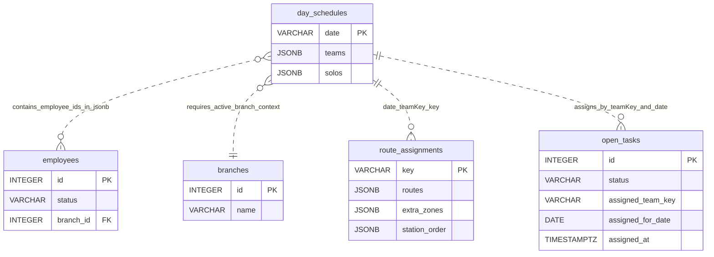

# دستور الكيان: الجداول اليومية (Day Schedules Domain Constitution)

> **الحالة (Status):** Active Draft / Authoritative  
> **المرجع الأعلى للكيان `day_schedules` في النظام.** تم إعداده بناءً على تحليل هجرات قاعدة البيانات، مسارات الـ API، واجهة جدولة الفرق، ودستور التخطيط التشغيلي.

---

## 1. هوية الكيان (Entity Identity)

- **الاسم العربي:** الجداول اليومية
- **الاسم الإنجليزي:** Day Schedule
- **اسم الجدول:** `day_schedules`
- **الوصف:** الجدول اليومي التشغيلي الذي يحدد الفرق الميدانية وفرق الطوارئ لكل يوم. يمثل المصدر الأولي لكل العمليات اللاحقة في التخطيط، مثل أهداف التسويق، المهام المسندة، توزيع المسارات، والزيارات.
- **الجداول المرتبطة برمجياً وتشغيلياً:** `open_tasks`, `route_assignments`, `employees`, `branches`
- **الأهمية والأمان:** كيان تشغيلي حاكم ليوم العمل. أي تعديل خاطئ عليه قد يغير نطاق المهام والأهداف والزيارات الناتجة لاحقاً. الجدول لا يملك حالياً أعمدة تدقيق مثل `created_by` أو `updated_at`، ولا توجد آلية حذف ناعم موثقة له؛ الحذف أو الاستبدال يجب أن يعامل كعملية عالية الأثر.

---

## 2. الجدول والحقول (Table & Field Dictionary)

يحتوي الجدول التالي على الوصف التفصيلي للحقول الثلاثة فقط في جدول `day_schedules` كما تظهر في الهجرة `001_core_tables.sql` ومسار الحفظ `packages/api/routes/schedules.ts`. الحقول `teams` و`solos` مخزنة كـ `JSONB` ولا تملك مفاتيح أجنبية فعلية داخل قاعدة البيانات.

| الحقل (Field) | النوع (SQL Type) | NULL? | DEFAULT | Constraints | الوصف والشرح بالعربية | مثال واقعي (Example) |
|---|---|---|---|---|---|---|
| `date` | `VARCHAR(50)` | ❌ | — | `PRIMARY KEY` | تاريخ اليوم التشغيلي، وهو المفتاح الأساسي الوحيد للجدول. يستخدمه الـ API في `GET /schedules/:date` و`PUT /schedules/:date`. الصيغة العملية المتوقعة من الواجهة هي `YYYY-MM-DD`، لكن قاعدة البيانات لا تفرض `CHECK` على الصيغة. | `"2026-05-28"` |
| `teams` | `JSONB` | ✅ | `'[]'` | — | مصفوفة فرق قياسية من نوع `TeamSlot`. كل عنصر يمثل فريقاً ميدانياً عادياً ويجب برمجياً أن يحتوي `supervisor` و`technician`. الحقل الداخلي `telemarketers` مصفوفة اختيارية من معرفات موظفين، و`trainee` معرف موظف اختياري أو `null`. كل القيم الداخلية هي FK منطقية إلى `employees.id` فقط، وليست FK فعلية. | `[{"supervisor":12,"technician":15,"telemarketers":[20,21],"trainee":30}]` |
| `solos` | `JSONB` | ✅ | `'[]'` | — | مصفوفة فرق طوارئ من نوع `EmergencySlot`. كل عنصر يمثل خانة طوارئ ويجب برمجياً أن يحتوي `technician`. يمكن أن يحتوي `telemarketers` كمصفوفة اختيارية و`trainee` كمعرف اختياري أو `null`. لا توجد قيود `CHECK` في قاعدة البيانات لضمان شكل JSON أو صحة المعرفات. | `[{"technician":18,"telemarketers":[22],"trainee":null}]` |

### 2.1 بنية `teams` الداخلية

```json
[
  {
    "supervisor": 12,
    "technician": 15,
    "telemarketers": [20, 21],
    "trainee": 30
  }
]
```

- **`supervisor`:** رقم صحيح موجب يمثل `employees.id` لموظف نوع خانته `SUPERVISOR`.
- **`technician`:** رقم صحيح موجب يمثل `employees.id` لموظف نوع خانته `TECHNICIAN`.
- **`telemarketers`:** مصفوفة أرقام صحيحة موجبة لموظفين نوع خانتهم `TELEMARKETER`. الحقل اختياري، والغياب يعامل كمصفوفة فارغة.
- **`trainee`:** رقم صحيح موجب لموظف نوع خانته `TRAINEE` أو قيمة فارغة. الكود يمنع استخدام `trainees` ويمنع أن يكون `trainee` مصفوفة.

### 2.2 بنية `solos` الداخلية

```json
[
  {
    "technician": 18,
    "telemarketers": [22],
    "trainee": null
  }
]
```

- **`technician`:** رقم صحيح موجب يمثل `employees.id` لفني الطوارئ، وهو الحقل الإجباري الوحيد في خانة الطوارئ.
- **`telemarketers`:** مصفوفة اختيارية من معرفات المسوقين الهاتفيين.
- **`trainee`:** معرف متدرب اختياري أو `null`.
- **حدود قاعدة البيانات:** `JSONB` يقبل أي JSON صالح ما لم يمر عبر API التحقق؛ لذلك الحماية الفعلية في الكود وليست في السكيما.

---

## 3. القيود والقواعد (Constraints & Business Rules)

### 3.1 قيود المستوى البرمجي وقاعدة البيانات (Database Constraints)

- **Primary Key:** الحقل `date` هو المفتاح الأساسي الوحيد في جدول `day_schedules`.
- **Foreign Keys:** لا توجد مفاتيح أجنبية فعلية داخل الجدول. معرفات الموظفين داخل `teams` و`solos` هي روابط منطقية فقط إلى `employees.id`.
- **Unique Constraints:** لا يوجد قيد فريد مستقل غير `PRIMARY KEY` على `date`.
- **Check Constraints:** لا يوجد `CHECK` لصيغة `date`، ولا يوجد `CHECK` لشكل `teams` أو `solos`.
- **Indexes:** لا يظهر فهرس خاص للجدول في الهجرات المرجعية غير الفهرس الضمني للمفتاح الأساسي.
- **Legacy `schedules`:** لم يظهر جدول `schedules` في `001_core_tables.sql` أو في بحث السكيما المرجعي ضمن هذا التحليل. مسار الحفظ الحالي يكتب مباشرة في `day_schedules`.

### 3.2 قواعد العمل البرمجية والتشغيلية (Business Rules)

| الرمز (Code) | القاعدة التشغيلية (Business Rule) | المصدر البرمجي (Source) | الشرح والتفصيل والضوابط المطبقة |
|---|---|---|---|
| **PL-R001** | لا يمكن حفظ جدول فرق بدون فرع فعّال | `packages/api/routes/schedules.ts` | عند `PUT /schedules/:date` يقرأ الخادم `actingBranchId` أو `scope.branchId`. إذا لم يوجد فرع، يرفض الحفظ برسالة: `يجب تحديد فرع فعال قبل حفظ جدول الفرق`. |
| **PL-R002** | كل فريق قياسي يجب أن يحتوي مشرفاً وفنياً | `packages/api/routes/schedules.ts` | لكل عنصر في `teams`، يجب أن يكون `supervisor` و`technician` أرقام موظفين صحيحة وموجبة. غياب أي منهما يؤدي إلى `400`. |
| **PL-R003** | خانة الطوارئ لا تحفظ بدون فني | `packages/api/routes/schedules.ts` | لكل عنصر في `solos`، يجب أن يكون `technician` معرف موظف صحيحاً وموجباً. `trainee` و`telemarketers` اختياريان. |
| **PL-R004** | الموظف يجب أن يكون نشطاً ومؤهلاً للظهور | `packages/api/routes/schedules.ts`, `packages/api/routes/employees.ts` | الحفظ يتحقق من `employees.status = 'active'` ومن `canAppearInSchedule = true`. قائمة الواجهة تأتي من `/employees/schedule-pool` بعد فلترة الموظفين بهذه الشروط. |
| **PL-R005** | لا يجوز خلط موظف من فرع آخر | `packages/api/routes/schedules.ts`, `packages/api/routes/employees.ts` | عند الحفظ تتم مقارنة `employee.branchId` مع الفرع الفعّال. أي اختلاف يرفض الطلب. endpoint `schedule-pool` يعيد موظفي الفرع المستهدف فقط. |
| **PL-R006** | الموظف الواحد لا يمكن أن يظهر في أكثر من موضع | `packages/api/routes/schedules.ts`, `TeamScheduler.tsx` | الخادم يجمع كل التعيينات في `teams` و`solos` ثم يمنع تكرار نفس `employee.id`. الواجهة أيضاً تخفي الموظف من قائمة المتاحين بعد اختياره. |
| **PL-R007** | جدول الفرق هو مصدر الأهداف اللاحقة | `packages/api/routes/planning.ts`, `planningMarketingTargets.ts`, `routeAssignments.ts` | أهداف التسويق وتوزيع المسارات تعتمد على `date` و`teamKey` الناتجين عن جدول اليوم. الفريق `team_0` أو `solo_0` لا يكون ذا معنى تشغيلياً دون جدول يوم محفوظ. |
| **PL-R008** | حساب الحمل يرحّل المهام المؤهلة إلى `assigned` | `packages/api/routes/planning.ts`, `assignedTasks.ts` | عند حساب `GET /planning/marketing-targets` بوضع `planning` يستدعي الخادم `syncAssignedTasks`، فيتم تحديث المهام المؤهلة في `open_tasks` باستخدام `assigned_team_key`, `assigned_for_date`, و`assigned_at`. |
| **DS-R009** | `JSONB` لا يخضع لـ FK validation داخل قاعدة البيانات | `001_core_tables.sql`, `packages/api/routes/schedules.ts` | هذه فجوة معروفة: قاعدة البيانات لا تمنع حفظ معرف موظف غير موجود داخل `teams` أو `solos` إذا تم تجاوز API أو تعطلت طبقة التحقق. |
| **DS-R010** | تسجيل `created_at` غير مطبق حالياً على `day_schedules` | `001_core_tables.sql`, `packages/api/routes/schedules.ts` | القاعدة المطلوبة للتحقق: عند الحفظ لا يوجد `created_at` في `day_schedules` ولا يظهر جدول `schedules` legacy في السكيما المرجعية. الكود الحالي يستخدم `INSERT INTO day_schedules (date, teams, solos)` فقط. |
| **DS-R011** | نوع خانة الموظف يجب أن يطابق الدور المحفوظ | `packages/api/routes/schedules.ts` | `supervisor` يتطلب `teamSlotType = SUPERVISOR`، و`technician` يتطلب `TECHNICIAN`، و`telemarketer` يتطلب `TELEMARKETER`، و`trainee` يتطلب `TRAINEE`. |
| **DS-R012** | شكل payload يجب أن يكون مصفوفتين | `packages/api/routes/schedules.ts` | `teams` و`solos` يجب أن يكونا مصفوفتين. أي عنصر فريق أو طوارئ يجب أن يكون object وليس array. |
| **DS-R013** | `trainee` مفرد وليس قائمة | `packages/api/routes/schedules.ts` | الكود يرفض `team.trainee` إذا كانت مصفوفة، ويرفض الحقل القديم أو الخاطئ `team.trainees`. |

---

## 4. العلاقات (Relationships)

### 4.1 مخطط العلاقات الكيانية (Entity Relationship Map)



### 4.2 تفاصيل الجداول المرتبطة

| الجدول المرتبط | نوع العلاقة | سلوك الحذف (ON DELETE) | الوصف التشغيلي |
|---|---|---|---|
| `employees` | `N:M` منطقية عبر `JSONB` | — | الحقول الداخلية `teams[].supervisor`, `teams[].technician`, `teams[].telemarketers[]`, `teams[].trainee`, و`solos[]` تشير إلى `employees.id` منطقياً فقط. لا يوجد FK فعلي بسبب التخزين داخل `JSONB`. |
| `branches` | `N:1` سياقية | — | جدول اليوم لا يحتوي `branch_id`، لكن الحفظ والقراءة التشغيلية يفترضان فرعاً فعّالاً من سياق المصادقة أو ترويسة الفرع. هذا يعني أن `date` وحده قد لا يكفي لو كان النظام متعدد الفروع في نفس اليوم. |
| `open_tasks` | `1:N` منطقية | — | المهام ترتبط بجدول اليوم عبر `assigned_team_key` مثل `team_0` أو `solo_0` و`assigned_for_date`. الفهرس `open_tasks_assigned_daily_idx` يدعم الاستعلام عن المهام المسندة لفريق في تاريخ محدد. |
| `route_assignments` | `1:N` منطقية عبر مفتاح مركب | — | مفتاح `route_assignments.key` يبنى عملياً بصيغة `{date}_{teamKey}` مثل `2026-05-28_team_0`. هذا يربط الفريق اليومي بمساراته ومناطقه وترتيب المحطات. |

### 4.3 علاقة `open_tasks`

- عند حساب الأهداف أو حفظ توزيع المسار، يستدعي النظام `syncAssignedTasks`.
- الحقول الحاكمة في `open_tasks` هي:
  - `assigned_team_key`: مفتاح الفريق مثل `team_0` أو `solo_0`.
  - `assigned_for_date`: تاريخ الجدولة اليومي.
  - `assigned_at`: وقت حدوث الإسناد.
- لا يوجد FK من `open_tasks.assigned_team_key` إلى `day_schedules` لأن مفتاح الفريق غير مخزن كصف مستقل، بل مشتق من ترتيب العناصر داخل `teams` و`solos`.

### 4.4 علاقة `route_assignments`

- `route_assignments.key` هو الرابط العملي مع جدول اليوم.
- الصيغة المعتمدة تشغيلياً: `{date}_{teamKey}`.
- مثال:
  - `date = "2026-05-28"`
  - `teamKey = "team_0"`
  - `key = "2026-05-28_team_0"`
- الحقول المرتبطة بالمسار:
  - `routes`
  - `extra_zones`
  - `station_order` حسب الهجرة `094_route_assignment_station_order.sql` والكود الحالي في `routeAssignments.ts`.

---

## 5. آلة الحالات (State Machine)

لا يملك جدول `day_schedules` حقل حالة داخل قاعدة البيانات. الحالة التشغيلية الأساسية هي وجود السجل أو عدم وجوده.

```
[draft / غير محفوظ]
        │
        │ PUT /schedules/:date
        ▼
[saved / محفوظ]
        │
        │ PUT /schedules/:date مرة أخرى
        ▼
[saved / محدث]
```

### 5.1 وصف الحالات المعتمدة

- **`draft`:** حالة واجهة فقط. توجد في `TeamScheduler.tsx` عندما يضيف المستخدم فرقاً أو طوارئ قبل الضغط على حفظ. لا يوجد سجل مضمون في قاعدة البيانات.
- **`saved`:** حالة وجود سجل في `day_schedules` لتاريخ محدد. يتم الوصول لها بعد نجاح `PUT /schedules/:date`.
- **`saved / updated`:** نفس السجل محفوظ سابقاً وتم تحديثه عبر `ON CONFLICT (date) DO UPDATE`.
- **`absent`:** لا يوجد سجل في قاعدة البيانات. الكود الحالي يعيد `{ date, teams: [], solos: [] }` بترميز `200` عند `GET`، وليس `404`.

### 5.2 حدود آلة الحالات

لا توجد حالة اعتماد نهائي، أو إغلاق يوم، أو أرشفة، أو حذف ناعم. أي تعديل بعد الحفظ يستبدل `teams` و`solos` مباشرة دون سجل تاريخي.

---

## 6. صلاحيات الوصول (Permission Matrix)

الصلاحية الدستورية لهذا الكيان هي `planning.manage` بنطاق `BRANCH`. لا يوجد نطاق `ASSIGNED` لأن الجدولة تخص الفرع كاملاً وليس موظفاً بعينه.

| المفتاح (Permission Key) | الاسم العربي للصلاحية | النطاقات المدعومة (Scopes) | الوصف الأمني |
|---|---|---|---|
| `planning.manage` | إدارة التخطيط وجدولة الفرق | `BRANCH` | يتيح لمدير الفرع تحميل قائمة الموظفين المؤهلين، حفظ جدول اليوم، حساب أهداف التسويق، وتوزيع العمل ضمن فرعه. |

### 6.1 منطق النطاق

1. **نطاق الفرع `BRANCH`:**
   - يجب وجود فرع فعّال عند حفظ الجدول.
   - يجب أن ينتمي كل موظف مستخدم في الجدول إلى نفس الفرع.
   - `/employees/schedule-pool` يتحقق من الصلاحية على الفرع المستهدف.
2. **نطاق `ASSIGNED`:**
   - غير مدعوم في الجدولة اليومية.
   - الموظف الفردي لا يملك جدول اليوم لمجرد ظهوره داخله.
3. **ملاحظة تنفيذية مهمة:**
   - `packages/api/routes/schedules.ts` لا يضع حالياً `requirePermission('planning.manage')` مباشرة على `GET /schedules/:date` و`PUT /schedules/:date` في الكود المرجعي المقروء. هذا تضارب أمني يجب التعامل معه كفجوة، لأن الدستور يتطلب `planning.manage`.

---

## 7. عقد API (API Contract)

### 7.1 قائمة المسارات (Endpoints)

| الطريقة | المسار (Path) | الصلاحية المطلوبة | وصف السلوك والوظيفة |
|---|---|---|---|
| **GET** | `/api/schedules/:date` | `planning.manage` دستورياً، غير مفروض مباشرة في الكود الحالي | جلب جدول يوم محدد من `day_schedules`. إذا لم يوجد سجل، يعيد الكود الحالي جدولاً فارغاً. |
| **PUT** | `/api/schedules/:date` | `planning.manage` دستورياً، غير مفروض مباشرة في الكود الحالي | إنشاء أو تحديث جدول اليوم عبر upsert بعد التحقق من الفرع، أهلية الموظفين، عدم التكرار، وتطابق نوع الخانة. |
| **GET** | `/api/employees/schedule-pool` | `planning.manage` | جلب قائمة الموظفين النشطين المؤهلين للظهور في الجدولة ضمن الفرع. |
| **GET** | `/api/planning/marketing-targets?date=&teamKey=` | `planning.manage` | حساب أهداف التسويق لفريق وتاريخ محددين، وقد يرحل المهام المؤهلة إلى `assigned` في وضع `planning`. |

### 7.2 `GET /api/schedules/:date`

#### 7.2.1 معلمات الطلب

| المعلمة | المكان | النوع | إلزامية | الوصف |
|---|---|---|---|---|
| `date` | Path | `string` | نعم | تاريخ اليوم التشغيلي، متوقع بصيغة `YYYY-MM-DD`. |
| `X-Branch-Id` | Header | `integer` | نعم دستورياً | فرع العمل الفعّال. Swagger يذكره، لكن مسار `GET` الحالي لا يستخدمه مباشرة في الاستعلام. |

#### 7.2.2 استجابة النجاح عند وجود سجل

```json
{
  "date": "2026-05-28",
  "teams": [
    {
      "supervisor": 12,
      "technician": 15,
      "telemarketers": [20, 21],
      "trainee": 30
    }
  ],
  "solos": [
    {
      "technician": 18,
      "telemarketers": [22],
      "trainee": null
    }
  ]
}
```

#### 7.2.3 استجابة عدم وجود سجل

الكود الحالي يعيد `200` مع جدول فارغ:

```json
{
  "date": "2026-05-28",
  "teams": [],
  "solos": []
}
```

المتطلب الاختباري المذكور في هذا الدستور يطلب `404` في حالة عدم الوجود؛ لذلك تسجل هذه النقطة كتضارب بين السلوك الحالي والسلوك المرغوب.

### 7.3 `PUT /api/schedules/:date`

#### 7.3.1 هيكل الطلب

```json
{
  "teams": [
    {
      "supervisor": 12,
      "technician": 15,
      "telemarketers": [20, 21],
      "trainee": 30
    }
  ],
  "solos": [
    {
      "technician": 18,
      "telemarketers": [22],
      "trainee": null
    }
  ]
}
```

#### 7.3.2 قواعد التحقق في الطلب

- `teams` يجب أن تكون مصفوفة.
- `solos` يجب أن تكون مصفوفة.
- كل عنصر داخل `teams` و`solos` يجب أن يكون object.
- كل معرف موظف يجب أن يكون رقماً صحيحاً موجباً.
- لا يسمح بتكرار نفس الموظف في أكثر من خانة.
- كل فريق قياسي يجب أن يحتوي مشرفاً وفنياً.
- كل فريق طوارئ يجب أن يحتوي فنياً.
- كل موظف يجب أن يكون:
  - موجوداً في `employees`.
  - `status = active`.
  - `canAppearInSchedule = true`.
  - تابعاً للفرع الحالي.
  - نوع خانته مطابقاً للدور المحفوظ.

#### 7.3.3 استجابة النجاح

```json
{
  "date": "2026-05-28",
  "teams": [
    {
      "supervisor": 12,
      "technician": 15,
      "telemarketers": [20, 21],
      "trainee": 30
    }
  ],
  "solos": [
    {
      "technician": 18,
      "telemarketers": [22],
      "trainee": null
    }
  ]
}
```

#### 7.3.4 أمثلة أخطاء التحقق

- غياب الفرع الفعّال: `يجب تحديد فرع فعال قبل حفظ جدول الفرق`.
- غياب مشرف الفريق: `الفريق 1 يجب أن يضم مشرفاً`.
- غياب فني الطوارئ: `فريق الطوارئ 1 يجب أن يضم فنياً`.
- تكرار الموظف: `لا يمكن تكرار الموظف #12 في أكثر من خانة`.

---

## 8. حالات الاختبار الشاملة (Test Cases)

### 8.1 الاختبارات الوظيفية والتحقق (Functional Tests)

| الرمز | سيناريو الفحص والاختبار | الطريقة والمسار | المدخلات المرسلة | السلوك المتوقع والاستجابة | ملاحظات تشغيلية |
|---|---|---|---|---|---|
| **TC-01** | حفظ جدول صحيح | `PUT /api/schedules/2026-05-28` | `teams` تحتوي مشرفاً وفنياً مؤهلين، و`solos` تحتوي فنياً مؤهلاً | `200` مع السجل المحفوظ من `day_schedules` | يجب تمرير فرع فعّال وأن يكون كل الموظفين من نفس الفرع. |
| **TC-02** | محاولة حفظ فريق قياسي بدون مشرف | `PUT /api/schedules/2026-05-28` | `teams[0].supervisor = null`, و`teams[0].technician` صحيح | `400` ورسالة تفيد بأن الفريق يجب أن يضم مشرفاً | يغطي `PL-R002`. |
| **TC-03** | محاولة حفظ فريق طوارئ بدون فني | `PUT /api/schedules/2026-05-28` | `solos[0].technician = null` | `400` ورسالة تفيد بأن فريق الطوارئ يجب أن يضم فنياً | يغطي `PL-R003`. |
| **TC-04** | موظف مكرر في فريقين أو خانتين | `PUT /api/schedules/2026-05-28` | نفس `employee.id` يظهر في `teams[0].supervisor` و`teams[1].technician` أو أي موضعين | `400` ورسالة عدم السماح بتكرار الموظف | يغطي `PL-R006`. |
| **TC-05** | موظف من فرع آخر | `PUT /api/schedules/2026-05-28` | معرف موظف نشط لكنه `branchId` مختلف عن الفرع الفعّال | `400` ورسالة أن الموظف لا يتبع الفرع الحالي | يغطي `PL-R005`. |
| **TC-06** | جلب جدول غير موجود | `GET /api/schedules/2099-01-01` | لا يوجد سجل بهذا التاريخ | المتوقع دستورياً: `404`. السلوك الحالي في الكود: `200` مع `{date, teams: [], solos: []}` | هذا اختبار تضارب يجب أن يفشل حالياً أو يعدل الكود ليطابق الدستور. |

### 8.2 اختبارات الصلاحيات والنطاقات (Permission Scopes Tests)

| رتبة المستخدم | الصلاحية المفحوصة | نطاق الصلاحية (Scope) | السلوك المتوقع والاستجابة |
|---|---|---|---|
| **Branch Manager** | `planning.manage` | `BRANCH` | يستطيع تحميل `schedule-pool` وحفظ جدول يوم لفرعه فقط. |
| **Branch Manager لفرع آخر** | `planning.manage` | `BRANCH` | يمنع من استخدام موظفين لا يتبعون فرعه في جدول اليوم. |
| **Technician / Employee** | `planning.manage` | `ASSIGNED` غير مدعوم | لا يجب أن يملك إدارة جدول الفرع لمجرد ظهوره في فريق اليوم. |
| **مستخدم بلا فرع فعّال** | `planning.manage` | `NONE` | يرفض الحفظ برسالة طلب فرع فعّال. |

---

## 9. الثغرات والتضاربات المكتشفة (Gaps & Contradictions)

- **GAP-DS-001:** `teams` و`solos` داخل `JSONB` لا يملكان FK validation إلى `employees.id`. يمكن نظرياً حفظ معرفات غير موجودة إذا تم تجاوز API أو إدخال البيانات مباشرة في قاعدة البيانات، مما يهدد نزاهة الجدولة.

- **GAP-DS-002:** لا يوجد `created_by` أو `updated_at` أو `created_at` على `day_schedules`. لا توجد وسيلة تدقيق لمعرفة من حفظ الجدول أو متى تم تحديثه، مع أن الجدول يؤثر على المهام والزيارات والأهداف.

- **GAP-DS-003:** `solos` لا يملك `CHECK constraint` أو schema validation داخل قاعدة البيانات. يمكن حفظ أي JSON صالح تقنياً، بما في ذلك بنية لا تحتوي `technician` إذا لم تمر عبر الكود.

- **GAP-DS-004:** مسارا `GET /schedules/:date` و`PUT /schedules/:date` لا يفرضان `requirePermission('planning.manage')` مباشرة في ملف `packages/api/routes/schedules.ts` المقروء. الدستور والصلاحية التشغيلية يتطلبان هذه الحماية، لكن التطبيق الحالي غير مؤكد أو غير مكتمل في هذا الملف.

- **GAP-DS-005:** جدول `day_schedules` لا يحتوي `branch_id` رغم أن القواعد التشغيلية فرعية. لأن `date` هو المفتاح الأساسي الوحيد، قد يحدث تضارب إذا احتاج أكثر من فرع إلى جدول مستقل لنفس التاريخ ضمن نفس قاعدة البيانات.

- **GAP-DS-006:** السلوك الحالي لـ `GET /schedules/:date` عند عدم وجود سجل يعيد `200` مع جدول فارغ، بينما حالة الاختبار المطلوبة دستورياً تطلب `404`. يجب حسم السلوك المرغوب وتعديل الكود أو الاختبار.

- **GAP-DS-007:** قاعدة تسجيل `created_at` عند الحفظ غير مطبقة. لا يوجد جدول `schedules` legacy ظاهر في السكيما المرجعية، ولا يوجد عمود `created_at` في `day_schedules`.

---

## 10. تاريخ التغييرات (Schema Changelog)

| تاريخ الهجرة | ملف الهجرة (Migration File) | طبيعة التعديل وهدف التأثير الفني والتشغيلي على الجدول |
|---|---|---|
| **غير مؤكد** | `001_core_tables.sql` | إنشاء جدول `day_schedules` بثلاثة حقول: `date` كمفتاح أساسي، و`teams` كـ `JSONB DEFAULT '[]'`، و`solos` كـ `JSONB DEFAULT '[]'`. كما أنشأت الهجرة جدول `route_assignments` المرتبط تشغيلياً بتوزيع مسارات الفرق. |
| **غير مؤكد** | `077_expand_open_tasks.sql` | إضافة `assigned_team_key` إلى `open_tasks` لربط المهام المفتوحة بالفريق اليومي الناتج عن الجدولة، مثل `team_0` أو `solo_0`. |
| **غير مؤكد** | `094_route_assignment_station_order.sql` | إضافة `station_order` إلى `route_assignments` لترتيب محطات أو مناطق الفريق ضمن توزيع المسار. هذه الهجرة ليست من قائمة الملفات الإلزامية لكنها ظهرت في السكيما والكود المرتبطين بالعلاقة. |
| **غير مؤكد** | `108_open_tasks_assigned_phase.sql` | إضافة `assigned_for_date` و`assigned_at` إلى `open_tasks`، وإنشاء فهرس `open_tasks_assigned_daily_idx` على `assigned_team_key`, `assigned_for_date`, `status` للمهام بحالة `assigned`. |
