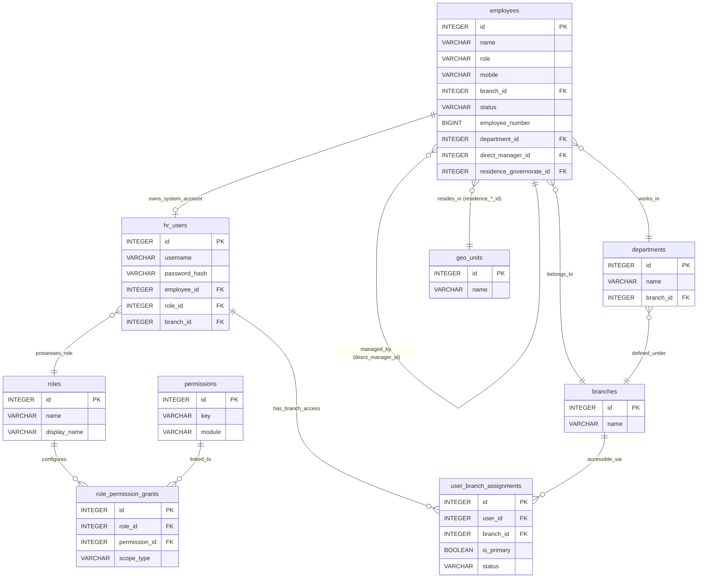

# دستور الكيان: الموظفون والمستخدمون (Employees & Users Domain Constitution)

> **الحالة (Status):** Authoritative / Active  
> **المرجع الأعلى والتأسيسي لبيانات الموارد البشرية (HR)، حسابات الوصول للأنظمة (RBAC)، وتخصيص الصلاحيات متعددة الفروع (Multi-branch Assignments).**

---

## 1. هوية الكيان (Entity Identity)

- **الاسم العربي:** الموظفون / الحسابات التشغيلية
- **الاسم الإنجليزي:** Employees & Users
- **الجداول الرئيسية:**
  1. `employees` (الملفات الفنية والبيانات الشخصية والمهنية الفنية للموظفين)
  2. `hr_users` (حسابات تسجيل الدخول والربط البرمجي بالأدوار)
  3. `user_branch_assignments` (تخصيص الفروع وتعدد صلاحيات الموظف)
  4. `role_permission_grants` (مصفوفة صلاحيات الأدوار ونطاقاتها الأمنية)
- **الوصف:** الكيان المحوري الحاكم لجميع الصلاحيات والعمليات التشغيلية في Golden CRM. يمثل الموظف الهوية التشغيلية والفيزيائية للمستخدم، وبدونه لا يمكن ترحيل أو إسناد أي سجل ميداني أو إداري (زيارات، اتصالات، عقود، صيانة، تحصيلات مالية).
- **الأهمية والأمان:** يمثل العمود الفقري لنظام الحماية والأمان وعزل الفروع (Branch-based Authorization & RBAC). أي خطأ في إسناد الفروع للموظفين أو صلاحيات الأدوار قد يؤدي إلى تسريب كامل لبيانات العملاء والعقود عبر الفروع المختلفة.

---

## 2. معجم الجداول والحقول (Table & Field Dictionary)

### 2.1 جدول الموظفين `employees`
يخزن تفاصيل السير الذاتية والبيانات المهنية والتصنيفات التشغيلية للموظفين.

| الحقل (Field) | النوع (SQL Type) | NULL? | DEFAULT | Constraints | الوصف والشرح بالعربية | مثال واقعي (Example) |
|---|---|---|---|---|---|---|
| `id` | `INTEGER` | ❌ | `nextval()` | `PRIMARY KEY` | المعرف الفريد للموظف | `14` |
| `name` | `VARCHAR(255)` | ❌ | — | — | الاسم الكامل للموظف | `"عمر ياسين الفيصل"` |
| `role` | `VARCHAR(50)` | ✅ | — | `CHECK (role IN ('supervisor', 'technician', 'telemarketer', 'trainee'))` | الدور التشغيلي المرتبط بمهام السchedules | `"technician"` (فني ميداني) |
| `mobile` | `VARCHAR(50)` | ❌ | — | — | رقم الاتصال الأساسي (فريد كانونياً) | `"0933112233"` |
| `branch` | `VARCHAR(255)` | ✅ | — | — | حقل الفرع النصي القديم (Legacy) | `"فرع حمص"` |
| `branch_id` | `INTEGER` | ✅ | — | `FK → branches(id) ON DELETE SET NULL` | الفرع الإداري الرئيسي للموظف | `3` (فرع حمص) |
| `status` | `VARCHAR(50)` | ❌ | `'active'` | `CHECK (status IN ('active', 'vacation', 'suspended', 'terminated'))` | الحالة التشغيلية للموظف | `"active"` |
| `job_title` | `VARCHAR(255)` | ✅ | — | — | المسمى الوظيفي الإداري | `"فني صيانة فلاتر"` |
| `avatar` | `TEXT` | ✅ | — | — | رابط الصورة الشخصية للموظف | `"/uploads/avatars/u14.jpg"`|
| `employee_number` | `BIGINT` | ❌ | `nextval()` | `UNIQUE INDEX` | الرقم الوظيفي التعريفي للموظف | `1005` |
| `first_name` | `VARCHAR(255)` | ✅ | — | — | الاسم الأول للموظف | `"عمر"` |
| `father_name` | `VARCHAR(255)` | ✅ | — | — | اسم الأب | `"ياسين"` |
| `last_name` | `VARCHAR(255)` | ✅ | — | — | اسم العائلة (الكنية) | `"الفيصل"` |
| `birth_date` | `DATE` | ✅ | — | — | تاريخ الميلاد | `1994-08-14` |
| `gender` | `VARCHAR(20)` | ✅ | — | — | الجنس | `"male"` |
| `marital_status` | `VARCHAR(100)` | ✅ | — | — | الحالة الاجتماعية | `"married"` |
| `military_service`| `VARCHAR(100)` | ✅ | — | — | حالة الخدمة العسكرية | `"منهي"` |
| `residence_governorate_id`| `INTEGER` | ✅ | — | `FK → geo_units(id) ON DELETE SET NULL` | المحافظة | `1` (دمشق) |
| `residence_region_id`| `INTEGER` | ✅ | — | `FK → geo_units(id) ON DELETE SET NULL` | المنطقة الإدارية | `2` (حمص المدينة) |
| `residence_sub_area_id`| `INTEGER` | ✅ | — | `FK → geo_units(id) ON DELETE SET NULL` | الناحية الجغرافية | `3` (الوعر) |
| `residence_neighborhood_id`| `INTEGER` | ✅ | — | `FK → geo_units(id) ON DELETE SET NULL` | الحي السكني | `12` (الوعر القديم) |
| `detailed_address`| `TEXT` | ✅ | — | — | العنوان السكني التفصيلي | `"شارع الخراب، قرب دوار الوعر"`|
| `contacts` | `JSONB` | ❌ | `'[]'::jsonb`| — | مصفوفة أرقام وهواتف تواصل إضافية | `[{"type": "landline", "value": "031221144"}]`|
| `academic_qualification`| `VARCHAR(255)` | ✅ | — | — | المؤهل الدراسي الأكاديمي | `"معهد متوسط هندسة حواسيب"` |
| `specialization` | `VARCHAR(255)` | ✅ | — | — | التخصص الدراسي الفعلي | `"شبكات وصيانة أجهزة"` |
| `years_of_experience`| `INTEGER` | ✅ | — | — | سنوات الخبرة العملية السابقة | `4` |
| `driving_license`| `BOOLEAN` | ✅ | — | — | هل يمتلك رخصة قيادة؟ | `true` |
| `job_skills` | `TEXT` | ✅ | — | — | المهارات الفنية التفصيلية للموظف | `"صيانة مضخات مياه عالية الضغط..."`|
| `foreign_languages`| `JSONB` | ❌ | `'[]'::jsonb`| — | اللغات الأجنبية المتقنة ونسبة الإتقان | `[{"language": "English", "level": "medium"}]`|
| `hire_date` | `DATE` | ✅ | — | — | تاريخ التعيين والموافقة الرسمية | `2026-01-15` |
| `start_work_date` | `DATE` | ✅ | — | — | تاريخ بدء المباشرة الفعلية للعمل | `2026-01-20` |
| `contract_type` | `VARCHAR(100)` | ✅ | — | — | نوع العقد المبرم للموظف | `"دائم"` |
| `work_type` | `VARCHAR(100)` | ✅ | — | — | نمط الدوام والعمل المعتمد | `"full_time"` |
| `previous_employment`| `TEXT` | ✅ | — | — | الجهات والشركات السابقة التي عمل بها | `"شركة رويال للمقاولات..."` |
| `department_id` | `INTEGER` | ✅ | — | `FK → departments(id) ON DELETE SET NULL` | القسم الفعلي الملحق به داخل الفرع | `4` (قسم الصيانة) |
| `direct_manager_id`| `INTEGER` | ✅ | — | `FK → employees(id) ON DELETE SET NULL` | المدير المباشر للموظف (Self-reference) | `9` (معرف المهندس المسؤول) |
| `referrer_type` | `VARCHAR(50)` | ✅ | — | — | نوع الإحالة أو الترشيح للعمل | `"employee_referral"` |
| `source_channel` | `VARCHAR(100)` | ✅ | — | — | قناة التوظيف المستقطبة | `"referral"` |
| `referrer_name` | `VARCHAR(255)` | ✅ | — | — | اسم الشخص أو الموظف المحيل | `"سامر المحمد"` |
| `referral_notes` | `TEXT` | ✅ | — | — | ملاحظات وتوصيات الاستقطاب الفنية | `"ينصح بتعيينه للخبرة السابقة"`|
| `referral_entity_id`| `INTEGER` | ✅ | — | — | معرف كارت الإحالة المرتبط (إن وجد) | `45` |
| `created_at` | `TIMESTAMPTZ` | ✅ | `NOW()` | — | تاريخ الإنشاء الأوتوماتيكي بالداتابيز| `2026-01-15 08:30:00+00` |

---

### 2.2 جدول حسابات المستخدمين `hr_users`
يربط السجل الشخصي للموظف بحساب وصول تقني مشفر للنظام والأدوار.

| الحقل (Field) | النوع (SQL Type) | NULL? | DEFAULT | Constraints | الوصف والشرح بالعربية | مثال واقعي (Example) |
|---|---|---|---|---|---|---|
| `id` | `INTEGER` | ❌ | `nextval()` | `PRIMARY KEY` | المعرف الفريد لحساب المستخدم | `7` |
| `name` | `VARCHAR(255)` | ❌ | — | — | اسم العرض الخاص بالحساب | `"عمر ياسين الفيصل"` |
| `username` | `VARCHAR(100)` | ❌ | — | `UNIQUE` | اسم تسجيل الدخول البرمجي | `"omar.yassin"` |
| `password_hash`| `VARCHAR(255)` | ❌ | — | — | كلمة المرور المشفرة بـ Bcrypt | `"$2b$10$xyz..."` |
| `role` | `VARCHAR(100)` | ❌ | — | — | الدور النصي القديم للحساب | `"technician"` |
| `is_active` | `BOOLEAN` | ✅ | `TRUE` | — | هل الحساب مسموح له بالولوج؟ | `true` |
| `employee_id` | `INTEGER` | ✅ | — | `FK → employees(id) ON DELETE SET NULL` | الموظف المرتبط بهذا الحساب (1-to-1) | `14` |
| `role_id` | `INTEGER` | ✅ | — | `FK → roles(id) ON DELETE SET NULL` | الدور الأساسي الممنوح للحساب بالصلاحيات | `3` (دور فني الصيانة) |
| `branch_id` | `INTEGER` | ✅ | — | `FK → branches(id) ON DELETE SET NULL` | الفرع الحالي المنسوخ (LEGACY_COMPAT) | `3` (فرع حمص) |
| `created_at` | `TIMESTAMPTZ` | ✅ | `NOW()` | — | تاريخ إنشاء الحساب بالخلفية | `2026-01-15 09:00:00+00` |

---

### 2.3 جدول إسناد الفروع للمستخدمين `user_branch_assignments`
يحدد الفروع التي يُسمح للمستخدم بإدارتها أو استعراض بياناتها، مع تحديد الفرع الجاري الأساسي له.

| الحقل (Field) | النوع (SQL Type) | NULL? | DEFAULT | Constraints | الوصف والشرح بالعربية | مثال واقعي (Example) |
|---|---|---|---|---|---|---|
| `id` | `INTEGER` | ❌ | `nextval()` | `PRIMARY KEY` | المعرف الفريد للإسناد الجغرافي | `22` |
| `user_id` | `INTEGER` | ❌ | — | `FK → hr_users(id) ON DELETE CASCADE` | المستخدم المنسوب له الفرع | `7` |
| `branch_id` | `INTEGER` | ❌ | — | `FK → branches(id) ON DELETE CASCADE` | الفرع الممنوح الوصول إليه | `3` |
| `is_primary` | `BOOLEAN` | ❌ | `FALSE` | — | هل هذا هو الفرع الرئيسي الافتراضي له؟| `true` |
| `status` | `VARCHAR(32)` | ❌ | `'active'` | `CHECK (status IN ('active', 'inactive'))` | حالة التعيين الجغرافي للفرع | `"active"` |
| `created_at` | `TIMESTAMPTZ` | ❌ | `NOW()` | — | تاريخ بدء التعيين للفرع | `2026-01-15 09:05:00+00` |
| `updated_at` | `TIMESTAMPTZ` | ❌ | `NOW()` | — | تاريخ آخر تحديث للتعيين الفرعي | `2026-05-25 08:00:00+00` |

*نزاهة القيد الدائري:* يوجد قيد فريد مركّب `UNIQUE(user_id, branch_id)` يمنع تعيين نفس الفرع مرتين لنفس الموظف، بالإضافة إلى مؤشر فريد جزئي `UNIQUE INDEX ... WHERE is_primary = TRUE` يضمن وجود فرع رئيسي واحد فقط فعال للموظف في نفس اللحظة التشغيلية.

---

### 2.4 جدول منح نطاقات الأدوار `role_permission_grants`
يخزن تفاصيل الأدوار والصلاحيات الممنوحة لها ونطاق الوصول الأمني المعتمد لها.

| الحقل (Field) | النوع (SQL Type) | NULL? | DEFAULT | Constraints | الوصف والشرح بالعربية | مثال واقعي (Example) |
|---|---|---|---|---|---|---|
| `id` | `INTEGER` | ❌ | `nextval()` | `PRIMARY KEY` | المعرف الفريد لمنح الصلاحية | `105` |
| `role_id` | `INTEGER` | ❌ | — | `FK → roles(id) ON DELETE CASCADE` | الدور المستهدف بالمنح الصلاحياتي | `3` |
| `permission_id` | `INTEGER` | ❌ | — | `FK → permissions(id) ON DELETE CASCADE` | الصلاحية الفنية המקושרת | `42` (صلاحية تعديل الموظفين) |
| `scope_type` | `VARCHAR(16)` | ❌ | — | `CHECK (scope_type IN ('GLOBAL', 'BRANCH', 'ASSIGNED'))` | نطاق الحماية الأمني المطبق للوصول | `"BRANCH"` (فقط للفرع الحالي) |
| `created_at` | `TIMESTAMPTZ` | ❌ | `NOW()` | — | تاريخ إقران الصلاحية بالدور | `2026-01-15 09:10:00+00` |
| `updated_at` | `TIMESTAMPTZ` | ❌ | `NOW()` | — | تاريخ تعديل نطاق الصلاحية | `2026-05-25 08:00:00+00` |

---

## 3. القيود والقواعد التشغيلية (Database Constraints & Business Rules)

### BR-1: ضوابط هيكلية التبعية الإدارية والمدراء (Management Hierarchy Constraints)
يخضع تعيين المدير المباشر للموظف (`employees.direct_manager_id`) لثلاثة شروط صارمة يتم التحقق منها بالـ Controller في السيرفر قبل الحفظ:
1. **منع التبعية الذاتية (Anti Self-Reference):** يمنع النظام تماماً أن يكون الموظف مديراً لنفسه يدوياً:
   $$\text{direct\_manager\_id} \neq \text{employee.id}$$
2. **مطابقة الفرع الجغرافي (Branch Isolation):** يجب أن يتبع المدير المباشر لنفس الفرع المسجل للموظف:
   $$\text{manager.branch\_id} = \text{employee.branch\_id}$$
3. **التخصص والتبعية التشغيلية (Department Scope):** يجب أن يكون المدير المباشر المختار مدرجاً ضمن قائمة المدراء المعتمدين والمؤهلين لقسم الموظف الفعلي (`department_id`). يتم فحص ذلك عبر استعلام `listScopedEmployeeManagerCandidates`.

---

### BR-2: النزاهة الكانونية لأرقام الهواتف وحظر التكرار (Canonical Contacts & Duplicate Check)
يتبع الموظفون نظاماً صارماً لمنع الازدواجية والحماية من إنشاء سجلات وهمية:
1. **التحويل للنسخة الكانونية:** تُعالج مصفوفة أرقام الاتصال `contacts` رقم الهاتف الأساسي وتزيل كافة الرموز والمسافات والنصوص الزائدة وتحوله للصيغة الرقمية الموحدة (مثل: `0933112233`).
2. **منع التكرار المطلق (409 Conflict):** قبل تنفيذ عمليتي الـ POST أو PUT للموظف، يقوم السيرفر باستدعاء المستودع `findEmployeeDuplicateByContactNumbers` للبحث في أرقام جميع الموظفين النشطين وغير النشطين. وفي حال تطابق أي رقم للموظف الجديد مع موظف قائم، يُرفض الطلب فوراً ويرد السيرفر بخطأ نزاع مع معرف الموظف المطابق:
   $$\text{HTTP 409 Conflict} \longrightarrow \text{error: 'يوجد سجل موظف مطابق لأحد أرقام التواصل مسبقاً'}$$

---

### BR-3: التناسق الجغرافي السكني للموظف (Address Geo Consistency)
لكي يتم حفظ العنوان الجغرافي للموظف بالـ DB، يفرض السيرفر نزاهة جغرافية فيزيائية:
- يجب أن يتم استعلام الفئات الجغرافية من جدول `geo_units` ويحظر إدخال نصوص حرة بموقع السكن.
- يُلزم السيرفر بحد أدنى تحديد: **المحافظة (`residence_governorate_id`) + المنطقة الإدارية (`residence_region_id`) + الناحية (`residence_sub_area_id`)**، بينما يكون الحي السكني (`residence_neighborhood_id`) اختيارياً. غياب أي وحدة من الوحدات الثلاث الأساسية يُفشل المعاملة فوراً بخطأ `400 تعذر قراءة العنوان الجغرافي المحدد`.

---

### BR-4: قيد الفرع الرئيسي وتطابق التوافقية القديمة (UBA Sync & Legacy Mirror)
1. **الفرع الجاري الحركي:** يتم تحديد فرع الوصول الافتراضي للمستخدم عبر جدول `user_branch_assignments` (الحقل `is_primary = TRUE`).
2. **وساطة التوافقية القديمة (Legacy Compatibility Mirror):** نظراً لوجود أجزاء برمجية قديمة بالـ CRM تستهلك حقل `hr_users.branch_id` مباشرة، يطبق تابع الخدمة `reconcilePrimaryBranch` نظام المزامنة اللحظية (Trigger-like transaction). عند تعيين أو تحديث فرع مستخدم رئيسي بـ `user_branch_assignments`، يقوم السيرفر بترحيل القيمة أوتوماتيكياً وتحديث الحقل `branch_id` بجدول `hr_users` بداخل نفس العملية (Transaction) لضمان اتساق الصلاحيات القديمة والجديدة.

---

### BR-5: الاستنتاج التلقائي للدور الفني من المسمى الوظيفي
عند جلب الموظف لجدول الصيانة والزيارات الميدانية، يُقاد تصنيف `employees.role` (الذي يُشتق وظيفياً) بجدول المبيعات الميدانية والتسويق عبر فئات الأدوار المعتمدة:
- يُترجم المسمى الوظيفي "متدرب" تلقائياً بالخلفية لـ `role = 'trainee'`.
- يُترجم "فني تركيب" أو "فني صيانة" تلقائياً لـ `role = 'technician'`.
- يُترجم "مسؤول تسويق" تلقائياً لـ `role = 'telemarketer'`.
تُسهل هذه القيود توزيع المهام أوتوماتيكياً وتصفية موظفي الميدان بجدول `schedule-pool`.

---

## 4. العلاقات البرمجية والفيزيائية (Entity Relationships Diagram)

يوضح المخطط التالي الهيكلية الداخلية لإقران الموظف بحساب النظام الصلاحياتي، وعلاقة التبعية للمدير المباشر جغرافياً ومهنياً:



---

## 5. آلة الحالات التشغيلية (Lifecycle State Machine)

تتحرك حالة الموظف الإدارية والتشغيلية لتحديد إمكانية ظهوره بجدول التكليفات الميدانية أو منعه من الوصول للنظام:

```
          ┌──────────────────────────────────────────────┐
          │                  [ active ]                  │◄──────────────┐
          └──────────────────────────────────────────────┘               │
             │                    │                    │                 │
             │ إجازة              │ توقيف مؤقت         │ إنهاء خدمة      │ عودة للخدمة
             ▼                    ▼                    ▼                 │
     ┌──────────────┐     ┌──────────────┐     ┌──────────────┐          │
     │  [vacation]  │     │ [suspended]  │     │ [terminated] │ ─────────┘
     └──────────────┘     └──────────────┘     └──────────────┘ (محظور للأبد بالداتابيز)
```

- **حالة vacation (إجازة):** حساب النظام يظل فعالاً، لكن يُستثنى من الترشيح لمهام التخطيط والميدان أوتوماتيكياً.
- **حالة suspended (موقوف مؤقت):** يُحظر الحساب تلقائياً من تسجيل الدخول للـ API، وتتوقف صلاحياته الأمنية فوراً.
- **حالة terminated (منتهي الخدمة):** حالة نهائية مغلقة لا يمكن تعديلها أو الحذف منها لحماية العقود التاريخية المنسوبة للموظف.

---

## 6. صلاحيات الوصول والمصفوفة الأمنية (Permission Matrix)

يتم تنظيم صلاحيات الموظفين وإدارة حسابات الوصول بشكل صارم، مع فلترة السجلات ديناميكياً وفق نطاق الصلاحيات الجغرافي المصاحب للموظف بالـ DB:

| مفتاح الصلاحية (Key) | الوصف بالعربية | النطاق المسموح (Scope) | التأثير وسلوك الفلترة المطبق بالخلفية |
|---|---|---|---|
| `employees.view_list` | استعراض قائمة الموظفين | GLOBAL / BRANCH | **GLOBAL:** استرجاع موظفي كافة فروع الشركة بالكامل.<br>**BRANCH:** يقتصر الـ API على فلترة وإرجاع موظفي الفرع المعتمد الجاري فقط. |
| `employees.create` | إضافة موظف جديد لفرع | GLOBAL / BRANCH | يمنع إضافة موظف لفرع حمص مثلاً ما لم يكن الفرع مدرجاً بـ `allowedBranchIds` للمشغل. |
| `employees.edit` | تعديل بيانات موظف | GLOBAL / BRANCH | يتطلب ترخيص `employees.edit` لفرع الموظف الحالي (`ownerBranch`) وفرعه المستهدف بالنقل. |
| `employees.delete` | مسح ملف موظف | GLOBAL / BRANCH | يقتصر على الموظفين غير المرتبطين تاريخياً بعقود أو مهام أو زيارات. |
| `users.branch_assignments.view` | استعراض فروع المستخدم | BRANCH | استعلام مصفوفة الفروع والوصول المتاحة للمستخدم المستهدف. |
| `users.branch_assignments.manage` | إدارة فروع المستخدمين | GLOBAL | حكر على حساب الإدارة العليا لتنظيم النطاقات وتعديل الفرع الرئيسي. |
| `admin.roles.manage` | ربط حساب النظام وتعديل الأدوار| GLOBAL / BRANCH | إضافة اسم مستخدم للنظام وربطه بدور فني أو تشغيلي مخصص. |
| `planning.manage` | إدارة وتأهيل لوحة التخطيط | BRANCH | جلب وتأهيل الفنيين من `schedule-pool` الذين يملكون رخصة قيادة ومسمى نشط بالفرع. |

---

## 7. عقد واجهة العمليات (API Contract)

### 7.1 استعلام قائمة الموظفين بنطاق الفرع الحالي
- **الطريقة:** `GET`
- **المسار:** `/api/employees`
- **الهيدر:** `X-Branch-Id: 3` (معرف الفرع الجاري للمستخدم)
- **الاستجابة الناجحة (200 OK):**
```json
[
  {
    "id": 14,
    "name": "عمر ياسين الفيصل",
    "employeeNumber": "1005",
    "mobile": "0933112233",
    "jobTitle": "فني صيانة فلاتر",
    "role": "technician",
    "status": "active",
    "branchId": 3,
    "departmentId": 4,
    "createdAt": "2026-01-15T08:30:00.000Z"
  }
]
```

---

### 7.2 إضافة موظف جديد لفرع حمص
- **الطريقة:** `POST`
- **المسار:** `/api/employees`
- **جسم الطلب (Request Body):**
```json
{
  "name": "محي الدين طه السباعي",
  "firstName": "محي الدين",
  "fatherName": "طه",
  "lastName": "السباعي",
  "mobile": "0944889900",
  "branchId": 3,
  "departmentId": 4,
  "jobTitle": "فني تركيب فلاتر",
  "status": "active",
  "birthDate": "1996-05-12",
  "gender": "male",
  "maritalStatus": "single",
  "militaryService": "معفى",
  "residenceGovernorateId": 1,
  "residenceRegionId": 2,
  "residenceSubAreaId": 3,
  "detailedAddress": "حمص، حي الحميدية، بناء 12",
  "contacts": [
    {
      "type": "mobile",
      "value": "0944889900"
    }
  ],
  "academicQualification": "معهد تقني صناعي",
  "specialization": "تكييف وتبريد",
  "yearsOfExperience": 2,
  "drivingLicense": true,
  "contractType": "دائم",
  "workType": "full_time"
}
```
- **الاستجابة الناجحة (200 OK):**
```json
{
  "id": 25,
  "employeeNumber": 1006,
  "name": "محي الدين طه السباعي",
  "branchId": 3,
  "departmentId": 4,
  "jobTitle": "فني تركيب فلاتر",
  "role": "technician",
  "status": "active",
  "createdAt": "2026-05-25T08:10:00.000Z"
}
```

---

### 7.3 استعلام المدراء المتاحين لإسناد الموظف الجديد
- **الطريقة:** `GET`
- **المسار:** `/api/employees/manager-candidates?branchId=3&departmentId=4`
- **الاستجابة الناجحة (200 OK):**
```json
[
  {
    "id": 9,
    "name": "المهندس خالد الرشيد",
    "employeeNumber": "1002",
    "jobTitle": "رئيس قسم الصيانة",
    "departmentId": 4
  }
]
```

---

## 8. حالات الاختبار الشاملة (Test Cases)

| معرف الاختبار | سيناريو الفحص والتحقق | Method | المعطيات والمدخلات | النتيجة المتوقعة (Expected) |
|---|---|---|---|---|
| **TC-01** | إضافة موظف ناجح ببيانات كاملة | POST | رسالة الطلب الموضحة في §7.2 | إنشاء الموظف بنجاح بالداتابيز وتوليد رقم وظيفي أوتوماتيكي متسلسل |
| **TC-02** | محاولة إنشاء موظف برقم تواصل مكرر | POST | مدخلات موظف برقم جوال يطابق موظفاً سابقاً | فشل الطلب ورجوع خطأ تنازع أمني (409 Conflict) |
| **TC-03** | محاولة إلحاق مدير مباشر لنفس الموظف | PUT | تعديل الموظف رقم `14` وجعل `directManagerId = 14` | رفض العملية ورجوع رسالة خطأ التحقق من التبعية الذاتية (400) |
| **TC-04** | محاولة تعيين مدير من فرع آخر للموظف | POST | إسناد مدير تابع لفرع دمشق لموظف مسجل بفرع حمص | رفض العملية فوراً ورجوع رسالة خطأ عزل الفروع للمدراء (400) |
| **TC-05** | استعلام الفنيين لجدول التخطيط اليومي | GET | المسار `/api/employees/schedule-pool` | إرجاع الفنيين النشطين فقط الذين يملكون رخصة قيادة ومسمى فني |
| **TC-06** | جلب موظفي المبيعات القادرين على الإغلاق | GET | المسار `/api/employees/closers` | استرجاع حسابات الموظفين الحاصلين على صلاحية `sales.can_close` |
| **TC-07** | محاولة قراءة موظف فرع آخر بدون صلاحية | GET | طلب الموظف `14` (حمص) من مشغل فرع دمشق | حظر الطلب فوراً ورجوع خطأ حظر الوصول الجغرافي للفرع (403 Forbidden) |
| **TC-08** | التحقق من إلزامية العناوين السكنية | POST | إرسال الطلب بدون تفاصيل المحافظة أو المنطقة | فشل الطلب ورجوع خطأ فحص العنوان الجغرافي الأساسي للموظف (400) |
| **TC-09** | تعيين فرع رئيسي جديد للمستخدم | POST | وضع `is_primary = TRUE` بجدول UBA للمستخدم `7` | تحديث قيد UBA وتحديث حقل التوافقية القديم بجدول `hr_users` تلقائياً |
| **TC-10** | حظر المستخدمين الموقوفين مؤقتاً | POST | محاولة تسجيل الدخول لحساب موظف حالته `suspended` | رفض توليد الـ Token ورجوع رسالة إغلاق الحساب تشغيلياً (401) |
| **TC-11** | حذف موظف مرتبط بالعمليات التاريخية | DELETE | حذف الموظف رقم `9` المرتبط بمهام صيانة ميدانية | فشل الطلب ورجوع خطأ تقييد الحذف التاريخي بالـ DB (500/400) |
| **TC-12** | فحص تفعيل فرع رئيسي واحد للمستخدم | POST | محاولة تفعيل خيار `is_primary = TRUE` لفرعين لنفس الحساب | حظر قاعدة البيانات لخرق قيد مؤشر الفرادة الفرعي الجزئي (Unique Constraint) |

---

## 9. الثغرات والتضاربات المكتشفة (Gaps & Contradictions)

### 🔴 GAP-067: Type Conflict in Employee Number between Migrations (عالية الخطورة)
- **الموقع:** `migrations/017_employee_profiles.sql` (Line 10) & `migrations/017_employees_extended_profile.sql` (Line 7)
- **الوصف:** يحدد المهجر الأول الحقل `employee_number` بنوع رقمي كبير `BIGINT` مربوط بمتسلسلة توليد آلية، بينما يعيد المهجر الثاني تعريفه بنوع نصي مرن `VARCHAR(50)` دون وجود حماية للسلامة.
- **الأثر التشغيلي:** يؤدي هذا التضارب لحدوث أخطاء فادحة وتوقف المعالجة اللحظية عند محاولة استيراد أو تحديث الحسابات، بالإضافة لتعطل واجهات البحث بالرقم الوظيفي نتيجة تشتت وتضارب أساليب المقارنة الحسابية والنصية بالاستعلامات.

### 🔴 GAP-068: Discrepancy between Legacy text `branch` and `branch_id` (عالية الخطورة)
- **الموقع:** `migrations/001_core_tables.sql` (`employees.branch`) & `migrations/013_multi_branch_identity.sql` (`employees.branch_id`)
- **الوصف:** يحتوي جدول الموظفين على حقلين متوازيين للفرع: حقل نصي حر `branch` (مخلفات الهيكل القديم) وحقل مرجعي صارم `branch_id REFERENCES branches(id)`. تخلو الخلفية من أي تزامن بين الحقلين.
- **الأثر التشغيلي:** إمكانية تعديل فرع الموظف بجدول الفروع إلى فرع حمص مع بقاء الاسم النصي "فرع دمشق" ببطاقة الموظف، مما يتسبب بإرباك الإدارة وتشتيت سلامة واستدامة الفهارس والإحصاءات التشغيلية.

### 🟡 GAP-069: Missing Soft Delete on Employees (متوسطة)
- **الموقع:** `packages/api/routes/employees.ts` (DELETE endpoint)
- **الوصف:** يقوم مسار الحذف بمسح فيزيائي نهائي للموظف من قاعدة البيانات في حال عدم ارتباطه بقيود مباشرة، دون وجود آلية أرشفة أو حذف ناعم (`deleted_at`).
- **الأثر التشغيلي:** تدمير الهوية الرقمية للموظفين السابقين المسجلين بمهام فرعية ثانوية، وفقدان مراجع الأنشطة الفنية للتدقيق (Audit Logs) مما يعيق مراجعة سلامة المهام.

### 🟡 GAP-070: Status Desynchronization in User Branch Assignments (متوسطة)
- **الموقع:** `packages/api/services/userBranchAssignmentService.ts`
- **الوصف:** لا يملك النظام أي منطق أوتوماتيكي (Trigger or Service hook) لتعطيل الفروع النشطة بـ `user_branch_assignments` عند تحويل حالة المستخدم لغير فعال `is_active = FALSE` بجدول `hr_users` أو إيقاف الموظف مؤقتاً.
- **الأثر التشغيلي:** بقاء التعيينات النشطة للفروع معلقة بالنظام مما يشوه تقارير توزيع الموارد البشرية ويوحي بوجود طاقة استيعابية للفروع مغلقة فعلياً.

### 🟡 GAP-071: Operational Role Ambiguity in system models (متوسطة)
- **الموقع:** `employees.role` VS `hr_users.role` VS `hr_users.role_id`
- **الوصف:** تشتت وضعف الترابط بين مفهوم الدور في النظام. يوجد دور تشغيلي بالموظفين `employees.role` (لتحديد الفئة ميدانياً)، ودور نصي بالمستخدمين `hr_users.role` ودور فيزيائي مربوط بالصلاحيات بجدول `roles` عبر `hr_users.role_id`.
- **الأثر التشغيلي:** إمكانية منح الموظف دور "فني تركيب" ميدانياً بينما يمتلك الحساب دور "مدير مبيعات" بالصلاحيات الأمنية، مما يتسبب بتداخل وتشوهات فظيعة بتوزيع المهام الميدانية وسجل الصلاحيات.

### 🟡 GAP-072: Lack of Audit Trails for Employee Profile Changes (متوسطة)
- **الموقع:** `packages/api/routes/employees.ts` (PUT endpoint)
- **الوصف:** تعديلات بطاقة الموظف الغنية والحساسة كمعلومات الاتصال، تفاصيل الخبرة، والعناوين الجغرافية لا يتم تسجيلها أو ربطها بالكامل بجدول المراقبة العام للمشروع `audit_logs`.
- **الأثر التشغيلي:** صعوبة تحديد المسؤول الفعلي عن تزوير أو تغيير نسب وتواريخ تعيين الموظفين، أو تعديل البيانات المالية لتواريخ المباشرة المعتمدة لحساب الرواتب والمكافآت.

---

## 10. سجل التغييرات وهيكلية قاعدة البيانات (Schema Changelog)

يوثق الجدول التالي مسار التعديلات والهجرات الفيزيائية لكيان الموظفين والمستخدمين بالداتابيز:

| الهجرة (Migration) | التأثير ونوع التعديل | تفاصيل الإجراء والتغييرات الفيزيائية |
|---|---|---|
| `001_core_tables.sql` | **تأسيس النواة الأولية** | إنشاء الجدول الأساسي للموظفين `employees` بحقول الاسم والهاتف والدور الفني البسيط. |
| `003_hr_rbac_tables.sql` | **تأسيس نظام RBAC والتأمين** | إنشاء جداول الصلاحيات وحسابات الولوج والمستخدمين `hr_users`, `roles`, `permissions` وربطهم مرجعياً. |
| `013_multi_branch_identity.sql` | **الهوية متعددة الفروع** | إدخال عمود `branch_id` لربط الموظف الجغرافي بجدول الفروع المعزولة. |
| `016_departments.sql` | **إضافة الأقسام التنظيمية** | تأسيس جدول الأقسام `departments` وإلحاق عمود القسم بالموظف `employees.department_id`. |
| `017_employee_profiles.sql` | **توسيع بطاقة الموظف الغنية** | إدخال الرقم الوظيفي التعريفي المتسلسل الآلي، تفاصيل السكن الجغرافي الرباعي، والملفات المهنية والأكاديمية الغنية. |
| `017_employees_extended_profile.sql`| **فهرس تضاربي فريد** | إعادة إدخال بطاقة الموظف (نوع مكرر نصي للرقم الوظيفي) وفرض مؤشر الفرادة الفرعي لعدم تكرار الرقم. |
| `019_authorization_schema_preparation.sql`| **تعدد فروع الموظف الفعلي** | تأسيس جدول `user_branch_assignments` وتخريج صلاحيات المنح `role_permission_grants` بنطاقات GLOBAL/BRANCH/ASSIGNED. |
| `020_role_model_conflict_cleanup.sql` | **تطهير قوالب الصلاحية** | تطهير الأدوار المستنسخة للفروع، وإحكام القيود الفنية لتخصيص الفروع UBA. |
| `028_user_branch_assignment_permissions.sql`| **بذر صلاحيات الفروع** | إدراج أذونات استعراض وإدارة تخصيص الفروع بجدول الصلاحيات العام للنظام. |
| `032_interviewer_assignment_and_conduct.sql`| **أذونات مقابلات التوظيف** | بذر صلاحية موظفي الموارد البشرية لإسناد وإجراء المقابلات الفنية للمتقدمين. |
| `035_employees_referral_entity_id.sql` | **إقران كروت الاستقطاب** | توسيع الجدول بربط الموظف بكارت الإحالة الخاص بالاستقطاب `referral_entity_id`. |
| `039_training_trainer_permission.sql` | **صلاحيات التدريب** | تزويد نظام الصلاحيات بإذن إدراج الموظف كمدرب مؤهل للدورات التدريبية المفتوحة. |
| `041_clients_created_by.sql` | **ربط منشئي الزبائن** | إحكام ربط منشئي سجلات العملاء من حسابات الموظفين المسجلين. |
| `042_assignments_m2m.sql` | **توزيع ومتابعة المبيعات** | إنشاء جداول إسناد الزبائن والمرشحين للموظفين الفرديين للمتابعة اليومية. |
| `044_employee_trainee_role.sql` | **إضافة دور المتدرب الميداني** | توسيع القيد ليتضمن دور المتدرب `trainee` لتسهيل جدولته ميدانياً وإتاحة قيم خالية `NULL` لغير الفنيين. |
| `054_permissions_allowed_scopes.sql` | **التحكم الصارم بالنطاقات** | فرض عواميد النطاق المسموح لكل إذن بالـ DB لحظر التوسيع العشوائي لمدراء الفروع. |
| `062_roles_team_slot_type.sql` | **ربط تخطيط الفرق اليومية** | توسيع الأدوار بإقرانها بعواميد تخطيط الفرق اليومي المعتمد `team_slot_type`. |
| `095_employee_status_refactor.sql` | **تطوير دورة حياة الموظف** | إعادة صياغة وترقية حالات الموظف وتصفية الحالات القديمة لـ active/vacation/suspended/terminated. |
| `104_fix_closed_by_employee_fk.sql` | **تصحيح قيود إغلاق المهام** | تصحيح الربط المرجعي لإغلاق المهام الفنية ميدانياً من حسابات الموظفين. |
| `171_drop_employees_residence_text.sql`| **تطهير الحقول القديمة** | مسح حقل السكن السكني القديم والنصي الحر لفرض استدامة العنوان الرباعي المعزول جغرافياً بالكامل. |
