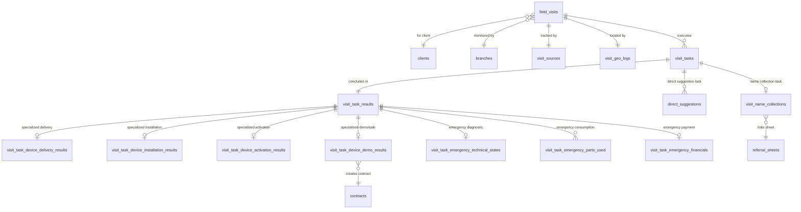

# دستور الكيان: الزيارات الميدانية (Field Visits Domain Constitution)

> **الحالة (Status):** Active / Authoritative  
> **المرجع الأعلى للعمليات والأنشطة الميدانية، وسجلات تتبع الفرق الجغرافية، والتحقق التقني من التركيب والتشغيل، ونتائج التسليم وخدمات الطوارئ.**

> **🔄 تعديل دستوري (2026-05-31):** هذا الملف خضع لتعديلات بنيوية بناءً على **DEC-006** و **DEC-007**.
> - الملخص التشغيلي الموحّد للنموذج الجديد في `domains/visits.md` (هو المرجع الأعلى للمفاهيم الموحّدة).
> - أبرز التغييرات: حذف `visit_name_collections` (DEC-007 D40)، استبدالها بـ `referral_sheets` على مستوى الزيارة، إنشاء `visit_surveys` (DEC-007 D42)، إعادة تعريف completion guards (DEC-007 D44/D45)، تصعيد ثلاثي 24/48/72h لعدم التوثيق (DEC-006 D38)، انتقال `completed` آلي عبر `checkAndCompleteVisit()`.
> - الحقول والجداول المُعلَّمة بـ `⛔ DEPRECATED` أدناه تبقى مذكورة للتوثيق التاريخي حتى تنفيذ migrations الإسقاط الفعلي.

---

## 1. هوية الكيان (Entity Identity)

- **الاسم العربي:** الزيارة الميدانية / النشاط التشغيلي الميداني
- **الاسم الإنجليزي:** Field Visit
- **الجداول الرئيسية:**
  1. `field_visits` (الزيارات الميدانية المجدولة للعملاء والفرق).
  2. `visit_tasks` (المهام الفردية المبرمة والملحقة بالزيارة).
  3. `visit_task_results` (النتائج العامة الموحدة لكل مهمة ميدانية).
- **الجداول الفرعية ونتائج المهام:**
  1. `visit_task_device_delivery_results` (نتائج تسليم الأجهزة المادية).
  2. `visit_task_device_installation_results` (نتائج تركيب وتثبيت الأجهزة).
  3. `visit_task_device_activation_results` (تفاصيل معايرة وتفعيل الأجهزة تقنياً).
  4. `visit_task_device_demo_results` (نتائج عروض المبيعات الميدانية).
  5. `visit_task_emergency_technical_states` (التقرير الفني لتشخيص الصيانة الطارئة).
  6. `visit_task_emergency_parts_used` (قطع الغيار المستهلكة في الصيانة).
  7. `visit_task_emergency_financials` (التسوية المالية لصيانات الطوارئ).
  8. ⛔ `visit_name_collections` **DEPRECATED** (سيُحذف — DEC-007 D40). انتقلت اللائحة لمستوى الزيارة عبر `referral_sheets`.
  9. `direct_suggestions` (الترشيحات المباشرة الفردية أثناء الزيارة).
  10. `visit_sources` (توثيق وتتبع مسبب استدعاء الزيارة الميدانية).
  11. `visit_geo_logs` (سجلات التتبع الجغرافي والزمني لحركة الفرق ميدانياً).
  12. 🆕 `referral_sheets` (لائحة الأسماء المقترحة — **اختيارية**، 1:1 مع `field_visits` عبر `UNIQUE(field_visit_id)`، تُنشأ يدوياً بزر بعد بدء الزيارة — DEC-007 D40/D41).
  13. 🆕 `visit_surveys` (استبيان الزيارة — **إلزامي**، 1:1 مع `field_visits`، 11 حقلاً ثابتاً + خيار `is_skipped` بسبب من `survey_skip_reasons` — DEC-007 D42).
- **الوصف:** يمثل كيان "الزيارة الميدانية" عصب الحركة والتنفيذ والربط المحوري في Golden CRM. إنه الجسر الذي يربط بين عمليات التخطيط الخلفي والمكالمات الهاتفية (التسويق الهاتفي) وعمليات المتابعة (المهام المفتوحة) مع النتائج الفعلية على أرض الواقع (العقود والديون والتحصيل). تم تصميم الكيان ليسمح بالمرونة التشغيلية المطلقة حيث يمكن للزيارة الواحدة احتواء عدة مهام مستقلة (`visit_tasks`) بأنواع مختلفة، ليقوم الفنيون والفرق الميدانية بتوثيق وبناء تقاريرهم التقنية والمالية والترشيحية مباشرة من الميدان.
- **الأهمية والأمان:** يمثل النواة التنفيذية للشركة. أي تلاعب في بيانات الزيارات أو التفاف على تسجيل المواقع الجغرافية يُعطل جودة الخدمة ويسرب الأجهزة، مما يستوجب ضبط الصلاحيات الجغرافية على مستوى الفرع بصرامة مطلقة وتأمين إحداثيات GPS.

---

## 2. معجم الجداول والحقول (Table & Field Dictionary)

### 2.1 جدول الزيارات الميدانية `field_visits`

يخزن البيانات التشغيلية والتنظيمية العليا للزيارات وحالة التكليف بالفرق.

| الحقل (Field) | النوع (SQL Type) | NULL? | DEFAULT | Constraints | الوصف والشرح بالعربية | مثال واقعي (Example) |
|---|---|---|---|---|---|---|
| `id` | `BIGINT` | ❌ | `nextval()` | `PRIMARY KEY` | المعرف الفريد المتسلسل للزيارة | `70412` |
| `visit_type` | `VARCHAR(50)` | ❌ | — | `CHECK IN ('marketing', 'emergency')` | نوع الزيارة التشغيلي | `"marketing"` |
| `visit_family` | `VARCHAR(50)` | ❌ | — | `CHECK IN ('marketing', 'service')` | تصنيف العائلة التشغيلية للزيارة | `"service"` |
| `status` | `VARCHAR(50)` | ❌ | `'scheduled'` | `CHECK (status IN ...)` انظر BR-1 | حالة الزيارة الحالية بالميدان | `"in_progress"` |
| `client_id` | `INTEGER` | ❌ | — | `FK → clients(id) ON DELETE RESTRICT` | معرف العميل المستهدف بالزيارة | `1024` |
| `branch_id` | `INTEGER` | ❌ | — | `FK → branches(id) ON DELETE RESTRICT` | فرع التشغيل الجغرافي للزيارة | `1` |
| `scheduled_date` | `DATE` | ✅ | — | — | التاريخ المجدول لحضور الفريق | `"2026-05-26"` |
| `scheduled_time` | `VARCHAR(50)` | ✅ | — | — | الشريحة الزمنية المتفق عليها | `"14:00-16:00"` |
| `source_legacy_type` | `VARCHAR(50)` | ✅ | — | — | نوع السجل التاريخي المسبب للزيارة | `"telemarketing_appointment"` |
| `source_legacy_id` | `VARCHAR(100)` | ✅ | — | — | معرف السجل المسبب للزيارة | `"appt-7741"` |
| `team_snapshot` | `JSONB` | ✅ | — | — | لقطة لبيانات الفريق الفعلي المكلف | `{"supervisor": "عمر", "technician": "أنس"}` |
| `field_notes` | `TEXT` | ✅ | — | — | ملاحظات المشرف الميداني للزيارة | `"المنزل طابق ثالث، المصعد معطل"` |
| `closed_by` | `INTEGER` | ✅ | — | `FK → hr_users(id) ON DELETE SET NULL` | معرف الموظف الذي أغلق الزيارة | `12` |
| `closed_at` | `TIMESTAMPTZ` | ✅ | — | — | تاريخ ووقت الإغلاق الفعلي للزيارة | `"2026-05-24T21:05:00Z"` |
| `created_by` | `INTEGER` | ✅ | — | `FK → hr_users(id) ON DELETE SET NULL` | معرف الموظف منشئ السجل | `15` |
| `created_at` | `TIMESTAMPTZ` | ❌ | `NOW()` | — | تاريخ إنشاء سجل الزيارة | `"2026-05-24T21:00:00Z"` |
| `updated_at` | `TIMESTAMPTZ` | ❌ | `NOW()` | — | تاريخ تعديل البيانات التشغيلية | `"2026-05-24T21:05:00Z"` |
| `reassigned_supervisor_id` | `INTEGER` | ✅ | — | `FK → employees(id) ON DELETE SET NULL` | المشرف الجديد المكلف بعد إعادة التعيين | `3` |
| `reassigned_technician_id` | `INTEGER` | ✅ | — | `FK → employees(id) ON DELETE SET NULL` | الفني الجديد بعد إعادة التعيين | `7` |
| `reassigned_trainee_id` | `INTEGER` | ✅ | — | `FK → employees(id) ON DELETE SET NULL` | المتدرب الملحق بالفريق الجديد | `11` |
| `reassigned_team_snapshot` | `JSONB` | ✅ | — | — | لقطة الفريق الجديد المتكاملة | `{"technician": "أحمد يوسف"}` |
| `reassigned_at` | `TIMESTAMPTZ` | ✅ | — | — | تاريخ ووقت إعادة تعيين الفريق | `"2026-05-24T21:03:00Z"` |
| `reassigned_by` | `INTEGER` | ✅ | — | `FK → hr_users(id) ON DELETE SET NULL` | الموظف الذي قام بإعادة تعيين الفريق | `12` |
| `appointment_booked_at` | `TIMESTAMPTZ` | ✅ | — | — | تاريخ حجز الموعد الهاتفي الأساسي | `"2026-05-24T20:46:00Z"` |
| `booked_by_telemarketer_id`| `INTEGER` | ✅ | — | `FK → hr_users(id) ON DELETE SET NULL` | معرف المسوق الهاتفي حاجز الموعد | `12` |
| `telemarketer_notes` | `TEXT` | ✅ | — | — | الملاحظات المأخوذة هاتفياً من المكالمة | `"يرجى الاتصال قبل التحرك بنصف ساعة"` |
| `answered_by` | `VARCHAR(50)` | ✅ | — | — | لقطة لاسم متلقي المكالمة وقت الحجز | `"زوجة العميل"` |
| `customer_snapshot` | `JSONB` | ✅ | — | — | لقطة لبيانات العميل الشاملة وقت الحجز | `{"mobile": "0991234567", "waterSource": "بئر"}` |
| `cancellation_reason_id` | `INTEGER` | ✅ | — | `FK → system_lists(id) ON DELETE SET NULL` | المعرف المرجعي لسبب إلغاء الزيارة | `1` (رفض الزبون الزيارة) |
| `cancellation_notes` | `TEXT` | ✅ | — | — | الملاحظات الإضافية حول سبب إلغاء الزيارة | `"غير مهتم بعد مشاورة العائلة"` |
| 🆕 `team_responsible_user_id` | `INTEGER` | ✅ | — | `FK → hr_users(id) ON DELETE SET NULL` | مالك اللائحة والاستبيان لحظة الإنشاء. للقياسي = مشرف الفريق، للطوارئ = الفني (DEC-007 D47) | `12` |

---

### 2.2 جدول مهام الزيارة `visit_tasks`

يوثق العمليات الفردية والمستقلة المخصصة للتنفيذ الفعلي ضمن الزيارة الواحدة.

| الحقل (Field) | النوع (SQL Type) | NULL? | DEFAULT | Constraints | الوصف والشرح بالعربية | مثال واقعي (Example) |
|---|---|---|---|---|---|---|
| `id` | `BIGINT` | ❌ | `nextval()` | `PRIMARY KEY` | المعرف الفريد المتسلسل للمهمة | `90145` |
| `field_visit_id` | `BIGINT` | ❌ | — | `FK → field_visits(id) ON DELETE CASCADE` | معرف الزيارة الحاضنة للمهمة | `70412` |
| `source_open_task_id`| `INTEGER` | ✅ | — | `FK → open_tasks(id) ON DELETE SET NULL` | معرف المهمة المفتوحة المسببة للتنفيذ | `1024` |
| `task_type` | `VARCHAR(50)` | ❌ | — | `CHECK (task_type IN ...)` انظر BR-2 | نوع المهمة الميدانية الفعلي | `"device_demo"` |
| `task_family` | `VARCHAR(50)` | ❌ | — | `CHECK IN ('marketing', 'service')` | عائلة تصنيف المهمة التشغيلية | `"marketing"` |
| `sequence_no` | `INTEGER` | ❌ | `1` | — | ترتيب تنفيذ المهمة داخل الزيارة | `1` |
| `status` | `VARCHAR(50)` | ❌ | `'pending'` | `CHECK (status IN ...)` انظر BR-2 | حالة تنفيذ المهمة بالميدان | `"completed"` |
| `execution_notes` | `TEXT` | ✅ | — | — | ملاحظات الفنيين المكتوبة أثناء التنفيذ | `"تم العرض بنجاح وبحضور كامل العائلة"` |
| `source_legacy_type` | `VARCHAR(50)` | ✅ | — | — | نوع السجل التاريخي المهاجر للمهمة | `"marketing_visit_task"` |
| `source_legacy_id` | `VARCHAR(100)` | ✅ | — | — | معرف السجل التاريخي المهاجر للمهمة | `"mvt-8812"` |
| `created_at` | `TIMESTAMPTZ` | ❌ | `NOW()` | — | تاريخ إنشاء سجل المهمة | `"2026-05-24T21:00:00Z"` |
| `updated_at` | `TIMESTAMPTZ` | ❌ | `NOW()` | — | تاريخ تعديل البيانات يدوياً | `"2026-05-24T21:05:00Z"` |

---

### 2.3 جدول النتائج العامة للمهام `visit_task_results`

يوفر الطبقة العامة لتوثيق القرارات والإغلاقات لكل مهمة ميدانية (يرتبط علاقة 1-إلى-1 فريدة).

| الحقل (Field) | النوع (SQL Type) | NULL? | DEFAULT | Constraints | الوصف والشرح بالعربية | مثال واقعي (Example) |
|---|---|---|---|---|---|---|
| `id` | `BIGINT` | ❌ | `nextval()` | `PRIMARY KEY` | المعرف الفريد للنتيجة العامة | `88210` |
| `visit_task_id` | `BIGINT` | ❌ | — | `FK → visit_tasks(id) ON DELETE CASCADE, UNIQUE` | معرف مهمة الزيارة المربوطة بالنتيجة | `90145` |
| `final_decision` | `VARCHAR(100)` | ❌ | — | — | القرار النهائي المعتمد للمهمة | `"installment_offer_closed"` |
| `reason_code` | `VARCHAR(100)` | ✅ | — | — | كود تعليل سبب الفشل أو الإلغاء | `"postponed_by_customer"` |
| `closing_notes` | `TEXT` | ✅ | — | — | ملاحظات وموجز الفني لإغلاق النتيجة | `"تم إقناع العميل وتوقيع العقد وقبض الدفعة"` |
| `closed_by` | `INTEGER` | ✅ | — | `FK → hr_users(id) ON DELETE SET NULL` | الموظف الذي اعتمد النتيجة يدوياً | `12` |
| `closed_at` | `TIMESTAMPTZ` | ❌ | `NOW()` | — | تاريخ ووقت إغلاق وحفظ النتيجة | `"2026-05-24T21:05:00Z"` |
| `created_at` | `TIMESTAMPTZ` | ❌ | `NOW()` | — | تاريخ إنشاء السجل الفعلي | `"2026-05-24T21:05:00Z"` |
| `updated_at` | `TIMESTAMPTZ` | ❌ | `NOW()` | — | تاريخ تعديل النتيجة يدوياً | `"2026-05-24T21:05:00Z"` |

---

### 2.4 معجم الجداول الفرعية والتخصصية ونتائج المهام

#### A. جدول نتائج تسليم الأجهزة `visit_task_device_delivery_results`
يخزن التفاصيل المادية والجغرافية لتسليم أجهزة الفلاتر والمبيعات المتعاقد عليها.
- `id` (`BIGINT`, PK)
- `visit_task_result_id` (`BIGINT`, `FK → visit_task_results(id) ON DELETE CASCADE, UNIQUE`)
- `serial_number` (`VARCHAR(100)`): الرقم التسلسلي للجهاز المسلم.
- `device_model_id` (`INTEGER`, `FK → device_models(id) ON DELETE SET NULL`): موديل الفلتر/الجهاز.
- `delivery_address` (`TEXT`): العنوان المعتمد الفعلي للتسليم.
- `actual_delivery_date` (`DATE`): التاريخ الفعلي الذي تم به الاستلام.
- `delivered_by_employee_id` (`INTEGER`, `FK → employees(id) ON DELETE SET NULL`): الموظف المسلّم الفعلي.
- `customer_acknowledged` (`BOOLEAN`, DEFAULT `FALSE`): إقرار وتوقيع الزبون على سلامة المنتج.
- `delivery_photos` (`JSONB`, DEFAULT `'[]'`): صور الاستلام الميدانية وإثبات الإقرار الجنائي.
- `delivery_condition` (`VARCHAR(50)`, `CHECK ('perfect', 'minor_damage', 'missing_accessories')`)
- `outcome` (`VARCHAR(50)`, `CHECK ('delivered_successfully', 'customer_not_available', 'wrong_address', 'refused_delivery')`)
- `delivery_lat` (`NUMERIC(10,7)`): الإحداثي الجغرافي الفعلي للتوصيل.
- `delivery_lng` (`NUMERIC(10,7)`): الإحداثي الجغرافي الفعلي للتوصيل.
- `notes` (`TEXT`): ملاحظات التوصيل.

#### B. جدول نتائج تركيب الأجهزة `visit_task_device_installation_results`
يوثق الإقرار الفني لتثبيت وربط الأجهزة مائياً وكهربائياً بالشبكة.
- `id` (`BIGINT`, PK)
- `visit_task_result_id` (`BIGINT`, `FK → visit_task_results(id) ON DELETE CASCADE, UNIQUE`)
- `outcome` (`VARCHAR(50)`, `CHECK ('installed_successfully', 'installation_incomplete', 'site_not_ready')`)
- `water_source_type` (`VARCHAR(50)`): نوع مصدر المياه (بئر، شبكة بلدية، صهريج).
- `pipe_type` (`VARCHAR(50)`): خامة الأنابيب المستخدمة للتمديد.
- `pipe_length_meters` (`NUMERIC(8,2)`): أطوال الخراطيم المستهلكة بالمتر.
- `electrical_connection` (`BOOLEAN`, DEFAULT `FALSE`): هل تم الربط بالتيار الكهربائي بنجاح؟
- `wall_mounting_done` (`BOOLEAN`, DEFAULT `FALSE`): هل تم تعليق الفلتر على جدار المطبخ؟
- `installed_accessories` (`JSONB`, DEFAULT `'[]'`): الإكسسوارات الفنية الملحقة (صنبور إضافي، مضخة).
- `installation_start_date` (`DATE`) / `installation_end_date` (`DATE`)
- `before_photos` / `after_photos` (`JSONB`, DEFAULT `'[]'`): لقطات موقع العمل قبل التركيب وبعده.
- `technical_notes` (`TEXT`): الملاحظات الفنية للتركيب.
- `installed_by_employee_id` (`INTEGER`, `FK → employees(id) ON DELETE SET NULL`): الفني القائم بالتركيب الفعلي.

#### C. جدول نتائج تفعيل وتشغيل الأجهزة `visit_task_device_activation_results`
يوثق قياسات جودة المياه والمعايرة والضغط قبل التفعيل وبعده لضمان الأداء الفني.
- `id` (`BIGINT`, PK)
- `visit_task_result_id` (`BIGINT`, `FK → visit_task_results(id) ON DELETE CASCADE, UNIQUE`)
- `outcome` (`VARCHAR(50)`, `CHECK ('activated_successfully', 'activation_failed', 'device_issue')`)
- `tds_before` (`NUMERIC`): نسبة الأملاح المذابة (TDS) قبل تفعيل الفلتر.
- `tds_after` (`NUMERIC`): نسبة الأملاح المذابة (TDS) للمياه الخارجة من الصنبور بعد التفعيل.
- `pump_pressure` (`NUMERIC`): قياس ضغط المضخة الفعلي.
- `membrane_output` (`VARCHAR(50)`): حالة غشاء التناضح العكسي (ممبرين).
- `tank_pressure` (`NUMERIC`): قياس ضغط خزان المياه المرفق.
- `uv_status` (`VARCHAR(50)`): حالة عمل شمعة الأشعة فوق البنفسجية للتعقيم.
- `customer_trained` (`BOOLEAN`, DEFAULT `FALSE`): هل تم إعطاء تدريب تشغيلي للعميل؟
- `training_notes` (`TEXT`) / `activation_photos` (`JSONB`, DEFAULT `'[]'`)
- `activated_by_employee_id` (`INTEGER`, `FK → employees(id) ON DELETE SET NULL`): الفني المفعل والمسؤول عن الفحص الفني.

#### D. جدول نتائج عروض المبيعات `visit_task_device_demo_results`
يوثق التسويات المالية فور إقناع العملاء في الميدان وبيع الأجهزة.
- `id` (`BIGINT`, PK)
- `visit_task_result_id` (`BIGINT`, `FK → visit_task_results(id) ON DELETE CASCADE, UNIQUE`)
- `offer_type` (`VARCHAR(50)`, `CHECK ('cash', 'installment')`): طريقة السداد المقبولة.
- `offer_amount` (`NUMERIC`): القيمة المالية الإجمالية للعرض المبرم.
- `installment_months` (`INTEGER`): مدة السداد بالأقساط شهرياً (في حال التقسيط).
- `closed_by_employee_id` (`INTEGER`, `FK → employees(id) ON DELETE SET NULL`): الفني أو البائع حاجز العقد.
- `contract_id` (`INTEGER`, `FK → contracts(id) ON DELETE SET NULL`): معرف العقد المالي المنشأ نتيجة البيع الميداني.

#### E. تقرير تشخيص الطوارئ `visit_task_emergency_technical_states`
يوثق التشخيص الفني وقياسات ضغط الفلاتر عند معالجة حالات الصيانة الطارئة والأعطال.
- `id` (`BIGINT`, PK)
- `visit_task_result_id` (`BIGINT`, `FK → visit_task_results(id) ON DELETE CASCADE, UNIQUE`)
- `problem_confirmed` (`BOOLEAN`): هل تأكد الفني من وجود العطل المشكو منه؟
- `technical_notes` (`TEXT`): تقرير العطل المكتشف وطريقة علاجه.
- `water_tds_before` / `water_tds_after` (`NUMERIC`)
- `pump_pressure` / `tank_pressure` (`NUMERIC`)
- `membrane_output` (`VARCHAR(50)`, `CHECK ('Good', 'Weak', 'Dead')`)
- `low_pressure_switch` / `high_pressure_switch` / `solenoid_valve` / `uv_status` (`VARCHAR(100)`)

#### F. قطع الغيار المستهلكة في صيانة الطوارئ `visit_task_emergency_parts_used`
يوثق المستلزمات وقطع الغيار المصروفة للفني من المستودع وتركيبها للعميل.
- `id` (`BIGINT`, PK)
- `visit_task_result_id` (`BIGINT`, `FK → visit_task_results(id) ON DELETE CASCADE`)
- `spare_part_id` (`INTEGER`, `FK → spare_parts(id) ON DELETE SET NULL`): معرف القطعة.
- `part_name_snapshot` (`VARCHAR(255)`): اسم القطعة وقت الصرف لضمان عدم تأثر السجل بتغيير المسمى.
- `quantity` (`INTEGER`, DEFAULT `1`): الكمية المستهلكة الفعلي.
- `unit_price` (`NUMERIC`): سعر الوحدة المعتمد بالعملة المحلية.

#### G. التسوية المالية للطوارئ `visit_task_emergency_financials`
يوثق حسابات أجور الصيانة وتكلفة قطع المستهلك ووسائل القبض الميداني.
- `id` (`BIGINT`, PK)
- `visit_task_result_id` (`BIGINT`, `FK → visit_task_results(id) ON DELETE CASCADE, UNIQUE`)
- `labor_cost` (`NUMERIC`): كود أجور وتكلفة اليد العاملة للفني الميداني.
- `parts_cost` (`NUMERIC`): إجمالي تكلفة قطع الغيار المصروفة.
- `total_cost` (`NUMERIC`): التكلفة الإجمالية المطلوبة من العميل (أجور + قطع).
- `payment_method` (`VARCHAR(50)`): طريقة السداد (نقداً، تحويل، ذمم).
- `collected_amount` (`NUMERIC`): المبلغ المقبوض فعلياً بالميدان من الفني.
- `invoice_notes` (`TEXT`): ملاحظات الفاتورة والتسوية المالية.

#### H. سجل تجميع التوصيات والأسماء `visit_name_collections`
يوثق مهمة جمع قائمة التوصيات للأصدقاء والأقارب من العميل كقاعدة تسويقية هامة.
- `id` (`SERIAL`, PK)
- `visit_task_id` (`INTEGER`, `FK → visit_tasks(id) ON DELETE CASCADE, UNIQUE`): معرف المهمة.
- `client_id` (`INTEGER`, `FK → clients(id)`): العميل صاحب التوصية.
- `proposed_count` (`INTEGER`, DEFAULT `0`): عدد التوصيات المقترحة والمستهدفة.
- `actual_count` (`INTEGER`, DEFAULT `0`): عدد التوصيات الفعلية التي تم الحصول عليها.
- `referral_sheet_id` (`INTEGER`): معرف صحيفة الترشيح الكبرى المرتبطة.
- `status` (`VARCHAR(50)`, DEFAULT `'pending'`, `CHECK ('pending', 'partial', 'completed')`): حالة مهمة الجمع.
- `notes` (`TEXT`): ملاحظات إضافية.

#### I. سجل الترشيحات المباشرة الفردية `direct_suggestions`
يوثق الترشيحات الفردية السريعة والاتصالات المباشرة المأخوذة فوراً.
- `id` (`SERIAL`, PK)
- `visit_task_id` (`INTEGER`, `FK → visit_tasks(id) ON DELETE CASCADE`): معرف مهمة الزيارة.
- `client_id` (`INTEGER`, `FK → clients(id)`): العميل الذي قام بالترشيح المباشر.
- `name` (`VARCHAR(255)`): اسم الشخص المرشح للاتصال به.
- `phone` (`VARCHAR(50)`): رقم هاتف الشخص المرشح.
- `is_direct` (`BOOLEAN`, DEFAULT `TRUE`): هل الترشيح مباشر وفوري؟
- `status` (`VARCHAR(50)`, DEFAULT `'pending'`, `CHECK ('pending', 'contacted', 'converted')`): حالة الترشيح.
- `notes` (`TEXT`): ملاحظات التوصية المباشرة.

#### J. سجل مسببات الزيارة `visit_sources`
يوثق الجهة أو الموظف المسبب لاستدعاء وإعداد خطة هذه الزيارة الميدانية.
- `id` (`SERIAL`, PK)
- `visit_id` (`INTEGER`, `FK → field_visits(id) ON DELETE CASCADE, UNIQUE`)
- `source_type` (`VARCHAR(50)`, `CHECK ('supervisor', 'technician', 'both', 'company_branch', 'company_global')`)
- `source_label` (`VARCHAR(255)`): الشرح التفصيلي للمسبب (مثال: "مشرف: أحمد + فني: ماهر").
- `actor_employee_ids` (`INTEGER[]`): قائمة معرفات الموظفين الفعليين المسببين للزيارة.

#### K. سجل التتبع الجغرافي والزمني الميداني `visit_geo_logs`
يوثق بيانات الإثبات الجغرافي والزمني لحضور وانصراف الفرق بالميدان للتفتيش والجودة.
- `id` (`SERIAL`, PK)
- `visit_id` (`INTEGER`, `FK → field_visits(id) ON DELETE CASCADE, UNIQUE`)
- `actual_start_time` (`TIMESTAMP`): الوقت الفعلي لنقر زر "بدء العمل" ميدانياً.
- `actual_start_lat` / `actual_start_lng` (`DECIMAL(10,8)` / `DECIMAL(11,8)`): إحداثيات موقع البدء الفعلي.
- `actual_start_accuracy` (`INTEGER`): دقة قراءة الـ GPS عند البدء بالمتر.
- `actual_end_time` (`TIMESTAMP`): الوقت الفعلي لنقر زر "إنهاء العمل" بالواجهة الجوالة.
- `actual_end_lat` / `actual_end_lng` (`DECIMAL(10,8)` / `DECIMAL(11,8)`): إحداثيات موقع الإنهاء الفعلي.
- `actual_end_accuracy` (`INTEGER`): دقة قراءة الـ GPS عند الانتهاء.
- `duration_minutes` (`INTEGER`): المدة الزمنية المستغرقة للزيارة بالدقائق (تحسب آلياً).
- `distance_meters` (`INTEGER`): المسافة بالمتر بين نقطة البدء والانصراف (تحسب بالـ Haversine آلياً).
- `location_missing` (`BOOLEAN`, DEFAULT `FALSE`): راية تدل على تعذر جلب الإحداثيات أو تعطل الـ GPS بالجوال.

---

## 3. القيود والقواعد التشغيلية (Database Constraints & Business Rules)

### BR-1: دورة حياة الزيارة الميدانية (Visit Lifecycle State Machine)
تتبع الزيارة الميدانية الهيكل التشغيلي الصارم المعتمد بالخادم والتطبيق الجوال:
1. **التسجيل الأولي (`scheduled`):** تُنشأ الزيارة تلقائياً بناءً على حجز موعد بالتسويق الهاتفي أو ترحيل مهمة صيانة طارئة.
2. **بدء الزيارة (`POST /api/field-visits/:id/start`):** يتحول وضع الزيارة إلى `in_progress` ويقوم الخادم أوتوماتيكياً بتوثيق إحداثيات وتوقيت البداية بجدول `visit_geo_logs` وتوليد سجل المسبب في `visit_sources`.
3. **إنهاء الزيارة ميدانياً (`POST /api/field-visits/:id/end`):** يتحول وضع الزيارة بالخلفية إلى `ended` (العمل التشغيلي منجز)، ويتم توثيق إحداثيات وتوقيت النهاية بالـ GPS، وحساب المدة والمسافة.
4. **تأكيد الإغلاق والاعتماد النهائي (انتقال آلي — DEC-007 P-DEC007-04):** الانتقال إلى `completed` **محسوب لا يدوي**، يحدث تلقائياً عبر helper `checkAndCompleteVisit(visitId)` يُستدعى بعد كل save لـ task_result أو survey أو survey skip. الشروط الحاسمة (Completion Guards — DEC-007 D44/D45):
   - الشرط 1: كل `visit_tasks` لها `visit_task_results.final_decision` غير NULL.
   - الشرط 2: `visit_survey` موجود لـ `field_visit_id` (مُعبَّأ كلياً أو في حالة `is_skipped = TRUE` مع `skip_reason` من `system_lists` فئة `survey_skip_reasons`).
   - **لا شرط ثالث للائحة** — `referral_sheets` اختيارية بالكامل (DEC-007 D45). الشرط القديم على `visit_name_collections` ⛔ ملغى.

5. **تصعيد عدم التوثيق (DEC-006 D38):** زيارة `in_progress` أو `ended` بلا توثيق لا تُغلق قسرياً مهما طال الوقت. آلية ثلاثية المراحل قابلة للضبط من `system_settings`:
   - بعد 24h (`visit_undocumented_alert_hours_l1`): تنبيه للفني المسؤول وفنيي الفريق.
   - بعد 48h (`visit_undocumented_alert_hours_l2`): تنبيه للمشرف + منع الفني من بدء أي زيارة جديدة حتى يوثّق السابقة.
   - بعد 72h (`visit_undocumented_alert_hours_l3`): تصعيد لمدير الفرع.

### BR-2: سلسلة الزناد والمهام التشغيلية (Visit Tasks Execution Flow)
- لكل زيارة ميدانية مهمة واحدة أو أكثر (`visit_tasks`) تتبع تسلسل أولوية محدد بـ `sequence_no`.
- لا يقوم الخادم بحفظ إنجاز المهمة بجدولها الفردي، وإنما يتطلب إنشاء نتيجة متخصصة بجدول `visit_task_results` وربطها بالجدول التخصصي المقابل حسب نوع المهمة:
  - إذا كانت المهمة `device_delivery`: تسجل النتيجة في `visit_task_device_delivery_results`.
  - إذا كانت المهمة `device_installation`: تسجل النتيجة في `visit_task_device_installation_results`.
  - إذا كانت المهمة `device_activation`: تسجل النتيجة في `visit_task_device_activation_results`.
  - إذا كانت المهمة `device_demo`: تسجل النتيجة في `visit_task_device_demo_results`.
  - إذا كانت المهمة `emergency_maintenance`: تسجل النتائج في `visit_task_emergency_technical_states`, `visit_task_emergency_parts_used` (متعدد) و `visit_task_emergency_financials`.

### BR-3: الترقية والمبيعات الميدانية (Device Offering & Sales Linkage)
- في مهام عرض الأجهزة `device_demo` بالميدان، يعرض الفني عروض خصومات من `device_discounts` المتاحة للفرع.
- في حال موافقة العميل على العرض والتعاقد الفعلي: يتم إنشاء عقد جديد بجدول `contracts` وربطه بالزيارة والمهمة المسببة تلقائياً عبر الحقول `contracts.source_visit_id` و `contracts.source_open_task_id` لتأمين التتبع المالي والجنائي للمبيعات الميدانية.

### BR-4: الحظر الصارم للتداخل وتوزيع المهام الجغرافي (Double-Booking & Assignment Gates)
- عند إعادة تعيين الفريق التشغيلي للزيارة الميدانية (`POST /api/field-visits/:id/reassign`): يفرض النظام فحصاً جغرافياً لضمان بقاء الزيارة محصورة ضمن حدود الفرع المسؤول، مع توثيق لقطة الفريق الجاري بـ `reassigned_team_snapshot` لتسهيل الرقابة.
- يتم تأمين البيانات الميدانية عبر تجميد لقطة بيانات العنوان والعميل Immutable Snapshots (`address_snapshot` و `customer_snapshot` بجدول الزيارات) فور إنشاء الزيارة لحماية الفنيين من أي تعديل خلفي قد يجريه موظفو المكتب الخلفي أثناء تنقل الفريق ميدانياً.

---

## 4. العلاقات الهيكلية (Entity Relationships)

---

## 5. آلة الحالات التشغيلية (State Machine)

### 5.1 حالات الزيارة الميدانية (Visit Status)
- **`scheduled` (مجدولة):** الزيارة منشأة ومخصصة للفريق وتنتظر الحضور الميداني.
- **`in_progress` (قيد العمل الميداني):** تم نقر زر بدء العمل وتسجيل الموقع والوقت الفعلي للبدء.
- **`ended` (منتهية تشغيلياً):** أكمل الفريق مهامه وأغلق الموقع وحوسبت المدة والمسافة.
- **`completed` (مكتملة ومغلقة):** تم توثيق جميع نتائج المهام بنجاح ومطابقة قوائم الأسماء واعتماد الزيارة.
- **`cancelled` (ملغاة):** تم إلغاء الزيارة لسبب رسمي مع توثيق `cancellation_reason_id` و `cancellation_notes`.
- **`postponed_by_company` / `postponed_by_customer` / `needs_reschedule` (مؤجلة / تحتاج إعادة جدولة):** حالات انتقالية للزيارة يُعاد بناؤها حسب التخطيط.

### 5.2 حالات مهام الزيارة (Visit Task Status)
- **`pending` (قيد الانتظار):** المهمة بانتظار بدء العمل عليها ميدانياً.
- **`in_progress` (قيد التنفيذ):** الفني يعمل على إنجاز وفحص بنود هذه المهمة حالياً.
- **`completed` (مكتملة):** تم إنجاز العمل المادي والتقني للمهمة بنجاح.
- **`not_completed` (غير مكتملة):** تعذر تنفيذ المهمة لسبب فني.
- **`cancelled` (ملغاة):** ألغيت المهمة التشغيلية الفردية بشكل مستقل عن الزيارة.

---

## 6. صلاحيات الوصول (Permission Matrix)

> GAP-027 محلول بتاريخ 2026-05-25 — جميع مسارات `fieldVisits.ts` تعتمد الآن على `field_visits.view` و `field_visits.edit`.

| الصلاحية | النطاق المسموح | الأدوار الممنوحة |
|---|---|---|
| `field_visits.view` | GLOBAL / BRANCH | SYSTEM_ADMIN (GLOBAL) · branch_manager (BRANCH) · telemarketer (BRANCH) |
| `field_visits.edit` | GLOBAL / BRANCH | SYSTEM_ADMIN (GLOBAL) · branch_manager (BRANCH) · telemarketer (BRANCH) |

| المسار أو الإجراء التشغيلي | الصلاحية المطلوبة | النطاق | الوصف |
|---|---|---|---|
| `GET /api/field-visits` | `field_visits.view` | BRANCH / GLOBAL | عرض قائمة الزيارات للفرع والبحث بها |
| `GET /api/field-visits/:id` | `field_visits.view` | BRANCH / GLOBAL | قراءة تفاصيل الزيارة والمهام الملحقة والنتائج |
| `GET /api/field-visits/:id/geo` | `field_visits.view` | BRANCH / GLOBAL | قراءة سجل الإحداثيات الجغرافية للزيارة |
| `GET /api/field-visits/:id/source` | `field_visits.view` | BRANCH / GLOBAL | قراءة مصدر الزيارة ومسببها التشغيلي |
| `GET /api/field-visits/name-collections/:id` | `field_visits.view` | BRANCH / GLOBAL | قراءة سجل تجميع الأسماء |
| `GET /api/field-visits/visit-tasks/:taskId/direct-suggestions` | `field_visits.view` | BRANCH / GLOBAL | قراءة الترشيحات المباشرة لمهمة زيارة |
| `POST /api/field-visits/:id/start` | `field_visits.edit` | BRANCH / GLOBAL | بدء الزيارة ميدانياً وتوثيق الموقع GPS للبدء |
| `POST /api/field-visits/:id/end` | `field_visits.edit` | BRANCH / GLOBAL | إنهاء العمل الميداني وتوثيق موقع الانصراف GPS |
| `POST /api/field-visits/:id/complete` | `field_visits.edit` | BRANCH / GLOBAL | إغلاق واعتماد الزيارة الفنية بعد إتمام النتائج |
| `POST /api/field-visits/visit-tasks/:taskId/name-collection` | `field_visits.edit` | BRANCH / GLOBAL | إنشاء كشف وقيد تجميع الأسماء والتوصيات |
| `PUT /api/field-visits/name-collections/:id/record-names` | `field_visits.edit` | BRANCH / GLOBAL | توثيق عدد الأسماء الفعلية المستلمة للصحيفة |
| `POST /api/field-visits/visit-tasks/:taskId/direct-suggestions` | `field_visits.edit` | BRANCH / GLOBAL | تسجيل ترشيح مباشر لشخص باسمه وهاتفه |

---

## 7. عقد API (API Contract)

### 7.1 جدول الـ Endpoints الكامل

| Method | الـ Endpoint | الصلاحية | وصف العملية |
|---|---|---|---|
| `GET` | `/api/field-visits` | `field_visits.view` | قائمة الزيارات — يتطلب `clientId` أو `date` |
| `GET` | `/api/field-visits/:id` | `field_visits.view` | تفاصيل كاملة مع المهام والنتائج والجغرافيا والمصدر |
| `GET` | `/api/field-visits/:id/geo` | `field_visits.view` | سجل الإحداثيات الجغرافية فقط |
| `GET` | `/api/field-visits/:id/source` | `field_visits.view` | مصدر الزيارة (شركة، مشرف، فني) — ينشئه lazily |
| `GET` | `/api/field-visits/name-collections/:id` | `field_visits.view` | سجل تجميع أسماء بمعرفه |
| `GET` | `/api/field-visits/visit-tasks/:taskId/direct-suggestions` | `field_visits.view` | قائمة الترشيحات المباشرة لمهمة زيارة |
| `POST` | `/api/field-visits/:id/start` | `field_visits.edit` | بدء الزيارة + تسجيل GPS البداية في `visit_geo_logs` |
| `POST` | `/api/field-visits/:id/end` | `field_visits.edit` | إنهاء الزيارة + GPS الانصراف + حساب المدة والمسافة (Haversine) |
| `POST` | `/api/field-visits/:id/complete` | `field_visits.edit` | إغلاق الزيارة — يشترط اكتمال جميع نتائج المهام والأسماء |
| `POST` | `/api/field-visits/visit-tasks/:taskId/name-collection` | `field_visits.edit` | إنشاء سجل تجميع الأسماء + `referral_sheet` تلقائياً إذا proposedCount > 0 |
| `PUT` | `/api/field-visits/name-collections/:id/record-names` | `field_visits.edit` | تسجيل العدد الفعلي + تحديث حالة الصحيفة (pending/partial/completed) |
| `POST` | `/api/field-visits/visit-tasks/:taskId/direct-suggestions` | `field_visits.edit` | إضافة ترشيح مباشر باسم وهاتف لمهمة زيارة |

### 7.2 منطق عمليات محورية

#### `GET /api/field-visits`
- يتطلب `clientId` (integer) أو `date` (string YYYY-MM-DD) — يرفض الاستعلام المفتوح بـ `400`.
- المستخدم غير SuperAdmin مقيد تلقائياً بـ `actingBranchId`.

#### `POST /api/field-visits/:id/start`
- Body اختياري: `{ lat, lng, accuracy }` — إذا غابت الإحداثيات يُسجَّل `location_missing = true`.
- يُنشئ `visit_source` تلقائياً إذا لم يكن موجوداً.
- يحدّث حالة الزيارة إلى `in_progress` (إلا إذا كانت `ended`/`completed`/`cancelled`).

#### `POST /api/field-visits/:id/end`
- يحسب `duration_minutes` من فرق وقت البدء الفعلي.
- يحسب `distance_meters` بمعادلة Haversine بين نقطتي البدء والانصراف.
- يحدّث حالة الزيارة إلى `ended` (إلا إذا كانت `completed`/`cancelled`).

#### `POST /api/field-visits/:id/complete` — قيود الإغلاق (Guards) — محدّث بـ DEC-007 D44/D45
1. جميع `visit_tasks` يجب أن يكون لها سجل في `visit_task_results.final_decision` غير NULL.
2. يوجد `visit_surveys` بـ `field_visit_id` (مُعبَّأ كلياً أو `is_skipped = TRUE` مع `skip_reason` من فئة `survey_skip_reasons`).
3. ⛔ ملغاة: الشروط القديمة على `visit_name_collections` (pending/partial). اللائحة اختيارية الآن.

> **ملاحظة:** الانتقال إلى `completed` يحدث آلياً عبر `checkAndCompleteVisit()` بعد كل save ذي صلة (task_result/survey/skip). الـ endpoint اليدوي يبقى احتياطياً.

#### 🆕 `POST /api/field-visits/:id/referral-sheet` — DEC-007 D41
- ينشئ `referral_sheets` يدوياً بزر بعد بدء الزيارة (status = `in_progress`).
- الحقول المملوءة آلياً: `referral_type='client'`، `referral_entity_id=client_id`، snapshots، `field_visit_id`، `owner_user_id=team_responsible_user_id`، `target_candidates=0`، `status='New'`، `referral_date=scheduled_date`.

#### 🆕 `POST /api/field-visits/:id/referral-sheet/target` — DEC-007 D41
- يُحدّث `target_candidates` على اللائحة الموجودة. لا إنشاء جديد.

#### 🆕 `POST /api/field-visits/:id/survey` — DEC-007 D42
- ينشئ/يُحدّث `visit_surveys` بكل الـ 11 حقلاً + `filled_by_user_id` + `filled_at`. يستدعي `checkAndCompleteVisit()` بعد الحفظ.

#### 🆕 `POST /api/field-visits/:id/survey/skip` — DEC-007 D42
- يُسجّل `is_skipped=TRUE` + `skip_reason` من `survey_skip_reasons`. يستدعي `checkAndCompleteVisit()` بعد الحفظ.

#### ⛔ DEPRECATED — تُحذف بعد التنفيذ
- `POST /visit-tasks/:taskId/name-collection` — اللائحة انتقلت لمستوى الزيارة (DEC-007 D40).
- `PUT /name-collections/:id/record-names` — `actual_count` لم يعد محسوباً ضمن الزيارة (DEC-007 D45).

### 7.3 رموز الاستجابة

| الحالة | الرمز | المعنى |
|---|---|---|
| نجاح القراءة | `200` | البيانات موجودة |
| نجاح الإنشاء | `201` | سجل جديد تم إنشاؤه |
| خطأ في المدخلات | `400` | معرف غير صالح / فلتر مفقود / قيود الإغلاق |
| لا صلاحية للعملية | `403` | الزيارة لفرع مختلف عن المستخدم |
| غير موجود | `404` | الزيارة أو المهمة أو السجل غير موجود |
| خطأ داخلي | `500` | خطأ قاعدة البيانات أو منطق الحسابات |

---

## 8. حالات الاختبار الشاملة (Test Cases)

| معرف الاختبار | سيناريو الاختبار (Scenario) | طريقة الطلب | المدخلات البرمجية (Inputs) | النتيجة المتوقعة (Expected) |
|---|---|---|---|---|
| **TC-01** | بدء زيارة فنية بنجاح | `POST /:id/start` | `id = 70412`, `{ "lat": 33.5138, "lng": 36.2765 }` | الرد بـ `200` وحالة الزيارة تصبح `in_progress` وإنشاء سجل بـ `visit_geo_logs`. |
| **TC-02** | منع بدء زيارة لفرع آخر | `POST /:id/start` | معرف زيارة يتبع لفرع حمص (2) والمستخدم بفرع دمشق (1) | الرد بـ `403` "ليس لديك صلاحية الوصول". |
| **TC-03** | إنهاء زيارة وحساب البيانات | `POST /:id/end` | `id = 70412`, `{ "lat": 33.5140, "lng": 36.2770 }` | الرد بـ `200` وحالة الزيارة تصبح `ended` وحساب قيم المدة والمسافة. |
| **TC-04** | إتمام زيارة معلقة المهام | `POST /:id/complete`| `id = 70412` مع وجود مهمة لم تسجل نتيجتها | الرد بـ `400` "لا يمكن إتمام الزيارة: 1 مهمة لم يسجل لها نتيجة". |
| **TC-05** | إتمام زيارة مستوفية القيود | `POST /:id/complete`| `id = 70412` وجميع المهام والأسماء مكتملة | الرد بـ `200` بنجاح وتحديث حالة الزيارة إلى `completed`. |
| **TC-06** | إنشاء سجل تجميع أسماء مقترح | `POST /visit-tasks/:taskId/name-collection` | `taskId = 90145`, `{ "proposed_count": 5 }` | الرد بـ `201` وتوليد سجل تجميع الأسماء وسجل `referral_sheets` تلقائياً. |
| **TC-07** | تسجيل الأسماء لصحيفة الترشيح| `PUT /name-collections/:id/record-names` | `id = 1`, `{ "actual_count": 5 }` | الرد بـ `200` بنجاح وتحديث الحالة للصحيفة إلى `completed`. |
| **TC-08** | تسجيل الأسماء الفاشل (قاصر) | `PUT /name-collections/:id/record-names` | `id = 1`, `{ "actual_count": 2 }` (المقترح 5) | الرد بـ `200` وحالة الصحيفة تصبح `partial`. |
| **TC-09** | إغلاق الزيارة بأسماء قاصرة | `POST /:id/complete`| `id = 70412` مع بقاء سجل الأسماء بوضع `partial` | الرد بـ `400` "عدد الأسماء المسجل أقل من المقترح". |
| **TC-10** | تسجيل ترشيح مباشر فوري | `POST /visit-tasks/:taskId/direct-suggestions` | `taskId = 90145`, `{ "name": "باسل حميد", "phone": "0933111222" }` | الرد بـ `201` وتوليد سجل الترشيح المباشر بجدول `direct_suggestions`. |
| **TC-11** | الاستعلام المالي لزيارة طوارئ | `GET /:id` | `id = 70413` لزيارة صيانة طارئة | إرجاع بيانات التفاصيل الفنية وقطع الغيار المصروفة والتسوية المالية المتكاملة. |
| **TC-12** | الاستعلام عن زيارة بدون فلاتر | `GET /` | بدون تمرير `clientId` أو `date` | الرد بـ `400` "يجب تحديد clientId أو date". |

---

## 9. الثغرات والتضاربات المكتشفة (Gaps & Contradictions)

### GAP-027: تضارب مسميات الصلاحيات (Permission Naming Mismatch) ✅ محلول
* **الموقع:** `packages/api/routes/fieldVisits.ts`
* **الوصف:** جميع مسارات وإجراءات التحكم بنظام الزيارات الميدانية الموحد `field_visits` يتم التحقق منها برمجياً وحمايتها بصلاحيات قديمة تتبع الكيان المتروك `marketing_visits` (مثل `marketing_visits.view` و `marketing_visits.update_result`).
* **التأثير:** إرباك إداري شديد للمطورين ومسؤولي الأمن وصعوبة فصل أدوار فنيي المبيعات عن فنيي الصيانة.
* **الحل المطبق:** استبدال جميع 12 صلاحية في `fieldVisits.ts` — 6 × `marketing_visits.view` → `field_visits.view` و 6 × `marketing_visits.update_result` → `field_visits.edit`. هجرة `migrations/175_field_visits_permissions.sql` تُنشئ الصلاحيات وتمنحها للأدوار تلقائياً.
* **تاريخ الحل:** 2026-05-25

### GAP-028: ثغرة حقل النتيجة الوهمي (Technical Contradiction - result_fields)
* **الموقع:** `docs/tasks/TASK_FIELD_VISITS_CONSTITUTION_PROMPT.md` vs `migrations/070_visit_core_schema.sql`
* **الوصف:** تشير مسودة العمل السابقة إلى وجود حقل كـ JSONB باسم `result_fields` بجدول `visit_tasks` المضاف بالهجرة `087`. بالبحث، يتبين أن الهجرة `087` أضافت الحقول لجدول `marketing_visit_tasks` القديم والمتروك والذي تم إسقاطه في الهجرة `152` ولا وجود لهذا الحقل نهائياً بالجدول المعتمد حالياً.
* **التأثير:** حدوث أخطاء برمجية وحيرة المطورين الجدد عند البحث عن الحقل.
* **الحل المقترح:** توضيح أن نتائج المهام الفنية والتشغيلية المعتمدة حالياً تعتمد بنسبة 100% على جداول النتائج التخصصية الملحقة بنظام Unified Result Pattern.

### GAP-029: قصور غياب مسار الإنشاء المباشر (No Direct Visit Creation Endpoint)
* **الموقع:** `packages/api/routes/fieldVisits.ts`
* **الوصف:** لا يوجد أي مسار برميجي متاح بالخادم يسمح بإنشاء زيارة ميدانية جديدة بشكل مستقل ومباشر (`POST /api/field-visits/` معطل أو غير منشأ).
* **التأثير:** يعجز المدير الإداري للفرع عن تعيين وتكليف زيارة يدوية فجائية للفنيين دون توليد موعد تواصل هاتفي أو مهمة صيانة طارئة مسبقة بالخلفية.
* **الحل المقترح:** بناء مسار مخصص للإنشاء اليدوي المباشر `POST /api/field-visits` وتوفير الصلاحيات المخصصة له.

### GAP-030: ضعف التنسيق والتحقق من حقول التشخيص (Unchecked Technical Diagnostics)
* **الموقع:** `migrations/070_visit_core_schema.sql` (visit_task_emergency_technical_states)
* **الوصف:** حقول التشخيص الهامة والمستقطبة من الميدان مثل `low_pressure_switch`, `high_pressure_switch`, `solenoid_valve`, `uv_status` مخزنة كـ `VARCHAR(100)` دون أي قيود فحص (`CHECK constraints`) أو التحقق البرمجي من تطابق القيم وقصرها على خيارات محددة.
* **التأثير:** إدخال قيم عشوائية مختلفة وتلف جودة التقارير التقنية لأعطال الفلاتر.
* **الحل المقترح:** إضافة قيد تحقق `CHECK` لقصر الحقول على القيم المعتمدة بالواجهة الرسومية (مثل 'Good', 'Damaged', 'Disconnected').

### GAP-031: غياب الأتمتة المباشرة للمرشحين (Lack of Automatic Candidate Generation) — **محلولة جزئياً بـ DEC-007**
* **الموقع:** `packages/api/routes/fieldVisits.ts`
* **الوصف القديم:** عند نجاح مهمة جمع الأسماء وتوثيق actual_count بجدول `visit_name_collections` وتحديث سجل `referral_sheets` بالعدد، لا يقوم النظام بالإنشاء والتحويل التلقائي لتلك التوصيات كـ `candidates` بقاعدة البيانات.
* **التحديث (DEC-007 D40/D45):** الأسماء لا تُدخَل ضمن الزيارة أصلاً. الزيارة تحمل فقط `target_candidates` كوعد على `referral_sheets`. إدخال الأسماء الفعلية (candidates) ينتقل إلى **شاشة "سجلات الأسماء المقترحة" المنفصلة** التي يُفتح فيها الإدخال لاحقاً. بذلك يختفي مفهوم "actual_count المحسوب ضمن الزيارة" تماماً.
* **المتبقي:** تصميم شاشة سجلات الأسماء المنفصلة وآلية فتحها (P-DEC007-03 — خارج نطاق DEC-007).

### GAP-032: انعدام الحذف الناعم والتدمير الجنائي للبيانات (No Soft-Delete for Field Visits)
* **الموقع:** `routes/fieldVisits.ts`
* **الوصف:** يفتقر الكيان التنفيذي والمالي الهام `field_visits` بالكامل لنظام الحذف الناعم (`deleted_at`). حذف أي عميل أو تذكرة يؤدي لإزالة الزيارات ومهامها ونتائجها وقطع الغيار المصروفة فيزيائياً بـ `ON DELETE CASCADE`.
* **التأثير:** فقدان شامل وفوري للأثر الجنائي التاريخي للأعمال والقطع والذمم المالية وضرب تقارير التدقيق السنوية.
* **الحل المقترح:** إدراج حقول `deleted_at` لجميع جداول المهام والزيارات والتسويات، وقصر الحذف على تعديل حالة الراية.

### GAP-033: عدم الاتساق الهيكلي لإحداثيات الـ GPS (GPS Field Type Inconsistency)
* **الموقع:** `migrations/081_visit_geo_logs.sql` vs `migrations/149_visit_task_postsale_results.sql`
* **الوصف:** يتم تخزين الإحداثيات الجغرافية في جدول التتبع `visit_geo_logs` بنوع `DECIMAL(10,8)` و `DECIMAL(11,8)`، بينما يتم تخزين إحداثي التسليم الفعلي بجدول `visit_task_device_delivery_results` بنوع `NUMERIC(10,7)`. كما يخلو السيرفر من أي فحص للتحقق من سلامة الأرقام ومنطقيتها الرياضية.
* **التأثير:** تباين في دقة التحديد الجغرافي وقيم الإحداثيات بين التقارير التشغيلية وتقارير التوصيل المالي.
* **الحل المقترح:** توحيد نوع الحقول في جميع الجداول كـ `DECIMAL(10,8)` وفرض التحقق من الحدود الرياضية (-90 إلى 90 للخطوط العرضية) في كود الـ Controller.

### GAP-073: تفاوت فحص صلاحية الفرع بين مسارات القراءة (Branch Access Check Inconsistency) 🟢 منخفضة
* **الموقع:** `packages/api/routes/fieldVisits.ts` — أسطر 521, 577, 1123, 1272
* **الوصف:** مسارات الطفرة (start, end, complete, name-collection, record-names, direct-suggestions) تفحص `branch_id` برمجياً وتُرجع `403` إذا كانت الزيارة تنتمي لفرع مختلف. لكن مسارات القراءة الفرعية الأربعة (`GET /:id/geo`, `GET /:id/source`, `GET /name-collections/:id`, `GET /visit-tasks/:taskId/direct-suggestions`) لا تجري أي فحص للفرع.
* **التأثير:** يستطيع مستخدم من فرع (أ) قراءة بيانات جغرافية ومصادر وأسماء وترشيحات تنتمي لزيارات فرع (ب) إذا عرف المعرف. خطورة منخفضة لأن المعرفات ليست عشوائية ولا يوجد endpoint للتعداد بدون فرع.
* **الحل المقترح:** إضافة JOIN بـ `field_visits` للتحقق من `branch_id` قبل إرجاع البيانات في هذه المسارات الأربعة. مؤجل.

---

## 10. تاريخ التغييرات الهيكلية (Schema Changelog)

| تاريخ الهجرة | رقم الهجرة (File) | الإجراء والوصف التقني والتأثير |
|---|---|---|
| **2026-04-12** | `050_telemarketing_appointment_visit_tasks.sql`| تأسيس البنية الهيكلية لربط الموعد المحجوز بالمهام الميدانية. |
| **2026-04-13** | `051_marketing_visits_mvp.sql`| إلحاق منطق MVP القديم للمبيعات الميدانية. |
| **2026-04-18** | `058_appointment_visit_open_task_link.sql`| إضافة قيد الربط الثلاثي بين الموعد والمهمة المفتوحة والزيارة الميدانية. |
| **2026-04-24** | `070_visit_core_schema.sql`| **الهجرة الفولاذية الكبرى:** إنشاء جداول النواة التشغيلية `field_visits` و `visit_tasks` و `visit_task_results` وتفاصيل نتائج الديمو والطوارئ. |
| **2026-04-25** | `071_field_visits_ended_status.sql`| إدراج حالة الزيارة الانتقالية الهامة `'ended'` للتمكين من تسجيل وتوثيق الإنجاز الميداني. |
| **2026-04-26** | `072_backfill_marketing_visits.sql`| ترحيل وتوزيع البيانات التاريخية القديمة للهيكل الموحد المحدث. |
| **2026-04-27** | `073_emergency_details_link_to_result.sql`| **تعديل تصحيحي محوري:** تحويل علاقات تفاصيل الطوارئ وقطع الغيار لترتبط بالنتيجة العامة `visit_task_results` بدلاً من سجل التكليف بالمهمة. |
| **2026-04-28** | `075_marketing_visit_tasks_per_instance.sql`| ضبط تعدد المهام ومحدداتها للزيارة التسويقية الواحدة. |
| **2026-05-02** | `080_visit_sources.sql`| إنشاء جدول `visit_sources` لربط وتتبع المسبب الإداري للزيارة الميدانية. |
| **2026-05-03** | `081_visit_geo_logs.sql`| إنشاء جدول `visit_geo_logs` لتسجيل إحداثيات ومسافات حركات الفرق بالـ GPS. |
| **2026-05-04** | `082_visit_name_collections.sql`| تأسيس جدول `visit_name_collections` لمتابعة مهام تجميع التوصيات. |
| **2026-05-04** | `083_direct_suggestions.sql`| تأسيس جدول `direct_suggestions` لتسجيل الترشيحات الميدانية السريعة. |
| **2026-05-05** | `087_marketing_visit_tasks_result_fields.sql`| إلحاق حقول النتائج المالية الفرعية (التي أسقطت لاحقاً في 152). |
| **2026-05-06** | `089_refactor_task_outcomes.sql`| إعادة تنظيم وهيكلة محصلات وقرارات المهام الميدانية. |
| **2026-05-07** | `090_add_offered_device_model.sql`| إدراج حقول موديل الجهاز المعروض بالمبيعات. |
| **2026-05-07** | `091_marketing_visit_task_offers.sql`| إنشاء جدول عروض المهام التسويقية والخصومات (أسقط لاحقاً). |
| **2026-05-18** | `130_applied_device_discount_id.sql`| ربط وتوثيق كود الخصم المعتمد في الزيارات المبيعاتية. |
| **2026-05-20** | `138_task_offer_contract_link.sql`| ربط العروض المبرمة بالزيارة مع العقود المنشأة بالداتابيز. |
| **2026-05-22** | `143_device_delivery_results.sql`| تأسيس جدول نتائج تسليم الأجهزة المادية `visit_task_device_delivery_results`. |
| **2026-05-23** | `146_field_visit_reassignment.sql`| **تحديث التعيين الميداني:** إضافة حقول إعادة التعيين والجدولة للفرق واللقطات الجارية للرقابة. |
| **2026-05-23** | `147_visit_tasks_device_demo.sql`| ضبط مهام عروض الأجهزة الميدانية. |
| **2026-05-23** | `148_migrate_marketing_visits.sql`| المزامنة وترحيل البيانات التشغيلية للزيارات التسويقية المحدثة. |
| **2026-05-24** | `149_visit_task_postsale_results.sql`| **الدمج والتنقيح الكلاسيكي:** توسيع حقول التسليم وإنشاء جداول تفاصيل التركيب والتفعيل الفني لخدمات ما بعد البيع. |
| **2026-05-24** | `150_backfill_postsale_results.sql`| مزامنة التفعيل والتركيب فنزلياً للبيانات التاريخية. |
| **2026-05-24** | `152_drop_marketing_visits_legacy.sql`| **تنظيف الهيكل الفولاذي:** إسقاط وحذف جداول `marketing_visits` والمبيعات القديمة بالكامل بعد نجاح الترحيل. |
| **2026-05-24** | `155_visit_tasks_contract_id.sql`| ربط مهام الزيارات بالعقود المالية مباشرة لتسريع الفلترة. |
| **2026-05-24** | `165_field_visits_appointment_snapshot.sql`| إضافة تتبع الموعد والمسوق واللقطات المعطلة وأكواد الإلغاء للزيارة الميدانية. |
| **2026-05-24** | `166_answered_by_and_visit_referral_sheets.sql`| ربط صحائف الترشيح بالزيارات الميدانية لرفع دقة توثيق التوصيات. |
| **2026-05-24** | `167_snapshot_backfill.sql`| ملء ومزامنة لقطات بيانات العملاء التاريخية في الزيارات المنجزة. |
| **2026-05-25** | `175_field_visits_permissions.sql`| إضافة `field_visits.edit` — حل GAP-027: استبدال 12 × `marketing_visits.*` بـ `field_visits.view` / `field_visits.edit` في `fieldVisits.ts`. منح الصلاحيات للأدوار الحالية. |
