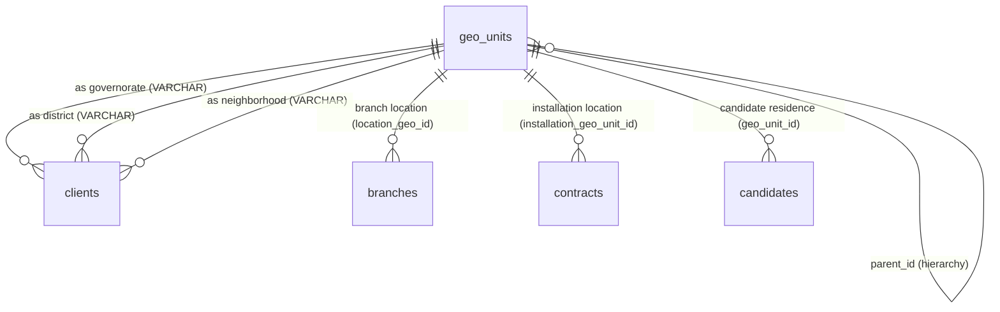

# دستور الكيان: المناطق الجغرافية (Geo Units Domain Constitution)

> **الحالة (Status):** Active / Authoritative  
> **المرجع الأعلى للوحدات والتقسيمات الجغرافية، والتحقق الجغرافي من المسارات، وصلاحيات التغطية للفروع، وتنسيق تمديد العناوين الفني.**

---

## 1. هوية الكيان (Entity Identity)

- **الاسم العربي:** الوحدات الجغرافية / التقسيم الجغرافي الهيكلي
- **الاسم الإنجليزي:** Geo Units
- **اسم الجدول:** `geo_units`
- **الوصف:** الكيان التأسيسي والعمود الفقري لبنية العناوين الجغرافية في Golden CRM. يقوم الكيان بتمثيل المستويات الإدارية والجغرافية في الجمهورية العربية السورية في بنية هرمية تبدأ بالمحافظة (`level = 1`)، تليها المنطقة أو المدينة (`level = 2`)، ثم الحي أو الناحية (`level = 3`). يتم ربط كل وحدة تابعة بالمعرف الأب (`parent_id`) لتأمين تكامل الشجرة الجغرافية. تعتمد عليه كافة الجداول التشغيلية لتحديد التوزيع الميداني وصلاحيات الفرق.
- **الجداول المرتبطة:**
  1. `clients` (عبر حقول العناوين `governorate`, `district`, `neighborhood`).
  2. `candidates` (عبر حقل `geo_unit_id`).
  3. `branches` (عبر الحقل الجغرافي للفرع `location_geo_id` وقائمة التغطية `covered_geo_ids`).
  4. `contracts` (عبر حقل موقع تركيب الأجهزة المعتمد `installation_geo_unit_id`).
  5. `employees` (عبر حقل السكن `residence`).
  6. `routes` & `route_points` (لتوجيه وجدولة مسارات الفرق جغرافياً).
  7. `task_type_config` (عبر حقل أساس المطابقة الجغرافي للمهام `location_basis`).
- **الأهمية والأمان:** يمثل الأساس الجوهري لفلترة وعزل البيانات جغرافياً بين الفروع (Branch Isolation). أي تلاعب في بذر الوحدات الجغرافية أو صلاحيات التغطية يكسر الحماية الأمنية للبيانات.

---

## 2. معجم الجداول والحقول (Table & Field Dictionary)

### 2.1 جدول الوحدات الجغرافية `geo_units`

يخزن الأسماء والمستويات الإدارية للتقسيمات في بنية هرمية متكاملة.

| الحقل (Field) | النوع (SQL Type) | NULL? | DEFAULT | Constraints | الوصف والشرح بالعربية | مثال واقعي (Example) |
|---|---|---|---|---|---|---|
| `id` | `INTEGER` | ❌ | `nextval()` | `PRIMARY KEY` | المعرف الفريد للتقسيم الجغرافي | `12` (المزة) |
| `name` | `VARCHAR(255)` | ❌ | — | — | الاسم الجغرافي للتقسيم | `"المزة"` |
| `level` | `INTEGER` | ❌ | — | — | المستوى الهرمي الإداري (1، 2، 3) | `2` (منطقة/مدينة) |
| `parent_id` | `INTEGER` | ✅ | — | `FK → geo_units(id) ON DELETE CASCADE` | معرف التقسيم الأب الأعلى التابع له | `1` (معرف محافظة دمشق) |

---

### 2.2 فريد فهرس التكامل الثنائي (Unique Index Constraint)

لتفادي تكرار إدخال مناطق أو أحياء بنفس الاسم والمستوى الإداري تحت نفس الأب الجغرافي، يفرض النظام بقاعدة البيانات Index فريداً وصارماً (انظر `053_geo_units_unique_constraint.sql`):
```sql
CREATE UNIQUE INDEX IF NOT EXISTS geo_units_name_level_parent_unique
  ON geo_units (LOWER(name), level, COALESCE(parent_id, 0));
```
*ملاحظة تقنية:* يتم استخدام دالة `COALESCE` لمعالجة القيم الفارغة (`NULL`) في حقل `parent_id` للمحافظات (`level = 1`) حيث تُستبدل بالرقم `0` في الفهرس، كما يُطبق الفحص بحروف صغيرة `LOWER` لضمان عدم الحساسية التامة لحالة الأحرف.

---

### 2.3 بذرة البيانات الجغرافية السورية المعتمدة (Syrian Geo Data)

يقوم النظام ببذر وحقن البيانات الجغرافية الحقيقية للمحافظات والمناطق والأحياء في سوريا (انظر هجرة بذر البيانات `061_syrian_geo_data.sql`):
- **المستوى الأول (Level 1 - المحافظات):** تشمل المحافظات الرئيسية بالداتابيز: `1` (دمشق)، `2` (حلب)، `9` (اللاذقية)، `10` (حمص)، `11` (طرطوس).
- **المستوى الثاني (Level 2 - المناطق والمراكز):** مثل `مزة`, `دوما`, `جرمانا` بمحافظة دمشق، و`الشهباء`, `أعزاز` بمحافظة حلب، و`الواعر`, `القصير` بمحافظة حمص.
- **المستوى الثالث (Level 3 - الأحياء والنواحي):** مثل `مزة القديمة` و`فيلات غربية` التابعة للمزة، و`الحميدية` و`الصالحية` التابعة لدمشق القديمة.

---

## 3. القيود والقواعد التشغيلية (Database Constraints & Business Rules)

### BR-1: الهيكلية الرباعية والتسلسل الإداري (Hierarchy Levels)
يدعم النظام بنية **رباعية المستويات** (وُثّقت خطأً ثلاثية سابقاً — تصحيح 2026-05-24):
- **المستوى الأول (`level = 1`):** المحافظة (Governorate). لا يملك أب جغرافي (`parent_id IS NULL`). مثال: `دمشق`.
- **المستوى الثاني (`level = 2`):** المنطقة أو المدينة (District/City). يتبع لمحافظة. مثال: `دمشق القديمة`.
- **المستوى الثالث (`level = 3`):** الناحية أو الحي الكبير (Sub-district). يتبع لمنطقة. مثال: `الحميدية`.
- **المستوى الرابع (`level = 4`):** الحي الدقيق أو القرية (Neighborhood/Village). يتبع لناحية. مثال: `باب شرقي`.

**القيد المُطبَّق بالـ DB (migration 168):** `CHECK (level IN (1, 2, 3, 4))`
**قاعدة الهرمية (مُطبَّقة بالـ API):** `parent.level = child.level - 1` — المحافظة لا تقبل أباً، وأي مستوى آخر يجب أن يشير لأب من المستوى الأدنى مباشرةً.

### BR-2: قيود الفلترة الجغرافية والصلاحيات (Geo Scope Filtering)
يتم فلترة وحماية عرض البيانات الجغرافية للفرع ديناميكياً بواسطة خوارزمية ذكية بالخادم (انظر `geoScopeService.ts`):
- **نطاق الوصول العام (`GLOBAL`):** يستعلم ويستعرض كافة الوحدات الجغرافية بلا قيود.
- **نطاق الفرع (`BRANCH`):** يرى فقط الوحدات الجغرافية التابعة لنطاق تغطية الفرع المعتمد:
  1. يقوم النظام بقراءة حقل تغطية الفرع `branches.covered_geo_ids` (مصفوفة JSONB).
  2. في حال فرغ المصفوفة، يتم الاعتماد تلقائياً على عنوان مركز الفرع `branches.location_geo_id` كمرجع أساسي وحيد.
  3. يتم بناء قائمة `serviceGeoIds` التي تشتمل على كافة الفروع والأبناء والأحياء الملحقة تحت الكيانات المحددة بالتغطية للتشغيل الميداني.
  4. يتم بناء قائمة `visibleGeoIds` التي تضيف كافة الآباء والأجداد الجغرافيين لتسهيل العرض والملاحة الهرمية بالواجهة الرسومية للفرع.

### BR-3: تركيب ومطابقة المهام جغرافياً (Task Geographic Matching - location_basis)
لتوزيع المهام الميدانية بكفاءة على الفروع، يقوم النظام بالمطابقة الجغرافية بناءً على إعدادات نوع المهمة `task_type_config.location_basis` (انظر هجرة `113`):
- **أساس العميل (`client`):** يتم ربط ومطابقة المهمة جغرافياً وفق الحي السكني للزبون (`clients.neighborhood`). يُستخدم للمهام الشخصية مثل عروض المبيعات (`device_demo`) والهدايا وتشييك العميل الجاري.
- **أساس العقد (`contract`):** يتم ربط ومطابقة المهمة جغرافياً وفق العنوان الجغرافي المعتمد والموثق فعلياً لتركيب الفلتر بـ `contracts.installation_geo_unit_id`. يُستخدم لجميع صيانات الأجهزة والتركيبات والتسليم وتحصيل الأقساط المادية المترتبة على العقد المبرم.

### BR-4: صياغة ودمج وتوصيف العنوان (Address Assembly)
يتم تركيب العنوان النصي الكامل للعملاء والفرق برمجياً عبر دمج أسماء الوحدات الجغرافية الموثقة:
$$\text{Full Address} = \text{Governorate Name} \rightarrow \text{District Name} \rightarrow \text{Neighborhood Name} \rightarrow \text{Detailed Physical Address}$$
- **مثال واقعي:** `"حمص، القصير، حي البلدية، بناية النور ط2"`

---

## 4. العلاقات الهيكلية (Entity Relationships)



---

## 5. قواعد الحذف والنزاهة المرجعية (Deletion & Integrity Rules)

```
[حذف وحدة جغرافية يدوياً] ──► ON DELETE CASCADE ──► [حذف كافة الأحياء والمناطق التابعة]
                                                │
                                                ▼
                                    [المشكلة التاريخية - VARCHAR]
                       (تخلف قيم نصية يتيمة في جدول العملاء دون تحديثها تلقائياً)
```
- **قيد الحذف المتتالي:** عند قيام المدير الإداري للنظام بحذف تقسيم جغرافي (محافظة أو منطقة)، يقوم محرك قاعدة البيانات أوتوماتيكياً بحذف كافة التقسيمات الفرعية والأحياء الملحقة تحتها بـ `ON DELETE CASCADE` على حقل `parent_id`.
- **مخاطر جدول العملاء:** نظراً لعدم وجود قيد ربط فيزيائي لعنوان الزبائن بسبب مشكلة الـ `VARCHAR` (انظر GAP-003)، فإن حذف التقسيم الجغرافي يترك أرقاماً جغرافية يتيمة (مثل `"12"`) داخل حقول الزبائن دون أن يتم حذفها أو تحديثها، مما يولد بيانات تالفة غير مطابقة.

---

## 6. صلاحيات الوصول (Permission Matrix)

| الصلاحية المطلوبة | مفتاح الأمان (Permission Key) | النطاق المسموح (Scope) | الوصف والشرح بالعربية |
|---|---|---|---|
| عرض الوحدات الجغرافية | `geo.view` | GLOBAL / BRANCH | قراءة واستعراض شجرة العناوين الجغرافية |
| إدارة التقسيمات الجغرافية | `geo.manage` | GLOBAL | إضافة تقسيمات جغرافية جديدة أو حذفها |

---

## 7. عقد API (API Contract)

### 7.1 قائمة endpoints المتاحة

| الطريقة | المسار | الصلاحية | وصف |
|---|---|---|---|
| `GET` | `/api/geo-units` | `geo.view` | قائمة كل الوحدات مفلترة حسب scope الفرع |
| `GET` | `/api/geo-units/:id` | `geo.view` | تفاصيل وحدة جغرافية فردية |
| `POST` | `/api/geo-units` | `geo.manage` | إنشاء وحدة جديدة مع تحقق هرمي |
| `PUT` | `/api/geo-units/:id` | `geo.manage` | تعديل اسم الوحدة فقط (level/parent محمي) |
| `DELETE` | `/api/geo-units/:id` | `geo.manage` | حذف — يفشل بـ 409 إذا يوجد أبناء |

#### `GET /api/geo-units`
- **الفلترة:** آلياً وفق `BRANCH` scope إذا كان المستخدم محدود الصلاحية.
- **الاستجابة:**
```json
[
  { "id": 1, "name": "دمشق", "level": 1, "parentId": null },
  { "id": 12, "name": "دمشق القديمة", "level": 2, "parentId": 1 },
  { "id": 45, "name": "الحميدية", "level": 3, "parentId": 12 },
  { "id": 149, "name": "باب شرقي", "level": 4, "parentId": 45 }
]
```

#### `GET /api/geo-units/:id`
- **الاستجابة:** نفس بنية عنصر واحد + `404` إذا غير موجود.

#### `POST /api/geo-units`
- **الصلاحية:** `geo.manage` (GLOBAL فقط).
- **Body:**
```json
{ "name": "حمص القديمة", "level": 2, "parentId": 10 }
```
- **التحقق:** `level IN [1,2,3,4]` ← `parent.level = level - 1` ← unique index.
- **رموز الخطأ:** `400` (تحقق هرمي) / `409` (اسم مكرر).

#### `PUT /api/geo-units/:id`
- **الصلاحية:** `geo.manage` (GLOBAL فقط).
- **Body:** `{ "name": "الاسم المصحح" }` — يُعدّل الاسم فقط، level وparent محميان.
- **رموز الخطأ:** `400` (اسم فارغ) / `404` (غير موجود) / `409` (اسم مكرر).

#### `DELETE /api/geo-units/:id`
- **الصلاحية:** `geo.manage` (GLOBAL فقط).
- **السلوك:** `ON DELETE RESTRICT` — يعيد `409` إذا يوجد أبناء مع رسالة: "احذف الأبناء أولاً".

---

## 8. حالات الاختبار الشاملة (Test Cases)

| معرف الاختبار | سيناريو الاختبار (Scenario) | طريقة الطلب | المدخلات البرمجية (Inputs) | النتيجة المتوقعة (Expected) |
|---|---|---|---|---|
| **TC-01** | عرض شجرة الوحدات الجغرافية | `GET /` | — | الرد بـ `200` مع مصفوفة الوحدات الجغرافية المسموح بعرضها. |
| **TC-02** | إنشاء محافظة جديدة بنجاح | `POST /` | `{ "name": "حماة", "level": 1 }` | الرد بـ `200` وإرجاع سجل المحافظة بـ `parentId = null`. |
| **TC-03** | إنشاء منطقة تابعة بنجاح | `POST /` | `{ "name": "سلمية", "level": 2, "parentId": 12 }` | الرد بـ `200` وحفظ السجل وربطه بـ `parent_id`. |
| **TC-04** | منع تكرار نفس الحي بنفس المستوى | `POST /` | `{ "name": "المزة", "level": 2, "parentId": 1 }` | الرد بـ `409` "إسم مكرر: توجد وحدة جغرافية بنفس الاسم والمستوى". |
| **TC-05** | حذف وحدة مع الأبناء | `DELETE /:id` | `id = 12` (منطقة) | الرد بـ `200` وحذف المنطقة وجميع أحياء المستوى الثالث التابعة لها. |
| **TC-06** | التحقق من فلترة نطاق الفرع | `GET /` | مستخدم بنطاق صلاحية `BRANCH` ومغطى بـ covered_geo_ids = `[12]` (المزة) | إعادة منطقة المزة والمحافظة التابعة لها فقط، وحجب بقية المحافظات والمناطق. |
| **TC-07** | إنشاء حي بدون أب إداري | `POST /` | `{ "name": "حي مخرب", "level": 3, "parentId": null }` | الرد بـ `200` أو `400` حسب منطق النظام (يُنصح بالحظر برمجياً). |
| **TC-08** | حذف وحدة مرتبطة بـ client كعنوان | `DELETE /:id` | `id = 12` (المزة) والعملاء مسجلين بنص `"12"` | الرد بـ `200` وحذف الوحدة الجغرافية بالكامل دون تعديل حقول العملاء (بقاء قيم يتيمة بسبب ثغرة VARCHAR). |
| **TC-09** | محاولة إنشاء مستوى غير مدعوم | `POST /` | `{ "name": "مستوى 0", "level": 0 }` أو level=4 | يُفترض بالخادم الرد بـ `400` (لكن ينجح حالياً بغياب check constraint بالـ DB). |
| **TC-10** | تجميع ودمج عنوان العميل النصي | (implicit) | `governorate = '1'` (دمشق)، `district = '12'` (المزة)، `neighborhood = '123'` (فيلات غربية) | تجميع وعرض العنوان كـ `"دمشق، المزة، فيلات غربية، بناية ٥"` بالواجهة الأمامية. |

---

## 9. الثغرات والتضاربات المكتشفة (Gaps & Contradictions)

### GAP-003: تخزين حقول عناوين الزبائن كـ VARCHAR
* **الموقع:** `migrations/001_core_tables.sql` (clients.governorate, clients.district, clients.neighborhood)
* **الوصف:** يتم تخزين العناوين الجغرافية للزبائن في جدول `clients` كسلاسل نصية (`VARCHAR(255)`) تحوي أرقام التقسيمات كنص (مثل `"12"`) بدلاً من أن تكون أرقام صحيحة مع قيد الربط (`INTEGER REFERENCES geo_units(id)`).
* **التأثير:** 
  - انعدام تام للربط المرجعي والنزاهة الفيزيائية بالـ DB.
  - تعطل تتبع التغييرات الجغرافية وتخلف بيانات يتيمة ومغلوطة بالبحث.
  - إجبار المطورين على القيام بعمليات تحويل قسري صعبة ومكلفة مثل `NULLIF(governorate, '')::int` في الفحوصات واللقطات كالمسجل في الهجرة `167`.
* **الحل المقترح:** تعديل هيكلي شامل لحقول العملاء الجغرافية لتتحول إلى `INTEGER` مع فرض قيد الربط وعمل migration لتطهير البيانات القديمة.

### GAP-034: تخزين سكن الموظفين كـ VARCHAR
* **الموقع:** `migrations/001_core_tables.sql` (employees.residence)
* **الوصف:** امتداداً لثغرة `GAP-003` السابقة، يتم تخزين حقل سكن وموقع الموظفين في جدول `employees` كـ `VARCHAR(255)` بدلاً من ربطه كـ `INTEGER` بالوحدات الجغرافية.
* **التأثير:** تداخل البيانات وصعوبة مطابقة وجدولة وتوزيع الفنيين ميدانياً وفق نطاق سكنهم الحقيقي بشكل أوتوماتيكي ومستقر.
* **الحل المقترح:** تحويل الحقل إلى `INTEGER REFERENCES geo_units(id)` وتحديث إجراءات بذر الموظفين.

### GAP-035: ✅ محلول — إضافة CHECK constraint على `level`
* **الموقع:** `migrations/168_geo_units_constraints.sql`
* **الحل المُطبَّق:** `ALTER TABLE geo_units ADD CONSTRAINT geo_units_level_check CHECK (level IN (1, 2, 3, 4));`
* **ملاحظة:** اكتُشف أثناء الحل أن النظام يدعم 4 مستويات فعلياً (وليس 3). الدستور صُحّح في BR-1.
* **التاريخ:** 2026-05-24

### GAP-036: ✅ محلول — فحص هرمي في POST handler
* **الموقع:** `packages/api/routes/geoUnits.ts` (POST /)
* **الحل المُطبَّق:** فحص `parent.level = child.level - 1` مع رسائل خطأ 400 واضحة لكل حالة.
* **التاريخ:** 2026-05-24

### GAP-037: ✅ محلول — إضافة `GET /:id` و`PUT /:id`
* **الموقع:** `packages/api/routes/geoUnits.ts`
* **الحل المُطبَّق:** `GET /:id` للقراءة الفردية + `PUT /:id` لتعديل الاسم فقط (level وparent محميان من التعديل).
* **التاريخ:** 2026-05-24

### GAP-038: ✅ محلول — استبدال `covered_geo_ids` JSONB بجدول `branch_geo_coverage`
* **الموقع:** `migrations/169_branch_geo_coverage_table.sql` + `geoScopeService.ts` + `branches.ts`
* **الحل المُطبَّق:**
  - إنشاء `branch_geo_coverage (branch_id FK → branches ON DELETE CASCADE, geo_unit_id FK → geo_units ON DELETE CASCADE, PRIMARY KEY (branch_id, geo_unit_id))`
  - ترحيل بيانات `covered_geo_ids` الموجودة — فقط IDs المرتبطة بـ `geo_units` حقيقية
  - حذف عمود `branches.covered_geo_ids`
  - تعديل `loadBranchCoveredGeoIds()` في `geoScopeService` للاستعلام من الجدول الجديد
  - تعديل GET/POST/PUT في `branches.ts` لإدارة الـ junction table باستخدام transactions
* **الفائدة:** حذف أي `geo_unit` يُنظّف تغطية الفروع أوتوماتيكياً — عزل الفروع لا يكسر بعد الآن.
* **التاريخ:** 2026-05-24

### GAP-039: ✅ محلول — استبدال CASCADE بـ RESTRICT
* **الموقع:** `migrations/168_geo_units_constraints.sql` + `packages/api/routes/geoUnits.ts`
* **الحل المُطبَّق:**
  - حذف `geo_units_parent_id_fkey` وإعادة إنشاؤه بـ `ON DELETE RESTRICT`
  - معالجة `err.code === '23503'` في DELETE handler برسالة: "لا يمكن حذف هذه الوحدة — يوجد وحدات تابعة لها. احذف الأبناء أولاً."
* **التاريخ:** 2026-05-24

---

## 10. تاريخ التغييرات الهيكلية (Schema Changelog)

| تاريخ الهجرة | رقم الهجرة (File) | الإجراء والوصف التقني والتأثير |
|---|---|---|
| **2026-04-01** | `001_core_tables.sql`| التأسيس الأساسي الأولي لجدول `geo_units` بأربعة حقول أساسية. |
| **2026-04-14** | `014_branch_id_domain_tables.sql`| إضافة حقول التغطية والمواقع الجغرافية للفروع بصفة JSONB وعلاقات FK للمراكز. |
| **2026-04-16** | `053_geo_units_unique_constraint.sql`| **تحديث التكامل الهيكلي:** إنشاء الفهرس الفريد لمنع تكرار المناطق والأسماء المتطابقة تحت نفس الأب. |
| **2026-04-19** | `060_fix_branch_geo_coverage.sql`| معالجة وتصحيح حقول التغطية وتكامل معطياتها للفروع. |
| **2026-04-20** | `061_syrian_geo_data.sql`| **الهجرة الجغرافية الكبرى:** بذرة وحقن البيانات والتقسيمات الجغرافية السورية الحقيقية لدمشق وحمص وحلب واللاذقية وطرطوس. |
| **2026-04-26** | `101_contracts_installation_address.sql`| ربط العقود مالياً وتقنياً بمواقع تركيب الأجهزة بـ `installation_geo_unit_id`. |
| **2026-04-27** | `113_task_type_config_location_basis.sql`| تأسيس عمود `location_basis` لتنظيم مطابقة وتوزيع المهام الجغرافية للفرق. |
| **2026-05-24** | `167_snapshot_backfill.sql`| ترحيل ونسخ البيانات التاريخية لـ snapshots مع تصفية وعمل casting لحقول VARCHAR الجغرافية لعملاء CRM. |
| **2026-05-24** | `168_geo_units_constraints.sql`| **GAP-035 + GAP-039:** إضافة `CHECK (level IN (1,2,3,4))` + استبدال `ON DELETE CASCADE` بـ `ON DELETE RESTRICT` على `parent_id`. |
| **2026-05-24** | `169_branch_geo_coverage_table.sql`| **GAP-038:** إنشاء جدول `branch_geo_coverage` + ترحيل بيانات `covered_geo_ids` + حذف العمود القديم. |
