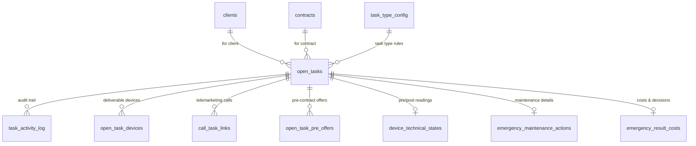

# دستور الكيان: المهام المفتوحة (Open Tasks Domain Constitution)

> **الحالة (Status):** Active Draft / Authoritative  
> **المرجع الأعلى للكيان `open_tasks` وكافة العمليات الميدانية، والتشغيلية، وجداول وسجلات النشاط، وتجهيزات الطوارئ، والعروض المسبقة التابعة له.**

---

## 1. هوية الكيان (Entity Identity)

- **الاسم العربي:** المهمة المفتوحة / التكليف التشغيلي
- **الاسم الإنجليزي:** Open Task
- **اسم الجدول:** `open_tasks`
- **الوصف:** كيان العمليات الميدانية والتشغيلية المركزي والأكثر تعقيداً في النظام. يمثل أي مهمة أو تكليف تشغيلي (توصيل جهاز، تركيب جهاز، صيانة دورية، صيانة طارئة، جمع أسماء تسويقي، ترشيح مباشر، إلخ...) يتم إنشاؤه لصالح عميل أو عقد. يمر التكليف بعدة مراحل (Phases) وحالات (Statuses) من الانتظار والتخطيط إلى التنفيذ الفعلي والإغلاق أو الإلغاء.
- **الأهمية والأمان:** الكيان المحرك للفنيين، والفرق الميدانية، وموظفي المتابعة الهاتفية. أي خلل في حالات هذا الكيان يؤدي إلى تضارب خطط العمل اليومية، ضياع مواعيد الصيانة، أو عدم الفلترة الصحيحة لبيانات الفروع. محمي بصلاحيات تشغيلية بصرامة على مستوى الفرع والسلطة الجغرافية.
- **الجداول الفرعية والملحقة (Sub-Entities):**
  1. `task_activity_log` (سجل الأنشطة وتغير الحالات والمراحل للتدقيق المحاسبي والجنائي).
  2. `open_task_devices` (سجل الأجهزة وموديلاتها والكميات المرتبطة بالتوصيل أو التركيب).
  3. `call_task_links` (جدول الربط المباشر بين المكالمات الهاتفية التسويقية والتكليفات).
  4. `open_task_pre_offers` (العروض المالية والتسويقية المسبقة والخصومات المقترحة قبل توقيع العقد).
  5. `device_technical_states` (سجل القراءات التقنية للجهاز قبل وبعد الصيانة الطارئة).
  6. `emergency_maintenance_actions` (تفصيل الإجراءات الفنية المطبقة للصيانة الطارئة).
  7. `emergency_result_parts` (قطع الغيار المستهلكة في معالجة الطوارئ وتفاصيل سحب التالف).
  8. `emergency_result_costs` (التكاليف المالية وأجور الفك والتركيب والتوصيل والقرارات النهائية للطوارئ).
  9. `emergency_payment_entries` (الدفعات المالية المقبوضة لمهام الطوارئ بعملات مختلفة).
  10. `emergency_installments` (جدولة الأقساط والذمم الناتجة عن تكاليف الصيانة الطارئة).

---

## 2. معجم الجداول والحقول (Table & Field Dictionary)

### 2.1 جدول المهام الرئيسي `open_tasks`

| الحقل (Field) | النوع (SQL Type) | NULL? | DEFAULT | Constraints | الوصف والشرح بالعربية | مثال واقعي (Example) |
|---|---|---|---|---|---|---|
| `id` | `SERIAL` | ❌ | — | `PRIMARY KEY` | المعرف الفريد التلقائي للمهمة | `5012` |
| `client_id` | `INTEGER` | ❌ | — | `FK → clients(id) ON DELETE CASCADE` | معرف الزبون التابع له التكليف | `1024` |
| `branch_id` | `INTEGER` | ❌ | — | `FK → branches(id) ON DELETE RESTRICT` | معرف الفرع التشغيلي الحاضن للمهمة | `1` |
| `task_type` | `VARCHAR(50)` | ❌ | `'device_demo'` | `FK → task_type_config(task_type) ON DELETE RESTRICT` | نوع التكليف التشغيلي (مدخل من الـ 20 نوع المعتمدة) | `"device_delivery"` |
| `task_family` | `VARCHAR(50)` | ❌ | `'marketing'` | `CHECK (task_family IN ...)` | عائلة المهمة (`marketing`, `service`, `maintenance`, `emergency`) | `"delivery"` |
| `reason` | `VARCHAR(100)` | ❌ | `'new_lead'` | `CHECK (reason IN ...)` | السبب التشغيلي للمهمة (`new_lead`, `follow_up`, `renewal`, `service_request`, `other`) | `"service_request"` |
| `status` | `VARCHAR(50)` | ❌ | `'open'` | `CHECK (status IN ...)` | حالة المهمة التفصيلية (انظر الميكرو-حالات الـ 11) | `"in_execution"` |
| `due_date` | `DATE` | ✅ | — | — | تاريخ الاستحقاق الصلب للمهمة | `"2026-05-25"` |
| `priority` | `VARCHAR(20)` | ✅ | — | `CHECK (priority IN ...)` | أولوية التنفيذ للمهمة (`high`, `medium`, `low`) | `"high"` |
| `source` | `VARCHAR(50)` | ❌ | `'system'` | — | قناة توليد المهمة وتكليفها | `"emergency_follow_up"` |
| `marketing_visit_task_id`| `VARCHAR(100)`| ✅ | — | — | (Legacy) معرف التكليف بعد تحويله لزيارة تسويق | `"mvt-802"` |
| `contact_target_id` | `INTEGER` | ✅ | — | — | معرف هدف الاتصال في حال الجدولة للاتصالات | `450` |
| `notes` | `TEXT` | ✅ | — | — | ملاحظات إضافية حول التكليف المكتوب | `"يفضل الاتصال بعد العصر"` |
| `created_by` | `INTEGER` | ✅ | — | `FK → hr_users(id) ON DELETE SET NULL` | معرف الموظف منشئ المهمة | `12` |
| `created_at` | `TIMESTAMPTZ` | ❌ | `NOW()` | — | تاريخ إنشاء السجل بقاعدة البيانات | `"2026-05-24T20:25:00Z"` |
| `updated_at` | `TIMESTAMPTZ` | ❌ | `NOW()` | — | تاريخ تعديل السجل وتحديثه التلقائي | `"2026-05-24T20:26:00Z"` |
| `client_snapshot` | `JSONB` | ✅ | — | — | لقطة بيانات الزبون وقت التكليف (الاسم، الهاتف، العنوان) | `{"name": "أحمد", ...}` |
| `contract_snapshot` | `JSONB` | ✅ | — | — | لقطة بيانات العقد المرتبط وقت إنشاء التكليف | `{"contractNumber": "C-12"}` |
| `team_snapshot` | `JSONB` | ✅ | — | — | لقطة بيانات فريق العمل الميداني المكلف | `{"teamKey": "team_a"}` |
| `origin` | `VARCHAR(50)` | ✅ | `'manual_entry'`| — | تصنيف أصل المهمة المفتوحة | `"manual_entry"` |
| `origin_ref_id` | `INTEGER` | ✅ | — | — | معرف الكيان المسبب (مثل معرف العرض أو التذكرة) | `8014` |
| `assigned_scope_id` | `INTEGER` | ✅ | — | — | معرف نطاق العمل الجغرافي المعين للمهمة | `12` |
| `assigned_team_key` | `VARCHAR(50)` | ✅ | — | — | معرف كود الفريق التشغيلي المكلف ميدانياً | `"team_a"` |
| `contract_id` | `INTEGER` | ✅ | — | `FK → contracts(id) ON DELETE SET NULL` | معرف العقد المالي المرتبط بالتكليف | `4025` |
| `expected_date` | `DATE` | ✅ | — | — | التاريخ المرن المتوقع لالتزام العميل ("تعال الأسبوع القادم") | `"2026-05-30"` |
| `last_waiting_status` | `VARCHAR(20)` | ✅ | — | `CHECK (last_waiting_status IN ...)` | الحالة الانتظارية السابقة للعودة لها عند إلغاء التخطيط | `"open"` / `"needs_follow_up"` |
| `cancellation_reason` | `TEXT` | ✅ | — | — | شرح وتبرير سبب إلغاء التكليف | `"الزبون مسافر خارج البلاد"` |
| `waiting_reason_id` | `INTEGER` | ✅ | — | `FK → system_lists(id) ON DELETE SET NULL` | معرف سبب الانتظار المعياري من القوائم | `105` |
| `waiting_reason_text` | `TEXT` | ✅ | — | — | تفصيل يدوي إضافي لسبب بقاء التكليف معلقاً | `"بانتظار وصول الفلاتر من المستودع"` |
| `attempt_count` | `INTEGER` | ❌ | `0` | `CHECK (attempt_count >= 0)` | عدد محاولات الاتصال والتواصل المسجلة للمهمة | `3` |
| `last_attempt_at` | `TIMESTAMPTZ` | ✅ | — | — | تاريخ آخر محاولة اتصال مسجلة فدائياً | `"2026-05-24T18:00:00Z"` |
| `assigned_for_date` | `DATE` | ✅ | — | — | التاريخ المخصص لتنفيذ المهمة ميدانياً بالجدول | `"2026-05-25"` |
| `assigned_at` | `TIMESTAMPTZ` | ✅ | — | — | تاريخ تخصيص المهمة وتعيين الفريق الفعلي | `"2026-05-24T19:30:00Z"` |
| `excluded_for_date` | `DATE` | ✅ | — | — | تاريخ استبعاد المهمة تشغيلياً من الجداول | `"2026-05-25"` |
| `excluded_reason` | `TEXT` | ✅ | — | — | تبرير سبب الاستبعاد اليدوي | `"تم ترحيلها بطلب الإدارة"` |
| `em_pre_state_id` | `INTEGER` | ✅ | — | `FK → device_technical_states(id)` | معرف القراءة الفنية الأولى قبل الصيانة الطارئة | `702` |
| `em_post_state_id` | `INTEGER` | ✅ | — | `FK → device_technical_states(id)` | معرف القراءة الفنية النهائية بعد الصيانة الطارئة | `703` |
| `em_action_id` | `INTEGER` | ✅ | — | `FK → emergency_maintenance_actions(id)` | معرف الإجراءات والتعديلات الفنية التي نفذت | `14` |
| `em_costs_id` | `INTEGER` | ✅ | — | `FK → emergency_result_costs(id)` | معرف التكاليف والقرارات المالية النهائية للطوارئ | `88` |

---

### 2.2 جدول سجل الأنشطة للمهمة `task_activity_log`

يتبع نمط الأرشفة التشغيلية والتدقيق الجنائي لحركة المهام وحالاتها.

| الحقل (Field) | النوع (SQL Type) | NULL? | DEFAULT | Constraints | الوصف والشرح بالعربية |
|---|---|---|---|---|---|
| `id` | `BIGSERIAL` | ❌ | — | `PRIMARY KEY` | المعرف الفريد التلقائي للنشاط |
| `task_id` | `INTEGER` | ❌ | — | `FK → open_tasks(id) ON DELETE CASCADE` | معرف المهمة المفتوحة المرتبط بها النشاط |
| `event_type` | `VARCHAR(50)` | ❌ | — | `CHECK (event_type IN ...)` | نوع الحدث المسجل (انظر BR-3 للأنشطة) |
| `performed_by` | `INTEGER` | ✅ | — | `FK → hr_users(id) ON DELETE SET NULL` | معرف الموظف الذي قام بالفعل |
| `role` | `VARCHAR(50)` | ✅ | — | — | لقطة لدور الموظف وقت تنفيذ الحدث |
| `old_value` | `TEXT` | ✅ | — | — | القيمة القديمة قبل التعديل |
| `new_value` | `TEXT` | ✅ | — | — | القيمة الجديدة بعد التعديل |
| `reason` | `TEXT` | ✅ | — | — | تبرير يدوي أو آلي للحدث |
| `reference_id` | `BIGINT` | ✅ | — | — | معرف مرجعي إضافي لأي كيان ملحق |
| `created_at` | `TIMESTAMPTZ` | ❌ | `NOW()` | — | تاريخ توثيق وحصول الحدث والنشاط |

---

### 2.3 جدول أجهزة التكليف `open_task_devices`

يوثق الأجهزة المادية وقطع الغيار الملحقة تشغيلياً قبل التوصيل الفعلي.

| الحقل (Field) | النوع (SQL Type) | NULL? | DEFAULT | Constraints | الوصف والشرح بالعربية |
|---|---|---|---|---|---|
| `id` | `BIGSERIAL` | ❌ | — | `PRIMARY KEY` | المعرف الفريد التلقائي للجهاز الملحق |
| `task_id` | `INTEGER` | ❌ | — | `FK → open_tasks(id) ON DELETE CASCADE` | معرف المهمة المرتبطة |
| `device_model_id` | `INTEGER` | ✅ | — | `FK → device_models(id) ON DELETE SET NULL` | معرف موديل الجهاز |
| `device_name_snapshot`| `VARCHAR(255)`| ❌ | — | — | لقطة لاسم الجهاز عند التوثيق لمنع تداخل الحذف |
| `quantity` | `INTEGER` | ❌ | `1` | `CHECK (quantity > 0)` | كمية الأجهزة المطلوبة للمهمة |
| `created_at` | `TIMESTAMPTZ` | ❌ | `NOW()` | — | تاريخ إنشاء السجل |

---

### 2.4 جدول ربط المكالمات بالمهام `call_task_links`

جدول ربط من نوع (Many-to-Many) يوثق التنسيق بين المكالمات التسويقية والمهام الناتجة.

| الحقل (Field) | النوع (SQL Type) | NULL? | DEFAULT | Constraints | الوصف والشرح بالعربية |
|---|---|---|---|---|---|
| `call_id` | `VARCHAR(255)` | ❌ | — | `FK → customer_call_logs(id) ON DELETE CASCADE` | معرف المكالمة الهاتفية |
| `task_id` | `INTEGER` | ❌ | — | `FK → open_tasks(id) ON DELETE CASCADE` | معرف المهمة المفتوحة الناتجة أو المحدثة |
| `created_at` | `TIMESTAMPTZ` | ❌ | `NOW()` | — | تاريخ توثيق الرابط والاتصال |

---

### 2.5 جدول العروض المسبقة للمهمة `open_task_pre_offers`

يوثق عروض الأسعار والدراسات المالية المرفقة مع عروض المبيعات قبل الاعتماد المالي والتوقيع الفعلي.

| الحقل (Field) | النوع (SQL Type) | NULL? | DEFAULT | Constraints | الوصف والشرح بالعربية |
|---|---|---|---|---|---|
| `id` | `BIGSERIAL` | ❌ | — | `PRIMARY KEY` | المعرف التلقائي للعرض المالي المسبق |
| `open_task_id` | `INTEGER` | ❌ | — | `FK → open_tasks(id) ON DELETE CASCADE` | معرف المهمة المفتوحة الحاضنة |
| `device_model_id` | `INTEGER` | ❌ | — | — | معرف موديل الجهاز محل الدراسة والعرض |
| `offer_type` | `VARCHAR(50)` | ❌ | — | `CHECK (offer_type IN ('cash', 'installment'))` | تصنيف نمط الدفع المقترح بالعرض المسبق |
| `quantity` | `INTEGER` | ❌ | `1` | `CHECK (quantity > 0)` | كمية الأجهزة المقترحة بالعرض |
| `total_amount` | `NUMERIC` | ❌ | — | `CHECK (total_amount >= 0)` | إجمالي قيمة العرض بالليرة السورية |
| `first_payment_amount`| `NUMERIC`| ✅ | — | `CHECK (first_payment_amount >= 0)` | قيمة الدفعة الأولى المقترحة بالعرض |
| `installment_months`| `INTEGER` | ✅ | — | `CHECK (installment_months > 0)` | عدد شهور التقسيط المقترحة |
| `currency` | `VARCHAR(10)` | ❌ | — | — | العملة المعتمدة للدراسة والعرض |
| `discount_percentage`| `NUMERIC` | ✅ | — | `CHECK (discount_percentage >= 0)` | نسبة الخصم المقترحة بالعرض المسبق |
| `closed_by_employee_id`| `INTEGER`| ✅ | — | `FK → employees(id) ON DELETE SET NULL` | معرف الموظف الذي قام بإغلاق ودراسة العرض |
| `no_closing_reason`| `TEXT` | ✅ | — | — | سبب عدم نجاح إغلاق وتأكيد العرض المبيعاتي |
| `applied_device_discount_id`| `INTEGER`| ✅ | — | `FK → device_discounts(id) ON DELETE SET NULL` | معرف الخصم النشط المطبق من النظام |
| `created_at` | `TIMESTAMPTZ` | ❌ | `NOW()` | — | تاريخ إنشاء السجل المالي المسبق |
| `updated_at` | `TIMESTAMPTZ` | ❌ | `NOW()` | — | تاريخ التعديل وتحديث السجل |

---

## 3. القيود والقواعد (Constraints & Business Rules)

### 3.1 قيود محددات قاعدة البيانات (Database Constraints)
- **Cascade Deletion:** الجداول الفرعية الأربعة التابعة (`task_activity_log`, `open_task_devices`, `call_task_links`, `open_task_pre_offers`, `emergency_result_parts`, `emergency_maintenance_actions`, `emergency_result_costs`) تتمتع بقيد الربط `ON DELETE CASCADE` مع جدول `open_tasks` الرئيسي، مما يؤدي لحذفها الكامل فيزيائياً بمجرد حذف المهمة.
- **Partial Unique Constraint:** يفرض النظام قيداً فريداً صارماً عبر الفهرس الجزئي:
  ```sql
  CREATE UNIQUE INDEX idx_open_tasks_unique_active
    ON open_tasks (client_id, task_type)
    WHERE status IN ('open', 'needs_follow_up')
      AND task_type != 'emergency_maintenance';
  ```
  يضمن هذا المنطق **عدم إمكانية وجود أكثر من مهمة واحدة نشطة قيد الانتظار** من نفس النوع لنفس العميل، باستثناء الصيانة الطارئة `emergency_maintenance` والتي يسمح بتكرارها لتغطية المشاكل التقنية المتتالية.

### 3.2 قواعد العمل البرمجية والتشغيلية (Business Rules)

#### BR-1: معيار توطين جغرافية المهام (Task Location Basis)
تعتمد تصفية وتخصيص مهام الفنيين في قاعدة البيانات والمطابقة مع مناطق التغطية (`workScopes`) على حقل `location_basis` في جدول إعدادات أنواع المهام `task_type_config`:
1. **موقع الزبون (`client`):** للمهام التي تركز على هوية العميل والتعاقد الأول مثل عرض الجهاز `device_demo` أو تسليم الهدايا `gift_delivery` أو إبرام العقد `device_purchase`. يتم قراءة إحداثيات ومناطق العميل الأصلي `clients.neighborhood`.
2. **موقع الجهاز (`contract`):** للمهام التشغيلية المادية والتركيبية التي ترتبط بالتركيب الجغرافي الفعلي مثل تسليم الجهاز `device_delivery` أو صيانته وتحصيل دفعاته. يتم قراءة العنوان الدقيق الموثق في العقد `contracts.installation_geo_unit_id` وهو ما يعالج GAP-006.

#### BR-2: تتبع سجلات أنشطة التكليف (Task Activity Event Types)
يتم فرض قيد فحص صارم في الـ DB يحد من أنواع الأحداث المقبولة في جدول `task_activity_log` لمنع تداخل التوثيق:
`CHECK (event_type IN ('status_change', 'note_added', 'rescheduled', 'assigned', 'reassigned', 'call_made', 'priority_changed', 'team_assigned', 'team_changed', 'lifecycle_skip'))`.

#### BR-3: التخصيص الثنائي للفريق والأفراد (Assignment Priority)
- عند تعيين جدول العمل اليومي الميداني (`POST /api/open-tasks/:id/assign-team`)، يتم توثيق الفريق المكلف في العمود `assigned_team_key` وحفظ قراءات الفنيين ميدانياً.
- عند رغبة المشرف بفرض فني أو موظف معين، يتم إرسال معرف الموظف وتخزينه في `employee_id` أو `assigned_telemarketer_id` حسب طبيعة عائلة المهمة التشغيلية.

#### BR-4: استقلالية الاستبعاد والإلغاء (Exclusion vs Cancellation)
1. **الإلغاء (`cancelled`):** حالة نهائية تشير لفشل إتمام المهمة وعدم صلاحيتها للاستمرار ويجب توثيق شرح كامل في حقل `cancellation_reason`.
2. **الاستبعاد (`excluded`):** خيار تشغيلي ديناميكي مؤقت يقوم بإخفاء المهام المعلقة من كشوف وجداول التحضير اليومية للفروع دون حذفها أو إلغائها لتمكين المشرفين من إرجاء مهام المواسم أو أصحاب العقود الخاصة. ويتم عبر تسجيل `excluded_for_date` و `excluded_reason`.

#### BR-5: التكامل مع منظومة تتبع الأجهزة مبيعاتياً (Lifecycle Propagation Hook)
ترتبط مهام التوصيل والتركيب والتفعيل مباشرة بالعقود المالية. بمجرد قيام الفني ميدانياً بتغيير حالة المهمة التابعة لـ `device_delivery` إلى `completed`:
- يقوم السيرفر تلقائياً بتحديث العقد المرتبط `contracts.device_status = 'delivered'`.
- يقوم السيرفر بإنشاء وإطلاق مهمة التركيب التالية `device_installation` أوتوماتيكياً لصالح الفنيين بفرع العقد لتأمين دورة العمل.

---

## 4. العلاقات بين الجداول (Entity Relationships)



---

## 5. آلة الحالات التشغيلية (State Machine)

تتألف حركة المهمة المفتوحة من **11 حالة تشغيلية فرعية** يتم تمثيلها واشتقاقها برمجياً إلى **4 مراحل كبرى** (Phases) غير مخزنة بالـ DB ويتم حسابها لحظياً عبر خوارزمية السيرفر:

```
                  ┌──────────────────────────────────────────────┐
                  │              Phase 1: Waiting                │
                  │        (open, needs_follow_up)               │
                  └──────────────────────┬───────────────────────┘
                                         │
                                   Assignment
                                         ▼
                  ┌──────────────────────────────────────────────┐
                  │              Phase 2: Planning               │
                  │   (assigned, in_scheduling, scheduled)       │
                  └──────────────────────┬───────────────────────┘
                                         │
                                   Team Accepts
                                         ▼
                  ┌──────────────────────────────────────────────┐
                  │              Phase 3: Execution              │
                  │   (waiting_execution, in_execution, ended)   │
                  └──────────────────────┬───────────────────────┘
                                         │
                                 Result Form Sent
                                         ▼
                  ┌──────────────────────────────────────────────┐
                  │               Phase 4: Closure               │
                  │       (completed, closed, cancelled)         │
                  └──────────────────────────────────────────────┘
```

- **الاستبعاد الجانبي (Excluded):** التكليف بأي مرحلة أو حالة يمكن توثيقه بالاستبعاد `excluded = TRUE` مما يحجبه من جميع القوائم النشطة ونقله لأرشيف الاستبعاد. ويتم استعادته عبر مسار الـ restore ليعود لوضعه السابق وحالته القديمة المخزنة تلقائياً.

---

## 6. صلاحيات الوصول (Permission Matrix)

> [!WARNING]
> **ثغرة هيكلية مؤجلة (GAP-017):** جميع مسارات الكيان `open_tasks` في `routes/openTasks.ts` محمية بصلاحيات الكيان القديم `marketing_visits` (`marketing_visits.view` و`marketing_visits.update_result`). الجدول أدناه يعرض الوضع الفعلي الحالي والمستهدف المقترح. لا يوجد خطر أمني — الصلاحيات موجودة ومطبّقة — لكن التسمية تخلط المفاهيم على المطورين الجدد. الحل يتطلب مرحلة migration مستقلة.

| المسار التشغيلي | الصلاحية الفعلية الحالية | الصلاحية المستهدفة | النطاق | الوصف |
|---|---|---|---|---|
| `GET /` | `marketing_visits.view` | `open_tasks.view` | BRANCH/GLOBAL | كشف المهام للفرع |
| `GET /client/:clientId` | `marketing_visits.view` | `open_tasks.view` | BRANCH/GLOBAL | مهام زبون محدد |
| `GET /device-demo` | `marketing_visits.view` | `open_tasks.view` | BRANCH/GLOBAL | كشف مهام عروض الأجهزة |
| `GET /scope/:scopeId` | `marketing_visits.view` | `open_tasks.view` | BRANCH/GLOBAL | مهام نطاق عمل |
| `GET /:id` | `marketing_visits.view` | `open_tasks.view` | BRANCH/GLOBAL | تفاصيل مهمة واحدة |
| `GET /:id/emergency-result` | `marketing_visits.view` | `open_tasks.view` | BRANCH/GLOBAL | تفاصيل نتيجة الطوارئ |
| `GET /:id/activity` | `marketing_visits.view` | `open_tasks.view` | BRANCH/GLOBAL | سجل الأنشطة |
| `GET /:id/devices` | `marketing_visits.view` | `open_tasks.view` | BRANCH/GLOBAL | أجهزة المهمة |
| `GET /:id/calls` | `marketing_visits.view` | `open_tasks.view` | BRANCH/GLOBAL | مكالمات المهمة |
| `POST /` | `marketing_visits.update_result` | `open_tasks.create` | BRANCH/GLOBAL | إنشاء مهمة جديدة |
| `POST /:id/assign-team` | `marketing_visits.update_result` | `open_tasks.edit` | BRANCH/GLOBAL | تعيين الفريق |
| `PATCH /:id` | `marketing_visits.update_result` | `open_tasks.edit` | BRANCH/GLOBAL | تحديث الحالة والتواريخ |
| `POST /:id/emergency-result` | `marketing_visits.update_result` | `open_tasks.edit` | BRANCH/GLOBAL | إغلاق الطوارئ |
| `POST /:id/assign-scope` | `marketing_visits.update_result` | `open_tasks.edit` | BRANCH/GLOBAL | تعيين نطاق عمل |
| `POST /:id/exclude` | `marketing_visits.update_result` | `open_tasks.edit` | BRANCH/GLOBAL | استبعاد المهمة |
| `POST /:id/restore` | `marketing_visits.update_result` | `open_tasks.edit` | BRANCH/GLOBAL | استرجاع المهمة |
| `POST /bulk-exclude` | `marketing_visits.update_result` | `open_tasks.edit` | BRANCH/GLOBAL | استبعاد مجمّع |
| `POST /bulk-restore` | `marketing_visits.update_result` | `open_tasks.edit` | BRANCH/GLOBAL | استرجاع مجمّع |
| `GET /:id/activity` | `marketing_visits.view` | `open_tasks.view` | BRANCH/GLOBAL | قراءة سجل النشاط |
| `POST /:id/activity` | `marketing_visits.update_result` | `open_tasks.edit` | BRANCH/GLOBAL | إضافة نشاط يدوي |

---

## 7. عقد API (API Contract)

### 7.1 قائمة endpoints الكاملة

| المسار | الصلاحية | الوصف | Query Params / Body |
|---|---|---|---|
| `GET /` | `marketing_visits.view` | كشف مهام الفرع | `branchId`، `status`، `taskType` |
| `GET /client/:clientId` | `marketing_visits.view` | مهام زبون محدد — بدون فلترة فرع للسوبرأدمن | — |
| `GET /device-demo` | `marketing_visits.view` | كشف مهام عروض الأجهزة مع بيانات الزيارة | `status`، `visitStatus`، `scheduledDate`، `hideSnoozed`، `hideFutureTasks` |
| `GET /scope/:scopeId` | `marketing_visits.view` | مهام نطاق عمل جغرافي محدد | — |
| `GET /:id` | `marketing_visits.view` | تفاصيل مهمة واحدة كاملة | — |
| `GET /:id/emergency-result` | `marketing_visits.view` | تفاصيل نتيجة الصيانة الطارئة | — |
| `GET /:id/activity` | `marketing_visits.view` | سجل أنشطة المهمة مرتب تصاعدياً | — |
| `GET /:id/devices` | `marketing_visits.view` | أجهزة المهمة المرفقة | — |
| `GET /:id/calls` | `marketing_visits.view` | مكالمات المهمة (مع legacy fallback) | — |
| `POST /` | `marketing_visits.update_result` | إنشاء مهمة يدوية | `clientId`✱، `branchId`✱، `taskType`، `taskFamily`، `reason`✱، `priority`، `dueDate`، `expectedDate`، `contractId`، `devices[]`، `preOffers[]` |
| `POST /:id/assign-team` | `marketing_visits.update_result` | تعيين فريق → يُحوّل الحالة لـ `scheduled` | `supervisorId`، `technicianId`، `traineeId` |
| `PATCH /:id` | `marketing_visits.update_result` | تحديث حالة / تواريخ / أولوية | `status`، `dueDate`، `expectedDate`، `priority`، `waitingReasonId`، `waitingReasonText`، `notes` |
| `POST /:id/emergency-result` | `marketing_visits.update_result` | إغلاق طوارئ وتوليد مهمة متابعة | `finalDecision`، `laborCost`، `partsCost`، `discountPercentage`، `followUpExpectedDate` |
| `POST /:id/assign-scope` | `marketing_visits.update_result` | تعيين نطاق عمل جغرافي للمهمة | `scopeId` |
| `POST /:id/exclude` | `marketing_visits.update_result` | استبعاد مهمة من قوائم اليوم | `reason`، (date تلقائي = today) |
| `POST /:id/restore` | `marketing_visits.update_result` | استرجاع مهمة مستبعدة | — |
| `POST /bulk-exclude` | `marketing_visits.update_result` | استبعاد مجمّع لعدة مهام | `taskIds[]`✱، `reason` |
| `POST /bulk-restore` | `marketing_visits.update_result` | استرجاع مجمّع لعدة مهام | `taskIds[]`✱ |
| `GET /:id/activity` | `marketing_visits.view` | قراءة سجل النشاط | — |
| `POST /:id/activity` | `marketing_visits.update_result` | إضافة نشاط / ملاحظة يدوية | `eventType`، `note`، `oldValue`، `newValue` |
| `POST /:id/devices` | `marketing_visits.update_result` | إضافة جهاز للمهمة | `deviceModelId`، `deviceNameSnapshot`، `quantity` |

✱ = حقل مطلوب

### 7.2 منطق أساسي في POST /

- `taskType` يُتحقق منه مقابل `task_type_config` → يُعيد `400` إن لم يوجد (GAP-065 ✅)
- `taskFamily` يُتحقق منه مقابل قيم CHECK constraint → يُعيد `400` (GAP-065 ✅)
- `reason` يُتحقق منه مقابل `system_lists` → يُعيد `400`
- فحص `branch.status = 'inactive'` → يُعيد `400` (GAP-049 ✅)
- عند النجاح: يحفظ `client_snapshot` تلقائياً + يُنشئ `open_task_devices` و`open_task_pre_offers` ضمن transaction

### 7.3 رموز الاستجابة الموحدة

| الرمز | الحالة |
|---|---|
| `200` | نجاح |
| `400` | حقل مطلوب ناقص أو قيمة غير صالحة |
| `403` | لا صلاحية أو المهمة لفرع آخر |
| `404` | المهمة غير موجودة |
| `500` | خطأ داخلي |

---

## 8. حالات الاختبار الشاملة (Test Cases)

| الرمز | سيناريو الفحص والاختبار | الطريقة والمسار | المدخلات المرسلة | السلوك المتوقع والاستجابة | ملاحظات تشغيلية |
|---|---|---|---|---|---|
| **TC-01** | إنشاء مهمة عرض جهاز للعميل | POST `/api/open-tasks` | كائن مهمة كامل يخص العميل `1024`. | ترميز `200` مع نجاح التأسيس والـ default status لـ `open` والمرحلة لـ `waiting`. | يتم أوتوماتيكياً حفظ لقطة العميل في حقل `client_snapshot`. |
| **TC-02** | محاولة تكرار مهمة نشطة قيد الانتظار | POST `/api/open-tasks` | إرسال نفس نوع المهمة والعميل النشط. | ترميز `400` أو فشل قاعدة البيانات بسبب قيد idx_open_tasks_unique_active. | يحظر تراكم نفس المهام المكررة المعلقة للزبون. |
| **TC-03** | تخصيص فريق مالي ميداني للمهمة | POST `/:id/assign-team` | إرسال كود الفريق `team_a` وتاريخ التنفيذ. | ترميز `200` ونقل التكليف لحالة `assigned` ومرحلة `planning`. | يتم توثيق الحدث وتاريخ التعيين في سجل النشاط. |
| **TC-04** | استبعاد مهمة وتجميدها يدوياً | POST `/:id/exclude` | إرسال سبب الاستبعاد وتاريخ التجميد. | ترميز `200` ونجاح راية الاستبعاد `excluded = TRUE`. | يحجب التكليف من جداول التحضير النشطة للفنيين. |
| **TC-05** | استعادة مهمة مجمدة لوضعها السابق | POST `/:id/restore` | إرسال طلب استعادة معرف المهمة. | ترميز `200` وإرجاع المهمة لوضعها المسبق وتصفير راية الاستبعاد. | يعيد التكليف للظهور في جداول التخطيط اليومية للفرع. |
| **TC-06** | إغلاق مهمة صيانة طارئة ناجحة | POST `/:id/emergency-result` | إرسال قرار حل المشكلة `resolved` والتكاليف. | ترميز `200` وتحويل المهمة للحالة النهائية `completed` وإغلاقها محاسبياً. | يتم حفظ إجمالي التكاليف والمقبوضات وتصفية الذمم. |
| **TC-07** | معالجة طوارئ معلقة بحاجة لمتابعة | POST `/:id/emergency-result` | إرسال قرار المتابعة `needs_followup` مع التاريخ. | ترميز `200` وتوليد مهمة طوارئ لاحقة تلقائياً بحالة `needs_follow_up`. | يعبر عن منطق الربط والمتابعة الآلية لنتائج الطوارئ. |
| **TC-08** | محاولة قراءة سجل نشاط المهمة | GET `/:id/activity` | استدعاء تفاصيل حركة المهمة المحددة. | ترميز `200` وإرجاع مصفوفة الأنشطة الزمنية مرتبة تصاعدياً. | يساعد في تتبع أداء الموظفين وإجراء التحقيقات. |

---

## 9. الثغرات والتضاربات المكتشفة (Gaps & Contradictions)

تم رصد عدد من العيوب الهيكلية الفادحة في معمارية وإعدادات كيان المهام المفتوحة:

### 🚨 9.1 الثغرة الأولى: تضارب مسميات الصلاحيات والتحقق بالخلفية (Legacy Permissions Mismatch)
- **التضارب:** يعتمد الكود بشكل مطلق في حماية مسارات `open_tasks` على صلاحيات الكيان القديم المسمى `marketing_visits` (مثل `marketing_visits.view` و `marketing_visits.update_result`) بدلاً من اعتماد مسميات مخصصة للكيان الموحد الجديد.
- **الأثر التشغيلي:** صعوبة ضبط الأدوار بدقة تامة في لوحة الإدارة وتداخل المفاهيم الأمنية للمطورين الجدد.
- **التوصية:** إعادة بذر وتعديل الصلاحيات بكامل طبقات الكود لقيم موحدة تعتمد الكيان المباشر `open_tasks.view`.

### ⚠️ 9.2 الثغرة الثانية: تداخل وتراكم جداول المهام والزيارات القديمة (Legacy Database Duplications)
- **التضارب:** احتفاظ قاعدة البيانات بالجدولين التاريخيين `tasks` و `marketing_visit_tasks` على الرغم من تفويض الكيان الموحد الجديد `open_tasks` بالقيام بكامل الدور الفني والتشغيلي.
- **الأثر التشغيلي:** تراكم جداول وأعمدة ميتة بالداتابيز تسبب إرباكاً للمطورين وتكرار بيانات معطل فيزيائياً.
- **التوصية:** إعداد نص هجرة نهائي شطب لتنظيف وتطهير قاعدة البيانات من الكيانات Deprecated بعد التحقق.

### ⚠️ 9.3 الثغرة الثالثة: افتقار الكيان التشغيلي الأهم لنظام الحذف الناعم (Lack of Soft-Delete Pattern)
- **التضارب:** على غرار العقود، لا يملك جدول `open_tasks` الرئيسي عمود الحذف الناعم `deleted_at`. ومسار الحذف المتاح يقضي بحذف السجل كاملاً وشطب كافة التوابع أوتوماتيكياً بموجب `ON DELETE CASCADE`.
- **الأثر التشغيلي:** ضياع البيانات التاريخية لأداء الفنيين والفرق وتخريب إحصائيات تقارير الصناديق والمحاولات دون وجود أثر جنائي للتدقيق.
- **التوصية:** إلحاق راية الحذف الناعم وتعديل مسارات الإرجاع.

### ⚠️ 9.4 الثغرة الرابعة: غياب التحقق من صحة وقيم الدفعات وجدولة أقسام الطوارئ (Unverified Emergency Dues Confirmation)
- **التضارب:** في مسار confirm لجدولة أقساط الطوارئ (`POST /:id/installments/confirm`)، لا يتأكد النظام من اتساق تواريخ استحقاق الأقساط أو خلوها من التداخل الزمني، كما يقبل إدخال قيم وذمم غير مطابقة محاسبياً دون فحص رياضي رادع.
- **الأثر التشغيلي:** توليد ذمم وديون مشوهة تاريخياً بالداتابيز قد تؤدي لعرقلة نظام التحصيل والمتابعة الهاتفية للفروع.
- **التوصية:** فرض تحقق رياضي وفني صارم بالـ Backend قبل إجراء الـ Commit النهائي.

### ✅ GAP-064: رسائل خطأ POST / كانت بالإنجليزية
* **الموقع:** `packages/api/routes/openTasks.ts:564-592`
* **الحل المُطبَّق:** استبدال `'clientId is required'`، `'branchId is required'`، و`'reason is required and must be selected from system lists'` برسائل عربية متسقة مع بقية الـ API.
* **التاريخ:** 2026-05-25

### ✅ GAP-065: غياب validation لـ `taskFamily` و`taskType` في POST /
* **الموقع:** `packages/api/routes/openTasks.ts:560-561`
* **الحل المُطبَّق:** 
  - `taskFamily`: فحص مقابل `Set` ثابت للقيم الثمانية المسموحة → `400` فوري بدل انتظار فشل CHECK constraint من الـ DB
  - `taskType`: استعلام `SELECT FROM task_type_config` → `400` إن لم يوجد النوع بدل فشل FK violation يُعيد `500`
* **التاريخ:** 2026-05-25

### ⚠️ 9.5 الثغرة الخامسة: عدم مطابقة فرع المهمة لفرع تسجيل الزبون الأصلي (Branch Context Inconsistency)
- **التضارب:** يسمح النظام تشغيلياً بإنشاء مهمة للمستخدم بفرع مختلف عن فرع العميل الأصلي. ولكن عمليات التصفية وقراءة البيانات للمشرفين في واجهة المستخدم تفترض أحياناً حصرها الجغرافي استناداً لفرع الزبون مما يؤدي لاختفاء و"توهان" بعض المهام من لوحة التحكم.
- **الأثر التشغيلي:** تعطل العمل الميداني وصعوبة التنسيق لبعض الفنيين بين المحافظات.
- **التوصية:** توحيد وتوثيق نطاق فرع المهمة بشكل معزول وصريح والاعتماد عليه دائماً في الفلترة.

---

## 10. تاريخ التغييرات الهيكلية (Schema Changelog)

| تاريخ الهجرة | ملف الهجرة (Migration File) | طبيعة التعديل وهدف التأثير الفني والتشغيلي على الجدول |
|---|---|---|
| **2026-04** | `055_open_tasks.sql` | التأسيس الهيكلي الأولي للجدول الرئيسي `open_tasks` وفهرسة القيود وتحديد الحالات الأولية. |
| **2026-04** | `056_open_tasks_constraints.sql` | إضافة قيود التحقق للأولويات وصياغة الزناد التلقائي لتحديث تواريخ التعديل `updated_at`. |
| **2026-04** | `057_open_task_link.sql` | ربط المهام المفتوحة بالزيارات التشغيلية للزبائن وتخصيص مفاتيح الربط. |
| **2026-04** | `058_appointment_visit_open_task_link.sql`| ربط التكليفات بسلسلة المواعيد والمكالمات وزيارات المبيعات لضمان سلامة التدفق. |
| **2026-04** | `066_open_tasks_emergency.sql` | دمج عائلة الصيانة الطارئة وتعديل قيد التكليف ليتسع لمهام طوارئ الفنيين. |
| **2026-04** | `068_open_tasks_snapshots.sql` | تدشين نظام لقطات البيانات الفدائية (`JSONB`) لتخزين بيانات الزبون والعقد والفريق وقت التكليف. |
| **2026-04** | `069_fix_emergency_unique.sql` | ضبط الفهرس الفريد النشط واستثناء الصيانة الطارئة للسماح بتكرارها عند الحاجة. |
| **2026-04** | `070_visit_core_schema.sql` | ربط زيارات الفنيين ميدانياً بالتكليفات المفتوحة عبر حقل المفتاح الأجنبي `source_open_task_id`. |
| **2026-04** | `076_scope_tasks.sql` | تأسيس جدول الربط الجغرافي `scope_tasks` وتخصيص التكليفات حسب فرق العمل. |
| **2026-04** | `077_expand_open_tasks.sql` | توسيع الجدول لإضافة تصنيفات الأصل والتعيين ومصادر المهام المفتوحة يدوياً وتلقائياً. |
| **2026-04** | `084_task_activity_log.sql` | إنشاء جدول سجل الأنشطة والتعقيب الفني للتدقيق الجنائي للنشاط `task_activity_log`. |
| **2026-04** | `085_call_task_links.sql` | تأسيس جدول جانكشن لتوثيق المكالمات الهاتفية المسببة للتكليفات والمهام. |
| **2026-04** | `086_open_task_devices.sql` | إنشاء جدول الأجهزة الملحقة للمهمة لحفظ تفاصيل وموديلات التوصيل والتركيب الفعلي. |
| **2026-04** | `092_open_task_pre_offers.sql` | تأسيس جدول عروض الأسعار والدراسات المالية المسبقة والخصومات المقترحة قبل توقيع العقد. |
| **2026-05** | `102_open_tasks_phase_zero_fields.sql`| إلحاق حقول التخطيط الأولى والربط بالعقد والتواريخ المتوقعة وتبرير الإلغاء. |
| **2026-05** | `103_open_tasks_waiting_phase.sql` | دمج ميكرو-حقول الانتظار ومحاولات الاتصال والتواريخ وربط الأسباب التفسيرية. |
| **2026-05** | `104_fix_closed_by_employee_fk.sql`| تعديل المفتاح الأجنبي لمعرف الموظف المغلق ليرتبط بجدول الموظفين مباشرة منعاً للأخطاء. |
| **2026-05** | `105_rename_statuses_and_add_phases.sql`| التحديث المعماري الأكبر: توسيع الحالات التشغيلية لـ 11 حالة وتصنيفها تحت 4 مراحل كبرى متكاملة. |
| **2026-05** | `108_open_tasks_assigned_phase.sql`| إدراج ميكرو-حقول التعيينات اليومية والتجميد والاستبعاد للفروع الميدانية. |
| **2026-05** | `113_task_type_config_location_basis.sql`| دمج عمود `location_basis` لتنظيم قواعد التوطين الجغرافي للمهمة وتصفية مناطق العمل. |
| **2026-05** | `116_emergency_result_phases.sql`| تأسيس البنية التحتية لمعالجة الطوارئ بـ 4 مراحل وإنشاء جداول القراءات والتكاليف والإجراءات. |
| **2026-05** | `117_emergency_result_enhancements.sql`| تدشين جدول قطع غيار الطوارئ `emergency_result_parts` وإدراج أجور الفك والتركيب والتخفيف بالخصوم. |
| **2026-05** | `121_emergency_payment_entries.sql`| إنشاء جداول المقبوضات المتعددة بالطوارئ وجدولة خطط الأقساط غير المؤكدة وربط الذمم. |
| **2026-05** | `134_pre_offer_applied_discount.sql`| ربط العروض المسبقة بالمعرف المعياري للخصم النشط الموثق بالنظام. |
| **2026-05** | `137_fix_open_tasks_unique_index.sql`| تصحيح الفهرس الجزئي النشط للمهام ليتسق مع المسميات والـ 11 حالة المحدثة. |
| **2026-05** | `138_task_offer_contract_link.sql`| ربط التكليف المفتوح بعروض التسويق والزيارات التشغيلية عند تحرير البيعة. |
| **2026-05** | `142_contract_device_tracking.sql`| إلغاء قيد التحقق الصعب لنوع المهمة وربطه أوتوماتيكياً بقاعدة إعدادات الأنواع `task_type_fk`. |
| **2026-05** | `144_delivery_task_permissions.sql`| بذر صلاحيات وعروض التوصيل والتركيب والتنقل الميداني للفنيين والمشرفين بالداتابيز. |
| **2026-05** | `145_device_installation_results.sql`| دمج قراءة نتائج التركيب الفعلي للأجهزة وقطع البنود الملحقة بالداتابيز. |
| **2026-05** | `146_field_visit_reassignment.sql` | توسيع قيود أحداث النشاط بجدول `task_activity_log` ليتسع للتغييرات التشغيلية للفرق ميدانياً. |
| **2026-05** | `150_backfill_postsale_results.sql`| تعبئة وترحيل بيانات نتائج مهام التوصيل والتركيب لضمان اتساق السجل التاريخي للأجهزة المبيعة. |
| **2026-05-25** | `routes/openTasks.ts` (no migration) | **GAP-064 + GAP-065:** تعريب رسائل الخطأ في POST / + إضافة validation لـ `taskFamily` (ثابت) و`taskType` (استعلام `task_type_config`) → `400` بدل `500`. |
