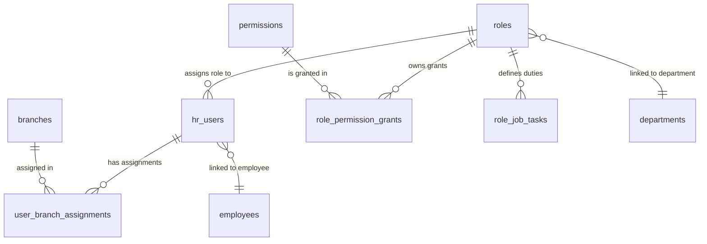

# دستور الكيان: الصلاحيات والأدوار (Permissions & Roles Domain Constitution)

> **الحالة (Status):** Active / Authoritative  
> **المرجع المركزي لنظام الأمان والتحكم بالوصول (RBAC)، والتحقق من صلاحيات المسارات والنطاقات الجغرافية والوظيفية، وتوزيع فروع المستخدمين بالخلفية.**

---

## 1. هوية الكيان (Entity Identity)

- **الاسم العربي:** نظام الصلاحيات والأدوار / التحكم المستند إلى الأدوار
- **الاسم الإنجليزي:** Permissions & Roles System (RBAC)
- **الجداول الرئيسية:**
  1. `roles` (الأدوار الأمنية)
  2. `permissions` (القاموس المركزي للصلاحيات بالنظام)
  3. `role_permission_grants` (جدول الربط والمنح الفعلي محدداً بنوع النطاق `scope_type`)
  4. `role_permissions` (جدول الربط القديم / التوافقية التاريخية)
  5. `user_branch_assignments` (تخصيص الفروع وتعدد الهوية للمستخدمين)
  6. `hr_users` (حسابات مستخدمي النظام وموظفي الموارد البشرية والعمليات الميدانية)
- **الوصف:** يمثل العصب الأمني والعمود الفقري المركزي للحماية والتحكم بالوصول في Golden CRM. يقوم النظام بتنظيم وحماية كافة البيانات التشغيلية عن طريق تحديد "من يستطيع تنفيذ ماذا، وعلى أي نطاق جغرافي أو وظيفي". يربط الحساب (`hr_users`) بدور محدد (`roles`)، ويُمنح هذا الدور حزمة من الصلاحيات (`permissions`) بنطاق صلاحية ديناميكي (`scope_type` = GLOBAL, BRANCH, ASSIGNED). ويتم فلترة الفروع جغرافياً وفق جدول التخصيص (`user_branch_assignments`).
- **الجداول المرتبطة:** كافة جداول قاعدة البيانات (تخضع عمليات قراءتها وكتابتها لفحوصات الأمان عبر هذا النظام).
- **الأهمية والأمان:** أقصى درجات الأهمية والخطورة. أي ثغرة أو معالجة غير صحيحة بالنطاقات تؤدي لتسريب البيانات بين الفروع (Branch Leakage) أو كسر الخصوصية الميدانية للزبائن.

---

## 2. معجم الجداول والحقول (Table & Field Dictionary)

### 2.1 جدول الأدوار `roles`
يخزن المسميات الوظيفية والأدوار الأمنية بالخلفية سواء كانت قوالب عامة أو مستنسخة للفروع.

| الحقل (Field) | النوع (SQL Type) | NULL? | DEFAULT | Constraints | الوصف والشرح بالعربية | مثال واقعي (Example) |
|---|---|---|---|---|---|---|
| `id` | `INTEGER` | ❌ | `nextval()` | `PRIMARY KEY` | المعرف الفريد للدور | `5` (مدير فرع حمص) |
| `name` | `VARCHAR(100)` | ❌ | — | `UNIQUE` (تاريخياً) | الاسم البرمجي الفريد للدور | `"BRANCH_MANAGER"` |
| `display_name` | `VARCHAR(255)` | ❌ | — | — | الاسم الظاهر للمستخدم بالواجهات | `"مدير الفرع"` |
| `description` | `TEXT` | ✅ | — | — | وصف تفصيلي للمسؤوليات | `"إدارة عمليات الفرع ميدانياً ومالياً"` |
| `is_system` | `BOOLEAN` | ✅ | `FALSE` | — | هل هو دور نظامي غير قابل للتعديل؟ | `TRUE` (لأدوار النظام الكبرى) |
| `is_protected` | `BOOLEAN` | ✅ | `FALSE` | — | هل الدور محمي من التعديل/الحذف؟ | `TRUE` (مثل SYSTEM_ADMIN) |
| `protected_reason` | `VARCHAR(255)`| ✅ | — | — | سبب الحماية والمنع من التعديل | `"دور الحساب الجذري للنظام"` |
| `is_active` | `BOOLEAN` | ✅ | `TRUE` | — | حالة تفعيل الدور واستخدامه بالنظام | `TRUE` |
| `branch_id` | `INTEGER` | ✅ | — | `FK → branches(id) ON DELETE CASCADE` | الفرع المنسوخ له الدور (في حال لم يكن قالب) | `1` (فرع دمشق) |
| `is_template` | `BOOLEAN` | ❌ | `FALSE` | `CHECK constraint` | هل يمثل قالباً عاماً (HQ Template)؟ | `TRUE` (الافتراضي للقوالب العامة) |
| `template_id` | `INTEGER` | ✅ | — | `FK → roles(id) ON DELETE SET NULL` | معرف القالب الأصلي المستنسخ منه هذا الدور | `2` (معرف قالب مدير الفرع) |
| `team_slot_type` | `VARCHAR(50)` | ✅ | — | — | نوع المقعد الميداني التابع للفريق | `"SUPERVISOR"`, `"TECHNICIAN"` |
| `created_at` | `TIMESTAMPTZ` | ✅ | `NOW()` | — | تاريخ الإنشاء | `2026-04-01 10:00:00+00` |
| `updated_at` | `TIMESTAMPTZ` | ✅ | `NOW()` | — | تاريخ آخر تحديث | `2026-05-24 18:00:00+00` |

*ملاحظة تقنية:* يفرض الجدول قيداً صارماً (`roles_scope_ck`):
```sql
CHECK ((is_template = TRUE AND branch_id IS NULL) OR (is_template = FALSE AND branch_id IS NOT NULL))
```
كما يعتمد فريد فهرس التكامل الثنائي للفروع والقوالب:
```sql
CREATE UNIQUE INDEX roles_name_branch_uk ON roles (name, COALESCE(branch_id, 0));
```

---

### 2.2 جدول الصلاحيات `permissions`
يمثل الفهرس والقاموس الأمني المركزي لكافة الصلاحيات المتاحة بالنظام.

| الحقل (Field) | النوع (SQL Type) | NULL? | DEFAULT | Constraints | الوصف والشرح بالعربية | مثال واقعي (Example) |
|---|---|---|---|---|---|---|
| `id` | `INTEGER` | ❌ | `nextval()` | `PRIMARY KEY` | المعرف الفريد للصلاحية | `12` |
| `key` | `VARCHAR(150)` | ❌ | — | `UNIQUE` | المفتاح الأمني المعتمد لفحص الكود | `"clients.view_list"` |
| `module` | `VARCHAR(50)` | ❌ | — | — | المودول أو الكيان الرئيسي بالبرمجية | `"clients"` |
| `sub_module` | `VARCHAR(50)` | ❌ | — | — | الكيان الفرعي التابع له الصلاحية | `"list"` |
| `action` | `VARCHAR(50)` | ❌ | — | — | الإجراء البرمجي المسموح (view, create, etc.)| `"view"` |
| `display_name` | `VARCHAR(255)` | ❌ | — | — | الاسم العربي المعروض في لوحة التحكم | `"عرض قائمة العملاء"` |
| `display_order` | `INTEGER` | ✅ | `0` | — | ترتيب العرض بالواجهات الرسومية | `120` |
| `allowed_scopes`| `TEXT[]` | ❌ | `{'GLOBAL','BRANCH','ASSIGNED'}` | — | النطاقات المدعومة جغرافياً وتشغيلياً بالداتابيز| `{'GLOBAL', 'BRANCH'}` |

---

### 2.3 جدول منح صلاحيات الأدوار `role_permission_grants`
يربط الأدوار بالصلاحيات مع تحديد نطاق الفلترة الجغرافي والوظيفي الفعلي الممنوح.

| الحقل (Field) | النوع (SQL Type) | NULL? | DEFAULT | Constraints | الوصف والشرح بالعربية | مثال واقعي (Example) |
|---|---|---|---|---|---|---|
| `id` | `INTEGER` | ❌ | `nextval()` | `PRIMARY KEY` | المعرف الفريد للمنح | `456` |
| `role_id` | `INTEGER` | ❌ | — | `FK → roles(id) ON DELETE CASCADE` | معرف الدور الأمني | `5` (مدير فرع حمص) |
| `permission_id` | `INTEGER` | ❌ | — | `FK → permissions(id) ON DELETE CASCADE`| معرف الصلاحية | `12` (عرض قائمة العملاء) |
| `scope_type` | `VARCHAR(16)` | ❌ | — | `CHECK IN (GLOBAL, BRANCH, ASSIGNED)`| نطاق الفلترة الأمني والتشغيلي الممنوح | `"BRANCH"` |
| `created_at` | `TIMESTAMPTZ` | ❌ | `NOW()` | — | تاريخ منح الصلاحية للدور | `2026-04-20 12:00:00+00` |
| `updated_at` | `TIMESTAMPTZ` | ❌ | `NOW()` | — | تاريخ تحديث نطاق الصلاحية | `2026-05-24 19:00:00+00` |

*ملاحظة تقنية:* يفرض الجدول قيداً فريداً ثنائياً لمنع تكرار الصلاحية الواحدة لنفس الدور: `UNIQUE (role_id, permission_id)`.

---

### 2.4 جدول تخصيص فروع المستخدمين `user_branch_assignments`
يحدد الفروع التي يملك الموظف حق الوصول إليها وصلاحية العمل ضمن نطاقها، ويسجل الفرع الرئيسي للعمليات.

| الحقل (Field) | النوع (SQL Type) | NULL? | DEFAULT | Constraints | الوصف والشرح بالعربية | مثال واقعي (Example) |
|---|---|---|---|---|---|---|
| `id` | `INTEGER` | ❌ | `nextval()` | `PRIMARY KEY` | المعرف الفريد للتعيين | `78` |
| `user_id` | `INTEGER` | ❌ | — | `FK → hr_users(id) ON DELETE CASCADE` | معرف حساب الموظف المخصص | `10` (أحمد الفني) |
| `branch_id` | `INTEGER` | ❌ | — | `FK → branches(id) ON DELETE CASCADE` | معرف الفرع المخصص للوصول | `1` (فرع دمشق) |
| `is_primary` | `BOOLEAN` | ❌ | `FALSE` | — | هل هذا هو فرع الموظف الافتراضي الرئيسي؟| `TRUE` (فرعه الأساسي للتشغيل والتقارير) |
| `status` | `VARCHAR(32)` | ❌ | `'active'` | `CHECK IN (active, inactive)` | حالة صلاحية التعيين (نشط أو معطل) | `"active"` |
| `created_at` | `TIMESTAMPTZ` | ❌ | `NOW()` | — | تاريخ تخصيص الفرع للمستخدم | `2026-04-19 14:00:00+00` |
| `updated_at` | `TIMESTAMPTZ` | ❌ | `NOW()` | — | تاريخ التعديل على التخصيص | `2026-05-24 20:00:00+00` |

*ملاحظة تقنية:* يمنع الفهرس الفريد تكرار نفس الفرع لنفس المستخدم: `UNIQUE (user_id, branch_id)`. كما يضمن النظام وجود فرع رئيسي واحد فقط (`is_primary = TRUE`) نشط لكل مستخدم بالخلفية عبر الفهرس الفريد الجزئي:
```sql
CREATE UNIQUE INDEX idx_user_branch_assignments_one_primary_per_user ON user_branch_assignments(user_id) WHERE is_primary = TRUE;
```

---

### 2.5 جدول حسابات مستخدمي النظام `hr_users`
الحساب الأمني المعتمد لتسجيل الدخول وإجراء كافة التعديلات التشغيلية بالنظام.

| الحقل (Field) | النوع (SQL Type) | NULL? | DEFAULT | Constraints | الوصف والشرح بالعربية | مثال واقعي (Example) |
|---|---|---|---|---|---|---|
| `id` | `INTEGER` | ❌ | `nextval()` | `PRIMARY KEY` | المعرف الأمني للمستخدم | `10` |
| `name` | `VARCHAR(255)` | ❌ | — | — | الاسم الفعلي الكامل للموظف | `"أحمد الفني"` |
| `username` | `VARCHAR(100)` | ❌ | — | `UNIQUE` | اسم تسجيل الدخول بالنظام | `"ahmed_tech"` |
| `password_hash` | `VARCHAR(255)`| ❌ | — | — | تشفير bcrypt لكلمة السر | `"$2a$10$X..."` |
| `role` | `VARCHAR(100)` | ❌ | — | — | الاسم القديم للدور (Legacy String) | `"TECHNICIAN"` |
| `is_active` | `BOOLEAN` | ✅ | `TRUE` | — | راية التفعيل للحساب الأمني | `TRUE` |
| `employee_id` | `INTEGER` | ✅ | — | `FK → employees(id) ON DELETE SET NULL`| معرف الموظف المرتبط تشغيلياً بالـ HR | `102` |
| `role_id` | `INTEGER` | ✅ | — | `FK → roles(id) ON DELETE RESTRICT` | معرف الدور الأمني الجديد المرتبط بالقوالب | `4` (دور فني الصيانة) |
| `branch_id` | `INTEGER` | ✅ | — | `FK → branches(id) ON DELETE RESTRICT` | الفرع الأساسي القديم (Legacy Fallback) | `1` (دمشق) |
| `is_super_admin`| `BOOLEAN` | ❌ | `FALSE` | — | حساب جذري يتخطى فحوصات الأمان | `FALSE` |
| `created_at` | `TIMESTAMPTZ` | ✅ | `NOW()` | — | تاريخ إنشاء الحساب | `2026-04-01 09:00:00+00` |

*ملاحظة تقنية:* يفرض النظام تطابقاً صارماً بحيث يرتبط كل موظف بحساب واحد نشط فقط لمنع تكرار الهوية الأكاديمية:
```sql
CREATE UNIQUE INDEX ux_hr_users_employee_id ON hr_users(employee_id) WHERE employee_id IS NOT NULL;
```

---

## 3. القيود والقواعد التشغيلية (Database Constraints & Business Rules)

### BR-1: الهيكلية الأمنية للوصول (RBAC Hierarchy)
يتدفق قرار منح الصلاحية في Golden CRM وفق تسلسل محدد بالـ DB:
$$\text{hr\_user} \rightarrow \text{role\_id} \rightarrow \text{role\_permission\_grants} \rightarrow \text{scope\_type} + \text{user\_branch\_assignments}$$

### BR-2: خوارزمية معالجة وفحص الصلاحيات بالخادم (Scope Resolution Algorithm)
يتم تنفيذ الفحص الأمني المركزي عبر دالة `authorize(context, check)` بملف `authorizationService.ts` كالتالي:
1. **تخطي الحساب الجذري (Super Admin Bypass):** إذا كان `is_super_admin = TRUE` و `actingBranchId = null` بالخلفية، يتم منح الموافقة الفورية وبلا أي شروط (`allowed: true, reason: 'SUPER_ADMIN'`).
2. **استخراج المنح المطابق (Grant Fetching):** يبحث النظام في مصفوفة صلاحيات المستخدم النشط عن المفتاح المستهدف (`check.permission`). في حال عدم وجوده، يتم فوراً حظر المستخدم الرد بـ `MISSING_PERMISSION`.
3. **فلترة النطاقات الجغرافية (Scope Filtering):**
   - **النطاق العام (`GLOBAL`):** يمنح حق الوصول المباشر لكافة السجلات في جميع الفروع والموظفين بلا قيود.
   - **نطاق الفرع (`BRANCH`):** يتحقق مما إذا كان المعرف الجغرافي المستهدف (`check.branchId`) أو فرع المستخدم الحالي (`actingBranchId`) مشمولاً ضمن فروع المستخدم المصرح له بالوصول بجدول `user_branch_assignments` (مصفوفة `allowedBranchIds`). في حال تطابقها، يمنح الوصول، وإلا يعيد الرد بـ `BRANCH_FORBIDDEN`.
   - **نطاق الموظف الشخصي (`ASSIGNED`):** يفرض أن يكون معرف المستخدم المنسوب للسجل المستهدف (`check.assignedUserId`) متطابقاً تماماً مع معرف المستخدم الجاري (`context.userId`). كما يجب أن يكون الفرع التابع له مشمولاً بالفروع المتاحة للمستخدم، وإلا يتم الحظر الفوري بـ `ASSIGNMENT_FORBIDDEN`.

### BR-3: مشكلة حظر النطاق الشخصي التشغيلي (The ASSIGNED Scope Mismatch) ⭐ ثغرة كبرى
* **جذور الثغرة (GAP-002 & GAP-009):** تم تصميم السياسات البرمجية بالواجهة والخلفية (مثل `clientPolicy.ts` و `candidatePolicy.ts`) لتدعم عزل العملاء والمرشحين وفق نطاق الموظف الشخصي (`ASSIGNED` - أي لا يرى الموظف إلا العملاء أو المرشحين المنسوبين له).
* **الحظر الميكانيكي بالـ DB:** في تحديث الهجرة رقم `054` (ملف `054_permissions_allowed_scopes.sql`)، تم فرض حصر للنطاقات المدعومة (`allowed_scopes`) لصلاحيات العملاء والمرشحين بـ `GLOBAL` و `BRANCH` فقط.
* **التأثير الفعلي:** عند قيام سوبر أدمن بمحاولة منح صلاحية `clients.view` بنطاق `ASSIGNED` لمجموعة من الموظفين عبر الـ API، يرفض محرك الـ tRPC الحفظ بالكامل لأن الكود يتحقق الصارم من الحقل `allowed_scopes` ويعيد خطأ: `"النطاق ASSIGNED غير مسموح لهذه الصلاحية"`.

### BR-4: استنساخ ونشر قوالب الفروع (Role Template Propagation)
- يتم تنظيم الأدوار بقالب أمني موحد بالفرع الرئيسي للشركة (`is_template = TRUE, branch_id IS NULL`).
- عند إنشاء فرع تشغيلي جديد للنظام، يتم استدعاء الدالة البرمجية لقاعدة البيانات `clone_role_templates_to_branch(target_branch)` لتقوم أوتوماتيكياً باستنساخ كافة أدوار النظام وقوالب الصلاحيات وربطها بالفرع المستهدف مع الحفاظ على الربط بالدور الأساسي عبر حقل `template_id`.

### BR-5: تطابق المسميات الوظيفية للفروع والفرق (Team Slot Type Integration)
- يرتبط عمود `roles.team_slot_type` بتنظيم وتوزيع العمليات الميدانية والمهام.
- يدعم الحقل القيم المعيارية المحددة للفرق التشغيلية: `"SUPERVISOR"` (مشرف فريق)، `"TECHNICIAN"` (فني صيانة ميداني)، `"TELEMARKETER"` (موظف تسويق هاتفي وخدمة عملاء).
- يُعتمد هذا التوصيف برمجياً في وحدات تخطيط المسارات (`workScopes`) وجدولة مهام الزيارات الميدانية.

---

## 4. العلاقات الهيكلية (Entity Relationships)



---

## 5. قواعد الحذف والنزاهة المرجعية (Deletion & Integrity Rules)

```
[محاولة حذف دور أمني نشط]
        │
        ├──► [هل يوجد مستخدم مرتبط بالدور؟] ──► نعم ──► [حظر الحذف البرمجي بالخلفية 400]
        │
        └──► [لا يوجد مستخدم مرتبـط] ────────► نعم ──► [حذف متتالي CASCADE]
                                                               │
                                                               ├──► [حذف منح الصلاحيات بالأدوار]
                                                               └──► [حذف مهام ومسؤوليات الدور]
```
- **قيود حذف الأدوار والأمان:** لحماية سلامة النظام الأمني، لا يسمح محرك الداتابيز بحذف دور أمني مرتبط به حسابات مستخدمين نشطة بالنظام (`hr_users`). ويجب تعديل ونقل أدوار الموظفين أولاً قبل مسح الدور.
- **الحذف المتتالي للصلاحيات:** عند حذف دور شاغر (غير مرتبط بمستخدمين)، يقوم محرك قاعدة البيانات بحذف كافة السجلات التابعة بـ `ON DELETE CASCADE` في جداول ربط الصلاحيات `role_permission_grants` و `role_permissions` بالإضافة لجدول المهام الملحقة `role_job_tasks`.
- **حسابات المستخدمين والنزاهة:** عند مسح حساب أمني للمستخدم `hr_users`، يتم حذف كافة التخصيصات والارتباطات الجغرافية التابعة له بجدول `user_branch_assignments` تلقائياً عبر CASCADE.

---

## 6. صلاحيات الوصول (Permission Matrix)

تم تنظيم الصلاحيات الخاصة بإدارة البنية الأمنية للنظام كالتالي:

| الصلاحية المطلوبة (Permission Key) | النطاق المسموح (Allowed Scopes) | الوصف والشرح بالعربية |
|---|---|---|
| `admin.roles.view` | `GLOBAL` | عرض قائمة الأدوار وقوالب الصلاحيات والمهام وتفاصيل منح الصلاحيات لكل دور بالواجهات. |
| `admin.roles.manage` | `GLOBAL` | إنشاء أدوار جديدة، تعديل المسميات والأوصاف، إسناد وحفظ مصفوفة الصلاحيات وتحديث المسؤوليات. |
| `users.branch_assignments.view` | `GLOBAL` | استعراض ومراقبة فروع وتخصيصات الموظفين ومطابقتها الجغرافية. |
| `users.branch_assignments.manage` | `GLOBAL` | تعديل وتحديث فروع العمليات المتاحة للمستخدمين، وتغيير الفرع التشغيلي الرئيسي. |

### 6.0 شجرة صلاحيات إدارة الأدوار والصلاحيات

إدارة الأدوار ليست دوميناً تشغيلياً عادياً؛ هي سطح التحكم الذي يوزع صلاحيات كل الدومينات الأخرى. لذلك تبقى صلاحياته `GLOBAL` فقط، ولا يجوز منحها بنطاق `BRANCH` أو `ASSIGNED` حتى لو كان الدور نفسه مخصصاً لمدير فرع. مدير الفرع يدير تشغيل فرعه، لا يدير بنية RBAC ولا يفتح أو يغلق صلاحيات النظام.

| الصلاحية المطلوبة (Permission Key) | النوع | النطاق المسموح (Allowed Scopes) | الوصف والشرح بالعربية |
|---|---|---|---|
| `admin.roles.view` | Admin View | `GLOBAL` | فتح سطح الأدوار والصلاحيات، قراءة قائمة الأدوار، قراءة تفاصيل دور محدد، قراءة كتالوج الصلاحيات، وقراءة منح الدور الحالية. لا تسمح بالحفظ أو التعديل. |
| `admin.roles.manage` | Admin Manage | `GLOBAL` | إنشاء وتعديل وحذف الأدوار غير المحمية، تعديل منح الصلاحيات في `role_permission_grants`، وتعديل مهام الدور. لا تمنح وحدها إسناد الدور للمستخدمين. |
| `admin.roles.users.manage` | User Role Assignment | `GLOBAL`, `BRANCH` | إنشاء حسابات النظام وتغيير دور المستخدم أو ربط الموظف بحساب نظام. لا تسمح بتعديل تعريف الدور ولا تعديل منح الصلاحيات. |

#### 6.0.1 حدود الصلاحيتين الحاليتين

- `admin.roles.view` تسمح بالقراءة الإدارية فقط. لا تمنح أي صلاحية تشغيلية على الزبائن أو الموظفين أو الفروع.
- `admin.roles.manage` مخصصة لإدارة بنية الأدوار وشجرة الصلاحيات: إنشاء/تعديل/حذف الدور، مهام الدور، وتعديل منح `role_permission_grants`.
- `admin.roles.users.manage` مخصصة لإسناد الأدوار للمستخدمين وحسابات النظام. مدير الشركة يملكها عادة بنطاق `GLOBAL`، ومدير الفرع يملكها بنطاق `BRANCH`، والسوبر أدمن يملكها بنطاق `GLOBAL`.
- لا يجوز استخدام `admin.roles.manage` أو `admin.roles.users.manage` كبديل لصلاحيات الدومينات. مثال: من يملك إسناد الأدوار لا يصبح تلقائياً مخولاً لتعديل زبون أو عقد عبر مسارات تلك الدومينات.
- لا يعتمد القرار الأمني على اسم الدور النصي (`roles.name`, `hr_users.role`, `employees.role`). أسماء الأدوار تستخدم للبذر أو العرض فقط. القرار التشغيلي يعتمد على `role_id` والمنح في `role_permission_grants`.
- `role_permission_grants` هو مصدر الحقيقة للمنح والنطاقات. `role_permissions` جدول تاريخي/توافقي ولا يجوز إضافة قرارات أمنية جديدة تعتمد عليه.

#### 6.0.2 قواعد تعديل المنح

- كل حفظ لمصفوفة صلاحيات دور يجب أن يكتب إلى `role_permission_grants` فقط، مع حذف/إعادة بناء منح الدور داخل معاملة واحدة.
- يجب رفض أي `scope_type` غير موجود في `permissions.allowed_scopes` للصلاحية المعنية.
- لا يجوز للواجهة أن ترسل scope غير مدعوم ثم يعتمد الخادم على إخفاء الواجهة. الخادم هو مصدر التحقق.
- عند حفظ المنح يجب تفريغ كاش الصلاحيات حتى لا تبقى جلسات أو قرارات قديمة نشطة.
- لا يجوز إنشاء صلاحية جديدة من صفحة الأدوار نفسها. إضافة/حذف/إعادة تسمية أي permission تتم عبر migration وتوثيق و workbook، ثم تظهر في الإدارة ككتالوج قابل للمنح.

#### 6.0.3 الأدوار المحمية وسلامة النظام

- الأدوار النظامية أو المحمية (`is_system = true` أو `is_protected = true`) لا تحذف ولا تعدل بطريقة تكسر الوصول الجذري.
- يجب منع حذف دور مرتبط بحسابات نشطة في `hr_users`، أو نقل الحسابات أولاً إلى دور آخر صالح.
- يجب منع حذف أو تعطيل آخر مسار وصول يملك صلاحيات إدارة الأدوار، خصوصاً آخر حساب/دور super admin فعّال.
- تعديل دور المستخدم الحالي مسموح فقط إذا لم ينتج عنه قفل ذاتي يمنعه من إكمال إدارة النظام. عند الشك يجب رفض العملية أو طلب تأكيد إداري صريح في الواجهة.
- منح `GLOBAL` لصلاحيات عالية الخطورة مثل `admin.roles.manage` و`users.branch_assignments.manage` يجب أن يبقى محصوراً بالسوبر أدمن أو دور إداري مركزي معتمد.

#### 6.0.4 الفصل الحالي والمستقبلي

تم فصل إسناد الأدوار للمستخدمين فعلياً إلى `admin.roles.users.manage`. وللوصول إلى ضبط أدق لاحقاً، يوصى بفصل ما تبقى من `admin.roles.manage` إلى صلاحيات أصغر:

| الصلاحية المقترحة | الغرض |
|---|---|
| `admin.roles.create` | إنشاء دور جديد غير محمي. |
| `admin.roles.edit` | تعديل اسم ووصف وخصائص الدور غير الحساسة. |
| `admin.roles.delete` | حذف دور غير محمي وغير مرتبط بمستخدمين. |
| `admin.roles.grants.manage` | تعديل مصفوفة الصلاحيات والنطاقات في `role_permission_grants`. |
| `admin.roles.audit.view` | قراءة سجل تغييرات الأدوار والمنح عند توفر audit trail. |

لا تعتمد الصلاحيات المقترحة في هذا الجدول حتى تضاف رسمياً عبر migration وتوثيق وواجهة وإختبارات. العقد الفعلي حالياً هو `admin.roles.view` و`admin.roles.manage` و`admin.roles.users.manage`.

### 6.1 شجرة صلاحيات الأجهزة وقطع الغيار

صلاحيات الأجهزة وقطع الغيار تفصل بين ظهور القسم، قراءة التعريفات داخل النماذج، إدارة التعريفات العامة، وتخصيص الأجهزة لأقسام الفروع. لا يجوز استخدام صلاحية الإدارة العامة للسماح بحقل اختيار داخل مهمة أو عقد؛ الحقول التشغيلية تستخدم صلاحيات قراءة مخصصة وسياسة subject مرتبطة بالفرع والقسم ونوع العملية.

| الصلاحية المطلوبة (Permission Key) | النوع | النطاق المسموح (Allowed Scopes) | الوصف والشرح بالعربية |
|---|---|---|---|
| `devices.nav` | Navigation | `GLOBAL`, `BRANCH` | إظهار قسم الأجهزة وقطع الغيار في الدروار. لا تمنح قراءة تشغيلية ولا إدارة. |
| `device_models.lookup` | Lookup | `GLOBAL` | قراءة تعريفات موديلات الأجهزة كمرجع عام لاستخدامها في الواجهات والنماذج المسموحة. |
| `spare_parts.lookup` | Lookup | `GLOBAL` | قراءة تعريفات قطع الغيار كمرجع عام لاستخدامها في الواجهات والنماذج المسموحة. |
| `device_models.manage` | Manage | `GLOBAL` | إنشاء وتعديل وحذف ناعم لتعريفات موديلات الأجهزة وحقولها العامة مثل الاسم والكود والفئة والسعر والصور وفترات الكفالة. |
| `spare_parts.manage` | Manage | `GLOBAL` | إنشاء وتعديل وحذف ناعم لتعريفات قطع الغيار وحقولها العامة مثل الاسم والكود والسعر ونوع الصيانة والأجهزة المتوافقة. |
| `devices.discounts.view` | Operation | `GLOBAL` | عرض خصومات الأجهزة الإدارية، بما فيها الخصومات غير النشطة والتاريخية. |
| `devices.discounts.manage` | Manage | `GLOBAL` | إنشاء وتعديل وحذف حملات خصومات الأجهزة. |
| `devices.department_availability.view` | Operation | `GLOBAL`, `BRANCH` | عرض الأجهزة المخصصة للأقسام داخل الفروع. |
| `devices.department_availability.manage` | Manage | `GLOBAL`, `BRANCH` | تخصيص أو إزالة أجهزة من قسم داخل فرع. هذه الصلاحية لا تسمح بتعديل تعريف الجهاز نفسه. |
| `device_models.task_lookup` | Lookup | `GLOBAL`, `BRANCH`, `ASSIGNED` | قراءة الأجهزة المسموحة داخل سياق مهمة أو عرض أو عقد، حسب الفرع والقسم ونوع العملية. |
| `spare_parts.task_lookup` | Lookup | `GLOBAL`, `BRANCH`, `ASSIGNED` | قراءة قطع الغيار المسموحة داخل سياق صيانة أو تركيب أو نتيجة فنية، حسب الفرع والقسم ونوع العملية. |
| `installed_devices.view` | Operation | `GLOBAL`, `BRANCH`, `ASSIGNED` | عرض الأجهزة المركبة أو المباعة فعلياً للزبائن ضمن النطاق الممنوح وبعد تحميل subject الجهاز أو الزبون. |
| `installed_devices.update_service_data` | Operation | `GLOBAL`, `BRANCH` | تعديل بيانات تشغيلية للجهاز المركب مثل فرع الخدمة أو عنوان التركيب أو حالة الجهاز، وليس تعريف الجهاز العام. |
| `installed_devices.possession.view` | Operation | `GLOBAL`, `BRANCH` | عرض سجل حيازة الجهاز ومكانه الحالي. |
| `installed_devices.possession.manage` | Operation | `GLOBAL`, `BRANCH` | نقل حيازة الجهاز أو تغيير الجهة الحائزة عليه. |

#### 6.1.1 قواعد الحقول التشغيلية

- لا توجد صلاحية مستقلة لكل حقل. الصلاحية تنشأ فقط عندما يكون الحقل قراراً أمنياً مختلفاً: إدارة تعريف عام، تخصيص لفرع أو قسم، ربط بعقد، استخدام داخل مهمة، أو تعديل بيانات جهاز مركب.
- حقول مهمة عرض الجهاز مثل `deviceModelId` و`quantity` لا تستخدم `device_models.manage`. تستخدم صلاحية العملية الأصلية مثل `open_tasks.create` أو `open_tasks.edit` مع `device_models.task_lookup` وسياسة تتحقق من الفرع والقسم.
- حقول قطع الغيار داخل الصيانة لا تستخدم `spare_parts.manage`. تستخدم صلاحية العملية الفنية مثل `open_tasks.record_parts_usage` أو صلاحية نتيجة الصيانة المعتمدة، مع `spare_parts.task_lookup`.
- مدير الفرع الذي يملك `devices.department_availability.manage` يستطيع تخصيص أجهزة لأقسام فرعه فقط. لا يستطيع تعديل الاسم أو السعر أو خصومات الجهاز إلا إذا امتلك صلاحيات الإدارة العامة المناسبة.
- المشرفة عند استخدام جهاز في مهمة عرض ترى الأجهزة المخصصة لقسمها فقط. مدير الفرع يرى الأجهزة المخصصة لكل أقسام فرعه. السوبر أدمن يرى كل الأجهزة أو أجهزة الفرع المحدد حسب سياق العملية.
- أي مسار يحفظ `deviceModelId` أو `sparePartId` داخل مهمة أو عقد يجب أن يعيد التحقق من السماح على الخادم. فلترة الواجهة ليست حماية أمنية.

### 6.2 صلاحيات إدارة القوائم والقيم المرجعية

القوائم موحدة على مستوى الشركة وكل الفروع. يجب فصل إدارة القوائم عن استخدامها داخل الحقول: ظهور قيمة مثل مصدر المياه أو سبب الإلغاء داخل نموذج لا يعني السماح بفتح صفحة إدارة القوائم أو تعديل قيمها.

| الصلاحية المطلوبة (Permission Key) | النوع | النطاق المسموح (Allowed Scopes) | الوصف والشرح بالعربية |
|---|---|---|---|
| `admin.system_lists.view` | Admin View | `GLOBAL` | فتح صفحة إدارة القوائم ورؤية كل القيم، بما فيها المعطلة وبيانات الإدارة مثل الترتيب والربط بالدور والبيانات الوصفية. |
| `admin.system_lists.manage` | Admin Manage | `GLOBAL` | إنشاء وتعديل وحذف عناصر القوائم الموحدة على مستوى الشركة. |
| `reference_data.lookup` | Lookup | `GLOBAL`, `BRANCH`, `ASSIGNED` | قراءة القيم الفعالة اللازمة لإكمال نموذج أو عملية مسموحة، بدون إظهار صفحة إدارة القوائم وبدون منح تعديل على القيم. |

تعرض `reference_data.lookup` داخل نفس مجموعة صلاحيات إدارة القوائم مع `admin.system_lists.view` و`admin.system_lists.manage` لتسهيل توزيع الصلاحيات. هذا تجميع إداري فقط: صلاحية lookup لا تفتح صفحة إدارة القوائم ولا تسمح بتعديل القيم.

#### 6.2.1 قواعد استخدام القوائم داخل الحقول

- حقول النماذج مثل مصدر المياه، سبب الرفض، سبب الإلغاء، نوع القسم، أو خيارات الاستطلاع تستخدم `reference_data.lookup` أو صلاحية lookup متخصصة عند الحاجة.
- صفحة إدارة القوائم في الدروار لا تظهر إلا مع `admin.system_lists.view`.
- عمليات إنشاء أو تعديل أو حذف قيمة في قائمة لا تتم إلا مع `admin.system_lists.manage`.
- قراءة القوائم عبر lookup ترجع القيم الفعالة فقط. القيم المعطلة وبيانات الإدارة الكاملة تبقى مخصصة لسطح إدارة القوائم.
- أي مسار يحفظ قيمة من القوائم يجب أن يتحقق على الخادم من أن القيمة موجودة وفعالة ضمن الفئة الصحيحة عند الحاجة. فلترة الواجهة لا تكفي.

### 6.3 شجرة صلاحيات الفروع والأقسام

إدارة الفروع والأقسام تفصل بين ظهور صفحة الإدارة، قراءة الفروع والأقسام داخل الحقول، عرض البيانات الإدارية، وتعديل البنية التنظيمية. الفروع والأقسام ليست قوائم موحدة عامة مثل `system_lists`: الفرع subject مستقل، والقسم subject تابع لفرع محدد.

| الصلاحية المطلوبة (Permission Key) | النوع | النطاق المسموح (Allowed Scopes) | الوصف والشرح بالعربية |
|---|---|---|---|
| `branches.nav` | Navigation | `GLOBAL`, `BRANCH` | إظهار قسم إدارة الفروع والأقسام في الدروار. لا تمنح إنشاء أو تعديل أو حذف. |
| `branches.lookup` | Lookup | `GLOBAL`, `BRANCH`, `ASSIGNED` | قراءة الفروع المسموحة كخيارات داخل النماذج والمرشحات التشغيلية، بدون فتح صفحة إدارة الفروع. |
| `branches.view` | Admin View | `GLOBAL`, `BRANCH` | فتح صفحة إدارة الفروع وعرض بيانات الفروع ضمن النطاق الممنوح. |
| `branches.edit` | Admin Edit | `GLOBAL`, `BRANCH` | تعديل بيانات الفرع التعريفية مثل الاسم والعنوان وبيانات التواصل. لا تكفي لتعديل حالة الفرع أو نطاق تغطيته. |
| `branches.manage` | Admin Manage | `GLOBAL`, `BRANCH` | إدارة قرارات الفرع الحساسة: الإنشاء بنطاق `GLOBAL` فقط، والحذف وتعديل الحالة ونطاق التغطية على الفرع الموجود ضمن النطاق. |
| `departments.lookup` | Lookup | `GLOBAL`, `BRANCH`, `ASSIGNED` | قراءة الأقسام المسموحة كخيارات داخل النماذج، حسب فرع العملية أو فرع المستخدم. |
| `departments.view_list` | Admin View | `GLOBAL`, `BRANCH` | عرض قائمة الأقسام داخل الفروع المسموحة. |
| `departments.manage` | Admin Manage | `GLOBAL`, `BRANCH` | إنشاء وتعديل وحذف أقسام الفرع. لا تمنح وحدها تخصيص أجهزة للأقسام؛ هذا يبقى ضمن `devices.department_availability.manage`. |

#### 6.3.1 قواعد الفروع والأقسام

- ظهور إدارة الفروع في الدروار يستخدم `branches.nav`، أما فتح الصفحة وقراءة بياناتها الإدارية فيستخدم `branches.view`.
- استخدام حقل فرع داخل نموذج أو فلتر يستخدم `branches.lookup` ولا يفتح إدارة الفروع.
- استخدام حقل قسم داخل نموذج يستخدم `departments.lookup` ولا يفتح صفحة أقسام الفرع.
- `branches.edit` مخصص للبيانات التعريفية للفرع. تغيير `status` أو `coveredGeoIds` قرار أوسع ويحتاج `branches.manage`.
- إنشاء فرع جديد يحتاج `branches.manage` بنطاق `GLOBAL` أو مسار السوبر أدمن؛ نطاق `BRANCH` لا يملك subject موجودا يحد الإنشاء، لذلك لا يستخدم للإنشاء.
- `branches.manage` بنطاق `BRANCH` يطبق على فرع موجود فقط، مثل تغيير حالة الفرع أو نطاق تغطيته داخل الفروع المسموحة للمستخدم.
- مدير الفرع مع نطاق `BRANCH` يرى ويدير فروعه فقط حسب `user_branch_assignments`، وليس حسب قيمة قديمة في JWT.
- الأقسام تابعة لفرع، لذلك كل قراءة أو تعديل لقسم قائم يجب أن يحمّل القسم أولا ثم يتحقق من `department.branch_id`.
- تخصيص أجهزة للقسم ليس جزءا من `departments.manage`. يستخدم `devices.department_availability.view/manage` حتى يبقى قرار الأجهزة منفصلا عن قرار بنية الأقسام.

### 6.4 شجرة صلاحيات الموظفين

صلاحيات الموظفين تفصل بين ظهور سجل الموظفين، قراءة السجل الإداري، إنشاء وتعديل وحذف ملف الموظف، وبين استخدام الموظفين كخيارات داخل حقول تشغيلية مثل المدير المباشر أو الوسيط. الموظف subject تابع لفرع عبر `employees.branch_id`، وحسابه التشغيلي تابع لـ `hr_users` و`user_branch_assignments`.

| الصلاحية المطلوبة (Permission Key) | النوع | النطاق المسموح (Allowed Scopes) | الوصف والشرح بالعربية |
|---|---|---|---|
| `employees.nav` | Navigation | `GLOBAL`, `BRANCH` | إظهار قسم سجلات الموظفين في الدروار. لا تمنح قراءة السجلات ولا تعديلها. |
| `employees.lookup` | Lookup | `GLOBAL`, `BRANCH`, `ASSIGNED` | قراءة الحد الأدنى من بيانات الموظفين داخل الحقول المسموحة مثل الوسيط أو خيارات الإسناد، بدون فتح سجل الموظفين الكامل. |
| `employees.manager_lookup` | Lookup | `GLOBAL`, `BRANCH` | قراءة المرشحين لحقل المدير المباشر ضمن فرع وقسم الموظف. |
| `employees.view_list` | Admin View | `GLOBAL`, `BRANCH` | عرض قائمة الموظفين وتفاصيلهم ضمن النطاق الممنوح. |
| `employees.create` | Admin Create | `GLOBAL`, `BRANCH` | إنشاء موظف جديد داخل فرع مسموح. يتطلب تحقق الخادم من الفرع والقسم والعنوان والمدير المباشر. |
| `employees.edit` | Admin Edit | `GLOBAL`, `BRANCH` | تعديل ملف موظف قائم. عند نقل الموظف بين الفروع يجب التحقق من الفرع الحالي والفرع المستهدف. |
| `employees.delete` | Admin Delete | `GLOBAL`, `BRANCH` | حذف سجل موظف عند السماح بذلك. الحذف النهائي يبقى مقيدا بقيود التاريخ والارتباطات التشغيلية إلى حين اعتماد الحذف الناعم. |

#### 6.4.1 قواعد حقول نموذج الموظف

- حقل الفرع في نموذج الموظف يستخدم `branches.lookup` ولا يستخدم `branches.view`.
- حقل القسم يستخدم `departments.lookup`، وعلى الخادم يجب التحقق أن `department_id` تابع لنفس `branch_id` المستهدف للموظف.
- حقول العنوان تستخدم `geo_units.lookup` وتطبق قاعدة §5.1 من معيار هندسة الصلاحيات: الخيارات تقيد بسياق العملية، والخادم يعيد التحقق عند الحفظ.
- حقول القيم المرجعية مثل الجنس، الحالة الاجتماعية، الخدمة العسكرية، نوع العقد، نوع العمل، اللغات، والمسمى الوظيفي تستخدم `reference_data.lookup`.
- حقل المدير المباشر يستخدم `employees.manager_lookup`، ويجب أن يكون المدير من نفس الفرع ومن المرشحين المعتمدين للقسم.
- قراءة موظف داخل حقل تستخدم `GET /api/employees/lookup` مع `employees.lookup` وتعيد حقولا محدودة فقط: `id`, `name`, `mobile`, `jobTitle`, `branchId`, `departmentId`, `status`.
- لا يجوز استخدام `GET /api/employees` داخل الحقول التشغيلية؛ هذا المسار مخصص لعرض سجل الموظفين الإداري ويتطلب `employees.view_list`.
- تعديل حساب النظام للموظف ليس جزءا من `employees.edit`. يبقى تحت صلاحيات إدارة الأدوار والحسابات مثل `admin.roles.manage` إلى حين فصل صلاحية مستقلة للحسابات.
- لا يعتمد القرار الأمني على `employees.role` أو `hr_users.role` النصيين. القرار يعتمد على `role_id` والمنح في `role_permission_grants`.

### 6.5 صلاحيات التخطيط ودراسة النطاقات

صلاحيات دومين التخطيط. تُفصل القراءة عن الكتابة في دراسة النطاقات (DEC-008) التزاماً بمعيار هندسة الصلاحيات: عرض الجدول و snapshots قرار أمني مختلف عن تحديث snapshot أو إدارة الاختيار اليدوي.

| الصلاحية المطلوبة (Permission Key) | النوع | النطاق المسموح (Allowed Scopes) | الوصف والشرح بالعربية |
|---|---|---|---|
| `planning.manage` | Operation | `BRANCH` | جدولة الفرق اليومية، توزيع المسارات، احتساب الأهداف، وتوليد نطاقات العمل ومزامنة المهام ضمن الفرع الفعّال. |
| `planning.zone_study.view` | Operation | `BRANCH` | قراءة جدول دراسة النطاقات و snapshots (كل `GET`، يشمل الأيام المجمَّدة). لا تمنح تحديثاً ولا إدارة picks. |
| `planning.zone_study.manage` | Operation | `BRANCH` | تحديث snapshot دراسة النطاقات وإضافة/حذف الاختيار اليدوي في Mode 2. لا تُغني عن `planning.zone_study.view`. |

#### 6.5.1 قواعد دراسة النطاقات

- `view` و `manage` صلاحيتان مفصولتان: من يحتاج التحديث يُمنح الاثنتين، ومن يحتاج القراءة فقط يُمنح `view` وحدها.
- النطاق `BRANCH` فقط. لا `ASSIGNED`؛ مدير الفرع يرى ويدير كامل بيانات فرعه.
- خصوصية snapshot Mode 2 لكل مستخدم تُحمى بعمود `user_id` في `zone_study_snapshots`، لا بالـ scope. الـ query يفلتر `user_id = req.user.id` لـ `mode = 'manual'`.
- التجميد بعد منتصف الليل (`date < CURRENT_DATE`) يرفض كل كتابة بـ `403 SNAPSHOT_FROZEN` حتى لمن يملك `manage`، ولا استثناء للسوبرأدمن.
- subject لكل عملية كتابة = `branch_id` للـ snapshot، يُتحقق منه ضد `actingBranchId`.

### 6.5 شجرة صلاحيات المستويات الإدارية (Geo Units)

المستويات الإدارية بنية وطنية مركزية شبيهة بـ `system_lists`. تُفصل تعبئة العنوان الروتينية عن العرض الإداري عن تعديل الشجرة الوطنية. التعديل قرار مركزي بنطاق `GLOBAL` فقط، والفرع يقرأ تغطيته فقط دون تعديل. التفصيل الكامل والقواعد في [دستور المناطق الجغرافية §6](geo-units.md).

| الصلاحية المطلوبة (Permission Key) | النوع | النطاق المسموح (Allowed Scopes) | الوصف والشرح بالعربية |
|---|---|---|---|
| `geo_units.lookup` | Lookup | `GLOBAL`, `BRANCH`, `ASSIGNED` | قراءة الوحدات النشطة كخيارات عناوين داخل النماذج، مفلترة بتغطية الفرع. لا تفتح صفحة الإدارة ولا تمنح تعديلاً. |
| `geo.view` | Admin View | `GLOBAL`, `BRANCH` | فتح صفحة إدارة المستويات وقراءة الوحدات (incl. inactive) ضمن النطاق. مدير الفرع يرى تغطية فرعه فقط. |
| `geo.manage` | Admin Manage | `GLOBAL` فقط | إنشاء/تعديل/حذف/تغيير حالة وحدة. حكر على المقر؛ لا يملك أي فرع تعديل الشجرة الوطنية. |

- حقول العنوان تستخدم `geo_units.lookup`، لا `geo.view`. القيم القابلة للاختيار `active` فقط.
- العرض بنطاق `BRANCH` يرى `visibleGeoIds` (التغطية + الأبناء + الآباء) فقط؛ والجلب الفردي `GET /:id` مفلتر بالنطاق.
- أي مسار يحفظ `geo_unit_id` داخل عنوان يعيد التحقق على الخادم عبر `assertGeoUnitInScope`. فلترة الواجهة ليست حماية.

---

## 7. عقد API (API Contract)

يقوم النظام بإدارة عمليات الصلاحيات والأدوار عبر Express API التقليدي و tRPC المحمي بالصلاحيات:

### 7.1 قائمة endpoints المتاحة (Express Web Router)

#### 1. `GET /api/admin/roles`
- **الوصف:** جلب واستعراض كافة قوالب الأدوار الأمنية النشطة بالنظام.
- **الصلاحية المطلوبة:** `admin.roles.view`.
- **صيغة الاستجابة:**
```json
[
  {
    "id": 4,
    "name": "BRANCH_MANAGER",
    "display_name": "مدير الفرع",
    "description": "إدارة الفرع ميدانياً",
    "is_system": false,
    "is_protected": false,
    "user_count": 3,
    "permission_count": 48
  }
]
```

#### 2. `PUT /api/admin/roles/:id/permissions`
- **الوصف:** تحديث وإعادة بناء مصفوفة المنح والصلاحيات الأمنية الكاملة لدور محدد.
- **الصلاحية المطلوبة:** `admin.roles.manage`.
- **طلب المدخلات (Body Schema):**
```json
{
  "roleId": 4,
  "grants": [
    { "permissionId": 12, "scopeType": "BRANCH" },
    { "permissionId": 15, "scopeType": "GLOBAL" }
  ]
}
```
- **السلوك والتحقق:** يتحقق الخادم ديناميكياً من حقل `allowed_scopes` لكل صلاحية مرسلة، وفي حال مخالفة النطاق الجغرافي المعياري المعتمد بالـ DB يعيد الرد بـ `400` مع نص الخطأ المطابق.

---

### 7.2 مسارات عقد الـ tRPC المتاحة (`rolesRouter`)

تُتاح العمليات الأمنية المتكاملة عبر مسارات tRPC وتتضمن المعايير التالية:

* `roles.list`: استعلام الأدوار وقوالبها العامة (يتطلب `admin.roles.view` أو `admin.roles.users.manage` لاستخدامها في حقل إسناد الدور).
* `roles.getById`: تفاصيل دور مخصص مصحوباً بكامل صلاحياته الممنوحة.
* `roles.setPermissions`: تعديل مصفوفة المنح والتحقق الصارم من سلامة النطاقات وتعديل كاش الذاكرة (يتطلب `admin.roles.manage`).
* `roles.hrUsersList`: قراءة حسابات النظام ضمن النطاق (يتطلب `admin.roles.view` أو `admin.roles.users.manage`).
* `roles.createHrUser`: إنشاء حساب مستخدم وربطه بدور وفرع (يتطلب `admin.roles.users.manage`).
* `roles.updateHrUser`: تعديل حساب مستخدم أو تغيير دوره ضمن النطاق (يتطلب `admin.roles.users.manage`).
* `roles.getUserBranchAssignments`: جلب تعيينات وفروع مستخدم محدد (يتطلب `users.branch_assignments.view`).
* `roles.upsertUserBranchAssignment`: إسناد فرع وصلاحية عمل جديدة للموظف (يتطلب `users.branch_assignments.manage`).

---

## 8. حالات الاختبار الشاملة (Test Cases)

| معرف الاختبار | سيناريو الاختبار (Scenario) | طريقة الطلب | المدخلات البرمجية (Inputs) | النتيجة المتوقعة (Expected) |
|---|---|---|---|---|
| **TC-01** | عرض قائمة الأدوار العامة بنجاح | `GET /roles` | — | الرد بـ `200` وإرجاع مصفوفة الأدوار التي تمثل قوالب أمنية. |
| **TC-02** | إنشاء قالب دور أمني جديد | `POST /roles` | `{ "name": "Sales Clerk", "displayName": "موظف مبيعات" }` | الرد بـ `200` وحفظ السجل مع قيمة `isTemplate = true`. |
| **TC-03** | تعديل صلاحيات دور بنطاق معتمد | `setPermissions` | `roleId = 4, grants = [{ permissionId: 21, scopeType: "BRANCH" }]` | الرد بنجاح وتحديث جداول `role_permission_grants` وتفريغ كاش الصلاحيات. |
| **TC-04** | منع إسناد نطاق غير مدعوم | `setPermissions` | `roleId = 4, grants = [{ permissionId: 35, scopeType: "ASSIGNED" }]` (Clients view) | الرد بـ `400` "النطاق ASSIGNED غير مسموح لهذه الصلاحية. النطاقات المسموحة: GLOBAL, BRANCH". |
| **TC-05** | منع حذف دور مرتبط بمستخدمين | `DELETE /roles/5` | `id = 5` (مرتبط بـ 3 موظفين) | الرد بـ `400` "لا يمكن حذف هذا الدور لوجود مستخدمين مرتبطين به". |
| **TC-06** | التحقق من فلترة نطاق BRANCH | `GET /api/clients` | مستخدم نشط بنطاق `BRANCH` لفرع دمشق (1) | استعلام وعرض العملاء التابعين لفرع دمشق فقط وحجب الفروع الأخرى. |
| **TC-07** | حظر نطاق ASSIGNED للعملاء | `GET /api/clients` | مستخدم منحت له صلاحية الزبائن بنطاق `ASSIGNED` بالخطأ بالـ DB | حظر الوصول المباشر والرد بـ `ASSIGNMENT_FORBIDDEN` بسبب ثغرة DB. |
| **TC-08** | تخطي الفحوصات للمدير الجذري | `GET /` (أي مسار) | مستخدم بـ `is_super_admin = true` | الرد بـ `200` وتخطي الفحص الجغرافي والوظيفي بالكامل. |
| **TC-09** | إنشاء حساب مستخدم أمني مكرر | `createHrUser` | `{ "username": "ahmed_tech", "roleId": 4 }` | الرد بـ `409` خطأ تعارض: "اسم الدخول مستخدم بالفعل بقاعدة البيانات". |
| **TC-10** | إسناد فرع رئيسي للموظف | `setPrimaryUserBranchAssignment` | `{ "userId": 10, "branchId": 2 }` | إلغاء الفرع الرئيسي القديم وتعيين الفرع الجديد وتفريغ كاش الصلاحيات. |
| **TC-11** | معالجة منتهي الصلاحية بالكاش | (implicit) | انتهاء مدة TTL (60 ثانية) على كاش الصلاحيات بالخلفية | إعادة الاستعلام الفعلي من الداتابيز لتحديث حزمة الجداول البرمجية للموظف. |
| **TC-12** | محاولة حذف دور نظامي محمي | `DELETE /roles/1` | `id = 1` (SYSTEM_ADMIN) | الرد بـ `400` "لا يمكن تعديل أو حذف هذا الدور المحمي". |

---

## 9. الثغرات والتضاربات المكتشفة (Gaps & Contradictions)

### GAP-002: تعطل النطاق الشخصي للعملاء بالـ DB
* **الموقع:** `migrations/054_permissions_allowed_scopes.sql` (allowed_scopes لـ `clients.*`)
* **الوصف:** خلو مصفوفة النطاقات المسموحة لصلاحيات العملاء من النطاق الشخصي `ASSIGNED`.
* **التأثير:** استحالة تطبيق فلترة شخصية للعملاء (لا يرى الموظف إلا زبائنه فقط)، وتجاوز الفلترة قسرياً لرؤية كافة عملاء الفرع.
* **الحل المقترح:** تشغيل هجرة جديدة تضيف `'ASSIGNED'` لعمود `allowed_scopes` لصلاحيات العملاء كاملة.

### GAP-009: تعطل النطاق الشخصي للمرشحين بالـ DB
* **الموقع:** `migrations/054_permissions_allowed_scopes.sql` (allowed_scopes لـ `candidates.*`)
* **الوصف:** نفس جذور مشكلة `GAP-002` السابقة، حيث يمنع الجدول إسناد فلترة النطاق الشخصي للمرشحين.
* **التأثير:** عجز قسم التوظيف والمقابلات عن عزل ملفات المرشحين الشخصية حسب الموظف المنسق للمقابلة.
* **الحل المقترح:** ترقية مصفوفة نطاق المرشحين لتشتمل على `'ASSIGNED'`.

### GAP-017 / GAP-027: تضارب مسميات صلاحيات المهام والزيارات الميدانية
* **الموقع:** `routes/openTasks.ts` & `routes/fieldVisits.ts`
* **الوصف:** تعتمد مسارات الفحص البرمجية لكيانات المهام المفتوحة والزيارات الميدانية بالكامل على المفاتيح التاريخية الموروثة `'marketing_visits.view'` و `'marketing_visits.update_result'`.
* **التأثير:** تعقيد كبير وصعوبة بالغة بفصل صلاحيات الموظفين، حيث يؤدي منح الموظف صلاحية رؤية الزيارات الميدانية لمنحه أوتوماتيكياً صلاحية تعديل وحذف وإدارة المهام والتشغيل التشخيصي للمحافظات والمهام المفتوحة.
* **الحل المقترح:** تفكيك وبذر مفاتيح صلاحيات مستقلة ومطابقة هيكلياً بالـ DB: `open_tasks.view`, `open_tasks.manage`, `field_visits.view`, `field_visits.manage`.

### GAP-040: ازدواجية وتكرار حقل الدور بجدول حسابات المستخدمين
* **الموقع:** `migrations/003_hr_rbac_tables.sql` (`hr_users.role` vs `hr_users.role_id`)
* **الوصف:** يحتوي جدول المستخدمين على عمودين لتحديد الدور: حقل نصي يتيم وموروث `role` (مثل `'TECHNICIAN'`) وحقل الربط الهيكلي الجديد `role_id` المرتبط بقوالب الفروع.
* **التأثير:** خطر تباين وتعارض الهوية الأمنية بالخلفية للمستخدم في حال تحديث معرف الرقم بالـ tRPC دون تصفير وتزامن النص الموروث.
* **الحل المقترح:** إيقاف تمديد الحقل النصي `role` تدريجياً وإزالته بالكامل وتوحيد الاعتماد على `role_id`.

### GAP-041: ازدواجية وتكرار تخصيصات الفروع للموظفين
* **الموقع:** `migrations/019_authorization_schema_preparation.sql` (`hr_users.branch_id` vs `user_branch_assignments`)
* **الوصف:** وجود حقل الفرع الفردي `hr_users.branch_id` بالتوازي مع جدول الربط متعدد الفروع المعزز حديثاً `user_branch_assignments`.
* **التأثير:** تعارض تشغيلي وتخلف بيانات في حال مسح التخصيص أو تحويله لفرع مغلق مع بقاء معرف الفرع الافتراضي الفردي معلقاً بالحساب الأساسي.
* **الحل المقترح:** تحويل كافة الإشارات البرمجية للوصول لتعيينات الفروع وتوحيدها عبر جدول الربط مع تصفير الحقل الفردي القديم.

### GAP-042: التعايش المشترك لجدولي الصلاحيات `role_permissions` و `role_permission_grants`
* **الموقع:** `migrations/019_authorization_schema_preparation.sql`
* **الوصف:** تعايش جدول الربط البسيط القديم `role_permissions` بالتزامن مع جدول الربط المتقدم الجديد المشتمل على نطاقات الصلاحيات `role_permission_grants`.
* **التأثير:** استهلاك مكثف للذاكرة وقنوات الربط بالـ DB دون فائدة تشغيلية حقيقية، حيث يجبر المطورين على إجراء عمليتي حفظ متتاليتين عند تعديل مصفوفة الصلاحيات.
* **الحل المقترح:** إزالة الجدول البسيط القديم وتوجيه كافة استعلامات الأمان لتعتمد على المنح الجغرافية بالكامل.

---

## 10. تاريخ التغييرات الهيكلية (Schema Changelog)

| تاريخ الهجرة | رقم الهجرة (File) | الإجراء والوصف التقني والتأثير |
|---|---|---|
| **2026-04-01** | `003_hr_rbac_tables.sql`| التأسيس الأساسي الأولي لهيكل الـ RBAC وجداول الأدوار والصلاحيات والمستخدمين الأساسية. |
| **2026-04-14** | `013_multi_branch_identity.sql`| **الهوية المتعددة:** تأسيس راية الحساب الجذري للـ HQ وحقول القوالب والنسخ للفروع وربط قيود التفرد. |
| **2026-04-16** | `015_role_templates_seed.sql`| بذرة القوالب والتقسيمات المعيارية للأدوار المعتمدة بالداتابيز للعمليات. |
| **2026-04-20** | `019_authorization_schema_preparation.sql`| **تأسيس النطاقات الجغرافية:** استبدال جداول الربط التأسيسية بـ `role_permission_grants` و `user_branch_assignments` كأوعية أمنية للنطاقات. |
| **2026-04-20** | `020_role_model_conflict_cleanup.sql`| معالجة وتصحيح التضاربات الهيكلية لضمان إشارة المستخدمين إلى قوالب الأدوار بدلاً من النسخ الشاغرة. |
| **2026-04-21** | `024_clients_permissions_seeding.sql`| بذرة وتأسيس مفاتيح وصلاحيات الوصول لبيانات وقوائم العملاء. |
| **2026-04-23** | `029_system_admin_role_protection.sql`| حظر كلي لتعديل أو حذف الأدوار القيادية الكبرى للنظام لضمان حماية الوصول الفني. |
| **2026-05-02** | `054_permissions_allowed_scopes.sql`| **تحديث قيود النطاقات الأمني:** إدخال عمود `allowed_scopes` وحظر النطاق التشخيصي والشخصي لقوائم العملاء والمرشحين. |
| **2026-05-04** | `062_roles_team_slot_type.sql`| ربط الأدوار بمقاعد وتوصيفات العمل الميداني للفرق التشغيلية ميدانياً. |
| **2026-06-13** | `279_geo_units_permission_tree.sql`| **فصل شجرة المستويات الإدارية:** إضافة `geo_units.lookup`، حصر `geo.manage` بـ `GLOBAL` فقط مع حذف منحها الفرعية، وbackfill من `geo.view` إلى `geo_units.lookup`. (انظر §6.5) |
