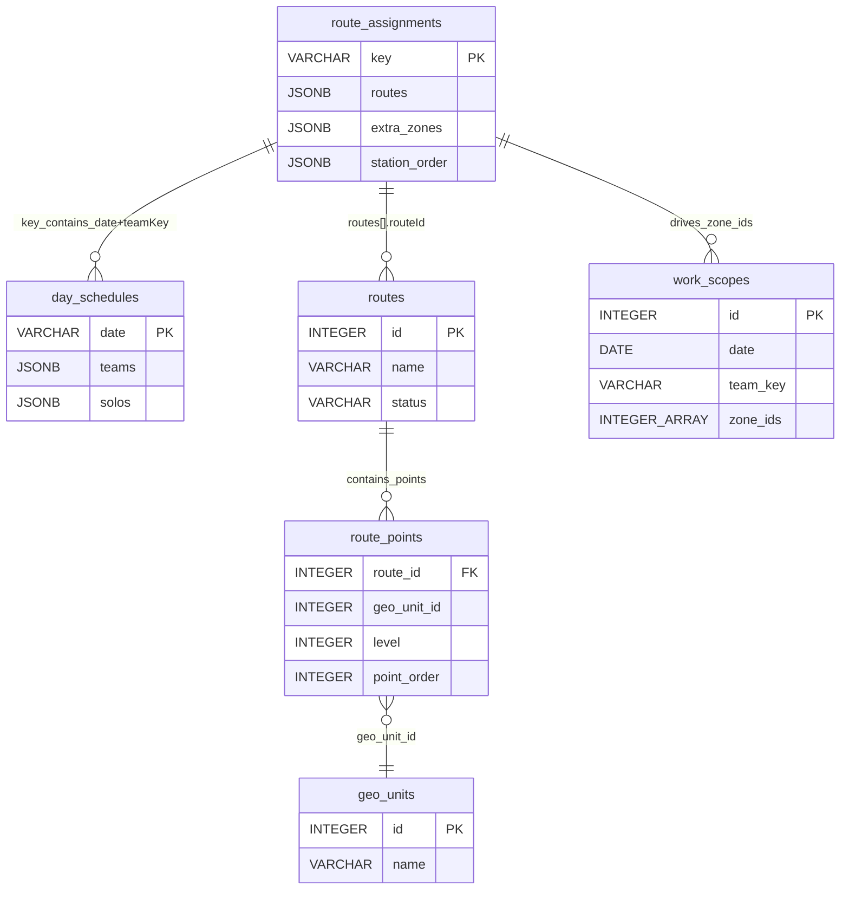

# دستور الكيان: توزيع المسارات (Route Assignments Domain Constitution)

> **الحالة (Status):** Active Draft / Authoritative  
> **المرجع الأعلى للكيان `route_assignments` في النظام.** تم إعداده بناءً على `001_core_tables.sql`، `094_route_assignment_station_order.sql`، `routeAssignments.ts`، و`route-assignment.md`.

---

## 1. هوية الكيان (Entity Identity)

- **الاسم العربي:** توزيع المسارات
- **الاسم الإنجليزي:** Route Assignment
- **اسم الجدول:** `route_assignments`
- **الوصف:** يربط الفريق اليومي (من `day_schedules`) بمساراته الجغرافية ومناطقه الإضافية، ويحدد ترتيب المحطات التشغيلي. هو الطبقة الوسيطة بين جدولة الفرق ونطاق العمل الفعلي.
- **الجداول المرتبطة برمجياً وتشغيلياً:** `day_schedules`, `routes`, `route_points`, `geo_units`, `work_scopes`, `open_tasks`
- **الأهمية والأمان:** كيان حاسم للتخطيط التشغيلي. أي خطأ في `routes` أو `extra_zones` يغير نطاق العمل ويؤثر على حساب المهام المؤهلة. لا يوجد soft-delete؛ الحذف فيزيائي.

---

## 2. الجدول والحقول (Table & Field Dictionary)

| الحقل (Field) | النوع (SQL Type) | NULL? | DEFAULT | Constraints | الوصف والشرح بالعربية | مثال واقعي (Example) |
|---|---|---|---|---|---|---|
| `key` | `VARCHAR(255)` | ❌ | — | `PRIMARY KEY` | المفتاح المركب: `{date}_{teamKey}` بصيغة `YYYY-MM-DD_team_X`. | `"2026-05-28_team_0"` |
| `routes` | `JSONB` | ✅ | `'[]'` | — | مصفوفة تركيب المسارات. كل عنصر يحوي `routeId`, `startIdx`, `endIdx`, `direction`. | `[{"routeId":5,"startIdx":0,"endIdx":3,"direction":"forward"}]` |
| `extra_zones` | `JSONB` | ✅ | `'[]'` | — | مصفوفة معرفات المناطق الإضافية (`geo_unit_id`) خارج المسارات. | `[101, 102]` |
| `station_order` | `JSONB` | ✅ | `'[]'` | — | مصفوفة ترتيب المحطات النهائية داخل النطاق. تُنظّف من العناصر الخارجة قبل الحفظ. | `[101, 105, 110]` |

### 2.1 الفهارس والقيود

- `PRIMARY KEY (key)` — يمنع تكرار توزيع لنفس اليوم والفريق.
- لا يوجد `FOREIGN KEY` فعلي لـ `routeId` داخل `routes` JSONB.
- لا يوجد `FOREIGN KEY` فعلي لعناصر `extra_zones` أو `station_order` إلى `geo_units`.

---

## 3. القيود والقواعد (Constraints & Business Rules)

### 3.1 قيود المستوى البرمجي وقاعدة البيانات (Database Constraints)

- **Primary Key:** الحقل `key`.
- **Foreign Keys:** لا توجد FK فعلية في الهجرة.
- **Unique Constraints:** لا يوجد قيد فريد إضافي غير PK.
- **Check Constraints:** لا يوجد `CHECK` على `key`، `routes`، `extra_zones`، أو `station_order`.
- **Indexes:** لا يوجد فهرس إضافي موثق.

### 3.2 قواعد العمل البرمجية والتشغيلية (Business Rules)

| الرمز (Code) | القاعدة التشغيلية (Business Rule) | المصدر البرمجي (Source) | الشرح والتفصيل والضوابط المطبقة |
|---|---|---|---|
| **RA-R001** | تنسيق `key` إلزامي: `YYYY-MM-DD_team_X` أو `YYYY-MM-DD_solo_X` | `routeAssignments.ts` | يُتحقق عبر regex: `^(\d{4}-\d{2}-\d{2})_((?:team|solo)_\d+)$`. أي مفتاح غير مطابق يرجع `400`. |
| **RA-R002** | لا تكرار للمسارات داخل `routes` | `routeAssignments.ts` | `seenRouteIds` Set ترفض `routeId` مكرر وتعيد `400`. |
| **RA-R003** | `startIdx` و `endIdx` غير سالبين و `startIdx ≤ endIdx` | `routeAssignments.ts` | يُرفض أي تركيب فيه `startIdx > endIdx` أو قيم سالبة. |
| **RA-R004** | `direction` إما `forward` أو `reverse` | `routeAssignments.ts` | أي قيمة أخرى تُرفض برسالة `invalid direction`. |
| **RA-R005** | لا تكرار للمناطق الإضافية | `routeAssignments.ts` | `seenExtraZones` Set ترفض `zoneId` مكرر في `extraZones`. |
| **RA-R006** | لا تكرار بترتيب المحطات | `routeAssignments.ts` | `seenStationOrder` Set ترفض `zoneId` مكرر في `stationOrder`. |
| **RA-R007** | عند الحفظ يُستدعى `syncAssignedTasks` تلقائياً | `routeAssignments.ts` | بعد `UPSERT` إلى `route_assignments`، يُشغل `syncAssignedTasks` ضمن transaction منفصلة. فشل المزامنة لا يبطل حفظ التوزيع. |
| **RA-R008** | يجب تحديد الفرع (`actingBranchId`) | `routeAssignments.ts` | غياب الفرع يرجع `400` برسالة `يجب تحديد الفرع`. |

---

## 4. العلاقات (Relationships)

### 4.1 مخطط العلاقات الكيانية (Entity Relationship Map)



### 4.2 تفاصيل الجداول المرتبطة

| الجدول المرتبط | نوع العلاقة | سلوك الحذف (ON DELETE) | الوصف التشغيلي |
|---|---|---|---|
| `day_schedules` | `N:1` منطقية | — | الربط يتم عبر `date` و`teamKey` المستخرجين من `key`. |
| `routes` | `N:M` منطقية | — | `routes[].routeId` يشير منطقياً إلى `routes.id` دون FK validation. |
| `route_points` | `N:M` منطقية | — | مناطق المسار تُستخرج من `route_points` حسب `routeId` ومؤشري البداية والنهاية. |
| `geo_units` | `N:M` منطقية | — | `extra_zones[]` و`station_order[]` يشيران منطقياً إلى `geo_units.id`. |
| `work_scopes` | `1:N` منطقية | — | توزيع المسارات هو المصدر لبناء `zone_ids` داخل `work_scopes`. |

---

## 5. آلة الحالات (State Machine)

`route_assignments` لا يملك حالة (`status`) صريحة. حالته الضمنية:

```text
غير موجود (no record) → موجود (record saved with routes/extraZones/stationOrder)
```

### 5.1 وصف الحالات الضمنية

- **غير موجود:** لا يوجد سجل للتاريخ/الفريق المطلوبين؛ الواجهة تعرض `routes: []`, `extraZones: []`, `stationOrder: []`.
- **موجود:** يوجد سجل محفوظ؛ البيانات تُستخدم لحساب نطاق العمل وللمزامنة التلقائية.

---

## 6. صلاحيات الوصول (Permission Matrix)

> **تحديث 2026-06-16 (هجرة `291_route_assignments_permission_family.sql`):** كان `routeAssignments.ts` **بلا أي تحقق صلاحية** (`requireAuth` فقط) — أي مستخدم مصادَق يقرأ خطط كل الفروع ويكتب فوق أي توزيع بمفتاح `date_team_N` مخمّن (يخالف §3-3/§3-7). الدستور كان يدّعي `marketing_visits.*` لكن الكود لم يفرضها. صار للتوزيع عائلته المستقلة `routes.assign.*`، منفصلة عن تعريف المسار `routes.*`.

| المفتاح (Permission Key) | الاسم العربي للصلاحية | النطاقات المدعومة (Scopes) | الوصف الأمني |
|---|---|---|---|
| `routes.assign.view` | عرض توزيع المسارات | `GLOBAL`, `BRANCH` | قراءة توزيعات الفرق؛ `BRANCH` يرى فقط توزيعات الفرق التابعة لفرعه (الفرع المالك مشتق من موظفي الفريق). |
| `routes.assign.manage` | إدارة توزيع المسارات | `GLOBAL`, `BRANCH` | إنشاء/تحديث توزيع؛ يُرفض التعديل عبر-الفروع (`403`). |

**اشتقاق الفرع المالك (GAP-DS-005):** `day_schedules`/`route_assignments` بلا `branch_id`، والمفتاح عام. الفرع المالك للتوزيع = `employees.branch_id` لمشرف/فني الخانة رقم N في `day_schedules.teams[N]`/`solos[N]` (PL-R005 يضمن أن الفريق من فرع واحد). عند تعذّر الاشتقاق (لا جدول لليوم بعد) يسقط التحقق إلى الفرع الفعّال للمستخدم — مُحكَم بالقدرة لكن دون عزل سجلّي؛ هذا أثر متبقٍّ من GAP-DS-005.

**الأساس (baseline):** الـ backfill محافظ: `routes.assign.view`←`marketing_visits.view`، `routes.assign.manage`←`marketing_visits.update_result` (بنفس النطاق). منح المخطّط/مدير الفرع يُطبَّق عبر **واجهة الأدوار** (سابقة هجرة 290).

### 6.1 منطق النطاق

- `GET /route-assignments` (الخريطة): `routes.assign.view`؛ GLOBAL ⇒ كل الفروع، BRANCH ⇒ فقط المفاتيح التي فرعها المالك ضمن فروع المستخدم (عبر `resolveOwningBranchesForKeys`)، NONE ⇒ `{}`.
- `GET /route-assignments/:key`: سجل قائم ⇒ تحقق الفرع المالك (`canViewAssignment`)؛ لا سجل ⇒ مصفوفات فارغة (soft-404).
- `PUT /route-assignments/:key`: `routes.assign.manage` + فرع فعّال + `canManageAssignment(الفرع المالك)`؛ فشل ⇒ `403`. المزامنة تُشغَّل على الفرع المالك (`owningBranch ?? actingBranchId`).
- غياب الفرع الفعّال يمنع الحفظ برسالة `يجب تحديد الفرع`.
- الملفات: `packages/api/policies/routeAssignmentPolicy.ts` (الاشتقاق + التفويض).

---

## 7. عقد API (API Contract)

### 7.1 قائمة المسارات (Endpoints)

| الطريقة | المسار (Path) | الصلاحية المطلوبة | وصف السلوك والوظيفة |
|---|---|---|---|
| **GET** | `/route-assignments` | `routes.assign.view` | يجلب توزيعات المسارات كخريطة، مُرشّحة بالفرع المالك (GLOBAL=الكل). |
| **GET** | `/route-assignments/:key` | `routes.assign.view` + تحقق الفرع المالك | يجلب توزيع مسار محدد بمفتاحه. إن لم يوجد يرجع مصفوفات فارغة. |
| **PUT** | `/route-assignments/:key` | `routes.assign.manage` + فرع فعّال + تحقق الفرع المالك | يُنشئ أو يحدث التوزيع، ثم يُشغل `syncAssignedTasks` على الفرع المالك. |

### 7.2 معلمات الطلب

| المعلمة | المكان | النوع | إلزامية | الوصف |
|---|---|---|---|---|
| `key` | Path | `string` | نعم | `YYYY-MM-DD_team_X` أو `YYYY-MM-DD_solo_X`. |
| `routes` | Body | `array` | لا | مصفوفة تركيب المسارات. |
| `extraZones` | Body | `array<integer>` | لا | مصفوفة المناطق الإضافية. |
| `stationOrder` | Body | `array<integer>` | لا | مصفوفة ترتيب المحطات. |
| `X-Branch-Id` | Header / Auth Context | `integer` | نعم (PUT) | سياق الفرع الفعّال. |

### 7.3 Request / Response Schema

| النوع | الهيكل |
|---|---|
| Request (PUT) | `{ "routes": [{"routeId":5,"startIdx":0,"endIdx":3,"direction":"forward"}], "extraZones": [101], "stationOrder": [101,105] }` |
| Response (GET) | `{ "routes": [...], "extraZones": [...], "stationOrder": [...] }` |
| Response (PUT) | `{ "routes": [...], "extraZones": [...], "stationOrder": [...], "syncResult": {...}, "syncWarning": "..." }` |

### 7.4 أخطاء التحقق

- `400`: `مفتاح توزيع المسار غير صالح` — مفتاح لا يطابق regex.
- `400`: `routes must be an array`.
- `400`: `Route X is duplicated in this work coverage`.
- `400**: `Route composition N has startIdx greater than endIdx`.
- `400`: `direction must be forward or reverse`.
- `400`: `Extra zone X is duplicated`.
- `400`: `Station X is duplicated in the ordering`.
- `400`: `يجب تحديد الفرع`.

---

## 8. حالات الاختبار الشاملة (Test Cases)

### 8.1 الاختبارات الوظيفية والتحقق (Functional Tests)

| الرمز | سيناريو الفحص والاختبار | الطريقة والمسار | المدخلات المرسلة | السلوك المتوقع والاستجابة | ملاحظات تشغيلية |
|---|---|---|---|---|---|
| **TC-01** | حفظ توزيع مسار صحيح | `PUT /route-assignments/2026-05-28_team_0` | `routes`, `extraZones`, `stationOrder` صالحة | `200` مع البيانات المحفوظة + `syncResult` | happy path |
| **TC-02** | مفتاح غير صالح | `PUT /route-assignments/bad_key` | أي body | `400` برسالة `مفتاح توزيع المسار غير صالح` | regex validation |
| **TC-03** | تكرار مسار داخل `routes` | `PUT /route-assignments/...` | `routes` تحتوي `routeId` مكرر | `400` برسالة تكرار | seenRouteIds |
| **TC-04** | `startIdx > endIdx` | `PUT /route-assignments/...` | `startIdx: 5, endIdx: 2` | `400` برسالة `greater than endIdx` | index validation |
| **TC-05** | `direction` غير صالحة | `PUT /route-assignments/...` | `direction: "up"` | `400` برسالة `invalid direction` | enum validation |
| **TC-06** | تكرار منطقة إضافية | `PUT /route-assignments/...` | `extraZones: [101, 101]` | `400` برسالة تكرار | seenExtraZones |
| **TC-07** | غياب الفرع عند الحفظ | `PUT /route-assignments/...` | أي body بدون `actingBranchId` | `400` برسالة `يجب تحديد الفرع` | auth context |
| **TC-08** | جلب توزيع غير موجود | `GET /route-assignments/2026-05-28_team_99` | — | `200` مع مصفوفات فارغة | soft 404 |

---

## 9. الثغرات والتضاربات المكتشفة (Gaps & Contradictions)

- **GAP-RA-001:** لا يوجد `FOREIGN KEY` لـ `routes[].routeId`. يمكن حفظ `routeId` غير موجود في `routes` دون رفض من قاعدة البيانات.

- **GAP-RA-002:** لا يوجد `FOREIGN KEY` لعناصر `extra_zones` أو `station_order` إلى `geo_units`. يمكن حفظ معرفات جغرافية غير موجودة.

- **GAP-RA-003:** ✅ **محلول (2026-06-16، هجرة 291):** `GET /route-assignments` صار يُرشّح بالفرع المالك (BRANCH = فروع المستخدم فقط، GLOBAL = الكل، NONE = `{}`)، و`GET/:key`+`PUT/:key` يفرضان تحقق الفرع المالك. أُضيف تحقق صلاحية `routes.assign.*` (كان `requireAuth` فقط).

- **GAP-RA-004:** `syncAssignedTasks` يُشغل في transaction منفصلة عن `route_assignments` UPSERT. فشل المزامنة لا يبطل الحفظ، مما قد يؤدي إلى حالة عدم تطابق بين التوزيع والمهام المسندة.

---

## 10. تاريخ التغييرات (Schema Changelog)

| تاريخ الهجرة | ملف الهجرة (Migration File) | طبيعة التعديل وهدف التأثير الفني والتشغيلي على الجدول |
|---|---|---|
| **غير مؤكد** | `001_core_tables.sql` | إنشاء جدول `route_assignments` مع الأعمدة `key`, `routes`, `extra_zones`. |
| **غير مؤكد** | `094_route_assignment_station_order.sql` | إضافة عمود `station_order JSONB DEFAULT '[]'` لترتيب المحطات. |
| **2026-06-16** | `291_route_assignments_permission_family.sql` | **عائلة صلاحيات التوزيع:** إضافة `routes.assign.view`+`routes.assign.manage` (GLOBAL/BRANCH)، backfill من `marketing_visits.*`. الكود: `routeAssignments.ts` يفرض القدرة + عزل الفرع المالك (المشتق من موظفي الفريق) عبر `routeAssignmentPolicy.ts`. يحلّ GAP-RA-003 وثغرة الكتابة عبر-الفروع. |
