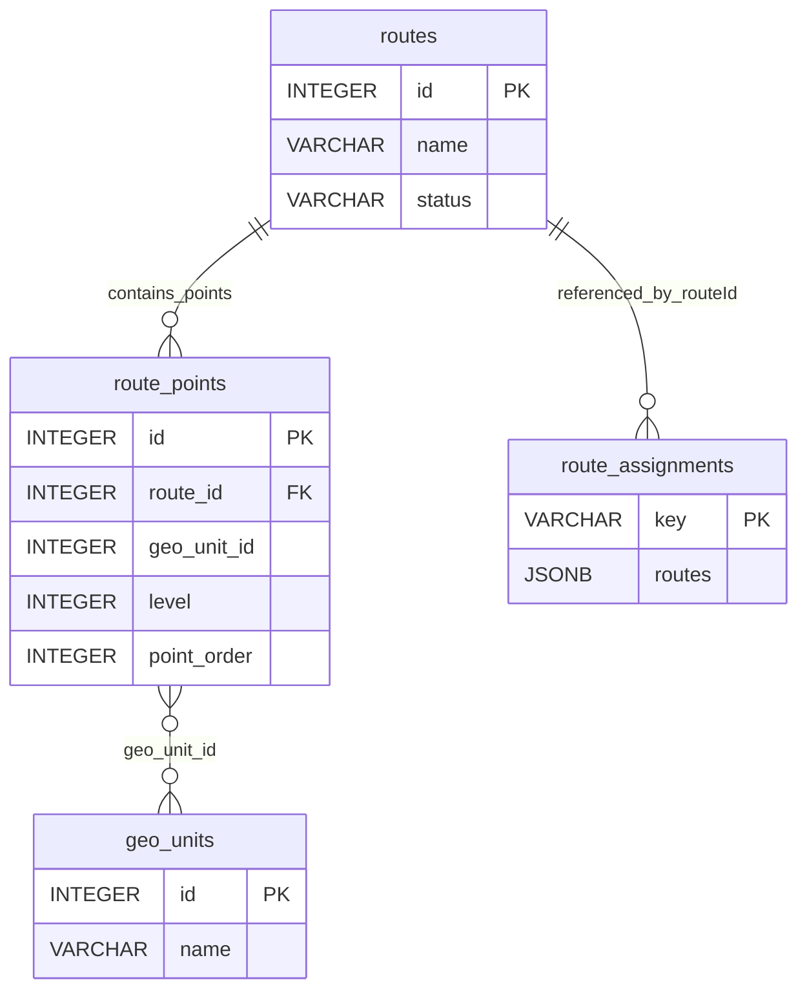

# دستور الكيان: المسارات الجغرافية (Routes Domain Constitution)

> **الحالة (Status):** Active Draft / Authoritative  
> **المرجع الأعلى للكيانين `routes` و `route_points` في النظام.** تم إعداده بناءً على `001_core_tables.sql` و`routes.ts` و`routeAssignments.ts`.

---

## 1. هوية الكيان (Entity Identity)

- **الاسم العربي:** المسارات الجغرافية
- **الاسم الإنجليزي:** Geo Route
- **اسم الجدول الرئيسي:** `routes`
- **الجدول الفرعي:** `route_points`
- **الوصف:** مسار جغرافي مُعرّف مسبقاً يتكوّن من سلسلة مرتبة من الوحدات الجغرافية (`geo_units`). يُستخدم لاحقاً في توزيع نطاق العمل على الفرق اليومية.
- **الجداول المرتبطة برمجياً وتشغيلياً:** `route_points`, `geo_units`, `route_assignments`, `work_scopes`, `day_schedules`
- **الأهمية والأمان:** كيان إداري مركزي؛ تعديل المسار يؤثر على كل التوزيعات المستقبلية والحالية. يدعم حذف فيزيائي (`CASCADE` لـ `route_points`). لا يوجد soft-delete.

---

## 2. الجدول والحقول (Table & Field Dictionary)

### 2.1 جدول `routes`

| الحقل (Field) | النوع (SQL Type) | NULL? | DEFAULT | Constraints | الوصف والشرح بالعربية | مثال واقعي (Example) |
|---|---|---|---|---|---|---|
| `id` | `SERIAL` / `INTEGER` | ❌ | — | `PRIMARY KEY` | المعرف الداخلي الفريد للمسار. | `5` |
| `name` | `VARCHAR(255)` | ❌ | — | — | الاسم الوصفي للمسار (مثلاً: "طريق دمشق–حمص"). | `"طريق الشام الرئيسي"` |
| `status` | `VARCHAR(50)` | ✅ | `'active'` | — | حالة المسار. القيم المتوقعة: `active` أو `inactive`. | `"active"` |

### 2.2 جدول `route_points`

| الحقل (Field) | النوع (SQL Type) | NULL? | DEFAULT | Constraints | الوصف والشرح بالعربية | مثال واقعي (Example) |
|---|---|---|---|---|---|---|
| `id` | `SERIAL` / `INTEGER` | ❌ | — | `PRIMARY KEY` | المعرف الداخلي الفريد لنقطة المسار. | `42` |
| `route_id` | `INTEGER` | ❌ | — | `FK → routes(id) ON DELETE CASCADE` | المسار الأمّ الذي تنتمي له هذه النقطة. | `5` |
| `geo_unit_id` | `INTEGER` | ❌ | — | — | الوحدة الجغرافية (`geo_units.id`) لهذه النقطة. لا توجد FK فعلية. | `101` |
| `level` | `INTEGER` | ❌ | — | — | المستوى الإداري للوحدة الجغرافية (1–5 تقريباً). | `3` |
| `point_order` | `INTEGER` | ❌ | — | — | الترتيب داخل المسار (0-based). | `0`, `1`, `2` |

### 2.3 الفهارس والقيود

- `routes_pkey`: `UNIQUE INDEX` على `routes(id)`.
- `route_points_pkey`: `UNIQUE INDEX` على `route_points(id)`.
- `FK route_points → routes(id) ON DELETE CASCADE`: عند حذف المسار تُحذف كل نقاطه تلقائياً.
- لا يوجد `UNIQUE` على `(route_id, point_order)`.
- لا يوجد `FK` على `geo_unit_id`.

---

## 3. القيود والقواعد (Constraints & Business Rules)

### 3.1 قيود المستوى البرمجي وقاعدة البيانات (Database Constraints)

- **Primary Keys:** `routes.id` و`route_points.id`.
- **Foreign Key:** `route_points.route_id → routes(id) ON DELETE CASCADE`.
- **Unique Constraints:** لا يوجد قيد فريد إضافي.
- **Check Constraints:** لا يوجد `CHECK` على `status` أو `level` أو `point_order`.
- **Indexes:** فهارس Primary Key فقط.

### 3.2 قواعد العمل البرمجية والتشغيلية (Business Rules)

| الرمز (Code) | القاعدة التشغيلية (Business Rule) | المصدر البرمجي (Source) | الشرح والتفصيل والضوابط المطبقة |
|---|---|---|---|
| **RO-R001** | المسار يتكوّن من نقاط مرتبة | `routes.ts`, `001_core_tables.sql` | `route_points` يحتوي `point_order` لتحديد التسلسل. النقاط تُحذف وتُعاد إدراجها عند كل PUT. |
| **RO-R002** | نقاط المسار تُعرض معها geoUnits | `routes.ts` | الـ GET يجلب `routes` + `route_points` + `geoUnits` (via `listAllGeoUnits`) ثم يُركّب الاستجابة. |
| **RO-R003** | نطاق الجغرافيا (`geo.view`) يُطبّق على القراءة | `routes.ts` | `resolveGeoScope` + `areRoutePointsInsideScope` تُرشّح المسارات حسب نطاق الفرع الفعّال. |
| **RO-R004** | نطاق الجغرافيا (`geo.manage`) يُطبّق على التعديل | `routes.ts` | POST/PUT/DELETE يرفض أي نقطة خارج نطاق تغطية الفرع برسالة `403`. |
| **RO-R005** | عند التعديل تُحذف كل النقاط القديمة ثم تُعاد الإضافة | `routes.ts` | `DELETE FROM route_points WHERE route_id = $1` ثم loop INSERT. هذا يضمن عدم ترك نقاط يتيمة. |
| **RO-R006** | حالة `status` الافتراضية هي `active` | `routes.ts`, `001_core_tables.sql` | POST يرسل `status || 'active'` كافتراضي. |

---

## 4. العلاقات (Relationships)

### 4.1 مخطط العلاقات الكيانية (Entity Relationship Map)



### 4.2 تفاصيل الجداول المرتبطة

| الجدول المرتبط | نوع العلاقة | سلوك الحذف (ON DELETE) | الوصف التشغيلي |
|---|---|---|---|
| `route_points` | `1:N` فعلية | `CASCADE` | المسار يحتوي على نقاط مرتبة؛ حذف المسار يحذف كل نقاطه. |
| `geo_units` | `N:M` منطقية | — | `geo_unit_id` يشير منطقياً إلى `geo_units.id` بدون FK. |
| `route_assignments` | `N:M` منطقية | — | `routes[].routeId` داخل JSONB يشير منطقياً إلى `routes.id`. |

---

## 5. آلة الحالات (State Machine)

```text
active → inactive
```

### 5.1 وصف الحالات المعتمدة

- **`active`:** المسار متاح للاستخدام في توزيعات الفرق والتخطيط.
- **`inactive`:** المسار معطّل ولا يظهر في قوائم الاختيار (بحسب فلتر الواجهة).

### 5.2 حدود آلة الحالات

لا يوجد soft-delete؛ الحذف فيزيائي ويُزيل المسار ونقاطه بشكل نهائي.

---

## 6. صلاحيات الوصول (Permission Matrix)

> **تحديث 2026-06-16 (هجرة `290_routes_permission_family.sql`):** فُصلت خطوط السير عن شجرة الجغرافيا الوطنية `geo.*`. السبب: خطوط السير كيان **تشغيلي على مستوى الفرع**، بينما هجرة 279 حصرت `geo.manage` بالمقر (GLOBAL فقط) وحذفت كل منحه الفرعية — فكسرت إدارة المسارات للفرع. مفتاح واحد كان يحرس قرارين أمنيين مختلفين (يخالف معيار الهندسة §4.1). صار للمسارات عائلتها المستقلة.

| المفتاح (Permission Key) | الاسم العربي للصلاحية | النطاقات المدعومة (Scopes) | الوصف الأمني |
|---|---|---|---|
| `routes.view` | عرض خطوط السير | `GLOBAL`, `BRANCH` | قراءة المسارات؛ النطاق `BRANCH` يُرشّح حسب تغطية الفرع الجغرافية، و`GLOBAL` بلا تقييد جغرافي. |
| `routes.manage` | إدارة خطوط السير | `GLOBAL`, `BRANCH` | إنشاء/تعديل/حذف المسارات؛ يبقى الاحتواء الجغرافي مفروضاً على النقاط ضمن تغطية الفرع. |

**الأساس (baseline):** مدير الفرع `routes.view`+`routes.manage` بنطاق `BRANCH`؛ المشرفة `routes.view` فقط؛ المقر/مدير النظام `GLOBAL`. الـ backfill في الهجرة محافظ: `routes.view` ← `geo.view` بنفس النطاق، و`routes.manage` ← `geo.manage` (GLOBAL فقط). منح `routes.manage` بنطاق `BRANCH` لمدير الفرع يُطبَّق عبر **واجهة الأدوار** — لأن هجرة 279 أتلفت منح `geo.manage` الفرعية الأصلية، ومنح `geo.view` لا تميّز مدير الفرع عن المشرفة، فاشتقاق الإدارة من العرض كان سيمنح الكتابة للمشرفة بالخطأ.

### 6.1 منطق النطاق

- `GET /routes` يُرشّح النتائج حسب `resolveRouteGeoScope(req.authContext, 'view')` (يستدعي `resolveGeoScope(..., 'routes.view')`).
- `POST/PUT/DELETE` يتحققون من `areRoutePointsInScope(points, scope)` بنطاق `routes.manage` قبل السماح بالعملية. `PUT/DELETE` يحمّلان نقاط المسار القائم ويتحققان من احتوائها أيضاً قبل التعديل.
- رسالة الرفض الموحدة: `لا يمكن إنشاء/تعديل/حذف مسار خارج نطاق تغطية الفرع`.
- الملفات: `packages/api/policies/routePolicy.ts` (ربط المفتاح بالنطاق الجغرافي)، `packages/api/services/geoScopeService.ts` (حساب التغطية).

---

## 7. عقد API (API Contract)

### 7.1 قائمة المسارات (Endpoints)

| الطريقة | المسار (Path) | الصلاحية المطلوبة | وصف السلوك والوظيفة |
|---|---|---|---|
| **GET** | `/routes` | `routes.view` | يجلب كل المسارات مع نقاطها، مُرشّحاً حسب نطاق الجغرافيا. |
| **POST** | `/routes` | `routes.manage` | ينشئ مساراً جديداً مع نقاطه. يتحقق من نطاق الجغرافيا. |
| **PUT** | `/routes/:id` | `routes.manage` | يُحدّث اسم/حالة المسار ويستبدل كل نقاطه. |
| **DELETE** | `/routes/:id` | `routes.manage` | يحذف المسار ونقاطه (CASCADE). يتحقق من النطاق. |

### 7.2 معلمات الطلب

| المعلمة | المكان | النوع | إلزامية | الوصف |
|---|---|---|---|---|
| `id` | Path | `integer` | نعم (PUT/DELETE) | معرف المسار. |
| `name` | Body | `string` | نعم (POST) | اسم المسار الوصفي. |
| `status` | Body | `string` | لا | `active` أو `inactive`. |
| `points` | Body | `array` | لا | نقاط المسار (`{geoUnitId, level, order}`). |
| `X-Branch-Id` | Header | `integer` | لا | سياق الفرع للتحقق من النطاق الجغرافي. |

### 7.3 Request / Response Schema

| النوع | الهيكل |
|---|---|
| Request (POST) | `{ "name": "طريق الشام", "status": "active", "points": [{"geoUnitId":101,"level":3,"order":0}] }` |
| Response (GET) | `[{ "id":5, "name":"...", "status":"active", "points":[{"geoUnitId":101,"level":3,"order":0}] }]` |

### 7.4 أخطاء التحقق

- `403`: `لا يمكن إنشاء/تعديل/حذف مسار خارج نطاق تغطية الفرع`.
- `404`: `Route not found` (PUT/DELETE).
- `400`: body ناقص أو نقاط خارج النطاق.

---

## 8. حالات الاختبار الشاملة (Test Cases)

### 8.1 الاختبارات الوظيفية والتحقق (Functional Tests)

| الرمز | سيناريو الفحص والاختبار | الطريقة والمسار | المدخلات المرسلة | السلوك المتوقع والاستجابة | ملاحظات تشغيلية |
|---|---|---|---|---|---|
| **TC-01** | إنشاء مسار صحيح مع نقاط | `POST /routes` | `name`, `points` صالحة داخل النطاق | `200` مع المسار ونقاطه | happy path |
| **TC-02** | إنشاء مسار بنقاط خارج نطاق الفرع | `POST /routes` | `points` تحتوي `geoUnitId` خارج النطاق | `403` برسالة `لا يمكن إنشاء مسار خارج نطاق تغطية الفرع` | geo scope |
| **TC-03** | تعديل مسار واستبدال نقاطه | `PUT /routes/5` | `name`, `points` جديدة | `200` مع النقاط المحدثة | delete-then-insert |
| **TC-04** | حذف مسار موجود | `DELETE /routes/5` | — | `200` مع `{success: true}` | CASCADE |
| **TC-05** | حذف مسار غير موجود | `DELETE /routes/99999` | — | `404` | not found |
| **TC-06** | جلب المسارات المُرشّحة | `GET /routes` | — | `200` مع قائمة مرشّحة حسب نطاق الفرع | geo filtering |

---

## 9. الثغرات والتضاربات المكتشفة (Gaps & Contradictions)

- **GAP-RO-001:** `route_points.geo_unit_id` لا يملك `FK` إلى `geo_units(id)`. يمكن إدراج `geo_unit_id` غير موجود.

- **GAP-RO-002:** لا يوجد `UNIQUE(route_id, point_order)`. يمكن تكرار `point_order` لنفس المسار.

- **GAP-RO-003:** لا يوجد `CHECK` على `routes.status`. القيم المتوقعة `active`/`inactive` غير مقيّدة بقاعدة بيانات.

- **GAP-RO-004:** `GET /routes` لا يُطبّق pagination فعلياً رغم قبول `page` و`limit` كـ query params.

---

## 10. تاريخ التغييرات (Schema Changelog)

| تاريخ الهجرة | ملف الهجرة (Migration File) | طبيعة التعديل وهدف التأثير الفني والتشغيلي على الجدول |
|---|---|---|
| **غير مؤكد** | `001_core_tables.sql` | إنشاء جدول `routes` (id, name, status) وجدول `route_points` (id, route_id FK CASCADE, geo_unit_id, level, point_order). |
| **2026-06-16** | `290_routes_permission_family.sql` | **فصل عائلة صلاحيات خطوط السير:** إضافة `routes.view` + `routes.manage` (GLOBAL/BRANCH)، backfill `routes.view`←`geo.view` و`routes.manage`←`geo.manage`. الكود: `routes.ts` يستخدم المفاتيح الجديدة عبر `routePolicy.ts`، والواجهة (`RouteManager.tsx`، خرائط عناوين الأدوار) مُحاذاة. يُصلح كسر هجرة 279 لإدارة المسارات على مستوى الفرع. |
