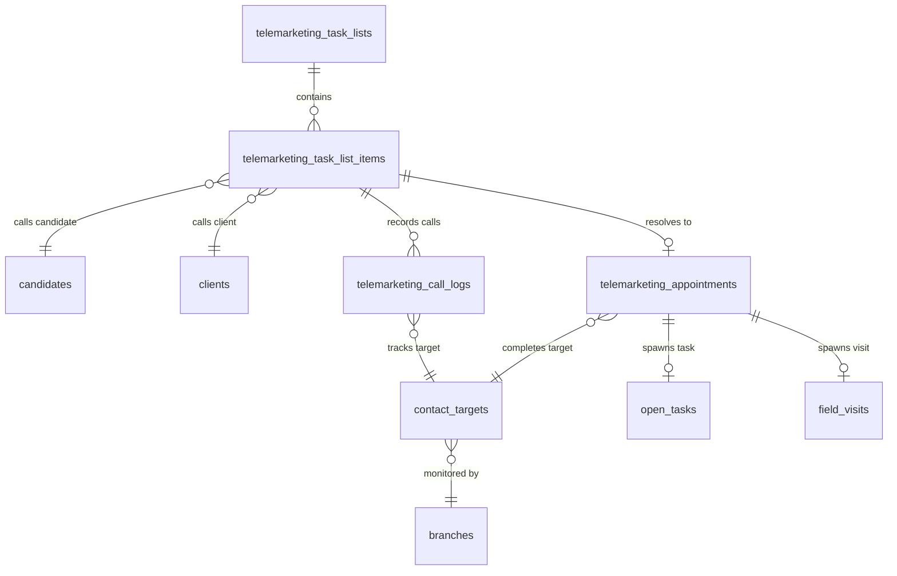

# دستور الكيان: التسويق الهاتفي (Telemarketing Domain Constitution)

> **الحالة (Status):** Active Draft / Authoritative  
> **المرجع الأعلى لكيانات وأنشطة التسويق الهاتفي وكشوف وجداول الاتصالات، والمكالمات، والمواعيد المحجوزة، وأهداف الاتصال اليومية.**

---

## 1. هوية الكيان (Entity Identity)

- **الاسم العربي:** التسويق الهاتفي / مركز الاتصال
- **الاسم الإنجليزي:** Telemarketing
- **الجداول الرئيسية:** 
  1. `telemarketing_task_lists` (كشوف الاتصال اليومية الموزعة على الفرق).
  2. `telemarketing_task_list_items` (بنود الاتصال والعملاء المرشحين الفرديين داخل الكشف).
  3. `telemarketing_call_logs` (سجلات توثيق المكالمات الهاتفية الجارية ونتائجها التفصيلية).
  4. `telemarketing_appointments` (مواعيد الزيارات الميدانية المحجوزة هاتفياً).
  5. `contact_targets` (الأهداف والذمم اليومية المخصصة للمتابعة والتحصيل والجدولة).
- **الوصف:** السلسلة الهيكلية الحاكمة لعمليات التواصل الصوتي والرسائل الهاتفية المباشرة مع الزبائن (`clients`) والمرشحين (`candidates`). يقوم الكيان بدور الوسيط والتكامل التشغيلي بين التخطيط (الخلفي) والتنفيذ الميداني للفنيين والفرق، حيث يحوّل أهداف الاتصال اليومية إلى مكالمات فعلية مسجلة ونتائج محددة، ثم يثبت مواعيد مؤكدة تنطلق منها مهام التركيب والزيارات والتحصيل.
- **الأهمية والأمان:** يمثل العمود الفقري لتوليد المبيعات وتنظيم خدمة العملاء. أي تسريب في بيانات الاتصال أو تلاعب في المواعيد وحالات الأرقام المعتمدة يضر بالمستهدف المالي اليومي للشركة ويسرب البيانات المنافسة. يخضع لرقابة صلاحيات مشددة على مستوى الفرع لتأمين الفلترة الجغرافية.

---

## 2. معجم الجداول والحقول (Table & Field Dictionary)

### 2.1 جدول كشوف الاتصال `telemarketing_task_lists`

يخزن الكشوف اليومية الحاضنة لبنود الاتصالات الموزعة على فرق الاتصال الهاتفي.

| الحقل (Field) | النوع (SQL Type) | NULL? | DEFAULT | Constraints | الوصف والشرح بالعربية | مثال واقعي (Example) |
|---|---|---|---|---|---|---|
| `id` | `VARCHAR(100)` | ❌ | — | `PRIMARY KEY` | المعرف الفريد النصي للكشف (UUID) | `"list-99214"` |
| `team_key` | `VARCHAR(100)` | ❌ | — | — | كود فريق الاتصال المخصص له الكشف | `"team_tele_damascus"` |
| `date` | `VARCHAR(50)` | ❌ | — | `UNIQUE (team_key, date)` | تاريخ التشغيل الفعلي الجاري للكشف | `"2026-05-24"` |
| `created_at` | `TIMESTAMPTZ` | ✅ | `NOW()` | — | تاريخ إنشاء الكشف بقاعدة البيانات | `"2026-05-24T20:45:00Z"` |

---

### 2.2 جدول بنود الكشوف `telemarketing_task_list_items`

يخزن العملاء أو المرشحين المدرجين في كشف الاتصال وحالة الاتصال الفردية الجارية معهم.

| الحقل (Field) | النوع (SQL Type) | NULL? | DEFAULT | Constraints | الوصف والشرح بالعربية | مثال واقعي (Example) |
|---|---|---|---|---|---|---|
| `id` | `VARCHAR(100)` | ❌ | — | `PRIMARY KEY` | المعرف الفريد النصي للبند | `"item-8012"` |
| `task_list_id` | `VARCHAR(100)` | ❌ | — | `FK → ...task_lists(id) ON DELETE CASCADE` | معرف الكشف التابع له البند | `"list-99214"` |
| `entity_type` | `VARCHAR(20)` | ❌ | — | `CHECK (entity_type IN ('candidate', 'client'))`| نوع الكيان المستهدف (`candidate` أو `client`) | `"candidate"` |
| `entity_id` | `INTEGER` | ❌ | — | — | معرف الكيان الفردي (الزبون أو المرشح) | `1024` |
| `name` | `VARCHAR(255)` | ❌ | — | — | اسم الشخص المستهدف بالاتصال الفعلي | `"محمد أحمد يوسف"` |
| `mobile` | `VARCHAR(50)` | ❌ | — | — | رقم الهاتف المحمول الأساسي للاتصال | `"0991234567"` |
| `contact_number`| `VARCHAR(50)` | ✅ | — | — | رقم هاتف بديل إضافي للتواصل | `"0933281928"` |
| `contact_label` | `VARCHAR(255)` | ✅ | — | — | تسمية تصنيف هاتف البديل (المنزل، العمل) | `"المنزل"` |
| `address_text` | `TEXT` | ✅ | — | — | العنوان النصي التفصيلي لموقع العميل | `"دمشق، الميدان، بناية الصفا"` |
| `geo_unit_id` | `INTEGER` | ✅ | — | — | معرف المنطقة السكنية الجغرافية للعميل | `12` |
| `status` | `VARCHAR(20)` | ✅ | `'pending'` | `CHECK (status IN ('pending', 'called', 'booked'))`| حالة بند الاتصال الحالية | `"called"` |
| `call_outcome` | `VARCHAR(50)` | ✅ | — | — | نتيجة الاتصال الأخيرة التي تم تدوينها | `"not_interested"` |
| `contact_target_id`| `BIGINT`| ✅ | — | `FK → contact_targets(id) ON DELETE SET NULL` | معرف مستهدف الاتصال المسبب للجدولة | `3042` |

---

### 2.3 جدول سجل مكالمات التسويق `telemarketing_call_logs`

يوثق التتبع التاريخي والجنائي لكافة محاولات الاتصال والمكالمات الهاتفية الجارية.

| الحقل (Field) | النوع (SQL Type) | NULL? | DEFAULT | Constraints | الوصف والشرح بالعربية | مثال واقعي (Example) |
|---|---|---|---|---|---|---|
| `id` | `VARCHAR(100)` | ❌ | — | `PRIMARY KEY` | المعرف الفريد لسجل المكالمة | `"call-5510"` |
| `entity_type` | `VARCHAR(20)` | ❌ | — | `CHECK (entity_type IN ('candidate', 'client'))`| نوع الكيان المستهدف | `"client"` |
| `entity_id` | `INTEGER` | ❌ | — | — | معرف الكيان (الزبون أو المرشح) | `1024` |
| `task_list_id` | `VARCHAR(100)` | ✅ | — | — | معرف كشف الاتصال التابع له (إن وجد) | `"list-99214"` |
| `team_key` | `VARCHAR(100)` | ❌ | — | — | كود فريق الاتصال الجاري المكالمة | `"team_tele_damascus"` |
| `outcome` | `VARCHAR(50)` | ❌ | — | `CHECK (outcome IN ...)` | النتيجة النهائية الصارمة للمكالمة (21 نتيجة) | `"booked_marketing_appointment"` |
| `contact_label` | `VARCHAR(255)` | ✅ | — | — | تسمية تصنيف هاتف العميل المتصل به | `"الأساسي"` |
| `contact_number`| `VARCHAR(50)` | ✅ | — | — | رقم الهاتف الفعلي الذي تم التواصل معه | `"0991234567"` |
| `notes` | `TEXT` | ✅ | — | — | تفاصيل وملاحظات المكالمة الهاتفية يدوياً | `"طلب الاتصال به غداً لعدم التفرغ"` |
| `timestamp` | `TIMESTAMPTZ` | ✅ | `NOW()` | — | تاريخ ووقت إجراء وتوثيق المكالمة | `"2026-05-24T20:46:00Z"` |
| `called_by` | `INTEGER` | ✅ | — | — | معرف الموظف الذي أجرى المكالمة | `12` |
| `communication_method`| `VARCHAR(30)`| ✅ | — | — | وسيلة الاتصال المعتمدة (هاتف، واتساب) | `"phone"` |
| `contact_target_id`| `BIGINT`| ✅ | — | `FK → contact_targets(id) ON DELETE SET NULL` | معرف مستهدف الاتصال المربوط بالمكالمة | `3042` |

---

### 2.4 جدول مواعيد التسويق `telemarketing_appointments`

يخزن المواعيد الجاري حجزها هاتفياً وتفاصيل الزيارات المبرمة.

| الحقل (Field) | النوع (SQL Type) | NULL? | DEFAULT | Constraints | الوصف والشرح بالعربية | مثال واقعي (Example) |
|---|---|---|---|---|---|---|
| `id` | `VARCHAR(100)` | ❌ | — | `PRIMARY KEY` | المعرف الفريد النصي للموعد | `"appt-7741"` |
| `entity_type` | `VARCHAR(20)` | ❌ | — | `CHECK (entity_type IN ('candidate', 'client'))`| نوع الكيان المستهدف بالموعد | `"candidate"` |
| `entity_id` | `INTEGER` | ❌ | — | — | معرف الكيان (الزبون أو المرشح) | `1024` |
| `customer_name` | `VARCHAR(255)` | ❌ | — | — | اسم العميل وقت حجز الموعد (Denormalized) | `"محمد أحمد يوسف"` |
| `customer_address`| `TEXT` | ✅ | — | — | العنوان المعتمد للزيارة ميدانياً للزبون | `"الميدان، بناية الصفا"` |
| `customer_mobile`| `VARCHAR(50)` | ✅ | — | — | رقم تواصل العميل للموعد المعتمد الفعلي | `"0991234567"` |
| `team_key` | `VARCHAR(100)` | ❌ | — | — | كود الفريق المكلف بالاتصال وصاحب الموعد | `"team_tele_damascus"` |
| `date` | `VARCHAR(50)` | ❌ | — | — | التاريخ المحدد للزيارة الميدانية المعتمد | `"2026-05-26"` |
| `time_slot` | `VARCHAR(50)` | ❌ | — | — | الفترة الزمنية لحضور الفريق (شريحة الوقت) | `"10:00-11:00"` |
| `occupation` | `VARCHAR(255)` | ✅ | — | — | لقطة لمهنة العميل وقت كتابة الموعد | `"مهندس"` |
| `water_source` | `VARCHAR(255)` | ✅ | — | — | لقطة لمصدر المياه المستخدم لدى العميل | `"شبكة رئيسية"` |
| `notes` | `TEXT` | ✅ | — | — | ملاحظات إضافية حول الموعد المبرم | `"الرجاء إحضار عينات فحص المياه"` |
| `created_at` | `TIMESTAMPTZ` | ✅ | `NOW()` | — | تاريخ إنشاء موعد الحجز | `"2026-05-24T20:46:00Z"` |
| `created_by` | `INTEGER` | ✅ | — | — | معرف الموظف الذي حجز الموعد هاتفياً | `12` |
| `contact_target_id`| `BIGINT`| ✅ | — | `FK → contact_targets(id) ON DELETE SET NULL` | معرف مستهدف الاتصال المربوط بالموعد | `3042` |
| `answered_by` | `VARCHAR(50)` | ✅ | — | — | اسم الشخص الذي أجاب على المكالمة وحجز | `"أخت العميل"` |

---

### 2.5 جدول أهداف الاتصال `contact_targets`

يوثق الأهداف اليومية الجاري تحضيرها والعمل عليها من الفرق لتصفية الديون أو المتابعة مبيعاتياً.

| الحقل (Field) | النوع (SQL Type) | NULL? | DEFAULT | Constraints | الوصف والشرح بالعربية | مثال واقعي (Example) |
|---|---|---|---|---|---|---|
| `id` | `BIGSERIAL` | ❌ | — | `PRIMARY KEY` | المعرف الفريد التلقائي للمستهدف | `3042` |
| `branch_id` | `INTEGER` | ❌ | — | `FK → branches(id) ON DELETE RESTRICT` | معرف الفرع التشغيلي للأهداف المستهدفة | `1` |
| `target_type` | `VARCHAR(50)` | ❌ | — | `CHECK (target_type IN ('client'))`| نوع الهدف المستهدف حالياً | `"client"` |
| `target_id` | `INTEGER` | ❌ | — | — | معرف العميل المستهدف بالمتابعة والاتصال | `1024` |
| `target_stage` | `VARCHAR(50)` | ❌ | — | `CHECK (target_stage IN ('lead'))`| تصنيف مرحلة المستهدف اليومي | `"lead"` |
| `visit_type` | `VARCHAR(50)` | ❌ | — | `CHECK (visit_type IN ('marketing'))`| نوع الزيارة التشغيلية التابعة | `"marketing"` |
| `source_type` | `VARCHAR(50)` | ❌ | — | `CHECK (source_type IN ('lead'))`| تصنيف مصدر البيانات الرئيسي | `"lead"` |
| `source_id` | `INTEGER` | ❌ | — | — | معرف المصدر المرتبط بالهدف | `8012` |
| `supervisor_hr_user_id`| `INTEGER`| ✅ | — | `FK → hr_users(id) ON DELETE SET NULL` | معرف المشرف المسؤول عن تحضير الخطط | `15` |
| `zone_id` | `INTEGER` | ✅ | — | — | معرف المنطقة الجغرافية التابعة للتحضير | `123` |
| `status` | `VARCHAR(50)` | ❌ | `'new'` | `CHECK (status IN ...)` | حالة المستهدف المالي للاتصال | `"closed"` |
| `latest_call_outcome`| `VARCHAR(50)`| ✅ | — | — | النتيجة الأخيرة لأبرز مكالمة للمستهدف | `"booked_marketing_appointment"` |
| `latest_task_list_item_id`| `VARCHAR(100)`| ✅ | — | — | معرف آخر بند كشف تواصل معه | `"item-8012"` |
| `latest_appointment_id`| `VARCHAR(100)`| ✅ | — | — | معرف الموعد الأحدث الذي تم حجزه | `"appt-7741"` |
| `created_at` | `TIMESTAMPTZ` | ❌ | `NOW()` | — | تاريخ إنشاء السجل | `"2026-05-24T20:45:00Z"` |
| `updated_at` | `TIMESTAMPTZ` | ❌ | `NOW()` | — | تاريخ تعديل البيانات الجارية | `"2026-05-24T20:46:00Z"` |
| `date` | `DATE` | ✅ | — | `UNIQUE (branch, type, id... date, zone)`| التاريخ التشغيلي المحدد للمستهدف اليومي | `"2026-05-24"` |

---

## 3. القيود والقواعد (Constraints & Business Rules)

### 3.1 قيود محددات قاعدة البيانات (Database Constraints)
- **Cascade Deletion:** تتمتع بنود الكشوف `telemarketing_task_list_items` بقيد ربط مباشر `ON DELETE CASCADE` مع كشف الاتصال الرئيسي `telemarketing_task_lists` مما يزيل البنود تلقائياً في حال حذف الكشف.
- **outcome CHECK Constraint:** يفرض جدول سجل المكالمات `telemarketing_call_logs` قيد فحص متكامل لـ 21 نتيجة صحيحة ومطابقة ومترجمة (انظر BR-1).
- **Date-Zone Daily Unique Constraint:** يفرض حقل الأهداف قيد تكرار يومي صارم لمنع تداخل تحضير المكالمات لنفس العميل بنفس اليوم والفرقة الجغرافية:
  `UNIQUE (branch_id, target_type, target_id, visit_type, source_type, date, zone_id)`.

### 3.2 قواعد العمل البرمجية والتشغيلية (Business Rules)

#### BR-1: هيكل محصلة المكالمات الهاتفية (Telemarketing Outcome System)
يوفر التطبيق 21 نتيجة معيارية مقسمة لـ 5 مجموعات كبرى بالاتساق المطلق مع السيرفر و `telemarketingOutcomes.ts`:
1. **لم يتم التواصل (`not_reached`):** تشمل `no_answer` (لم يتم الرد)، `busy` (مشغول)، `out_of_coverage` (خارج التغطية)، `not_in_service` (خارج الخدمة)، `wrong_number` (رقم خاطئ)، `auto_disconnected` (انقطع تلقائياً)، `message_sent` (مرسل رسالة).
2. **تم التواصل - بدون موعد (`reached`):** تشمل `currently_busy` (العميل مشغول حالياً)، `interrupted` (انقطع الاتصال)، `not_interested` (غير مهتم)، `other_company_not_interested` (لديه جهاز آخر وغير مهتم)، `seen_offer_not_interested` (اطلع سابقاً وغير مهتم)، `address_updated` (تم تحديث العنوان)، `new_number` (رقم إضافي).
3. **تم التواصل - يحتاج متابعة (`follow_up`):** تشمل `other_company_callback` (لديه جهاز آخر وطلب المتابعة)، `seen_offer_callback` (اطلع وطلب المتابعة).
4. **تم التواصل - طلب خدمة (`service_request`):** تشمل `service_request` (طلب صيانة)، `company_customer_missing_phone` (رقم مفقود).
5. **حجز موعد (`booked`):** تشمل القيمة المعيارية المعتمدة للحجز `booked_marketing_appointment`.

#### BR-2: سلسلة الزناد والتسلسل الآلي للحجز (Trigger Chain)
عند قيام موظف مركز الاتصال بنجاح بترحيل مكالمة وحجز موعد زيارة (`POST /api/telemarketing/appointments`):
1. **تحديث المستهدف:** يتحول وضع الهدف الجاري في `contact_targets.status` تلقائياً إلى `closed` وتوثيق مسبب الإغلاق `latest_call_outcome = 'booked_marketing_appointment'`.
2. **الزناد الأول للمهمة المفتوحة:** يقوم النظام أوتوماتيكياً بإنشاء مهمة مفتوحة جديدة (`open_tasks` من نوع `device_demo` وعائلة `marketing` وتخصيص تاريخ موعد `expected_date`) لصالح العقد أو العميل.
3. **الزناد الثاني للزيارة الميدانية:** يقوم السيرفر تلقائياً بإنشاء زيارة ميدانية مخططة ومؤكدة (`field_visits` وربطها بالتاريخ والوقت المحجوزين) وتكليف الفنيين بالخطة التابعة.

#### BR-3: التعددية وتنوع الكيانات المستهدفة (Entity Polymorphism)
- يعتمد النظام بالكامل بنية التعددية لنوع الكيانات (`entity_type IN ('candidate', 'client')`).
- تخدم هذه الميزة إدارة الاتصال بالمرشحين (`candidates`) لتحويلهم لمبيعات جديدة، والعملاء القدامى (`clients`) لمتابعة التحصيل والصيانة.
- في حال كان الهدف مرشحاً وتم حجز موعد زيارة مبيعات ناجحة له ونتج عنها عقد: يقوم النظام بترقية وضع المرشح تلقائياً وربطه بالعميل المنشأ مع الحفاظ التام على كامل سجلات المكالمات والأرشيف الصوتي التاريخي للزبون.

#### BR-4: استبقاء وتوثيق الخصائص الفدائية وقت الحجز (Appointment Snapshots)
- يقوم جدول المواعيد `telemarketing_appointments` بأخذ لقطات فورية لبعض خصائص العميل وقت حجز الموعد مثل المهنة `occupation` ومصدر المياه `water_source`.
- الهدف من هذه اللقطة حماية البيانات التشغيلية الأولية والتحضيرية للفنيين الميدانيين قبل ذهابهم للموقع، تحسباً لتحديث بيانات العميل لاحقاً من قسم الصيانة أو المبيعات.

---

## 4. العلاقات بين الجداول (Entity Relationships)

---

## 5. آلة الحالات التشغيلية (State Machine)

### 5.1 دورة حياة بنود كشف الاتصال (Task List Item Lifecycle)
- **`pending` (قيد الانتظار):** الحالة الافتراضية للبند الملحق فور إنشاء الكشف.
- **`called` (تم التواصل):** بعد تسجيل مكالمة هاتفية صحيحة بـ 20 نتيجة متاحة عدا الحجز.
- **`booked` (تم الحجز):** عند نجاح المكالمة وحجز شريحة مواعد مؤكدة للزيارة.

### 5.2 دورة حياة أهداف الاتصال اليومية (Contact Target Lifecycle)
- **`new` (جديد):** الهدف المستقطب الأولي في الفرع.
- **`queued` / `in_call_list` (مدرج بكشف الاتصال):** عند إلحاق الهدف بكشف تواصل جاري لفريق التسويق.
- **`contacted` (تم التواصل):** عند تدوين تواصل ناجح أو جزئي بالهواتف.
- **`closed` (مغلق):** الحالة النهائية للهدف، وتتم أوتوماتيكياً بمجرد حجز موعد (`booked_marketing_appointment`) أو يدوياً عبر المشرف بسبب انتهاء محاولات الاتصال.

---

## 6. صلاحيات الوصول (Permission Matrix)

> [!CAUTION]
> **ثغرة أمنية هيكلية (GAP-022):** مسار الأهداف الهاتفية المباشرة والمزامنة اليومية الميدانية للتحصيل بملف `routes/contactTargets.ts` يفتقر بالكامل لوجود بوابات التحقق من الصلاحيات المعيارية للفرع (`requirePermission`)، مما يسمح لأي مستخدم مصرح له بالدخول (حتى لو كان متدرباً) بالمزامنة وعرض كافة أهداف المبيعات والمتابعة الجغرافية.

| المسار التشغيلي (Route Path) | المفتاح الفعلي المطلوب | النطاق المسموح (Scope) | الوصف والشرح بالعربية |
|---|---|---|---|
| `GET /api/telemarketing/snapshot`| `telemarketing.lists.view` | BRANCH / GLOBAL | عرض لقطة كشف الاتصال الحالي للفريق |
| `POST /task-lists/upsert` | `telemarketing.lists.generate`| BRANCH / GLOBAL | إنشاء أو تحديث كشوف الاتصالات يدوياً |
| `POST /task-lists/generate-from-plan`| `telemarketing.lists.generate`| BRANCH / GLOBAL | توليد بنود الكشوف بناء على الخطط |
| `POST /api/telemarketing/call-logs`| `telemarketing.calls.create` | BRANCH / GLOBAL | تسجيل مكالمة هاتفية وتحديث المحصلة |
| `POST /api/telemarketing/appointments`| `telemarketing.appointments.book`| BRANCH / GLOBAL | حجز موعد وتأكيد الزيارات الميدانية |
| `POST /api/telemarketing/service-tasks`| `telemarketing.calls.create` | BRANCH / GLOBAL | تحويل العميل وتوليد مهمة صيانة/صندوق |

---

## 7. عقد API (API Contract)

### 7.1 قائمة endpoints الرئيسية (Core Endpoints)

1. **`GET /api/telemarketing/snapshot`**
   - **الغرض:** استرجاع تفاصيل وإحصائيات بنود كشف الاتصال اليومي المخصص للفريق واليوم الجاري.
   - **الباراميترات:** `teamKey` (مفتاح الفريق)، `date` (التاريخ المختار).

2. **`POST /api/telemarketing/call-logs`**
   - **الغرض:** تسجيل وتوثيق تفاصيل محاولة تواصل هاتفية وتحديث حالة بنود الكشف.
   - **المدخلات (Request Body):**
     `{ "entityType": "client", "entityId": 1024, "outcome": "busy", "teamKey": "team_tele_damascus", "notes": "الرقم مشغول يرجى الإعادة" }`

3. **`POST /api/telemarketing/appointments`**
   - **الغرض:** حجز موعد زيارة وإطلاق سلسلة التكليف والمهام التلقائية ميدانياً.
   - **المدخلات:**
     `{ "entityType": "client", "entityId": 1024, "customerName": "أحمد", "date": "2026-05-26", "timeSlot": "10:00-11:00", "teamKey": "team_tele_damascus" }`

4. **`GET /api/contact-targets/marketing`**
   - **الغرض:** جلب قائمة أهداف المبيعات المفتوحة اليومية المخصصة للمتابعة بالفرع.
   - **الرأس (Headers):** `X-Branch-Id` (معرف فرع التشغيل الجاري بصرامة).

---

## 8. حالات الاختبار الشاملة (Test Cases)

| الرمز | سيناريو الفحص والاختبار | الطريقة والمسار | المدخلات المرسلة | السلوك المتوقع والاستجابة | ملاحظات تشغيلية |
|---|---|---|---|---|---|
| **TC-01** | تسجيل مكالمة ناجحة للزبون بنتيجة حجز | POST `/api/telemarketing/call-logs` | كائن مكالمة للزبون `1024` بنتيجة `booked_marketing_appointment`. | ترميز `200` مع حفظ السجل الهاتفي وإغلاق مستهدف الاتصال الجاري. | يمهد لنقل البند لحالة booked في كشف التحضير. |
| **TC-02** | محاولة حجز موعد زيارة كامل مبيعاتياً | POST `/api/telemarketing/appointments` | تفاصيل الزبون واليوم وشريحة الوقت المتاحة. | ترميز `200` وحجز الموعد وتوليد مهمة `device_demo` وزيارة ميدانية آلياً. | التحقق من صحة عمل سلسلة الزناد التلقائي والتسلسل للكيانات. |
| **TC-03** | تسجيل مكالمة فاشلة بسبب رفض صريح | POST `/api/telemarketing/call-logs` | نتيجة `rejected` مع تبرير رفض `telemarketing_rejection_reason`. | ترميز `200` وتحديث حالة البند لـ `called` وإغلاق الهدف نهائياً. | يوثق رغبات العملاء بالانسحاب ويمنع إزعاجهم. |
| **TC-04** | استرجاع لقطة الكشف اليومي لفرقة الاتصال | GET `/api/telemarketing/snapshot` | الباراميترات النصية للفريق واليوم الجاري. | ترميز `200` مع كائن الكشف التفصيلي والبنود المعلقة ومعدلات الإنجاز. | يعكس واجهة المتابعة الفورية لموظفي التسويق. |
| **TC-05** | توليد كشف اتصال ديناميكي من الخطة | POST `/task-lists/generate-from-plan` | معرف خطة التحضير المبرمة والتواريخ. | ترميز `200` واستيراد العملاء لجدول البنود التابع للكشف أوتوماتيكياً. | يختصر جهد إدخال وتكرار العملاء المستهدفين يدوياً. |
| **TC-06** | تحويل تواصل هاتف لصيانة وفتح مهمة | POST `/api/telemarketing/service-tasks` | معرف المكالمة ونوع الصيانة المطلوبة `periodic_maintenance`. | ترميز `200` وإنشاء مهمة خدمة مفتوحة `open_tasks` وتخصيصها للفرع الجاري. | يسهل خدمة العملاء وحفظ متطلباتهم المحاسبية هاتفياً. |
| **TC-07** | محاولة حجز موعد لعميل بفرع مغاير | POST `/api/telemarketing/appointments` | إرسال طلب حجز الزيارة لزبون من فرع مغاير. | ترميز `200` ونجاح التوثيق والالتزام بالربط الجغرافي المعزول للطلب. | يعكس مرونة النظام في إدارة المبيعات المتقاطعة للفروع. |

---

## 9. الثغرات والتضاربات المكتشفة (Gaps & Contradictions)

تم رصد عدد من الثغرات والعيوب الهيكلية الحرجة التي تهدد كفاءة وحماية الكيانات الهاتفية:

### 🚨 9.1 الثغرة الأولى: غياب أمني كامل للتحقق بصلاحيات أهداف الاتصال (Missing Branch Sync Auth Scopes on Contact Targets)
- **التضارب:** مسار الأهداف الهاتفية الميدانية والمزامنة اليومية الميدانية للتحصيل بملف `routes/contactTargets.ts` يفتقر بالكامل لوجود بوابات التحقق من الصلاحيات المعيارية للفرع (`requirePermission`)، مما يسمح لأي مستخدم مصرح له بالدخول (حتى لو كان متدرباً) بالمزامنة وعرض كافة أهداف المبيعات والمتابعة الجغرافية.
- **الأثر التشغيلي:** إمكانية تسريب بيانات المبيعات الحساسة للفروع المنافسة أو العبث غير المحسوب بمعدلات ومؤشرات أهداف الفرع ومزامنتها.
- **التوصية:** إدراج بوابات الأمان `requirePermission('contact_targets.view')` و `requirePermission('contact_targets.manage')` للمسارات فوراً وتصفية البيانات بصرامة.

### ⚠️ 9.2 الثغرة الثانية: انعدام مسارات التعديل أو التحديث للمواعيد المحجوزة (No PUT/PATCH Endpoints for Appointments)
- **التضارب:** لا يوجد أي مسار برمجي مخصص لتحديث أو تعديل أو إعادة جدولة مواعيد التسويق المحجوزة (`telemarketing_appointments`).
- **الأثر التشغيلي:** في حال رغبة العميل بتأجيل الموعد أو تعديل شريحة الوقت، يضطر الموظف لإنشاء موعد حجز جديد بالكامل مما يخلق مواعيد مكررة وتضارب بيانات مهول وأجهزة تابعة "تائهة" لعدم وجود آلية للتعديل المباشر.
- **التوصية:** بناء وإتاحة مسار تعديل صريح `PATCH /api/telemarketing/appointments/:id` لتحديث التواريخ والشرائح والمزامنة التشغيلية.

### ⚠️ 9.3 الثغرة الثالثة: غياب فحص قيود وسيلة الاتصال وتوحيدها (Unconstrained Communication Method Values)
- **التضارب:** حقل وسيلة الاتصال الموثق بـ `telemarketing_call_logs.communication_method` نوعه `VARCHAR(30)` ولكنه يفتقر بالكامل لوجود قيد فحص `CHECK constraint` بالـ DB أو Server Validation بالـ Controller.
- **الأثر التشغيلي:** إدخال بيانات عشوائية أو مشوهة إملائياً من الواجهات (مثل `phone`, `Phone`, `واتس اب`, `whatsapp`) مما يعطل كفاءة إعداد تقارير الأداء وتتبع قنوات التواصل.
- **التوصية:** إرساء قيد فحص صارم ومحدد بالقيم المقبولة حصرياً (`'phone', 'whatsapp', 'sms'`).

### ⚠️ 9.4 الثغرة الرابعة: تضارب لقطات خصائص المياه مع الجدول المحدث للعملاء (Water Source Snapshot Inconsistency)
- **التضارب:** يقوم جدول مواعيد التسويق بأخذ لقطة فورية لمصدر المياه الخاص بالعميل وتخزينه في `water_source` كعمود نصي، على الرغم من قيام قاعدة البيانات مؤخراً بفصل خصائص المياه وجعلها حقولاً إدارية متغيرة بالكامل، مما يفرغ الحقل المسجل من معناه ويسجله كـ `null` دائماً.
- **الأثر التشغيلي:** تزويد الفنيين الميدانيين بمعلومات ناقصة أو مشوهة وغير موحدة حول عينات فحص المياه المطلوبة للزبائن الجدد.
- **التوصية:** توحيد قراءة مصادر المياه وربطها بالهيكلية الجديدة لخصائص الزبون وقت الحفظ.

### ⚠️ 9.5 الثغرة الخامسة: افتقار الكيانات والأنشطة لنظام الحذف الناعم (Central Telemarketing Lacks Soft-Delete)
- **التضارب:** تعتمد جميع الجداول الخمسة للتسويق على الحذف الفيزيائي الحاد. وفي حال القيام بحذف العميل أو المرشح، يتم تدمير ومحو كامل سجل مكالماته وتاريخ اتصالاته والمواعيد المحجوزة والكشوف المرتبطة به تلقائياً وقسرياً بموجب قيد الربط `ON DELETE CASCADE`.
- **الأثر التشغيلي:** ضياع تتبع الأداء وسجلات العمل التاريخية لأقسام التسويق وعدم توفر أثر محاسبي آمن لمراجعة إنتاجية مركز الاتصال.
- **التوصية:** تطبيق معيار الحذف الناعم وتجميد الحسابات التالفة مع الحفاظ التام على الأرشيف التاريخي.

---

## 10. تاريخ التغييرات الهيكلية (Schema Changelog)

| تاريخ الهجرة | ملف الهجرة (Migration File) | طبيعة التعديل وهدف التأثير الفني والتشغيلي على الجدول |
|---|---|---|
| **2026-04** | `001_core_tables.sql` | التأسيس الهيكلي الأولي وإنشاء جداول الكشوف `task_lists` والبنود والاتصالات والمواعيد والمحددات القياسية. |
| **2026-04** | `014_branch_id_domain_tables.sql` | ربط عمليات الكشوف بالفرع التشغيلي المنشئ وتدشين فهرسة الفروع لرفع سرعة الاستعلام والبحث. |
| **2026-04** | `045_contact_targets.sql` | تأسيس البنية التحتية لأهداف الاتصال اليومية `contact_targets` وربط الحالات ومستويات جودة البيانات. |
| **2026-04** | `046_telemarketing_permissions_seeding.sql`| بذر صلاحيات استعراض الكشوف وإنشائها وحجز المواعيد وضبط الأدوار بفروع الشركة. |
| **2026-04** | `047_telemarketing_contact_target_linkage.sql`| ربط جداول البنود والمكالمات والمواعيد بجدول أهداف الاتصال وتصحيح أنواع معرفات الليفسايكل لتتطابق كـ `VARCHAR(100)`. |
| **2026-04** | `048_telemarketing_outcome_expand.sql`| التوسيع الهيكلي الهام: رفع قيد فحص نتيجة المكالمة ليتسع لـ MVP Outcome المتكامل وتصنيفها لمجموعات. |
| **2026-04** | `049_cleanup_null_branch_telemarketing_data.sql`| تطهير ومعالجة السجلات التاريخية القديمة وتعبئة الفروع المفقودة لتفادي استثناءات الاستعلام. |
| **2026-04** | `050_telemarketing_appointment_visit_tasks.sql`| بناء الزناد والتسلسل الآلي لتوليد المهام والزيارات الميدانية فور إبرام موعد التسويق الهاتفي. |
| **2026-04** | `051_marketing_visits_mvp.sql` | ربط كشوف الاتصالات بالزيارات الميدانية المبيعاتية الموحدة لتتبع نتائج العروض. |
| **2026-04** | `054_permissions_allowed_scopes.sql`| ضبط وتقييد النطاقات المسموحة للتسويق بـ `GLOBAL` و `BRANCH` واستبعاد النطاق الفردي `ASSIGNED`. |
| **2026-04** | `057_open_task_link.sql` | دمج معرفات التكليف المفتوح ببنود الاتصالات لتسجيل نتائج المكالمات. |
| **2026-04** | `058_appointment_visit_open_task_link.sql`| ربط الموعد بالتكليف المفتوح ومزامنة حركة الحالات والمراحل للزيارات ميدانياً. |
| **2026-04** | `064_customer_call_logs.sql` | تدشين السجل الموحد لاتصال الزبائن وحل تعارض ربط المكالمات التليفونية بملف المتابعة. |
| **2026-04** | `074_telemarketing_appointments_book_permission.sql`| ضبط صلاحية حجز موعد المبيعات وحصرها بالفئات المصرحة منعاً للتجاوزات. |
| **2026-05** | `093_backfill_call_task_links.sql`| تعبئة وترحيل روابط المهام المفقودة للمكالمات السابقة لضمان اتساق تتبع الأداء التقني. |
| **2026-05** | `097_telemarketing_call_logs_outcome_add_missing.sql`| إلحاق نتيجة "إضافة رقم جديد" و"مرسل رسالة نصية" لقيد فحص محصلات المكالمات لتفادي الأخطاء البرمجية. |
| **2026-05** | `098_telemarketing_rejection_reschedule_reasons.sql`| بذر أسباب الرفض المعيارية وأسباب التأجيل في جدول القوائم `system_lists` لتغذية الواجهات وتوحيد التحليل. |
| **2026-05** | `107_contact_targets_closed_status.sql`| تصحيح حركة حالات أهداف الاتصال ونقلها لوضع الإغلاق `closed` فور اكتمال سيناريو الحجز بنجاح. |
| **2026-05** | `151_contact_targets_add_date.sql`| الانتقال لنمط الأهداف اليومية وإضافة حقل التاريخ وتثبيت راية المفتاح الفريد الموحد يومياً للعميل. |
| **2026-05** | `154_contact_targets_zone_unique.sql`| ترقية القيد الفريد للأهداف ليشمل المعرف الجغرافي للمنطقة `zone_id` تفادياً للتعارضات وتكامل التحضير. |
| **2026-05** | `166_answered_by_and_visit_referral_sheets.sql`| إضافة حقل تدوين اسم مجيب الاتصال `answered_by` لجدول مواعيد التسويق لرفع دقة التوثيق. |
