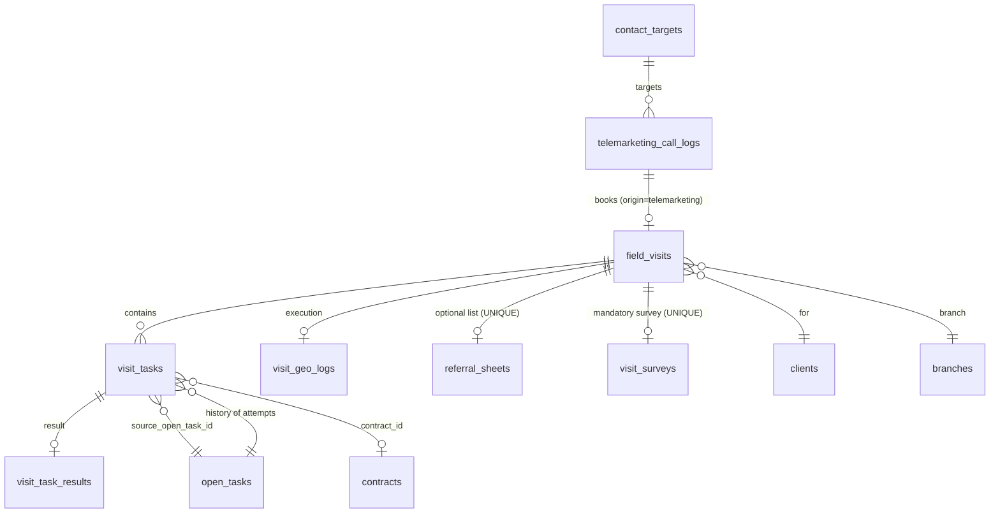

# دستور الدومين — الزيارات

> الحالة: معتمد كمرجع دستوري
> اللغة: عربية موحّدة
> النطاق: Visits / Field Visits / Visit Lifecycle / Appointment Unification
> آخر تحديث: 2026-05-31

---

## 0) الملخص التنفيذي

دومين الزيارات يحكم كل تواصل ميداني مجدول مع الزبون. الزيارة في Golden CRM **كيان موحّد واحد** (`field_visits`) يحتوي مهام متعددة (`visit_tasks`) من أي نوع.

**الزيارة = الموعد**. لا يوجد كيان "موعد" منفصل. حجز التيليماركتر = إنشاء زيارة بحالة `scheduled`.

**كل زيارة تحوي شقّين دائمين على مستوى الزيارة (لا المهمة):** لائحة أسماء (`referral_sheet`) **اختيارية**، واستبيان (`visit_survey`) **إلزامي** بـ 11 حقلاً ثابتاً. الانتقال إلى `completed` **محسوب لا يدوي**.

المراجع الحاكمة:
- `features/unified-visit-model.md` — العقد التقني والقواعد التفصيلية
- `features/visit-detail-page-constitution.md` — هيكل البيانات الكامل (٧ أقسام)
- `components/client-snapshot.md` — مرجع `customer_snapshot` (المستوى الثاني)
- `decisions/DEC-003-visit-task-unification.md` — قرارات التوحيد الأولى (31-05-2026)
- `decisions/DEC-004-visit-task-lifecycle-refinement.md` — تنقيح دورة الحياة (31-05-2026)
- `decisions/DEC-005-contact-targets-filter.md` — توحيد فلتر contact_targets ودورة حياتها (31-05-2026)
- `decisions/DEC-006-pending-resolutions-round1.md` — حسم 9 نقاط معلقة (31-05-2026)
- `decisions/DEC-007-visit-structure-list-and-survey.md` — هيكلة الزيارة + اللائحة + الاستبيان (31-05-2026)

---

## 1) التعريفات

| المصطلح | التعريف |
|---|---|
| **الزيارة** (`field_visit`) | اتفاق زمني واحد مع الزبون لتنفيذ مهمة أو أكثر. وعاء يحوي `visit_tasks`. هي نفسها "الموعد" — لا فرق بينهما. |
| **المهمة في الزيارة** (`visit_task`) | محاولة تنفيذ واحدة لـ `open_task` ضمن زيارة محددة. لها نتيجة واحدة فقط. |
| **النتيجة** (`visit_task_result`) | مخرج تنفيذ المهمة (مع side table للتفاصيل النوعية). |
| **المهمة المفتوحة** (`open_task`) | الوعد/الالتزام الدائم بأن عملاً ما سيُنفَّذ. تعيش طويلاً عبر عدة محاولات. |
| **جهة الاتصال** (`contact_target`) | هدف يومي للفريق ليتواصل معه. ليست زيارة، لكنها قد تتحول لزيارة عبر مكالمة ناجحة. |
| **المكالمة** (`call_log`) | محاولة تواصل هاتفية. نتيجتها قد تكون "حجز زيارة" → إنشاء `field_visit`. |
| **مصدر الزيارة** (`origin`) | كيف نشأت الزيارة (telemarketing / manual / emergency / system). يُسجَّل بـ `origin_type` + `origin_id`. |
| **لائحة الزيارة** (`referral_sheet`) | لائحة الأسماء المقترحة المرتبطة بالزيارة. **اختيارية**. تُنشأ يدوياً بزر بعد بدء الزيارة. واحدة كحدّ أقصى لكل زيارة (`UNIQUE(field_visit_id)`). |
| **استبيان الزيارة** (`visit_survey`) | استبيان قياس + رأي الزبون. **إلزامي** لإكمال الزيارة (إلا بـ skip + سبب). 11 حقلاً ثابتاً. واحد لكل زيارة. |
| **مسؤول الفريق** (`team_responsible`) | المالك الفعلي للائحة والاستبيان. للقياسي = المشرف. للطوارئ = الفني. يُحفظ snapshot لحظة الإنشاء. |

---

## 2) حدود الدومين

### 2.1 داخل النطاق
- كيان الزيارة الموحد (`field_visits`).
- مهام الزيارة (`visit_tasks`) ودورة حياتها التنفيذية.
- نتائج المهام (`visit_task_results` + side tables).
- جدول تنفيذ الزيارة (`visit_geo_logs`).
- إنشاء الزيارة من المصادر الأربعة (telemarketing / manual / emergency / system).
- إعادة جدولة، إلغاء، إعادة إسناد الفريق.
- إضافة مهام cascading داخل زيارة جارية.

### 2.2 خارج النطاق
- جدولة الفرق اليومية → دومين `planning`.
- إدارة المهام المفتوحة (`open_tasks`) كوعد → دومين `tasks`.
- التسويق الهاتفي والمكالمات → دومين `telemarketing`.
- نتائج التفاصيل النوعية لكل `task_type` → ملفات features الخاصة بكل نوع.

### 2.3 ممنوع الخلط
- الزيارة ليست المهمة المفتوحة.
- الزيارة ليست المكالمة.
- الزيارة ليست جهة الاتصال.
- "إعادة محاولة" المهمة = `visit_task` جديد في زيارة جديدة، وليس تعديل النتيجة القديمة.

---

## 3) الكيان والحقول الجوهرية

### 3.1 `field_visits` — الحقول الأساسية

| الحقل | النوع | ملاحظة |
|---|---|---|
| `id` | BIGSERIAL | مفتاح |
| `visit_type` | VARCHAR | `marketing` \| `service` \| `mixed` (راجع §5 V-R002) |
| `status` | VARCHAR | 9 حالات معتمدة (راجع §6) |
| `client_id` | FK → `clients` | الزبون |
| `branch_id` | FK → `branches` | الفرع المسؤول |
| `scheduled_date` | DATE | تاريخ التنفيذ |
| `scheduled_time` | VARCHAR | شريحة الوقت |
| `team_snapshot` | JSONB | الفريق الأصلي |
| `team_responsible_user_id` | FK → `hr_users` | مالك اللائحة والاستبيان لحظة الإنشاء. للقياسي = `team_snapshot.supervisor_id`. للطوارئ = `team_snapshot.technician_id` (DEC-007 D47) |
| `reassigned_*` | متعدد | الفريق الرديف (راجع visit-detail §4) |
| `origin_type` | VARCHAR | `telemarketing` \| `manual` \| `emergency_request` \| `system` |
| `origin_id` | VARCHAR/BIGINT | معرّف المصدر (المعنى حسب `origin_type`) |
| `customer_snapshot` | JSONB | لقطة الزبون = **Level 2 Standard Snapshot** (راجع `components/client-snapshot.md`) — D12 |
| `appointment_booked_at` | TIMESTAMPTZ | وقت حجز الزيارة (يحتاج migration) |
| `booked_by_telemarketer_id` | FK → `hr_users` | من حجز (يحتاج migration) |
| `telemarketer_notes` | TEXT | ملاحظات وقت الحجز (يحتاج migration) |
| `answered_by` | VARCHAR | من ردّ على المكالمة (يحتاج migration) |
| `cancellation_reason_id` | FK → `system_lists` | سبب الإلغاء (يحتاج migration) |
| `cancellation_notes` | TEXT | ملاحظات الإلغاء (يحتاج migration) |
| `field_notes` | TEXT | ملاحظات الميدان |
| `closed_by` / `closed_at` | متعدد | إغلاق الزيارة |

> الحقول التفصيلية والـ snapshots موثّقة في `features/visit-detail-page-constitution.md`.

### 3.2 الجداول التابعة

| الجدول | العلاقة | الغرض |
|---|---|---|
| `visit_tasks` | 1:N | المهام داخل الزيارة |
| `visit_task_results` | 1:1 لكل task | النتيجة العامة |
| `visit_task_{type}_results` | 1:1 لكل result | تفاصيل نوع المهمة (side table) |
| `visit_geo_logs` | 1:1 | بيانات التنفيذ الفعلي (GPS, time, distance) |
| `referral_sheets` | 1:1 (UNIQUE field_visit_id) | لائحة الأسماء المقترحة — على مستوى الزيارة (DEC-007 D40) |
| `visit_surveys` | 1:1 (UNIQUE field_visit_id) | استبيان الزيارة بـ 11 حقل ثابت (DEC-007 D42) |

> **مُلغى:** جدول `visit_name_collections` يُحذف (DEC-007 D40). كل وظائفه انتقلت إلى `referral_sheets` مباشرة. شاشة "سجلات الأسماء المقترحة" المنفصلة هي مكان إدخال الـ candidates لاحقاً، لا الزيارة.

---

## 4) دورة الحياة

### 4.1 حالات الزيارة (7 حالات بعد D18)

```
scheduled ──→ in_progress ──→ ended ──→ completed   (تلقائي عند تحقق الشروط الثلاثة)
   │                            │            └──→ closed   (إقفال إداري يدوي)
   │                            └──→ not_completed (يدوي بقرار المسؤول)
   └──→ cancelled (قبل البدء فقط)
```

**القيود الجوهرية:**
- **`cancelled` فقط من `scheduled`** (D8) — لا إلغاء بعد البدء.
- **لا `postponed_*` ولا `needs_reschedule`** (D18) — إعادة الجدولة كمفهوم انتقلت لمستوى المهمة عبر `last_waiting_status` (D10) و `expected_date/time` (D22).
- **`completed` ينتقل تلقائياً** عند تحقق ثلاثة شروط مجتمعة (DEC-007 §2 المبدأ الرابع):
  1. كل `visit_tasks` لها `visit_task_results` بـ `final_decision` غير NULL.
  2. `visit_survey` موجود لـ `field_visit_id` (مُعبَّأ كلياً أو في حالة `is_skipped = TRUE` مع `skip_reason`).
  3. لا اشتراط لـ `referral_sheet` — اللائحة اختيارية بالكامل (DEC-007 D44 + D45).
- **`not_completed`** على مستوى الزيارة = استثناء واحد فقط: الفريق وصل ولقي الزبون مش موجود/الموقع مغلق. يُسجَّل **يدوياً** + سبب.

### 4.2 حالات المهمة داخل الزيارة (`visit_tasks.status`)

`pending` → `in_progress` → `completed` \| `not_completed` \| `cancelled`

> ملاحظة: حالة الزيارة لا تتبع نتائج المهام — `completed` تعني "التوثيق اكتمل"، مش "كل المهام نجحت".

### 4.3 مرحلة `in_progress`/`ended` بدون توثيق — تصعيد ثلاثي (DEC-006 D38)

`ended` = الفريق غادر الموقع، النتائج لسا غير مكتملة. `in_progress` بلا حركة طويلة = الفريق بدأ ولم يوثّق. آلية التصعيد واحدة لكلتا الحالتين، بثلاث مراحل قابلة للضبط من `system_settings`:

- **المرحلة 1 — بعد 24 ساعة** (`visit_undocumented_alert_hours_l1`, افتراضي 24): تنبيه للفني المسؤول وفنيي الفريق.
- **المرحلة 2 — بعد 48 ساعة** (`visit_undocumented_alert_hours_l2`, افتراضي 48): تنبيه للمشرف + **منع الفني من بدء أي زيارة جديدة** حتى يوثّق السابقة.
- **المرحلة 3 — بعد 72 ساعة** (`visit_undocumented_alert_hours_l3`, افتراضي 72): تصعيد لمدير الفرع.

**لا إغلاق تلقائي قسري إطلاقاً** — توثيق `not_completed` لمهمة بدون نتيجة يحتاج فعل بشري من حامل صلاحية الإقفال. الإغلاق القسري يُتلف بيانات لا تُسترَد (نوع المشكلة، الحل، الجباية، نتيجة المهمة).

---

## 5) القواعد التشغيلية

### `V-R001` — زيارة واحدة لكل موعد
لكل اتفاق زمني مع الزبون يوجد `field_visit` واحد فقط. لا توجد كيانات موعد منفصلة. (مرجع: قرار D1)

### `V-R002` — تصنيف الزيارة بـ 3 قيم
`visit_type` ∈ {`marketing`, `service`, `mixed`}. الزيارة المختلطة (`mixed`) تحوي مهاماً من أكثر من عائلة. التفصيل عبر `visit_tasks.task_type`. (مرجع: قرار D4)

### `V-R003` — كل زيارة تحمل مصدرها
حقلا `origin_type` + `origin_id` إلزاميان عند الإنشاء. لا يجوز إنشاء زيارة بدون مصدر معروف. (مرجع: قرار D3)

### `V-R004` — الزيارة وعاء مرن قبل البدء
- تعديل الفريق مسموح وقت `scheduled` (`reassigned_*`).
- إلغاء مسموح فقط قبل `in_progress` + سبب إلزامي من `system_lists` فئة `visit_cancellation_reasons` (D8).
- إضافة/إزالة مهام مسموحة قبل `in_progress`.
- **لا إعادة جدولة** على مستوى الزيارة (D18) — إلغاء + إنشاء زيارة جديدة.

### `V-R005` — إضافة مهام أثناء التنفيذ موسّعة (cascading)
الفريق المسؤول عن زيارة `in_progress` يستطيع إضافة **أي `open_task` للزبون نفسه** (موجود أو يُنشأ لحظياً) كـ `visit_task`. لا قائمة بيضاء. شرط N-window معطّل. القيد الوحيد: نفس `client_id`. (مرجع: قرار D7 موسّع)

### `V-R006` — نتيجة واحدة لكل `visit_task` + side table إلزامي
كل `visit_task` له صف واحد في `visit_task_results` + صف في `visit_task_{type}_results` المخصّص. التعديل قبل `closed` مسموح، وبعدها ممنوع. سجل المحاولات = chain من `visit_tasks` تحت نفس `open_task`. (مرجع: قرارات D5/D15)

### `V-R007` — كل زيارة تنشئ visit_tasks جديدة
عند جدولة محاولة جديدة لنفس `open_task`، تُنشأ `visit_task` جديدة بالكامل. لا يُعاد استخدام `visit_task` قديم. (مرجع: قرار D6)

### `V-R008` — حذف `telemarketing_appointments`
الجداول `telemarketing_appointments` يُهمل ويُحذف. أي حجز هاتفي يُسجَّل مباشرة كـ `field_visit` بحالة `scheduled` مع `origin_type = 'telemarketing'`. (مرجع: قرار D1)

### `V-R009` — حصر الحجز ضمن خطة اليوم (D18)
لا يجوز إنشاء `field_visit` لتاريخ:
- ليس له `day_schedule` محفوظ.
- لا تشمل `route_assignments` فيه منطقة الزبون.
- في الماضي.

النظام يفرض الفحص الثلاثي عند `POST /telemarketing/book-visit` و `POST /field-visits` و `POST /open-tasks/:id/schedule-from-expected`. لا late-binding، لا تخمين فريق المستقبل.

### `V-R010` — `completed` محسوب لا يدوي (D16 + DEC-007 §2 المبدأ الرابع)
الزيارة تنتقل `completed` تلقائياً عند تحقق الشروط الثلاثة (§4.1). لا زر "إكمال الزيارة" يدوي. الانتقال يُنفَّذ في طبقة التطبيق عبر helper `checkAndCompleteVisit(visitId)` يُستدعى بعد كل `save` لـ task_result أو survey أو survey skip (DEC-007 P-DEC007-04). `not_completed` على الزيارة استثناء صريح يدوي.

### `V-R011` — صلاحيات حسب نوع الفريق (D11)
- فريق قياسي (`TeamSlot`): **المشرف** هو المسؤول.
- فريق طوارئ (`EmergencySlot`): **الفني** هو المسؤول.
- فريق رديف (`reassigned_*`): الدور المقابل في الفريق الرديف.
- بعد `ended`: التعديل/الإقفال يتطلب صلاحية الإقفال. فتح `closed` يتطلب `field_visits.reopen_closed` (إدارة عليا) + سبب مكتوب.

### `V-R012` — GPS إلزامي مع `location_missing` استثناء (D17)
GPS مطلوب عند البدء والإنهاء. مهلة 30 ثانية. عند الفشل، يُعرض خيار `location_missing = true` + سبب من `system_lists` فئة `location_missing_reasons`. مسافة > 500م من `customer_snapshot.gps` تُسجَّل تحذير (لا رفض).

### `V-R013` — `customer_snapshot` يتبع Level 2 (D12)
هيكل `customer_snapshot` يطابق **Standard Snapshot** المعرّف في `components/client-snapshot.md` §المستوى الثاني. لا تكرار schema.

### `V-R014` — `contact_target` يبقى مغلقاً (D23)
عند حجز الزيارة: `contact_target.status = 'closed'` + `latest_visit_id` يربط. **إلغاء الزيارة لا يُعيد فتحه** — هدف اليوم تحقق بالتواصل.

### `V-R015` — شقّان دائمان لكل زيارة على مستوى الزيارة (DEC-007 المبدأ 1)
كل `field_visit` يحوي بنيوياً جزأين أساسيين خارج `visit_tasks`:
- **اللائحة (`referral_sheet`)** — اختيارية. يُسمح بزيارة بدون لائحة دون سبب صريح.
- **الاستبيان (`visit_survey`)** — إلزامي. لا تُكتمل الزيارة بدونه إلا بـ skip معتمد من `system_lists` فئة `survey_skip_reasons`.

كلاهما يرتبط بـ `field_visit_id` مباشرة عبر FK مع قيد `UNIQUE` (واحد لكل زيارة). الملكية = `team_responsible_user_id` لحظة الإنشاء (DEC-007 D47).

### `V-R016` — إنشاء `referral_sheet` يدوي بزر بعد البدء (DEC-007 D41)
اللائحة لا تُولَّد آلياً. زر "إضافة لائحة جديدة" يظهر بعد `start` (status = `in_progress`). المسؤول يضغطه، يُدخل `target_candidates`، يحفظ. تُنشأ `referral_sheets` بـ:
- `referral_type = 'client'` ثابت.
- `referral_entity_id = field_visit.client_id`.
- `referral_name_snapshot` من `clients.full_name` لحظة الإنشاء.
- `referral_address_text` لقطة عنوان الزبون.
- `referral_origin_channel = 'visit'` ثابت.
- `field_visit_id = field_visit.id`.
- `owner_user_id = team_responsible_user_id`.
- `target_candidates = 0` افتراضياً، يُحدَّث لاحقاً عبر endpoint منفصل.
- `status = 'New'` افتراضياً.
- `referral_date = field_visit.scheduled_date`.

### `V-R017` — `visit_survey` 11 حقلاً ثابتاً + skip اختياري (DEC-007 D42)
الحقول الإلزامية عند الإكمال: `household_members_count`, `drinking_water_source`, `tds_test_result`, `hardness_test_drops`, `demo_kit_tds_result`, `customer_opinion_water_source`, `customer_opinion_demo_kit`, `customer_opinion_purification_idea`, `customer_purchase_intent`, `expected_payment_method`, `area_evaluation` (من `system_lists` فئة `area_evaluation_options`: ممتازة/جيدة/متوسطة/ضعيفة — DEC-007 D43).

قيد CHECK مركّب: إما `is_skipped = TRUE` مع `skip_reason` غير NULL وكل الـ 11 حقل NULL، أو `is_skipped = FALSE` مع كل الـ 11 حقل غير NULL و `filled_by_user_id` غير NULL.

**توقيت الفتح (D46):** كلا اللائحة والاستبيان مفتوحان للإدخال من `start` حتى `ended`. مغلقان في `scheduled` و `completed`.

### `V-R018` — completion guards الجديدة (DEC-007 D44 + D45)
`POST /field-visits/:id/complete` (أو الانتقال الآلي) يفحص بترتيب صارم:
1. كل `visit_tasks` مع `field_visit_id = :id` لها `visit_task_results.final_decision` غير NULL — وإلا 400 "X مهمة لم تُسجَّل نتيجتها".
2. `visit_surveys` موجود لـ `field_visit_id = :id` — وإلا 400 "لم يُدخَل الاستبيان أو سبب التخطي".

**لا شرط ثالث للائحة.** اللائحة اختيارية بالكامل (DEC-007 D45). الشرط القديم على `visit_name_collections` ملغى مع حذف الجدول.

---

## 6) سلوك الواجهة

| الشاشة | المحتوى |
|---|---|
| قائمة الزيارات (`VisitsListPage`) | كل الزيارات بكل أنواعها مع فلاتر type/team/date/status |
| تفاصيل الزيارة (`VisitDetailPage`) | الأقسام السبعة (راجع `features/visit-detail-page-constitution.md`) |
| نموذج النتيجة (`VisitTaskResultModal`) | conditional rendering حسب `task_type`، POST لـ unified endpoint |
| سير عمل التيليماركتر | يستدعي `POST /telemarketing/book-visit` → ينشئ `field_visit` |

---

## 7) عقد الـ API

### 7.1 الزيارات

```
GET    /field-visits                       ← قائمة
GET    /field-visits/:id                   ← تفاصيل
POST   /field-visits                       ← إنشاء يدوي (manual origin) — يفحص D18
POST   /field-visits/:id/start             ← بدء (GPS + started_by)
POST   /field-visits/:id/end               ← إنهاء التنفيذ (GPS + ended_by)
POST   /field-visits/:id/cancel            ← إلغاء (قبل البدء فقط + سبب) — D8
PATCH  /field-visits/:id/team              ← إعادة إسناد الفريق (قبل البدء فقط)
POST   /field-visits/:id/tasks             ← إضافة مهمة (cascading، D7 موسّع)
GET    /field-visits/:id/tasks/:tid/result ← قراءة نتيجة مهمة
POST   /field-visits/:id/tasks/:tid/result ← تسجيل نتيجة مهمة — D15
POST   /field-visits/:id/complete          ← اختياري — التحوّل يحدث تلقائياً عبر checkAndCompleteVisit() (DEC-007)
POST   /field-visits/:id/close             ← إقفال إداري يدوي (`closed`) — D11
POST   /field-visits/:id/reopen            ← فتح `closed` (إدارة عليا فقط) — D11
POST   /field-visits/:id/referral-sheet            ← إنشاء اللائحة يدوياً (DEC-007 D41)
POST   /field-visits/:id/referral-sheet/target     ← تحديث target_candidates (DEC-007 D41)
POST   /field-visits/:id/survey                    ← إنشاء/تحديث visit_survey (DEC-007 D42)
POST   /field-visits/:id/survey/skip               ← تسجيل skip_reason (DEC-007 D42)
```

### 7.2 الحجز من قنوات أخرى

```
POST   /telemarketing/book-visit                ← من التيليماركتر — D14 سيناريو 2
POST   /open-tasks/:id/schedule-from-expected   ← من وعد سابق (D22) — origin = 'expected_followup'
POST   /emergency-requests                      ← من بلاغ طارئ (emergency_request origin)
```

### 7.3 ملغاة
- ❌ `POST /telemarketing/appointments` (D1)
- ❌ `PATCH/DELETE /telemarketing/appointments/:id` (D1)
- ❌ `PATCH /field-visits/:id/reschedule` (D18)
- ❌ كل ما يبدأ بـ `/marketing-visits/*` (legacy سابق)
- ❌ `POST /visit-tasks/:taskId/name-collection` (DEC-007 D40 — اللائحة انتقلت لمستوى الزيارة)
- ❌ `PUT /name-collections/:id/record-names` (DEC-007 D40)

---

## 8) الصلاحيات

| العملية | الصلاحية | الممنوح |
|---|---|---|
| عرض قائمة الزيارات | `field_visits.view` | حسب النطاق |
| إنشاء يدوي / حجز | `field_visits.create` | مدير الفرع / تيليماركتر |
| بدء/إنهاء/تسجيل (قبل `ended`) | `field_visits.execute` | المسؤول في الفريق المسؤول لهذه الزيارة بالذات (D11) |
| إلغاء (قبل البدء) | `field_visits.cancel` | مشرف / مدير |
| إعادة إسناد الفريق | `field_visits.reassign_team` | مدير الفرع |
| تعديل بعد `ended` + إقفال `closed` | `field_visits.update_result` | مشرف / مدير |
| **فتح `closed`** 🆕 | `field_visits.reopen_closed` | إدارة عليا فقط + سبب مكتوب |
| تعديل بعد `closed` | ❌ ممنوع (إلا بفتح أولاً) | — |

> الصلاحيات legacy `marketing_visits.*` رُحّلت إلى `field_visits.*` (راجع UV-G001 مرحلة ٦).

---

## 9) العلاقات



---

## 10) الفجوات المفتوحة

| الكود | الموضوع | الحالة |
|---|---|---|
> **⏳ Implementation status:** سجل تنفيذ كامل لـ Phases 0-8 في
> [`plans/2026-06-01-implementation-status.md`](../plans/2026-06-01-implementation-status.md).

| `V-G001` | Migrations DEC-003 (`appointment_*`, `customer_snapshot`, `cancellation_*`, `origin_type`, `origin_id`) | ✅ محلولة — Phase 1 (migration 222) + migrations سابقة 165/166 |
| `V-G002` | حذف `telemarketing_appointments` فعلياً من DB | 🔄 مؤجلة — Phase 9 بعد 14 يوم staging |
| `V-G003` | تحديث 5 ملفات backend تستخدم `telemarketing_appointments` | 🔄 جزئية — planning يقرأ من field_visits الآن (Phase 4); 4 ملفات legacy تبقى حتى Phase 9 |
| `V-G004` | endpoint `POST /telemarketing/book-visit` | ✅ محلولة — Phase 4 (`50d334a`) |
| `V-G005` | endpoint `POST /field-visits/:id/tasks` (cascading موسّع — D7) | ✅ محلولة — Phase 4 (`50d334a`) |
| `V-G006` | Migrations DEC-004 (lifecycle 7 حالات، `location_missing_reason`, `started_by`, `ended_by`, `field_visits.reopen_closed`) | ✅ محلولة — Phase 0 (219) + Phase 1 (223) + Phase 7 (231) |
| `V-G007` | endpoint `POST /open-tasks/:id/schedule-from-expected` (D22) | ✅ محلولة — Phase 4 (`50d334a`) |
| `V-G008` | فحص D18 الثلاثي في كل الـ booking endpoints | ✅ محلولة — Phase 4 (`services/visitBooking.ts::assertD18`) |
| `V-G009` | منطق escalation `ended` → 24h/48h (D9) | ✅ محلولة — Phase 7 توسعت لـ 24/48/72h (DEC-006 D38) في `services/visitEscalationJob.ts` |
| `V-G010` | شاشة "متابعات اليوم" (Schedule-from-Expected) + شاشة "مهام خارج الخطة" (D13) | 🔄 جزئية — `ScheduleFromExpectedModal` جاهز (Phase 8)؛ شاشة خارج الخطة pending |
| `V-G011` | تعريف `system_lists` الجديدة: `visit_cancellation_reasons`, `location_missing_reasons`, `visit_task_reasons`, `customer_followup_reasons` | ✅ محلولة — Phase 0 (migration 218) بـ "أخرى" كحد أدنى؛ القيم الكاملة تخص P-DEC006-01 |
| `V-G012` | استبدال BR-2 trigger chain (migration 050) — الموعد→الزيارة لم يعد له معنى | 🔄 جزئية — لا trigger فعلي في migration 050 (راجعنا)؛ الـ chain فهمناه كمسار logical |
| `V-G013` | حذف جدول `visit_name_collections` + ترحيل بياناته إلى `referral_sheets` (DEC-007 D40) | ✅ migration 230 جاهز مع bridge backfill + safety guard — Phase 6 |
| `V-G014` | جدول `visit_surveys` + UI `VisitSurveyModal` + endpoints `/survey` و `/survey/skip` (DEC-007 D42) | ✅ محلولة — migration 214 + Phase 6 (`c441b02`) |
| `V-G015` | إنشاء `referral_sheet` يدوي بزر بعد start + endpoint `/referral-sheet` (DEC-007 D41) | ✅ محلولة — Phase 6 (`c441b02`) |
| `V-G016` | تصعيد ثلاثي 24/48/72h لزيارات بدون توثيق + 4 مفاتيح `system_settings` (DEC-006 D38) | ✅ محلولة — Phase 0 (217) + Phase 7 (`services/visitEscalationJob.ts`) |
| `V-G017` | helper `checkAndCompleteVisit()` ينفّذ الانتقال الآلي إلى `completed` بعد كل save (DEC-007 P-DEC007-04) | ✅ محلولة — Phase 6 (`services/visitCompletion.ts`) |
| `V-G018` | seed فئة `area_evaluation_options` (4 قيم) + فئة `survey_skip_reasons` (DEC-007 D43) + باقي فئات DEC-006 الست | ✅ محلولة — migration 215 + Phase 0 (218) |
| `V-G019` | حقل `team_responsible_user_id` على `field_visits` + تعبئة من `team_snapshot` لحظة الإنشاء (DEC-007 D47) | ✅ محلولة — Phase 1 (migration 222) + Phase 4 (تعبئة في `visitBooking.ts`) |
| `V-G020` | `UNIQUE(field_visit_id)` على `referral_sheets` (DEC-007 D40) | ✅ محلولة — migration 216 |

---

## 11) الخلاصة

> **الزيارة = الموعد = كيان واحد (`field_visits`).**
> **المهمة في الزيارة (`visit_task`) = محاولة تنفيذ واحدة، نتيجة واحدة.**
> **التاريخ = chain من `visit_tasks` تحت نفس `open_task`.**
> **المصدر دائماً صريح عبر `origin_type` + `origin_id`.**
> **التصنيف خفيف (3 قيم)؛ التفصيل في `task_type`.**
> **الشقّان (`referral_sheet` اختيارية + `visit_survey` إلزامي) على مستوى الزيارة لا المهمة.**
> **الانتقال إلى `completed` محسوب لا يدوي — عبر `checkAndCompleteVisit()` بعد كل save.**
