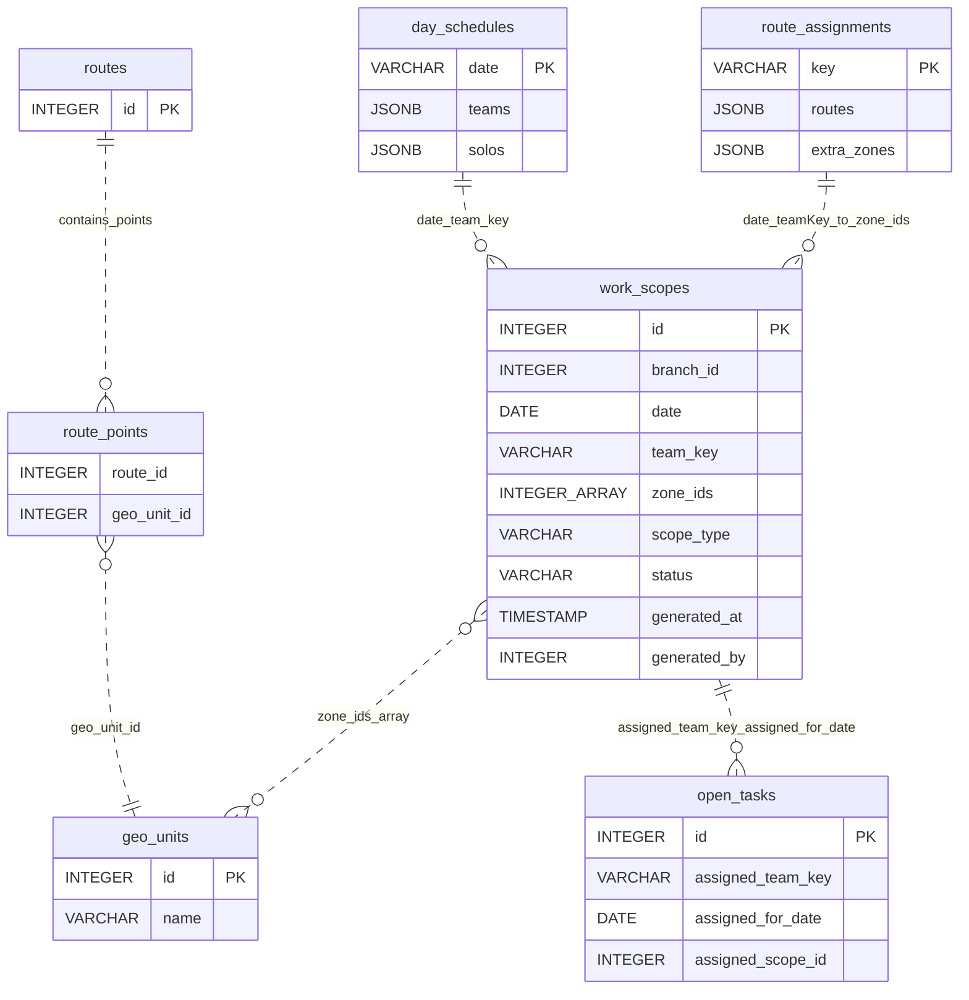

# دستور الكيان: نطاقات العمل (Work Scopes Domain Constitution)
> **الحالة (Status):** Active Draft / Authoritative  
> **المرجع الأعلى للكيان `work_scopes` في النظام.** تم إعداده بناءً على `078_work_scopes.sql` ومسارات التخطيط وخدمات حساب الحمل ومزامنة المهام.

---

## 1. هوية الكيان (Entity Identity)

- **الاسم العربي:** نطاقات العمل
- **الاسم الإنجليزي:** Work Scope
- **اسم الجدول:** `work_scopes`
- **الوصف:** ناتج حساب التخطيط؛ يحدد المناطق الجغرافية `zone_ids` التي يغطيها فريق محدد بتاريخ محدد داخل فرع محدد.
- **الجداول المرتبطة برمجياً وتشغيلياً:** `day_schedules`, `route_assignments`, `routes`, `route_points`, `geo_units`, `open_tasks`, `branches`
- **الأهمية والأمان:** كيان يربط جدول اليوم وتوزيع المسار بالمهام المسندة. أي خطأ في `branch_id`, `date`, `team_key`, أو `zone_ids` قد يغير حمل الفريق وقائمة المهام الناتجة. لا يوجد soft-delete موثق.

---

## 2. الجدول والحقول (Table & Field Dictionary)

تظهر في الهجرة تسعة أعمدة فعلية، رغم أن قائمة المهمة كتبت "8 حقول" ثم سردت تسعة أسماء. هذا الدستور يوثق كل الأعمدة الموجودة في `078_work_scopes.sql` حتى لا يسقط أي عمود فعلي.

| الحقل (Field) | النوع (SQL Type) | NULL? | DEFAULT | Constraints | الوصف والشرح بالعربية | مثال واقعي (Example) |
|---|---|---|---|---|---|---|
| `id` | `SERIAL` / `INTEGER` | ❌ | — | `PRIMARY KEY` | المعرف الداخلي الفريد لنطاق العمل. | `145` |
| `branch_id` | `INTEGER` | ❌ | — | — | الفرع الذي ينتمي له نطاق العمل، ويجب أن يأتي من سياق الفرع الفعّال. | `3` |
| `date` | `DATE` | ❌ | — | `UNIQUE(date, team_key, branch_id)` | تاريخ اليوم التشغيلي الذي يحسب له نطاق الفريق. | `"2026-05-28"` |
| `team_key` | `VARCHAR(50)` | ❌ | — | `UNIQUE(date, team_key, branch_id)` | مفتاح الفريق بصيغة `team_X` أو `solo_X`. | `"team_0"` |
| `zone_ids` | `INTEGER[]` | ✅ | `'{}'` | — | مصفوفة Postgres لمعرفات المناطق. هي FK منطقي إلى `geo_units.id` بدون FK فعلي. | `{101,102}` |
| `scope_type` | `VARCHAR(50)` | ✅ | `'mixed'` | — | نوع النطاق. القيمة الثابتة حالياً هي `mixed` ولا توجد خيارات أخرى موثقة. | `"mixed"` |
| `status` | `VARCHAR(50)` | ✅ | `'draft'` | — | حالة النطاق. المسار الدستوري هو `draft` ثم `generated`، وليس `active`. | `"generated"` |
| `generated_at` | `TIMESTAMP` | ✅ | `NOW()` | — | وقت توليد أو تحديث نطاق العمل. | `"2026-05-28T09:30:00"` |
| `generated_by` | `INTEGER` | ✅ | — | — | معرف المستخدم الذي نفذ التوليد إن توفر. لا توجد FK فعلية موثقة. | `42` |

### 2.1 الفهارس والقيود

- `UNIQUE(date, team_key, branch_id)` يمنع تكرار نطاق لنفس الفريق والفرع والتاريخ.
- `idx_work_scopes_date` يدعم الاستعلام حسب التاريخ.
- `idx_work_scopes_team` يدعم الاستعلام حسب `team_key` و`branch_id`.

---

## 3. القيود والقواعد (Constraints & Business Rules)

### 3.1 قيود المستوى البرمجي وقاعدة البيانات (Database Constraints)

- **Primary Key:** الحقل `id`.
- **Foreign Keys:** لا توجد FK فعلية في الهجرة.
- **Unique Constraints:** القيد الفريد على `date`, `team_key`, `branch_id`.
- **Check Constraints:** لا يوجد `CHECK` على `status`, `scope_type`, `team_key`, أو عناصر `zone_ids`.
- **Indexes:** يوجد فهرس حسب التاريخ، وفهرس حسب الفريق والفرع.
- **فجوة معروفة:** `zone_ids[]` لا يملك FK validation.
- **حد تشغيلي:** `scope_type = 'mixed'` ثابت حالياً ولا توجد خيارات أخرى.

### 3.2 قواعد العمل البرمجية والتشغيلية (Business Rules)

| الرمز (Code) | القاعدة التشغيلية (Business Rule) | المصدر البرمجي (Source) | الشرح والتفصيل والضوابط المطبقة |
|---|---|---|---|
| **WS-R001** | `work_scopes` ينتج عن حساب الحمل في planning mode | `packages/api/routes/planning.ts`, `planningMarketingTargets.ts` | النطاق ليس إدخالاً يدوياً؛ ينتج من جدول اليوم وتوزيع المسار وحساب الحمل. |
| **WS-R002** | كل نطاق تابع لـ `branch_id` + `date` + `team_key` | `078_work_scopes.sql` | هذا الثلاثي هو الهوية التشغيلية للنطاق، وتحميه قاعدة البيانات بقيد فريد. |
| **WS-R003** | `zone_ids[]` هي مصفوفة `geo_units.id` | `planningMarketingTargets.ts` | المناطق تبنى من `route_assignments.routes` عبر `route_points.geo_unit_id`، مع `extra_zones`. |
| **WS-R004** | الحالة `draft` ثم `generated` فقط | `078_work_scopes.sql` | القيمة الافتراضية `draft`، وبعد التوليد تعتمد `generated`. لا توجد حالة `active` معتمدة. |
| **WS-R005** | `mode=planning` يولد النطاق ويشغل `syncAssignedTasks` | `packages/api/routes/planning.ts`, `assignedTasks.ts` | بعد حساب الأهداف يستدعي المسار مزامنة المهام لتحديث `open_tasks.assigned_team_key` و`assigned_for_date`. |

### 3.3 تحقق مسار التخطيط

- `date` يجب أن يكون بصيغة `YYYY-MM-DD`.
- `teamKey` يجب أن يطابق `team_X` أو `solo_X`.
- `branchId` يؤخذ من `req.authContext.actingBranchId`.
- غياب الفرع الفعّال يؤدي إلى `400` برسالة `A branch context is required`.
- `solo_X` يرجع نتيجة فارغة لأهداف التسويق بسبب `SOLO_HAS_NO_MARKETING_LOAD`.
- غياب توزيع المسار يرجع نتيجة فارغة بسبب `ROUTE_ASSIGNMENT_NOT_FOUND`.

---

## 4. العلاقات (Relationships)

### 4.1 مخطط العلاقات الكيانية (Entity Relationship Map)



### 4.2 تفاصيل الجداول المرتبطة

| الجدول المرتبط | نوع العلاقة | سلوك الحذف (ON DELETE) | الوصف التشغيلي |
|---|---|---|---|
| `day_schedules` | `N:1` منطقية | — | الربط يتم عبر `date` و`team_key` المشتق من ترتيب `teams` أو `solos`. |
| `route_assignments` | `N:1` منطقية | — | المفتاح العملي هو `{date}_{teamKey}`، ومنه تأتي `routes` و`extra_zones`. |
| `routes` / `route_points` | `N:M` منطقية | — | مناطق المسار تستخرج من `route_points.geo_unit_id` حسب مقاطع المسارات المختارة. |
| `geo_units` | `N:M` منطقية | — | `zone_ids[]` يشير منطقياً إلى `geo_units.id` دون FK validation. |
| `open_tasks` | `1:N` منطقية | — | المهام الناتجة ترتبط بالفريق والتاريخ عبر `assigned_team_key` و`assigned_for_date`. |

### 4.3 أثر العلاقة على المهام

- `syncAssignedTasks` يستخدم نطاق التخطيط الحالي لتحديد المهام المؤهلة.
- المهام المؤهلة تنتقل من `open` أو `needs_follow_up` إلى `assigned`.
- عند توفر `scopeId` يمكن تحديث `open_tasks.assigned_scope_id`.

---

## 5. آلة الحالات (State Machine)

```text
draft -> generated
```

### 5.1 وصف الحالات المعتمدة

- **`draft`:** الحالة الافتراضية عند إنشاء سجل النطاق.
- **`generated`:** الحالة المعتمدة بعد توليد النطاق من حساب التخطيط.

### 5.2 حدود آلة الحالات

لا توجد حالة `active` أو `archived`، ولا يوجد soft-delete؛ الحذف، إن حدث، هو حذف فيزيائي.

---

## 6. صلاحيات الوصول (Permission Matrix)

الصلاحية الدستورية لهذا الكيان هي `planning.manage` بنطاق `BRANCH`.

| المفتاح (Permission Key) | الاسم العربي للصلاحية | النطاقات المدعومة (Scopes) | الوصف الأمني |
|---|---|---|---|
| `planning.manage` | إدارة التخطيط ونطاقات العمل | `BRANCH` | يتيح حساب أهداف التسويق وتوليد نطاق العمل ومزامنة المهام ضمن الفرع الفعّال فقط. |

### 6.1 منطق النطاق

- يجب أن يأتي `branch_id` من سياق المصادقة.
- لا يدعم الكيان نطاق `ASSIGNED` للإدارة.
- الموظف لا يملك نطاق العمل لمجرد ظهور مهمة مسندة له.
- غياب الفرع الفعّال يمنع التوليد.

---

## 7. عقد API (API Contract)

### 7.1 قائمة المسارات (Endpoints)

| الطريقة | المسار (Path) | الصلاحية المطلوبة | وصف السلوك والوظيفة |
|---|---|---|---|
| **GET** | `/planning/marketing-targets?date=&teamKey=&mode=planning` | `planning.manage` | يحسب الأهداف، يولد أو يحدث `work_scope` دستورياً، ثم يشغل `syncAssignedTasks`. |
| **GET** | `/planning/marketing-targets?date=&teamKey=&mode=assigned` | `planning.manage` | يجلب المهام أو الأهداف المسندة فقط دون توليد جديد ودون تشغيل `syncAssignedTasks`. |

### 7.2 معلمات الطلب

| المعلمة | المكان | النوع | إلزامية | الوصف |
|---|---|---|---|---|
| `date` | Query | `string` | نعم | تاريخ التخطيط بصيغة `YYYY-MM-DD`. |
| `teamKey` | Query | `string` | نعم | مفتاح الفريق بصيغة `team_X` أو `solo_X`. |
| `mode` | Query | `string` | لا | `planning` أو `assigned`. غير `assigned` يعامل كـ `planning`. |
| `X-Branch-Id` | Header / Auth Context | `integer` | نعم | سياق الفرع الفعّال. |

### 7.3 Request / Response Schema

| النوع | الهيكل |
|---|---|
| Request | `GET /planning/marketing-targets?date=2026-05-28&teamKey=team_0&mode=planning` مع `X-Branch-Id` وسياق مصادقة. |
| Response | يحتوي `teamKey`, `leads`, `candidates`, `countsByZone`, `counts`, `zoneIds`, `targetStationsCount`, `hasSupervisor`, `supervisorEmployeeId`, `supervisorHrUserId`, `technicianEmployeeId`, `technicianHrUserId`, `companyHrUserIds`, `actorHrUserIds`, و`reason`. |

### 7.4 الفرق بين `mode=planning` و`mode=assigned`

| الوضع | السلوك |
|---|---|
| `planning` | يحسب حمل التخطيط، يبني `zoneIds`, يولد `work_scope` دستورياً، ويستدعي `syncAssignedTasks`. |
| `assigned` | يقرأ المهام المسندة فقط ولا يشغل مزامنة الإسناد في مسار `marketing-targets`. |

### 7.5 أخطاء التحقق

- `400`: `date must be YYYY-MM-DD`.
- `400`: `teamKey must be team_X or solo_X`.
- `400`: `A branch context is required`.
- `401`: عند غياب المصادقة.
- `500`: خطأ داخلي أثناء حساب أهداف التسويق.

---

## 8. حالات الاختبار الشاملة (Test Cases)

### 8.1 الاختبارات الوظيفية والتحقق (Functional Tests)

| الرمز | سيناريو الفحص والاختبار | الطريقة والمسار | المدخلات المرسلة | السلوك المتوقع والاستجابة | ملاحظات تشغيلية |
|---|---|---|---|---|---|
| **TC-01** | توليد `work_scope` بـ `mode=planning` | `GET /planning/marketing-targets` | `date=2026-05-28`, `teamKey=team_0`, `mode=planning`, وفرع فعّال | `200` مع أهداف التخطيط، وإنشاء أو تحديث `work_scopes` للثلاثي `date, team_key, branch_id`، وتشغيل `syncAssignedTasks` | happy path. |
| **TC-02** | توليد `work_scope` بدون `day_schedule` محفوظ | `GET /planning/marketing-targets` | تاريخ لا يحتوي الفريق المطلوب داخل `day_schedules` | فشل وظيفي في التوليد؛ لا يعتمد نطاق لفريق غير موجود | الكود المرجعي قد يرجع نتيجة فارغة بسبب `TEAM_NOT_FOUND`. |
| **TC-03** | `zone_ids` تحتوي `geo_unit` غير موجود | توليد أو إدخال مباشر | `zone_ids={999999}` | قاعدة البيانات لا تمنع الحفظ بسبب غياب FK validation | gap معروف. |
| **TC-04** | فرع مختلف عن الفرع المسجل في JWT | `GET /planning/marketing-targets` | سياق مصادقة لفرع ومحاولة العمل على فرع آخر | يجب الالتزام بـ `actingBranchId` ورفض غياب الفرع الفعّال | يغطي نطاق `BRANCH`. |
| **TC-05** | تكرار `date, team_key, branch_id` | توليد متكرر أو إدخال مباشر | سجلان لنفس `2026-05-28`, `team_0`, `3` | يمنع التكرار عبر `UNIQUE(date, team_key, branch_id)` | المسار الصحيح يستخدم upsert أو تحديثاً مكافئاً. |

---

## 9. الثغرات والتضاربات المكتشفة (Gaps & Contradictions)

- **GAP-WS-001:** `zone_ids[]` لا يملك FK validation. يمكن حفظ معرفات غير موجودة في `geo_units` إذا تم تجاوز التطبيق أو حدث خلل في التوليد.

- **GAP-WS-002:** لا يوجد soft-delete. جدول `work_scopes` لا يحتوي `deleted_at` أو آلية أرشفة، لذلك الحذف فيزيائي.

- **GAP-WS-003:** `scope_type = 'mixed'` ثابت حالياً. لا يوجد دعم موثق لأنواع أخرى ولا يوجد `CHECK constraint` للقيم المقبولة.

---

## 10. تاريخ التغييرات (Schema Changelog)

| تاريخ الهجرة | ملف الهجرة (Migration File) | طبيعة التعديل وهدف التأثير الفني والتشغيلي على الجدول |
|---|---|---|
| **غير مؤكد** | `078_work_scopes.sql` | إنشاء جدول `work_scopes` كحاوية نطاق عمل يومية لكل فريق وفرع، مع القيد الفريد `UNIQUE(date, team_key, branch_id)` وفهرسي `idx_work_scopes_date` و`idx_work_scopes_team`. |
